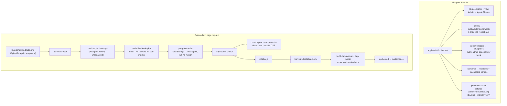

# Architecture Overview

Apple is a Blueprint extension that themes the admin area through **runtime injection only**. No core file is replaced for the theme to work; the one deliberate exception (the dashboard view) is a reversible, marker-verified patch.

## System diagram



## Injection points (conf.yml)

| Point | Value | What it does |
| --- | --- | --- |
| `admin.wrapper` | `admin/wrapper.blade.php` | The theme's **only** entry point — rendered by Blueprint at the end of `<body>` on every admin page. Emits tokens, loader, asset links, and the settings-link injector. |
| `admin.controller` / `admin.view` | hub | Settings UI; SCHEMA-driven; seeds defaults on load. |
| `data.public` | `public/` | Static assets served from `/extensions/apple` with `{timestamp}` cache-busting. |
| `data.directory` | `private/` | `install.sh` / `remove.sh` hooks. |
| `requests.views` | `src/views/` | `variables` (token emission) and `dashboard` (bento source) partials. |

## The token layer

`variables.blade.php` emits one inline `<style>` with the full Catppuccin palette **for both modes** — `html[data-apple="dark"]` gets Mocha values, `html[data-apple="light"]` gets Latte — plus the admin's accent (validated against a server-side whitelist), glass and radius settings as `--ap-*` custom properties. Every stylesheet consumes variables only; there are no hardcoded colors anywhere in the libraries.

A synchronous pre-paint script resolves the effective mode (browser choice → hub default → OS preference) and sets `data-apple` on `<html>` before first paint, so there is no mode flash.

## The runtime harvest

`sidebar.js` reads the stock `ul.sidebar-menu` — headers, links, icon classes, labels, active state — and builds `#ap-sidebar` and `#ap-topbar`. The stock chrome stays in the DOM (AdminLTE JS and extensions may depend on it) but is hidden. Stock top-bar actions are **re-parented** into the Apple top bar rather than cloned, so panel-bound handlers (logout confirmation, tooltips) keep working. See [Extension Compatibility](../user-guide/compatibility.md).

## The dashboard patch

`install.sh` swaps `resources/views/admin/index.blade.php` for Apple's bento view:

1. Skip if the marker `apple-theme-dashboard` is already present (idempotent).
2. Back up the original to `index.blade.php.apple-backup` (first run only).
3. Copy the bento source — probed from three locations because the hook can run before Blueprint links the views.
4. Verify the marker landed; roll back to the backup if not.

The patched view reads `apple::dashboard_custom` at render time and falls back to the **stock markup embedded in the same file** when the feature is off — toggling never requires a re-patch. `remove.sh` restores the backup.

## Settings storage

Settings live as `apple::<key>` rows in the panel `settings` table via Blueprint's library — no migrations, no config files. Two subtleties the code handles explicitly:

- **Serialization.** Blueprint's `dbSet` stores serialized scalars (`s:1:"1";`). Every direct table read (dashboard view, standalone wrapper) unwraps `s:N:"…"` before comparing.
- **Caching.** The library caches reads; after external row edits, `php artisan cache:clear` is required (the hub re-seeds from whatever it reads, so a stale cache can resurrect deleted values).

## CSS libraries

| File | Responsibility |
| --- | --- |
| `core.css` | Surface/typography, boot gate + loader, scrollbars, selection, focus ring, motion killswitches |
| `layout.css` | Sidebar, top bar, content flow, iOS large-title header, footer, rail mode |
| `components.css` | The global AdminLTE/Bootstrap 3 reskin (see Compatibility) |
| `dashboard.css` | The bento grid and its tiles, responsive collapse |
| `mobile.css` | ≤ 992px drawer behavior, ≤ 768px content adjustments |

All selectors are scoped under `html[data-apple]`, so any page where the theme is inactive renders 100% stock.

## Standalone variant

For panels without Blueprint, the same theme ships as PanelFiles + scripts:

- Assets land in `public/apple`, partials in `resources/views/apple`.
- `install.sh` injects a marker-delimited `@include('apple.wrapper')` before `</body>` in `layouts/admin.blade.php` (backup first, idempotent) and applies the same dashboard patch.
- The standalone wrapper is identical except it reads settings straight from the table (with unserialization) and links assets from `/apple` — no Blueprint dependency.

## File layout

```
apple/
├── conf.yml                    # Blueprint manifest
├── icon.svg
├── admin/
│   ├── controller.php          # settings hub (SCHEMA-driven)
│   ├── view.blade.php          # settings UI
│   └── wrapper.blade.php       # every-page injector
├── src/views/
│   ├── variables.blade.php     # --ap-* token emission + pre-paint script
│   └── dashboard.blade.php     # bento source (stock fallback embedded)
├── public/libraries/           # 5 CSS libs + sidebar.js
├── private/
│   ├── install.sh              # dashboard patch (idempotent, verified)
│   └── remove.sh               # restore + settings cleanup (never fails)
└── standalone/
    ├── PanelFiles/             # public/apple + resources/views/apple
    └── data/                   # install.sh / remove.sh
```
