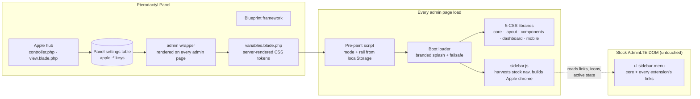

# Apple Theme for Pterodactyl (Admin)

**An iOS-grade matte glass theme for the Pterodactyl admin area**, built on the Blueprint framework. Apple replaces the stock AdminLTE chrome with a frosted sidebar and floating top bar, reskins every panel component in Catppuccin Mocha (dark) and Latte (light), and ships a custom bento dashboard — with **zero core-file replacement** and **zero external assets**.

<div class="tip custom-block" style="margin-top: 1.5rem;">

**🍎 Built for PingLess Studios**
[studio.pingless.org](https://studio.pingless.org) · Single `.blueprint` package, standalone variant included

</div>

---

## Architecture



Apple never edits a Pterodactyl core file to work. Blueprint renders Apple's wrapper at the end of every admin page; it emits server-rendered design tokens (so the first paint is already themed and in the right mode), then loads Apple's CSS and JS. The JavaScript **harvests the panel's own sidebar menu at runtime** — every link, icon and active state, including links injected by any other extension — and rebuilds it as the Apple navigation. Install another extension tomorrow and its pages simply appear.

---

## Key Features

- **🌗 Catppuccin in both modes.** Full Mocha (dark) and Latte (light) token sets, 12 official Catppuccin accents (blue, sapphire, sky, teal, green, yellow, peach, red, pink, mauve, lavender, flamingo), and a top-bar toggle that persists per browser. Admins pick the default: system, dark or light.
- **🧊 Matte glass, not glassmorphism-for-show.** Frosted sidebar, floating top bar and cards whose blur and opacity are settings (`0–30px` blur, `50–95%` opacity). Surfaces stay neutral — only the accent carries color, and on the sidebar only the icon does.
- **🧭 A sidebar that adapts to everything.** Section headers, links, icons and active states are read from the panel's own menu DOM, so any extension that registers an admin link — now or later — shows up automatically. Filter field, icon-rail collapse (persisted), and an off-canvas drawer with blurred backdrop on mobile.
- **🍱 Bento dashboard.** Greeting with real update status, live counts (servers, users, nodes, locations), a 14-day signup sparkline rendered as inline SVG (no chart CDN), quick actions, and a system tile. Toggleable — the stock dashboard ships inside the same file as a runtime fallback.
- **🚀 Branded boot loader.** A splash with your panel name, the Apple glyph and an accent progress ring while the chrome builds — with a CSS-only failsafe and a static reduced-motion variant.
- **🧩 Every component reskinned globally.** Boxes, buttons, forms, tables, tabs (as iOS segmented controls), alerts, callouts, modals, labels, pagination, dropdowns, select2, SweetAlert, stat widgets — extension pages look native without a line of per-extension work.
- **♿ Accessibility as a contract.** Body text ≥ 4.5:1 in both modes, visible focus rings, `prefers-reduced-motion` honored everywhere, status never carried by color alone.
- **📦 Blueprint + standalone.** One codebase ships as a `.blueprint` package (with settings hub) and as a standalone variant for panels without Blueprint.

---

## Quick Install

```bash
# place apple-v1.0.0.blueprint in /var/www/pterodactyl, then:
blueprint -i apple-v1.0.0
```

Open **Admin → Apple Theme** — defaults apply on first load, so the admin area looks right before you change a thing. See [Installation](./getting-started/installation.md) for the standalone variant, verification and troubleshooting.

---

## Why Apple instead of…

| | Apple | Stock admin | Legacy admin themes |
| --- | :---: | :---: | :---: |
| Sidebar navigation | ✅ floating glass rail + drawer | ❌ fixed AdminLTE rail | ⚠️ hover-expand hacks |
| Dark **and** light modes | ✅ Catppuccin Mocha + Latte, instant toggle | ❌ single skin | ⚠️ two diverging CSS forks |
| Other extensions in the sidebar | ✅ automatic, runtime-harvested | ✅ (stock list) | ❌ hardcoded, links vanish |
| Extension pages themed | ✅ global component reskin | — | ⚠️ per-page rewrites |
| Dashboard | ✅ bento grid, live stats, sparkline | ❌ one info box | ⚠️ raw SQL in the view |
| Core files replaced | ✅ none¹ | — | ❌ layout + views overwritten |
| External assets loaded | ✅ none | ⚠️ FA/Ionicons CDN | ⚠️ fonts/charts CDN |

¹ *The dashboard view is swapped by an idempotent, marker-verified patch with the original backed up next to it and restored on uninstall — it is the one deliberate exception, and it can be switched off from the settings hub without removing the theme.*

> **Bottom line:** legacy admin themes overwrite `layouts/admin.blade.php` and hardcode the menu — every other extension's link silently disappears, and uninstalling wipes the panel. Apple reads the menu the panel already built and styles what extensions already render.

---

::: tip VERIFIED LIVE
Every surface was verified on a real Pterodactyl 1.12 panel during development: dashboard, servers, users, settings, nests, extensions and the settings hub in both modes, the mobile drawer at phone width, settings save/reset, and a full uninstall → reinstall cycle — via automated browser screenshots with zero console errors.
:::

---

## Next Steps

- **[Installation →](./getting-started/installation.md)** — Blueprint and standalone, verify, troubleshoot, uninstall.
- **[Configuration Reference →](./configuration/reference.md)** — every setting, every default, every token.
- **[Using the Theme →](./user-guide/using-the-theme.md)** — toggle, rail, filter, drawer, loader.
- **[Extension Compatibility →](./user-guide/compatibility.md)** — how other extensions adapt automatically.

---

<div class="footer-note">

**Developed for [PingLess Studios](https://studio.pingless.org)**

Questions or licensing — reach us at [studio.pingless.org](https://studio.pingless.org).

</div>

<style scoped>
.footer-note {
  margin-top: 3rem;
  padding: 1.5rem;
  border-top: 1px solid var(--vp-c-divider);
  text-align: center;
  font-size: 0.875rem;
  color: var(--vp-c-text-2);
}
.footer-note a {
  font-weight: 600;
}
</style>
