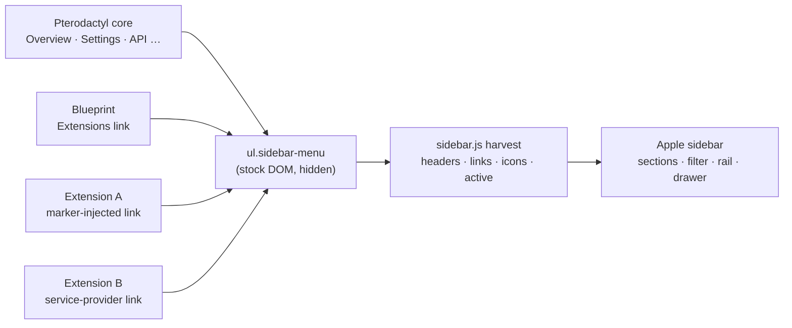

# Extension Compatibility

Apple's design rule is **coexist, never conquer**. Two mechanisms make every other extension work with the theme automatically — no allowlist, no per-extension CSS.

## 1. The sidebar is harvested, not hardcoded

Apple never writes its own navigation. On every admin page, `sidebar.js` reads the panel's own `ul.sidebar-menu` — the exact DOM Pterodactyl and every extension already build — and re-renders it as the Apple sidebar:

What gets preserved per item:

- **Section headers** (`li.header`) become Apple section labels, in original order
- **Every link** with its `href`, its Font Awesome icon class, its label and its **server-computed active state**
- **Any injection style** — Blade marker blocks, `@yield('blueprint.sidenav')`, JS-injected items (including Apple's own settings link)

Install, update or remove an extension and the sidebar simply reflects the new reality on the next page load. There is nothing to register with Apple.

## 2. Components are reskinned globally

Apple restyles the standard AdminLTE 2 / Bootstrap 3 vocabulary that every admin page already outputs. An extension page that renders stock markup looks native with zero changes:

| Component family | Covered selectors |
| --- | --- |
| Cards | `.box` (+ header/body/footer/tools, semantic `.box-solid` tints) |
| Buttons | `.btn` all variants and sizes, radio `btn-group[data-toggle="buttons"]` → iOS segmented control |
| Forms | `.form-control`, labels, input groups, validation states, iCheck |
| Tables | `.table` (hover, striped, bordered, row states), DataTables chrome |
| Tabs | `.nav-tabs` and `.nav-tabs-custom` → segmented control, `.nav-pills`, `.nav-stacked` |
| Feedback | `.alert`, `.callout`, `.label`, `.badge`, SweetAlert |
| Overlays | `.modal-*`, `.dropdown-menu`, tooltips |
| Data display | `.small-box`, `.info-box`, `.description-block`, `.progress` |
| Misc | pagination, panels, wells, list groups, select2 (single, multiple, dropdowns) |

Vendor quirks are neutralized deliberately: Pterodactyl's own `pterodactyl.css` hardcodes dark box headers, solid `!important` alert fills, dark modal bodies and a heavy box shadow — Apple overrides each at higher specificity (or matching `!important`) so both modes stay correct.

## What extension authors should do

- **Render stock AdminLTE markup.** `.box`, `.form-control`, `.btn-*`, `.table` — the theme does the rest.
- **Consume the `--ap-*` custom properties** for anything custom (see the [Configuration Reference](../../configuration/reference.md#css-custom-properties-for-extension-authors)).
- **Register your admin link the usual ways** — Blade marker block or Blueprint sidenav yield. It appears in the Apple sidebar automatically.

## What to avoid

- **Hardcoded palette hexes** (`#1e1e2e`, `#3c8dbc`) — they break the light mode and the admin's accent choice.
- **Injecting your own sidebar/topbar chrome** — two sidebars is worse than none; add a link to the stock menu instead.
- **`!important` inline styles** on components Apple already owns — you will fight the theme and lose in one of the modes.

## Known limits

- Extensions that render **fully custom layouts** (their own nav, own design system) keep their look — Apple never forces itself over custom UI. Blueprint's own extensions page is an example: its cards keep Blueprint styling inside Apple's chrome.
- AdminLTE's push-menu is replaced by Apple's drawer; the stock toggle is hidden but the stock sidebar DOM stays in place for compatibility.
