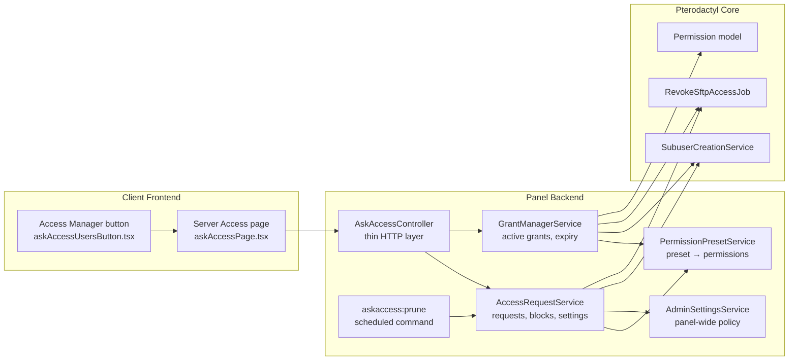
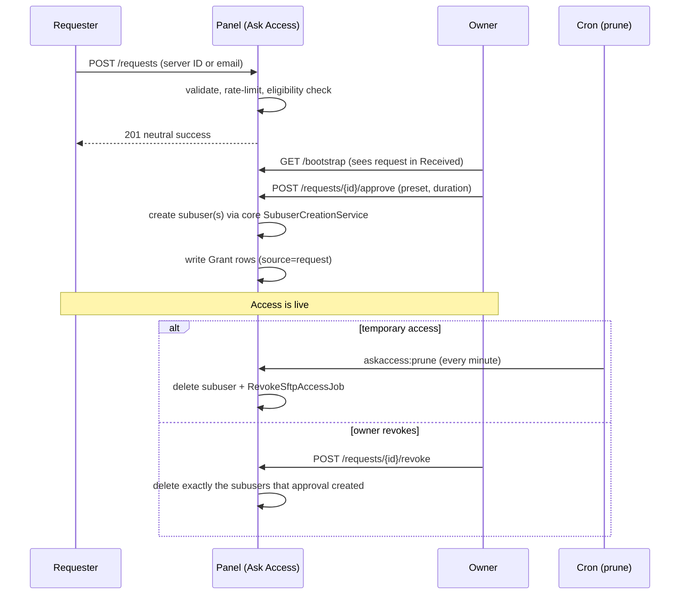
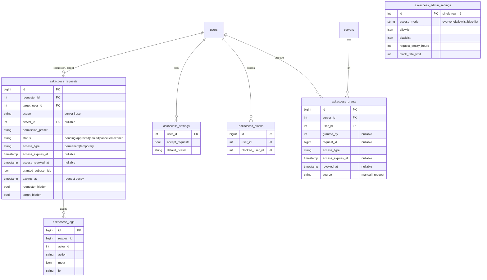

# Architecture Overview

Ask Access is deliberately self-contained: everything runs inside the Pterodactyl panel process. No node agents, no external services, no new daemons. Access grants are **real Pterodactyl subusers**, so Wings, SFTP, the console, and every other addon see them exactly like manually-added subusers.

---

## Components



| Component | Role |
|---|---|
| `AskAccessServiceProvider` | Registers services, migrations, the scheduled prune command, and (on non-Blueprint panels) the client API routes |
| `AskAccessController` | Thin HTTP layer — validation only; all authorization lives in the services |
| `AccessRequestService` | Request lifecycle (create/cancel/approve/deny/revoke), blocks, user settings, bootstrap payload |
| `GrantManagerService` | The "Active" tab: direct grant CRUD, expiry resolution, temporary-grant pruning, the `accessmanager.manage` delegation check |
| `PermissionPresetService` | Maps `read`/`standard`/`full` to validated permission lists; strips unknown strings |
| `AdminSettingsService` | Access policy (everyone/allowlist/blacklist), decay hours, block rate limit |
| `PruneCommand` | Runs every minute via `schedule:run`: expires stale pending requests, revokes lapsed temporary grants |

---

## Request lifecycle



Two design points worth knowing:

- **Requests and grants are separate records.** The request row tracks the conversation (status, message, expiry); `askaccess_grants` rows are the canonical record of live access. This is what lets the Active tab manage access that came from manual grants, not just requests.
- **Revocation is precise.** Each approval records the exact subuser IDs it created, so revoking never touches access the user obtained through other means.

---

## Database schema



All tables are `askaccess_`-prefixed to avoid collisions. Migrations are defensive (`hasTable`/`hasColumn` checks), so re-running them after a partial install is safe.

---

## File layout

```
app/
├── Console/Commands/AskAccess/PruneCommand.php
├── Http/Controllers/Api/Client/AskAccess/AskAccessController.php
├── Models/AskAccess/           # AccessRequest, Grant, AccessBlock, AccessLog,
│                               # AccessSetting, AdminSetting
├── Providers/AskAccessServiceProvider.php
└── Services/AskAccess/         # AccessRequestService, GrantManagerService,
                                # PermissionPresetService, AdminSettingsService
config/askaccess.php
database/migrations/2026_06_0{1,2,3}_*_askaccess*.php
routes/blueprint/client/pterodactylaskaccess.php
resources/scripts/blueprint/extensions/pterodactylaskaccess/
├── askAccessPage.tsx           # the Server Access account page
└── askAccessUsersButton.tsx    # "Access Manager" button on server Users page
```

---

## Security model

- **Per-record authorization** — every service method re-checks ownership (`requester_id` / `target_user_id` / server ownership / `accessmanager.manage`), so no endpoint can act on another user's data regardless of what ID is submitted.
- **Anti-enumeration** — email-scope requests return byte-identical neutral responses for "no such account", "you're blocked", and "owner not accepting requests". Owner emails are masked in the requester's Sent list.
- **Permission sanitization** — every permission array passes through the panel's authoritative `Permission` registry; unknown strings are dropped and `websocket.connect` is always added. There is no path to injecting a made-up permission.
- **Rate limiting** — global client API throttle, plus per-user creation limits (15/hour), pending caps (25), and a dedicated block-action throttle (10/minute), all keyed server-side to the authenticated user ID.
- **Safe revocation** — subuser deletion always dispatches `RevokeSftpAccessJob` (best-effort, never blocks the operation) so live SFTP sessions die with the grant.
- **Fail-safe logging** — audit-log writes are wrapped so a logging failure can never break the primary operation.
- **No new attack surface on nodes** — Wings is untouched; nothing runs on game servers.
