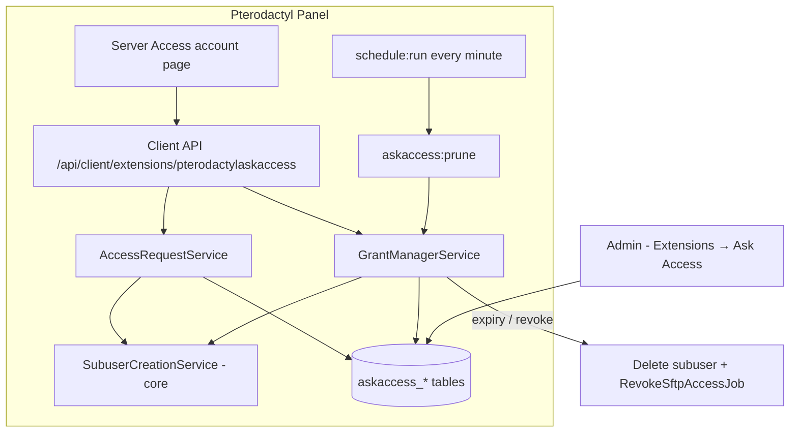

# Ask Access

**Server access requests for Pterodactyl Panel** — available as a Blueprint addon or a standalone panel extension. Users can ask for access to another user's server (by server ID) or to all of someone's servers (by email), and owners approve, deny, or revoke those requests from a built-in account page.

Instead of owners manually digging through the Subusers page and guessing which permissions to tick, Ask Access turns the whole flow into a request → approve → manage cycle with sensible permission presets, optional time-limited access, and a complete audit log.

<div class="tip custom-block" style="margin-top: 1.5rem;">

**Built for ALTIS TECH SOLUTIONS by [AnAverageBeing](https://github.com/AnAverageBeing)**
[GitHub Repo](https://github.com/AnAverageBeing/Ask-Access) · [Studio](https://xdp.network)

</div>

---

## Architecture



Everything runs **inside the panel** — no node daemons, no external services. Grants are real Pterodactyl subusers, so they work with Wings, SFTP, and the console exactly like manually-added subusers. A scheduled prune command (driven by the panel's existing `schedule:run` cron) expires stale requests and revokes temporary access the minute it lapses.

---

## Key Features

- **Two ways to ask** — request a single server by its ID/UUID, or request access to *all* of a user's servers by email.
- **Permission presets** — `Read-only`, `Standard`, and `Full access` map to curated, validated Pterodactyl permission lists. Owners can override the preset per-request before approving. See [Configuration](./configuration/reference#permission-presets).
- **Temporary access** — approve access for 1 hour up to 30 days (max 1 year via API). Expiry is automatic: the subuser is removed and SFTP sessions are revoked.
- **Active access manager** — an "Active" tab lists everyone with access to your servers across your whole fleet: edit permissions, change duration, add more servers, or remove access in one click.
- **Delegated access managers** — grant a trusted subuser the `accessmanager.manage` permission and they can manage access on that server on your behalf.
- **Privacy by design** — email-based requests return an identical response whether or not the account exists, so the feature can't be used to probe which emails are registered. Owner emails are masked in the requester's "Sent" list.
- **Blocking** — users can block specific accounts; pending requests from a blocked user are auto-denied and future ones are silently dropped.
- **Admin policy controls** — panel admins choose who may use the feature (everyone / allowlist / blacklist), set request decay time, and tune rate limits. See [Configuration](./configuration/reference#admin-panel-settings).
- **Abuse protection** — per-user creation rate limits, pending-request caps, server-side block throttling, and the panel's global API rate limiter.
- **Full audit trail** — every create/approve/deny/cancel/revoke action is logged with actor, metadata, and IP.

---

## Blueprint vs Standalone

Both packages install the **same** addon — the difference is only how files reach your panel.

| | Blueprint (recommended) | Standalone |
|---|---|---|
| Installer | `blueprint -install pterodactylaskaccess` | `sudo bash install.sh` from the release zip |
| Requirement | [Blueprint](https://blueprint.zip) framework on the panel | Plain Pterodactyl panel (Blueprint still needed for the account page route) |
| File merging | Automatic via Blueprint | `install.sh` copies `PanelFiles` into place |
| Removal | `blueprint -remove pterodactylaskaccess` | `sudo bash uninstall.sh` |
| Updates | Install the new `.blueprint` package | Re-run `install.sh` from the new release |

::: warning The account page needs Blueprint's extends layer
The **Server Access** page is wired through Blueprint's `resources/scripts/blueprint/extends` system. On a panel with no Blueprint at all, the API still works but the page won't render. For most setups, use the Blueprint package.
:::

---

## Quick Install

**Blueprint:**

```bash
cd /var/www/pterodactyl
blueprint -install pterodactylaskaccess-v1.0.0.blueprint
```

**Standalone:**

```bash
unzip AskAccess-v1.0.0-standalone.zip && cd standalone
sudo bash install.sh
```

Then open **Account → Server Access** in the client area. Full walkthrough: [Installation](./getting-started/installation)
