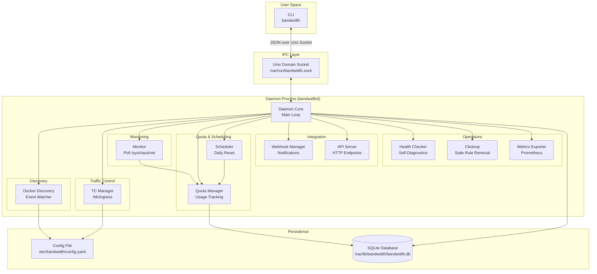
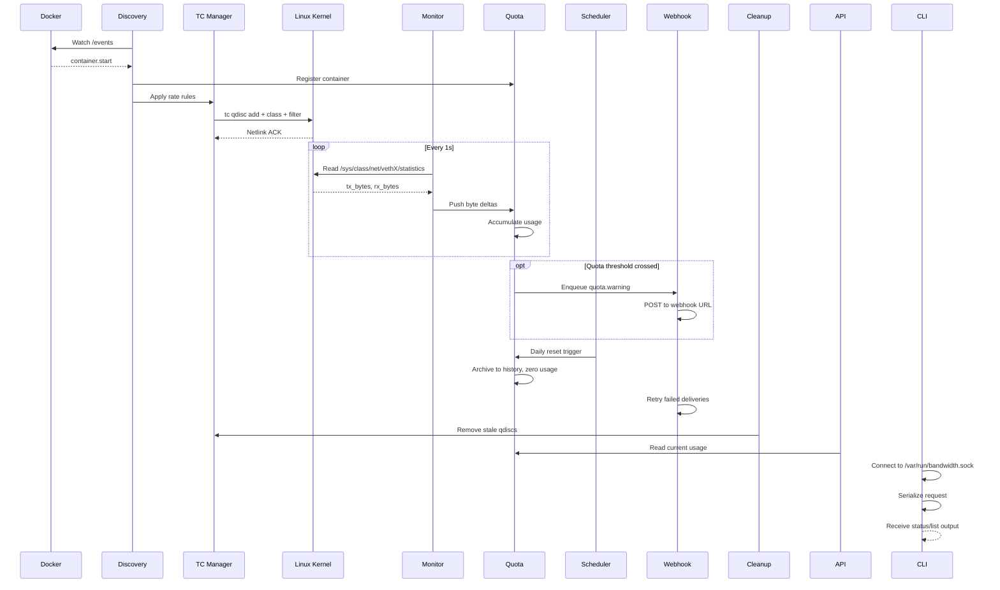
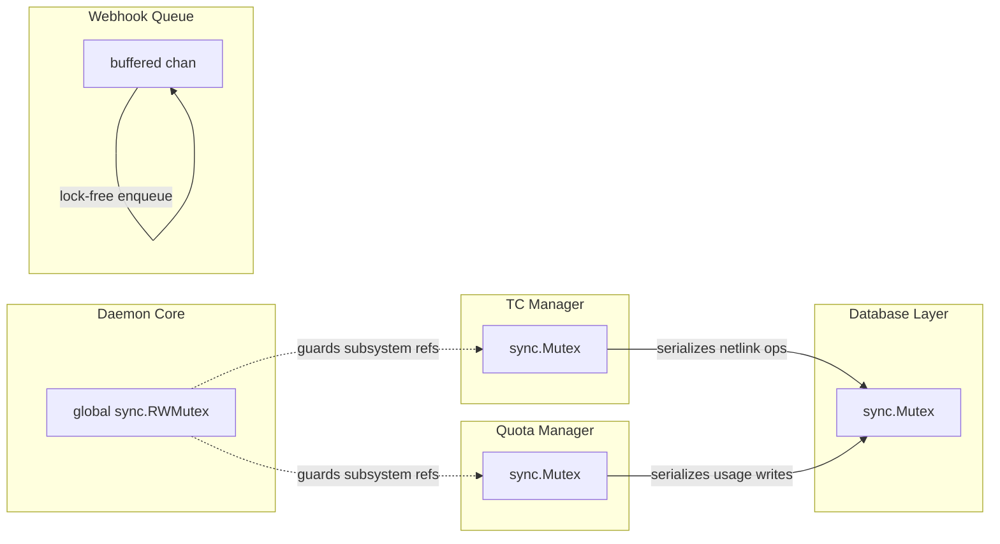

# Architecture Overview

[[toc]]

## System Architecture



## Component Descriptions

### CLI (`bandwidth`)

The command-line client that communicates with the daemon exclusively over a Unix domain socket. It serializes user commands into JSON and sends them to `/var/run/bandwidth.sock`. Available subcommands include `list`, `set`, `get`, `reset`, `stats`, and `health`. The CLI never reads the database or modifies traffic control rules directly — all mutations go through the daemon.

### Daemon Core

The central orchestrator running as `bandwidthd`. It owns the main polling loop, lifecycle management (startup, graceful shutdown, signal handling), and routes all inter-subsystem communication. It holds the global `RWMutex` that protects shared state references across goroutines.

### Docker Discovery

Listens to the Docker Engine API event stream (`/events`) for `start`, `die`, and `destroy` events on containers. On startup, it performs a full reconciliation by listing all running containers and comparing them against the database. It detects container labels that define bandwidth profiles (e.g., `bandwidth.rate`, `bandwidth.ceil`) and triggers TC rule creation or removal when containers appear or disappear.

### TC Manager

The kernel-facing subsystem responsible for attaching Linux Traffic Control `htb` qdiscs to virtual Ethernet (`veth`) interfaces. It supports both egress shaping (root HTB qdisc → class with `rate`/`ceil`) and ingress policing (filter with `police` action). All TC operations are serialized under a dedicated `sync.Mutex` to prevent concurrent netlink races. For a deep dive into how TC works, see [TC Explained](./tc-explained.md).

### Monitor

A polling loop that reads network statistics from `/sys/class/net/<veth>/statistics/tx_bytes` and `rx_bytes` every second. It computes byte deltas, converts them to bits per second, and forwards the readings to the Quota Manager. The polling interval is configurable via `config.yaml` (`monitor.interval_sec`).

### Quota Manager

Accumulates per-container bandwidth consumption and compares it against configured limits. It writes usage records to the `usage` table and transitional entries to `history` when a container stops or a monitoring period ends. It answers quota queries from the API and CLI, and emits events when a container exceeds 80%, 90%, or 100% of its allowance.

### Scheduler

A cron-style goroutine that fires at configurable intervals (default: midnight UTC). Its primary job is to reset daily quotas by zeroing cumulative counters in the `usage` table and archiving the previous day's totals into `history`. It also triggers periodic TC rule validation and stale-container cleanup.

### Webhook Manager

Dispatches outbound HTTP POST notifications to user-configured URLs when specific events occur: `container.started`, `container.stopped`, `quota.warning`, `quota.exceeded`, `quota.reset`, `health.failure`. Webhook delivery runs in a worker pool; failed deliveries are retried with exponential backoff (up to 5 attempts) and logged to `events`.

### API Server

Serves a minimal HTTP API on `127.0.0.1:<port>` for Prometheus scraping (`/metrics`), health checks (`/healthz`), and a read-only JSON status endpoint (`/api/v1/status`). It uses a `sync.RWMutex` read-lock on database access to avoid blocking CLI socket operations.

### Health Checker

Runs self-diagnostics every 30 seconds: verifies the database is writable, the Docker socket is reachable, at least one TC qdisc is present (if containers are tracked), and no goroutine leaks are detected. Results are published to the `/healthz` endpoint and can trigger `health.failure` webhooks.

### Cleanup

Garbage-collects stale TC qdiscs and filters that no longer correspond to a running container. It runs after Docker `die`/`destroy` events and periodically (every 5 minutes) as a safety net. It also purges `history` and `events` rows older than the retention period configured in `config.yaml`.

### Metrics Exporter

Converts internal counters (bytes transferred, quota usage, webhook success/failure counts, goroutine count) into Prometheus-format metrics served by the API Server at `/metrics`. All metrics are prefixed with `bandwidth_`.

---

## Data Flow



---

## Threading Model

| Component | Goroutine Strategy | Details |
|---|---|---|
| **Main Loop** | 1 goroutine | signal handling, shutdown orchestration, subsystem lifecycle |
| **Docker Event Watcher** | 1 goroutine | long-lived `GET /events` stream, reconnects on EOF |
| **Monitor** | 1 goroutine | `time.Ticker` loop at configured interval |
| **Scheduler** | 1 goroutine | `time.Timer` or cron, fires resets and periodic tasks |
| **Webhook Manager** | N workers (configurable) | worker pool consuming a buffered channel |
| **API Server** | 1 goroutine per request | `net/http` default multiplexer |
| **Socket Listener** | 1 goroutine per connection | `net.UnixListener` accept loop |
| **Health Checker** | 1 goroutine | `time.Ticker` at 30s |

All goroutines are managed via `sync.WaitGroup` and context cancellation for coordinated shutdown.

---

## Locking Strategy



| Mutex | Scope | Protects |
|---|---|---|
| **Daemon RWMutex** | Daemon Core | Subsystem start/stop references, configuration reload |
| **TC Manager Mutex** | TC Manager | All netlink socket operations (add/delete qdisc, class, filter) |
| **Quota Manager Mutex** | Quota Manager | In-memory usage counters, threshold cache |
| **DB Mutex** | Database Layer | All `database/sql` write transactions; acquired per operation |

The Daemon `RWMutex` is held as a read-lock during steady-state operation (allowing concurrent readers of configuration and subsystem handles) and as a write-lock only during startup, shutdown, and configuration reload. This prevents the "global kernel lock" anti-pattern while still ensuring safe lifecycle transitions.

The channel-based webhook queue eliminates the need for a mutex on the webhook dispatch path — workers receive jobs from a buffered channel in a lock-free producer-consumer pattern.

---

## Database Schema

```mermaid
erDiagram
    containers ||--o{ usage : "has"
    containers ||--o{ history : "generates"
    containers ||--o{ events : "triggers"
    containers }o--|| config : "references"
    webhooks ||--o{ events : "delivers"

    containers {
        text    container_id   PK
        text    container_name
        text    veth_interface
        int64   rate_bps
        int64   ceil_bps
        bool    active
        text    created_at
        text    updated_at
    }

    usage {
        text    container_id   PK_FK
        int64   tx_bytes
        int64   rx_bytes
        int64   quota_limit
        int64   last_reset
    }

    history {
        integer id            PK_AUTO
        text    container_id  FK
        int64   tx_bytes
        int64   rx_bytes
        int64   quota_limit
        text    period_start
        text    period_end
    }

    events {
        integer id            PK_AUTO
        text    container_id  FK
        text    event_type
        text    payload_json
        text    created_at
    }

    webhooks {
        text    id            PK
        text    url
        text    event_filter
        text    secret
        bool    enabled
        text    created_at
    }

    config {
        text    key           PK
        text    value
    }

    schema_version {
        integer version       PK
        text    applied_at
    }
```

### Table Details

#### `containers`
Stores metadata for every container tracked by the bandwidth manager. `rate_bps` and `ceil_bps` are parsed from Docker labels; `active = false` marks containers that have stopped but whose TC rules have not yet been cleaned up.

#### `usage`
A live accumulator of per-container byte counters since the last reset. This table is **updated in-place** — there is exactly one row per active container. `quota_limit` is a denormalized copy of the rate to avoid a join during quota checks.

#### `history`
Append-only archive of usage snapshots. A new row is inserted when a container stops or when the daily scheduler runs. Enables time-series queries for bandwidth reporting.

#### `events`
Audit log of all significant occurrences: container lifecycle changes, quota threshold crossings, webhook delivery attempts, and health state transitions. `payload_json` stores event-specific structured data.

#### `webhooks`
User-configured webhook endpoints. `event_filter` is a comma-separated list of event types the webhook subscribes to. `secret` is an HMAC shared secret for payload signing.

#### `config`
Key-value store for runtime configuration that can be changed at runtime via the CLI (`bandwidth config set <key> <value>`).

#### `schema_version`
Tracks the database schema version for forward-compatible migrations.

---

## File Layout

```
/usr/local/bin/bandwidth          # CLI binary
/usr/local/bin/bandwidthd         # Daemon binary

/etc/bandwidth/
└── config.yaml                   # Main configuration file

/var/lib/bandwidth/
└── bandwidth.db                  # SQLite database

/var/log/bandwidth/
└── bandwidth.log                 # Daemon log (logrotated)

/var/run/
└── bandwidth.sock                # Unix domain socket
```

| Path | Purpose | Permissions |
|---|---|---|
| `/usr/local/bin/bandwidth` | CLI client binary | `0755 root:root` |
| `/usr/local/bin/bandwidthd` | Daemon binary | `0755 root:root` |
| `/etc/bandwidth/config.yaml` | YAML configuration | `0640 root:bandwidth` |
| `/var/lib/bandwidth/bandwidth.db` | SQLite database | `0640 root:bandwidth` |
| `/var/log/bandwidth/bandwidth.log` | Daemon log file | `0640 root:bandwidth` |
| `/var/run/bandwidth.sock` | Unix domain socket | `0660 root:bandwidth` |

::: warning Socket Permissions
The Unix socket must be group-accessible to the `bandwidth` group. Users who need to run the CLI must be members of this group. Running the CLI as non-root without group membership will result in `permission denied` on socket connect.
:::

::: tip Log Rotation
A `logrotate` configuration should be installed at `/etc/logrotate.d/bandwidth` to prevent unbounded log growth. Recommended: daily rotation with 7 days retention and `copytruncate`.
:::
