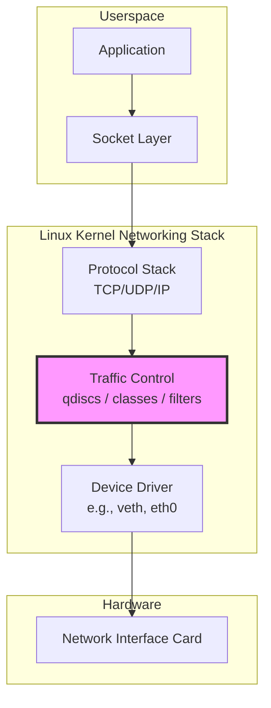
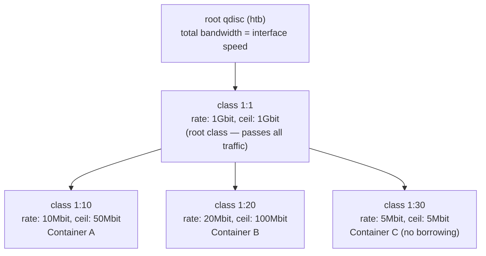
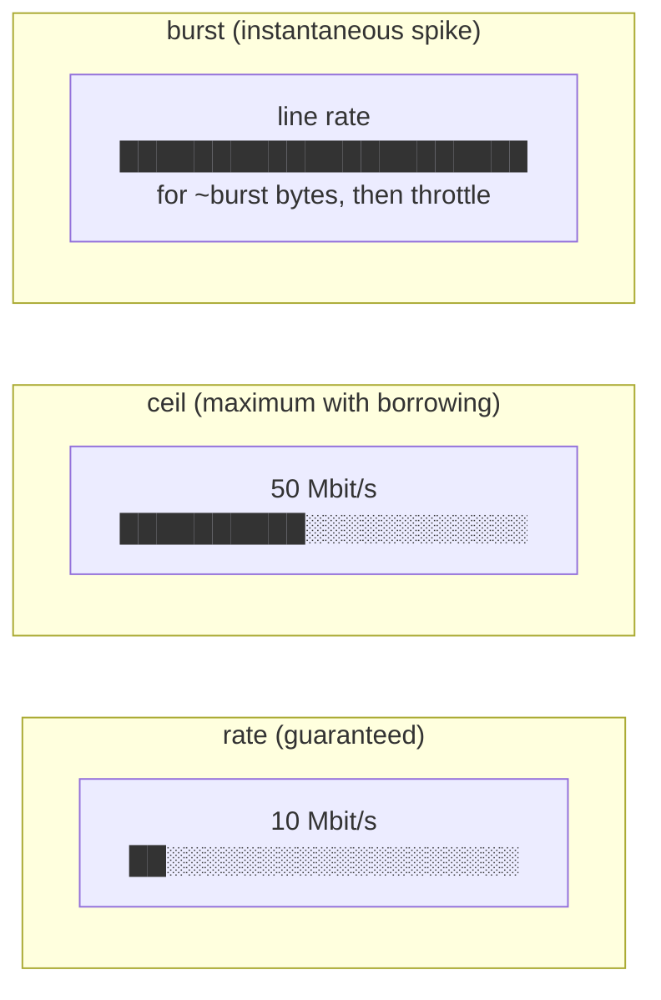
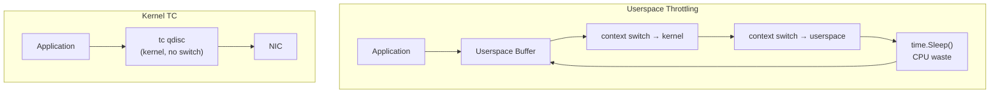
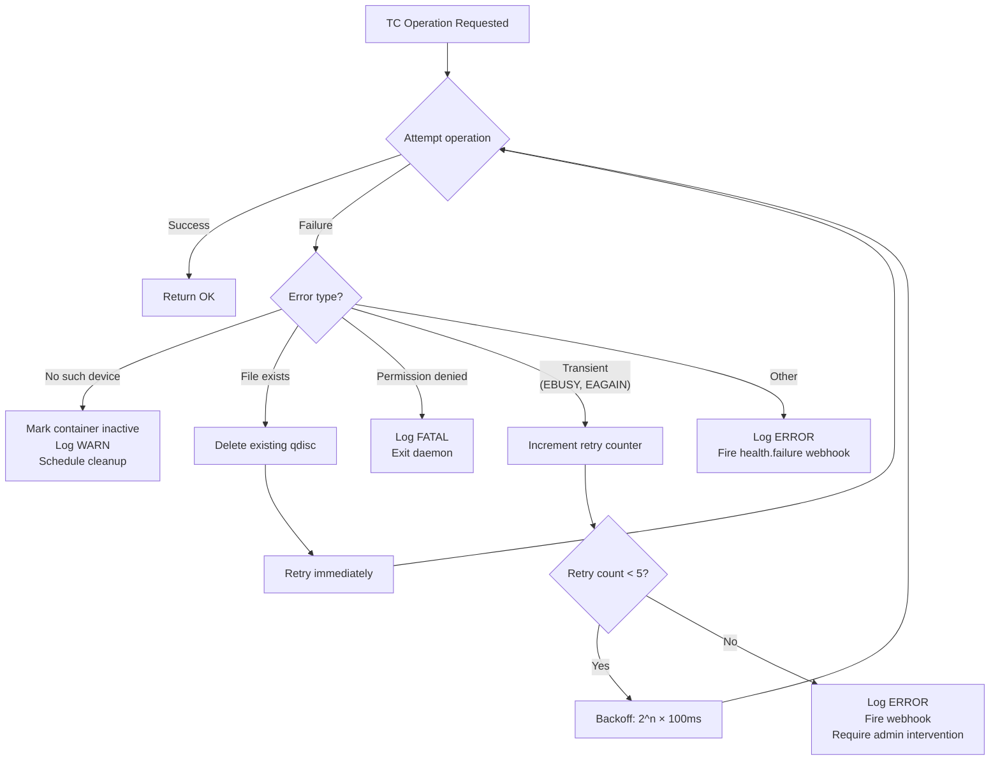

# Linux Traffic Control Explained

[[toc]]

## What Is `tc`?

`tc` (traffic control) is the userspace utility for configuring the Linux kernel's packet scheduling subsystem. It operates in **kernel space** as part of the networking stack, sitting between the protocol layer and the network device driver. This gives it direct, zero-copy access to packet queues with no context-switch overhead.



`tc` supports several queueing disciplines (qdiscs), but the one most relevant to bandwidth limiting is **HTB** (Hierarchical Token Bucket).

---

## HTB (Hierarchical Token Bucket)

HTB is a classful qdisc that shapes traffic to a configured rate by organizing classes in a tree hierarchy. Each class has:

- A **rate** — guaranteed minimum throughput (bps)
- A **ceil** — maximum burst throughput a class can borrow from its parent (bps)
- A **burst** bucket — tokens accumulated when idle, allowing short bursts above rate



- **Container A**: Guaranteed 10 Mbit/s, but can borrow up to 50 Mbit/s from unused parent bandwidth when available.
- **Container B**: Guaranteed 20 Mbit/s, ceiling at 100 Mbit/s.
- **Container C**: Hard-capped at 5 Mbit/s — `ceil == rate` means no borrowing.

---

## How Bandwidth Manager Uses `tc`

The bandwidth manager performs three operations for each container, executed through the TC Manager subsystem under a `sync.Mutex`:

### Step 1: Create Root HTB Qdisc on the veth Interface

```bash
tc qdisc add dev vethABCD123 root handle 1: htb default 30
```

| Argument | Meaning |
|---|---|
| `dev vethABCD123` | The virtual Ethernet interface connecting the container to the bridge |
| `root` | This is the root (egress) qdisc for this interface |
| `handle 1:` | qdisc major handle — all classes under it will be `1:X` |
| `htb` | Use Hierarchical Token Bucket discipline |
| `default 30` | Traffic not matching any filter goes to class `1:30` (the "default/unlimited" catch-all) |

### Step 2: Create a Shaping Class with Rate and Ceil

```bash
tc class add dev vethABCD123 parent 1: classid 1:10 htb \
    rate 10mbit ceil 50mbit burst 15k
```

| Argument | Meaning |
|---|---|
| `parent 1:` | Attach under the root qdisc |
| `classid 1:10` | Minor handle for this class |
| `rate 10mbit` | Guaranteed 10 Mbit/s (the `rate` from the container's bandwidth profile) |
| `ceil 50mbit` | Maximum 50 Mbit/s when sibling classes are idle (the `ceil` from the profile) |
| `burst 15k` | Token bucket size — allows short spikes up to ceil before throttling kicks in |

### Step 3: Attach a Filter to Direct Container Traffic into the Class

```bash
tc filter add dev vethABCD123 protocol ip parent 1: prio 1 \
    u32 match ip src 172.17.0.5/32 flowid 1:10
```

This filter catches all IP packets sourced from the container's IP address and directs them into class `1:10`, where the rate/ceil limits apply.

::: info Ingress Policing
For inbound (download) limiting, bandwidth manager attaches a policing filter on the ingress qdisc:

```bash
tc qdisc add dev vethABCD123 handle ffff: ingress
tc filter add dev vethABCD123 parent ffff: protocol ip prio 1 \
    u32 match ip dst 172.17.0.5/32 \
    police rate 10mbit burst 15k drop flowid :1
```

The `police` action drops packets exceeding the rate — unlike HTB shaping, ingress policing cannot queue; excess packets are simply discarded.
:::

---

## Token Bucket Concept

The token bucket algorithm is the mathematical foundation of HTB:

```
                    Tokens arrive at constant RATE
                            │
                            ▼
                    ┌───────────────────┐
        Tokens ───▶│   TOKEN BUCKET    │───▶ (overflow discarded
                    │  max size: BURST  │      if bucket full)
                    └────────┬──────────┘
                             │
                             │ One token consumed per byte sent
                             ▼
                    ┌───────────────────┐
        Packet ────▶│    CLASSIFIER     │───▶ Send if enough tokens
                    │                   │───▶ Queue/Drop if insufficient
                    └───────────────────┘
```

- Tokens fill the bucket at a constant **rate** (e.g., 10 Mbit/s = 1,250,000 bytes/s).
- The bucket has a maximum capacity of **burst** bytes (e.g., 15 KB).
- A packet of size N bytes can be sent **only if** at least N tokens are in the bucket.
- If the bucket is empty, packets are either **queued** (shaping) or **dropped** (policing).
- When the link is idle, tokens accumulate up to `burst`, allowing a brief spike when traffic resumes.

---

## Rate vs Ceil vs Burst — Visual Comparison



| Parameter | What It Controls | Analogy |
|---|---|---|
| **rate** | Minimum guaranteed throughput — always available even under contention | Your reserved lane on the highway |
| **ceil** | Maximum throughput a class can reach by borrowing unused bandwidth from siblings | The fastest you're allowed to drive when the highway is empty |
| **burst** | Bytes allowed in a short spike before the token bucket enforces the rate | How far past the speed limit you can go before the cop pulls you over |

::: warning Burst Values
Setting `burst` too low causes unnecessary throttling of TCP slow-start and small flows. Setting it too high allows long unshaped bursts that defeat the rate limit. The bandwidth manager calculates burst as:

```
burst_bytes = max(rate_bps / HZ, 1500)
```

where `HZ` is the kernel timer frequency (typically 250 or 1000). For a 10 Mbit/s rate at HZ=250, this yields `10_000_000 / 8 / 250 = 5,000 bytes`. The bandwidth manager enforces a floor of 1500 bytes (one Ethernet MTU) so single-packet flows are never starved.
:::

---

## Why Userspace Throttling Is Bad

Approaches that try to limit bandwidth from userspace (e.g., `time.Sleep` between `Write` calls, or userspace token-bucket libraries) suffer from critical flaws:



| Problem | Userspace | Kernel `tc` |
|---|---|---|
| **Context switches** | Every throttled write crosses the syscall boundary twice | Packets never leave kernel space |
| **CPU waste** | Busy-waiting or timer-based sleep burns CPU cycles | Timer-driven token replenishment in softirq context |
| **Accuracy** | Timer granularity limited to ~1ms (jiffies); 1ms jitter at 10G is massive | HZ-granularity (~4ms at HZ=250) for shaping, microsecond burst policing |
| **TCP awareness** | No access to TCP congestion window or queue state | Can mark/drop packets to signal congestion before queues overflow |
| **Hardware offload** | Impossible | Many NICs offload HTB shaping to hardware (e.g., Mellanox, Intel E810) |
| **Fairness** | Per-process, cannot arbitrate between multiple containers | Hierarchical classes provide weighted fair sharing |

---

## Why `tc` Is Good

```mermaid
mindmap
  root((Linux tc))
    Kernel-Space
      No context switch
      Direct sk_buff access
      Softirq scheduling
    Accuracy
      Microsecond burst policing
      Token bucket with HZ granularity
      BQL (Byte Queue Limits) aware
    Scalability
      Per-interface qdiscs
      Lockless for multi-queue NICs
      Thousands of classes
    Hardware Offload
      TC Flower offload
      HTB offload (mlx5, ice drivers)
      XDP integration
    Ecosystem
      iproute2 standard tooling
      Prometheus exporters exist
      eBPF extensible
```

Kernel traffic control is **the standard mechanism** used by Kubernetes CNI plugins (Calico, Cilium), container runtimes (Docker's `--device-write-bps`), and professional traffic shaping appliances. There is no userspace equivalent that matches its performance, accuracy, and integration depth.

---

## Verification Commands

Use these commands to inspect TC rules applied by the bandwidth manager:

### Show All Qdiscs on an Interface

```bash
tc -s qdisc show dev vethABCD123
```

Output includes byte/packet/drop counters so you can confirm shaping is active.

### Show Class Hierarchy

```bash
tc -s class show dev vethABCD123
```

Reveals the entire HTB tree with per-class rate, ceil, bytes sent, and drops.

### Show Filters

```bash
tc -s filter show dev vethABCD123
```

Lists all u32 filters and their match rules with hit counters.

### Show Ingress Qdisc

```bash
tc -s qdisc show dev vethABCD123 ingress
```

### Check Interface Statistics

```bash
cat /sys/class/net/vethABCD123/statistics/tx_bytes
cat /sys/class/net/vethABCD123/statistics/rx_bytes
```

### Full Inspection Script

```bash
#!/bin/bash
# dump-tc.sh <veth_name>
VETH=$1
echo "=== QDISC ==="
tc -s qdisc show dev "$VETH"
echo "=== CLASSES ==="
tc -s class show dev "$VETH"
echo "=== FILTERS ==="
tc -s filter show dev "$VETH"
```

---

## Common `tc` Errors and Fixes

### `Error: rate is required`

```bash
$ tc class add dev vethABCD123 parent 1: classid 1:10 htb ceil 50mbit
Error: rate is required.
```

**Cause**: HTB classes must have a `rate` parameter. **Fix**: Always set rate, even if you only care about the ceiling:

```bash
tc class add dev vethABCD123 parent 1: classid 1:10 htb \
    rate 10mbit ceil 50mbit burst 15k
```

### `RTNETLINK answers: File exists`

```bash
$ tc qdisc add dev vethABCD123 root handle 1: htb
RTNETLINK answers: File exists
```

**Cause**: A qdisc with `handle 1:` already exists on this interface (e.g., from a previous daemon run that didn't clean up). **Fix**: Remove the old qdisc first before adding the new one:

```bash
tc qdisc del dev vethABCD123 root
tc qdisc add dev vethABCD123 root handle 1: htb default 30
```

The bandwidth manager always attempts `tc qdisc del` before `tc qdisc add` to avoid this race.

### `Error: No such device`

```bash
$ tc qdisc add dev vethDEADBEEF root handle 1: htb
Error: No such device.
```

**Cause**: The veth interface no longer exists — either the container was destroyed between discovery and TC application (a race condition), or Docker renamed/removed the interface. **Fix**: The bandwidth manager treats this as a non-fatal error, logs it at WARN level, and marks the container as `active = false` in the database. The Cleanup subsystem will later remove the stale database row.

### `RTNETLINK answers: Operation not permitted`

**Cause**: The daemon is not running as root, or does not have `CAP_NET_ADMIN`. **Fix**: Ensure `bandwidthd` runs with the required capability:

```bash
# systemd unit snippet
[Service]
CapabilityBoundingSet=CAP_NET_ADMIN
AmbientCapabilities=CAP_NET_ADMIN
```

---

## How Bandwidth Manager Handles TC Failures



| Failure Mode | Retry Strategy | Max Attempts | Escalation |
|---|---|---|---|
| `File exists` | Immediate retry after delete | 1 | none (expected race) |
| `No such device` | None — container gone | 0 | Cleanup removes DB row |
| `EBUSY` / `EAGAIN` | Exponential backoff: 100ms, 200ms, 400ms, 800ms, 1600ms | 5 | Webhook fires, operator must investigate |
| `EPERM` | None | 0 | **Fatal** — daemon exits immediately |
| All others | Exponential backoff | 3 | Logged, webhook fired |

::: warning Fatal Permission Errors
The daemon cannot function without `CAP_NET_ADMIN`. If TC operations fail with `EPERM` or `EACCES`, the daemon logs the error to syslog and exits with code 1. The systemd unit should be configured with `Restart=on-failure` so it doesn't loop infinitely.
:::

The bandwidth manager also performs a **periodic reconciliation** (every 5 minutes) where it compares the TC state (`tc qdisc show`, `tc class show`) against the database. Any qdisc attached to a veth interface not in the `containers` table is removed. This self-heals orphaned rules left behind by crashes or incomplete cleanup.
