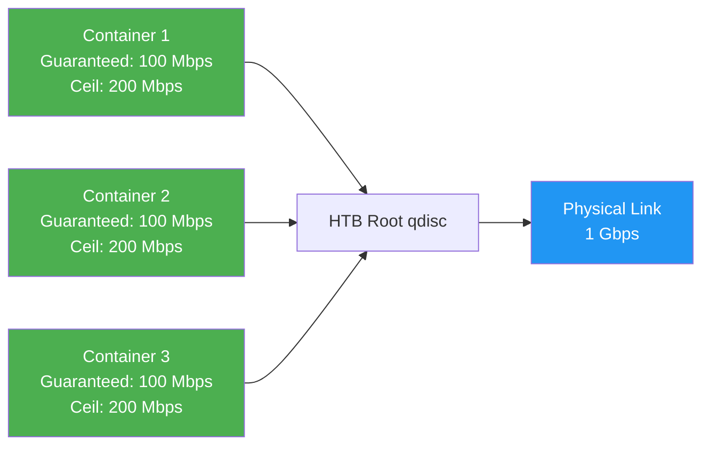
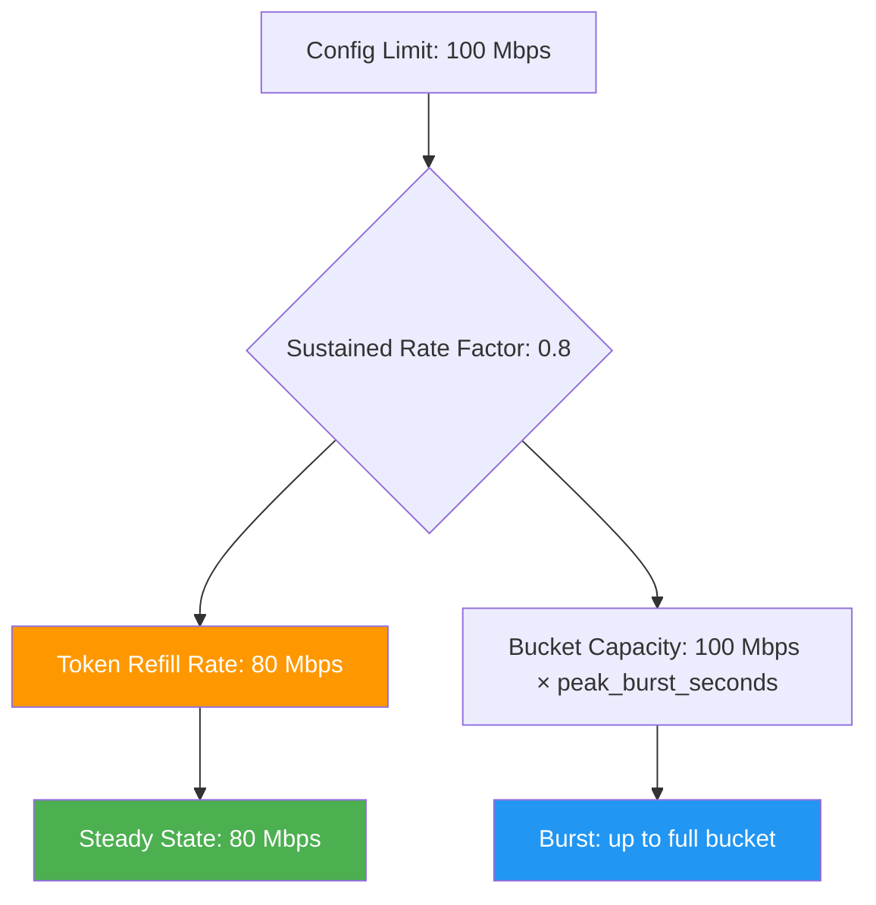
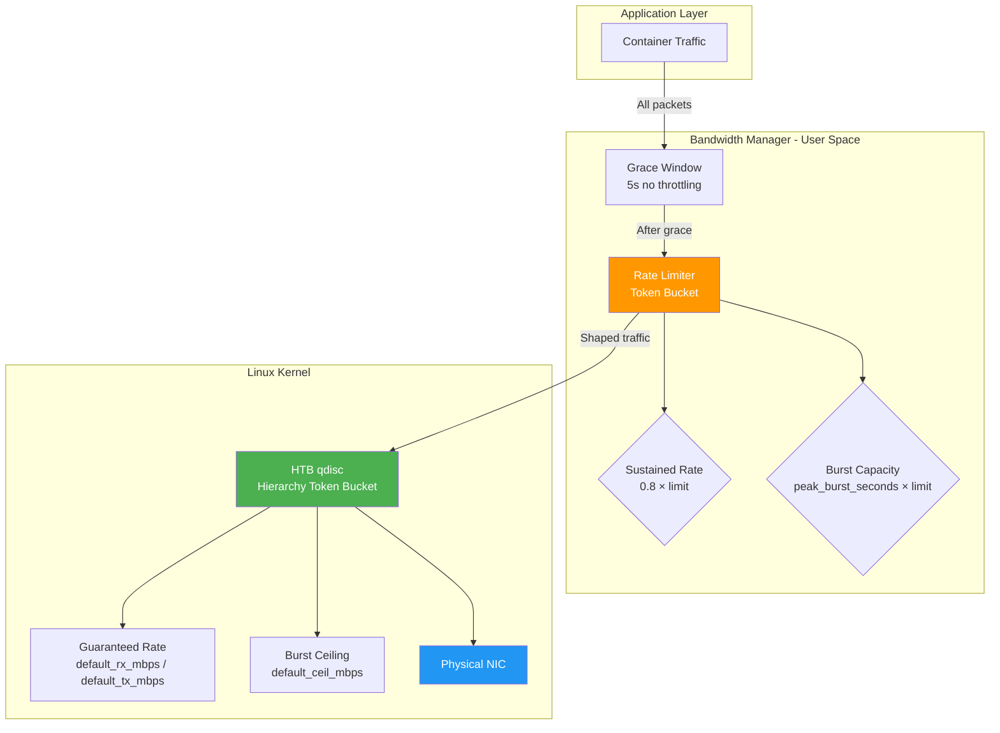

# Configuration Reference

> **The definitive reference for every Bandwidth Manager configuration value.**
> Generated from the actual defaults in `internal/config/config.go` and the production
> config at `configs/config.yaml`. Last updated for Bandwidth Manager v1.x.

[[toc]]

---

## Overview

Bandwidth Manager is configured through a single YAML file (typically
`/etc/bandwidth/config.yaml`). The daemon merges your file with built-in
defaults — any key you omit retains its safe default value. Validation runs at
startup and rejects dangerous combinations before any rules are applied.

**Configuration precedence (highest to lowest):**

1. Docker container labels (per-container overrides)
2. YAML configuration file
3. Built-in Go defaults (in `DefaultConfig()`)

---

## 1. General (`general`)

Top-level operational settings for the daemon process.

### `general.socket_path`

| Property | Value |
|----------|-------|
| **YAML path** | `general.socket_path` |
| **Type** | `string` |
| **Default** | `"/var/run/bandwidth.sock"` |
| **Required** | Yes |

Unix domain socket path for CLI↔daemon IPC. All `bandwidthctl` commands talk to
the daemon through this socket. The socket is created with `0600` permissions
(root-only).

**When to change it:**

- Running multiple Bandwidth Manager instances on the same host — each needs a
  unique socket.
- Your distribution uses a different FHS path (e.g., `/run` instead of
  `/var/run`).
- You want the socket in a container-accessible bind mount.

::: warning Common mistake
Using a path inside a container's own filesystem. The socket must be on a
bind-mounted volume if containers need to access it. Otherwise, only processes
on the host can communicate.
:::

**Security implication:** Anyone who can write to this socket can control
bandwidth rules for all containers. Keep it root-only (the daemon enforces
this).

---

### `general.lock_file`

| Property | Value |
|----------|-------|
| **YAML path** | `general.lock_file` |
| **Type** | `string` |
| **Default** | `"/var/run/bandwidth.lock"` |

Exclusive file lock preventing multiple daemon instances from running
simultaneously. The daemon acquires an `flock(2)` on this file at startup and
releases it on shutdown.

**When to change it:**

- Running multiple isolated instances (each needs its own lock file).
- `/var/run` is on `tmpfs` and you want persistence across reboots (use
  `/var/lib` instead).

::: info Tip
If the daemon crashes without cleaning up, delete the lock file manually:
`rm /var/run/bandwidth.lock`
:::

---

### `general.pid_file`

| Property | Value |
|----------|-------|
| **YAML path** | `general.pid_file` |
| **Type** | `string` |
| **Default** | `"/var/run/bandwidth.pid"` |

Writes the daemon's process ID to this file. Used by init systems (systemd,
OpenRC) and health check scripts to signal or monitor the process.

**When to change it:**

- Your init system expects a specific PID file location.
- Running multiple instances.

**Performance implication:** Negligible — a single `write(2)` at startup and
`unlink(2)` at shutdown.

---

## 2. Logging (`logging`)

Structured logging with rotation, compression, and format options.

### `logging.level`

| Property | Value |
|----------|-------|
| **YAML path** | `logging.level` |
| **Type** | `string` |
| **Default** | `"info"` |
| **Valid values** | `"debug"`, `"info"`, `"warn"`, `"error"` |

Controls log verbosity. Each level includes all higher-severity messages.

| Level | Includes | Use case |
|-------|----------|----------|
| `debug` | Everything | Troubleshooting rules not applying, container discovery issues |
| `info` | info + warn + error | Normal production operation |
| `warn` | warn + error | Reduced-noise production |
| `error` | error only | Minimal logging, alert-driven |

::: warning Performance warning
`debug` level on a host with 1000+ containers can generate **hundreds of
megabytes of logs per hour**. Every tc rule application, stats poll, and
discovery cycle is logged. Only use `debug` temporarily for troubleshooting.
:::

---

### `logging.console`

| Property | Value |
|----------|-------|
| **YAML path** | `logging.console` |
| **Type** | `bool` |
| **Default** | `true` |

Prints log entries to stdout. Essential for `journald` integration when running
under systemd.

**When to change it:**

- Disable (`false`) when logging exclusively to file to avoid duplicate output
  in container environments that capture both stdout and log files.
- Disable in very high-volume deployments to reduce I/O pressure on the
  terminal subsystem.

---

### `logging.file`

| Property | Value |
|----------|-------|
| **YAML path** | `logging.file` |
| **Type** | `string` |
| **Default** | `"/var/log/bandwidth/bandwidth.log"` |

Filesystem path for log output. The daemon creates parent directories
automatically (`mkdir -p` equivalent).

**When to change it:**

- Your log aggregation agent (Fluentd, Vector, Filebeat) tails a different
  directory.
- You want per-instance log files when running multiple daemons.

::: warning Common mistake
Setting this to a path on a network filesystem (NFS, CIFS). Log rotation and
file locking behave unpredictably on networked filesystems. Always use local
storage.
:::

---

### `logging.max_size_mb`

| Property | Value |
|----------|-------|
| **YAML path** | `logging.max_size_mb` |
| **Type** | `int` |
| **Default** | `100` |

Maximum log file size in megabytes before rotation triggers. The current log is
renamed and a new one is started.

**When to change it:**

- **Decrease** (e.g., `10`) on disk-constrained edge devices.
- **Increase** (e.g., `500`) for debug-heavy environments to reduce rotation
  frequency (fewer file handles opened/closed).

**Performance implication:** Smaller values cause more frequent rotation, which
involves `rename()`, `gzip` (if `compress: true`), and file creation. At
extremely small sizes (< 10 MB) with high log throughput, rotation overhead
becomes measurable.

---

### `logging.max_age_days`

| Property | Value |
|----------|-------|
| **YAML path** | `logging.max_age_days` |
| **Type** | `int` |
| **Default** | `30` |

Rotated log files older than this many days are deleted. Works in conjunction
with `max_backups` — whichever limit is hit first triggers deletion.

**When to change it:**

- Compliance requirements mandate longer retention (e.g., `90` or `365`).
- Disk-constrained systems need aggressive cleanup (e.g., `7`).

**Security implication:** Logs may contain container names, IP addresses, and
bandwidth usage patterns. Ensure log retention aligns with your data retention
policy.

---

### `logging.max_backups`

| Property | Value |
|----------|-------|
| **YAML path** | `logging.max_backups` |
| **Type** | `int` |
| **Default** | `10` |

Maximum number of rotated log files to retain. Combined with `max_size_mb`,
this caps total log storage at approximately `max_backups × max_size_mb` MB
(plus the active file).

**Example:** With defaults: 10 backups × 100 MB + 1 active ≈ 1.1 GB maximum.

**When to change it:**

- Increase for forensic troubleshooting (e.g., `50`).
- Decrease for tight disk budgets (e.g., `3`).

---

### `logging.compress`

| Property | Value |
|----------|-------|
| **YAML path** | `logging.compress` |
| **Type** | `bool` |
| **Default** | `true` |

Gzip-compresses rotated log files (`.log.gz`). Typically achieves 5–10×
compression on text logs; less on JSON (already compact).

**When to change it:**

- Disable if your log shipper handles compression itself (avoids double
  compression).
- Disable if CPU is at a premium and log volume is low.

**Performance implication:** Compression runs synchronously during rotation on
a goroutine. For JSON format at `debug` level with 100 MB files, compression
can take 1–3 seconds of CPU time. This does not block log writes (rotation uses
a temp file then renames).

---

### `logging.format`

| Property | Value |
|----------|-------|
| **YAML path** | `logging.format` |
| **Type** | `string` |
| **Default** | `"json"` |
| **Valid values** | `"text"`, `"json"` |

Output format for log entries.

| Format | Best for | Example |
|--------|----------|---------|
| `json` | Log aggregation (ELK, Loki, Datadog) | `{"level":"info","ts":"2026-06-30T10:00:00Z","msg":"container discovered","container":"nginx-1"}` |
| `text` | Human reading, `tail -f`, grep | `2026-06-30T10:00:00Z INF container discovered container=nginx-1` |

::: info Tip
Use `json` even in development if you plan to ship logs to a centralized system
later. Switching formats later changes all your log parsing rules. The `jq`
tool makes JSON logs just as readable: `tail -f bandwidth.log | jq '.msg'`
:::

---

## 3. Database (`database`)

SQLite database configuration. Bandwidth Manager uses SQLite for quotas,
history, webhook persistence, and status tracking.

### `database.path`

| Property | Value |
|----------|-------|
| **YAML path** | `database.path` |
| **Type** | `string` |
| **Default** | `"/var/lib/bandwidth/bandwidth.db"` |
| **Required** | Yes |

Filesystem path to the SQLite database file.

::: warning Common mistake
Placing the database on NFS or other networked filesystems. SQLite's locking
primitives (`flock`) are unreliable on NFS and WILL cause database corruption.
Always use local storage (ext4, xfs, btrfs).
:::

**Performance implication:** Use a fast local disk. NVMe is ideal; even a SATA
SSD is fine. Spinning rust (HDD) works but expect slower WAL checkpointing and
query times under heavy container churn.

---

### `database.max_open_conns`

| Property | Value |
|----------|-------|
| **YAML path** | `database.max_open_conns` |
| **Type** | `int` |
| **Default** | `1` |
| **MUST be 1** | Yes |

::: danger CRITICAL — DO NOT CHANGE
SQLite is a **single-writer** database. Setting `max_open_conns > 1` WILL cause
`SQLITE_BUSY` errors, failed writes, and potential data corruption. The daemon
serializes all database access through a single connection. There is no
performance benefit to increasing this — there is only risk.
:::

---

### `database.max_idle_conns`

| Property | Value |
|----------|-------|
| **YAML path** | `database.max_idle_conns` |
| **Type** | `int` |
| **Default** | `1` |

Number of idle connections kept in the pool. Must match `max_open_conns`.
Changing this has no practical effect when `max_open_conns` is `1`.

---

### `database.journal_mode`

| Property | Value |
|----------|-------|
| **YAML path** | `database.journal_mode` |
| **Type** | `string` |
| **Default** | `"WAL"` |
| **Valid values** | `"WAL"`, `"DELETE"`, `"TRUNCATE"`, `"MEMORY"`, `"OFF"` |

SQLite journal mode. Controls how transactions are atomic and how reads/writes
interact.

| Mode | Reads during writes? | Speed | Durability | Best for |
|------|---------------------|-------|------------|----------|
| **WAL** | Yes (concurrent) | Fastest | Good | **Default — local storage** |
| DELETE | No (blocked) | Slower | Good | NFS compatibility |
| TRUNCATE | No (blocked) | Slower | Good | NFS (alternative to DELETE) |
| MEMORY | Yes | Fastest | **None** | Ephemeral/test environments |
| OFF | Yes | Fastest | **None** | Read-only data, benchmarks |

**When to change it:**

- **WAL→DELETE:** Your database is on NFS or a filesystem without robust
  `mmap`/`flock` support. WAL requires shared memory and POSIX advisory locks
  that NFS implementations often break.
- **WAL→MEMORY:** You want maximum speed and don't care about data surviving a
  crash. Useful for integration tests or CI pipelines where the database is
  recreated each run.

::: warning
WAL mode creates two additional files: `bandwidth.db-wal` and
`bandwidth.db-shm`. Ensure your backup tool captures these — backing up only
the `.db` file with an active WAL produces a corrupt backup.
:::

---

### `database.synchronous`

| Property | Value |
|----------|-------|
| **YAML path** | `database.synchronous` |
| **Type** | `string` |
| **Default** | `"NORMAL"` |
| **Valid values** | `"OFF"`, `"NORMAL"`, `"FULL"`, `"EXTRA"` |

Controls when SQLite calls `fsync()` to flush data to disk.

| Mode | fsync frequency | Corruption risk on power loss | Write speed |
|------|----------------|-------------------------------|-------------|
| OFF | Never | **High** — database can corrupt | Fastest |
| NORMAL | At critical checkpoints | **Low** — may lose last transaction only | Fast |
| FULL | Every transaction | **None** | Slow |
| EXTRA | FULL + extra paranoia | **None** | Slowest |

**When to change it:**

- **NORMAL→FULL:** You cannot tolerate losing the last committed transaction
  (financial accounting, billing systems).
- **NORMAL→OFF:** You're running benchmarks, CI tests, or the data is fully
  reproducible and you want maximum speed.

::: warning
`OFF` will corrupt your database on an unclean shutdown (power loss, `kill -9`,
kernel panic). The corruption may not be immediately obvious — it can manifest
days later as `SQLITE_CORRUPT` errors. **Do not use OFF in production.**
:::

---

### `database.cache_size_kb`

| Property | Value |
|----------|-------|
| **YAML path** | `database.cache_size_kb` |
| **Type** | `int` |
| **Default** | `32000` (32 MB) |

SQLite page cache size in kilobytes. Larger cache = more data kept in memory =
fewer disk reads.

**Guidelines by container count:**

| Containers | Recommended cache |
|------------|-------------------|
| < 100 | 8000 (8 MB) — default is fine |
| 100–500 | 16000 (16 MB) |
| 500–1000 | 32000 (32 MB) — **the default** |
| 1000–5000 | 64000–128000 (64–128 MB) |
| 5000+ | 256000+ (256+ MB) — consider profiling first |

**When to change it:**

- Increase if `bandwidthctl status` queries feel slow (the status page runs
  several SELECT queries).
- Decrease if the daemon uses too much RSS memory — the cache lives in the
  process's address space.

**Performance implication:** Each 1000 KB = ~1 MB of process memory. Setting
this to 256000 uses ~256 MB of RAM for SQLite cache alone. Measure before
increasing.

---

### `database.auto_migrate`

| Property | Value |
|----------|-------|
| **YAML path** | `database.auto_migrate` |
| **Type** | `bool` |
| **Default** | `true` |

Automatically creates/upgrades database tables at startup. Uses a versioned
migration system — on upgrade, it runs only the migrations that haven't been
applied yet.

**When to change it:**

- Almost never. Disabling means you must manually run migrations with
  `bandwidthctl migrate`, which is error-prone.
- Disable if you want to inspect the database state before applying a schema
  change.

::: warning
If you disable `auto_migrate` and the schema doesn't match, the daemon will
fail queries with SQL errors. Leave this `true`.
:::

---

## 4. Docker (`docker`)

Docker Engine connection and container discovery settings.

### `docker.endpoint`

| Property | Value |
|----------|-------|
| **YAML path** | `docker.endpoint` |
| **Type** | `string` |
| **Default** | `"unix:///var/run/docker.sock"` |

Docker daemon connection URI.

| Value | Use case |
|-------|----------|
| `unix:///var/run/docker.sock` | Local Docker (default) |
| `unix:///run/docker.sock` | Systems using `/run` instead of `/var/run` |
| `tcp://192.168.1.10:2375` | Remote Docker (**no TLS — insecure!**) |
| `tcp://192.168.1.10:2376` | Remote Docker with TLS |

**When to change it:**

- Managing containers on a remote Docker host (Swarm node, bare-metal compute).
- Running Bandwidth Manager inside a container with the Docker socket
  bind-mounted at a non-standard path.
- Using Docker-in-Docker (dind) with a custom socket path.

::: danger Security
Using `tcp://` without TLS (`tls_verify: false`, no cert path) exposes Docker
API access over the network in plaintext. Anyone on the network can create
containers, pull images, and escape to root on the host. Always use TLS for
remote Docker connections.
:::

---

### `docker.api_version`

| Property | Value |
|----------|-------|
| **YAML path** | `docker.api_version` |
| **Type** | `string` |
| **Default** | `"1.44"` |

Docker API version to negotiate. The Docker client library auto-negotiates the
highest version both the client and server support, so this value acts as a
**ceiling**.

**When to change it:**

- **Almost never.** The auto-negotiation handles version matching.
- Pin to a specific version if your Docker Engine is old and the negotiated API
  exposes features Bandwidth Manager doesn't handle.
- Leave at `"1.44"` (or the latest) to get all features.

**Common mistake:** Setting this to match your exact Docker version (`"24.0.5"`)
— this is the *engine* version, not the API version. The Docker API is
separately versioned.

---

### `docker.tls_verify`

| Property | Value |
|----------|-------|
| **YAML path** | `docker.tls_verify` |
| **Type** | `bool` |
| **Default** | `false` |

Enables TLS certificate verification for remote Docker connections. Only
relevant when `endpoint` uses `tcp://`.

**When to change it:**

- Set `true` when connecting to remote Docker over TLS (port 2376).
- Leave `false` for local Unix socket connections (TLS is not used over Unix
  sockets).

::: info Tip
Docker's own TLS setup guide creates certs at `~/.docker/`. You can copy those
or generate your own with:

```bash
openssl req -newkey rsa:4096 -nodes -keyout key.pem -x509 -days 365 -out cert.pem
```
:::

---

### `docker.tls_cert_path`

| Property | Value |
|----------|-------|
| **YAML path** | `docker.tls_cert_path` |
| **Type** | `string` |
| **Default** | `""` |

Path to a directory containing TLS certificates for Docker authentication.
Expected files: `cert.pem` (client cert), `key.pem` (client key), `ca.pem`
(CA certificate).

**When to change it:**

- Only when using remote Docker with mutual TLS (mTLS) authentication.
- Leave empty for local socket connections.

::: warning Common mistake
Setting `tls_verify: true` but leaving `tls_cert_path` empty. The connection
will fail with certificate errors. Both must be configured together.
:::

---

### `docker.discovery_interval`

| Property | Value |
|----------|-------|
| **YAML path** | `docker.discovery_interval` |
| **Type** | `duration` |
| **Default** | `10s` |

Interval between full container discovery scans. The daemon lists all running
containers and reconciles them against its internal state.

**When to change it:**

- **Decrease** (e.g., `5s`): Faster detection of new containers when
  `watch_events` is disabled or unreliable. Costs more CPU.
- **Increase** (e.g., `30s`): Low-churn environments (containers rarely
  start/stop). Saves CPU.

**Performance implication:** Each scan calls `GET /containers/json` on the
Docker API. With 1000 containers, this is a ~50 KB JSON response. At 10 s
intervals, that's ~430 MB/day of API traffic (within the host, over the Unix
socket). At 5 s, it doubles.

---

### `docker.watch_events`

| Property | Value |
|----------|-------|
| **YAML path** | `docker.watch_events` |
| **Type** | `bool` |
| **Default** | `true` |

Subscribes to the Docker event stream (`GET /events`) for instant container
lifecycle detection. When a container starts, stops, or dies, the daemon
reacts within milliseconds.

**When to change it:**

- **Keep `true`** for production — this is the primary detection mechanism.
- **Set `false`** if the Docker event stream is unreliable in your environment
  (rare) or if you want purely poll-based discovery.

::: info How it works
The event stream is a long-lived HTTP connection. Docker pushes JSON events
(e.g., `{"Type":"container","Action":"start","id":"abc123",...}`) as they
happen. Bandwidth Manager parses these and applies/exempts tc rules
immediately, without waiting for the next poll interval.
:::

**Performance implication:** The event stream connection is extremely cheap —
one persistent TCP connection with minimal traffic. Far more efficient than
polling faster to achieve similar responsiveness.

---

## 5. Bandwidth (`bandwidth`)

Default speed limits and statistics collection. These apply to **every**
container that doesn't have per-container overrides via Docker labels.

### `bandwidth.default_rx_mbps`

| Property | Value |
|----------|-------|
| **YAML path** | `bandwidth.default_rx_mbps` |
| **Type** | `float64` |
| **Default** | `100` |
| **Required** | Yes (> 0) |

Default **download** (receive/ingress) bandwidth limit in Megabits per second
applied to each container. This caps how fast a container can pull data from
the network.

**When to change it:**

- **Increase**: High-bandwidth workloads (video streaming, CDN, file servers).
- **Decrease**: Cost-sensitive environments where each Mbps costs money (cloud
  egress charges); low-priority batch containers.
- **Per-container**: Use Docker labels instead of changing the global default
  (see [Labels](#_18-docker-labels-override-system)).

**Performance implication:** tc (traffic control) uses a token bucket filter
with this rate. At very low rates (< 1 Mbps), the token bucket granularity
becomes coarse — bursts may exceed the limit briefly. The rate limiter smooths
this (see [Rate Limiter](#_19-rate-limiter-token-bucket)).

---

### `bandwidth.default_tx_mbps`

| Property | Value |
|----------|-------|
| **YAML path** | `bandwidth.default_tx_mbps` |
| **Type** | `float64` |
| **Default** | `100` |
| **Required** | Yes (> 0) |

Default **upload** (transmit/egress) bandwidth limit in Mbps. Caps how fast a
container can push data to the network.

**When to change it:**

- **Asymmetric links**: If your server has 1 Gbps down / 100 Mbps up, set
  `default_rx_mbps: 1000` and `default_tx_mbps: 100` to match physical
  capacity.
- **Upload-heavy workloads**: Backup services, log shippers, database
  replication. Increase `default_tx_mbps` to avoid bottlenecks.

---

### `bandwidth.default_ceil_mbps`

| Property | Value |
|----------|-------|
| **YAML path** | `bandwidth.default_ceil_mbps` |
| **Type** | `float64` |
| **Default** | `200` |

**Burst ceiling** — the absolute maximum rate a container can reach by
borrowing unused bandwidth from other containers. This is a key concept in
HTB (Hierarchy Token Bucket):

- `default_rx_mbps` / `default_tx_mbps` = **guaranteed** rate (always
  available).
- `default_ceil_mbps` = **maximum** rate (available if the physical link has
  spare capacity).



If Container 2 and 3 are idle, Container 1 can burst up to 200 Mbps. When all
three are active, each gets its guaranteed 100 Mbps.

**When to change it:**

- **Increase** if you want containers to burst more aggressively (e.g., `500`
  on a 10 Gbps link).
- **Decrease** to `default_rx_mbps` value (no bursting) for strict fairness.
- **Set very high** (e.g., `10000`) for "no hard ceiling" bursting (limited only
  by physical link capacity).

::: info
`ceil` must be **≥** the guaranteed rate. Setting `ceil` lower than
`default_rx_mbps` is a configuration error.
:::

---

### `bandwidth.default_burst_mbps`

| Property | Value |
|----------|-------|
| **YAML path** | `bandwidth.default_burst_mbps` |
| **Type** | `float64` |
| **Default** | `150` |

Token bucket burst size. Determines how much data can be sent in a single burst
before the rate limiter kicks in. Higher values allow bigger initial bursts.

**Conceptual model:**

```
Tokens added at `default_rx_mbps` rate → [ Bucket (capacity = burst_mbps) ] → Traffic flows
```

- At 100 Mbps rate, the bucket fills at 12.5 MB/s.
- A `burst_mbps` of 150 means the bucket can hold up to 150 Mbits (≈ 18.75 MB)
  of tokens.
- A connection can burst at line speed until the bucket empties, then settles
  to the sustained rate.

**When to change it:**

- **Increase**: TCP slow-start benefits from larger bursts; HTTP requests
  complete faster.
- **Decrease**: Stricter traffic shaping; reduce microbursts that cause
  bufferbloat on intermediate switches.

---

### `bandwidth.poll_interval`

| Property | Value |
|----------|-------|
| **YAML path** | `bandwidth.poll_interval` |
| **Type** | `duration` |
| **Default** | `5s` |
| **Required** | Yes (> 0) |

Interval between bandwidth usage statistics collection from tc. The daemon
reads byte/packet counters from each container's tc class and calculates
current throughput.

**When to change it:**

- **Decrease** (e.g., `1s`): More responsive real-time graphs in the TUI;
  finer-grained quota tracking. Costs more CPU.
- **Increase** (e.g., `15s`): Low-resolution monitoring is acceptable; save
  CPU.

**Performance implication:** Each poll reads `/sys/class/net/*/statistics` or
equivalent netlink data. With 1000 containers at 1 s intervals, that's 1000
reads/second. This is usually fine on modern hardware (< 1% CPU), but becomes
noticeable on ARM SBCs (Raspberry Pi) or heavily loaded hosts.

---

## 6. Quota (`quota`)

Daily traffic quotas with automatic throttling.

### `quota.default_quota_gb`

| Property | Value |
|----------|-------|
| **YAML path** | `quota.default_quota_gb` |
| **Type** | `float64` |
| **Default** | `500` |
| **Valid** | ≥ 0 |

Default daily traffic allowance in Gigabytes per container. When a container
exceeds this within a 24-hour period, the exceeded-speed limit kicks in.

**When to change it:**

- **`0`**: Unlimited — quotas are disabled. Containers never get throttled.
- **Increase**: Generous plans, high-usage customers.
- **Decrease**: Tight budgets, shared hosting, cost control.
- **Per-container override**: Docker label `bandwidth.daily_quota=200` sets
  that container to 200 GB.

::: info
The daily reset time is controlled by `scheduler.reset_cron` and the configured
`timezone`. Default is midnight Asia/Kolkata.
:::

---

### `quota.exceeded_speed_rx_mbps`

| Property | Value |
|----------|-------|
| **YAML path** | `quota.exceeded_speed_rx_mbps` |
| **Type** | `float64` |
| **Default** | `1` |

Download speed (in Mbps) applied to containers that have exceeded their daily
quota.

::: warning Common mistake
Setting this to `0` is **not valid** — tc (Linux traffic control) rejects a
rate of zero. The minimum practical value is `0.001` (1 Kbps). The default of
`1` Mbps is low enough to be painful but keeps essential services (DNS, minimal
HTTP) functional.
:::

**When to change it:**

- **Increase** (e.g., `10`): You want exceeded containers to remain somewhat
  usable (graceful degradation).
- **Decrease** (e.g., `0.1`): Aggressive throttling to strongly discourage
  overuse.

---

### `quota.exceeded_speed_tx_mbps`

| Property | Value |
|----------|-------|
| **YAML path** | `quota.exceeded_speed_tx_mbps` |
| **Type** | `float64` |
| **Default** | `1` |

Upload speed applied to over-quota containers. Same constraints as
`exceeded_speed_rx_mbps`.

---

### `quota.warning_percent`

| Property | Value |
|----------|-------|
| **YAML path** | `quota.warning_percent` |
| **Type** | `float64` |
| **Default** | `90` |
| **Valid** | 0–100 |

Threshold (as percentage of quota) at which a webhook notification is sent.
When a container reaches this percentage of its daily quota, the webhook fires.

**Example:** With `default_quota_gb: 500` and `warning_percent: 90`, the
webhook fires at 450 GB used.

**When to change it:**

- **Decrease** (e.g., `75`): Earlier warning to give users time to react.
- **Increase** (e.g., `95`): Fewer notifications; warn only when nearly
  exhausted.
- **`0`**: Disable warnings entirely.

---

### `quota.disconnect_on_exceeded`

| Property | Value |
|----------|-------|
| **YAML path** | `quota.disconnect_on_exceeded` |
| **Type** | `bool` |
| **Default** | `false` |

Controls what happens when a container exceeds its quota.

| Value | Behavior |
|-------|----------|
| `false` | **Throttle**: Apply `exceeded_speed_rx_mbps` / `exceeded_speed_tx_mbps` limits |
| `true` | **Disconnect**: Remove ALL tc rules for the container — it gets **full unrestricted speed** |

::: danger SECURITY-CRITICAL
Setting `disconnect_on_exceeded: true` **removes all bandwidth limits** from
the container. The container gets **full line speed** — potentially saturating
your entire network link. This is almost certainly **not** what you want.

This option exists for environments where external enforcement (firewall rules,
network ACLs) handles the disconnection separately. The tc removal is then just
cleanup.
:::

**When to change it:**

- Almost **never** set to `true` unless you have an external mechanism that
  blocks the container at the network level (e.g., iptables DROP rule, SDN
  policy).
- Keep `false` (throttle) for the safe, predictable behavior.

---

## 7. Webhook (`webhook`)

Outgoing HTTP notifications for quota warnings, exceeded events, and system
alerts.

### `webhook.enabled`

| Property | Value |
|----------|-------|
| **YAML path** | `webhook.enabled` |
| **Type** | `bool` |
| **Default** | `false` |

Master switch for all webhook notifications. When `false`, no webhooks are sent
regardless of endpoint configuration.

---

### `webhook.max_retries`

| Property | Value |
|----------|-------|
| **YAML path** | `webhook.max_retries` |
| **Type** | `int` |
| **Default** | `3` |

Maximum delivery attempts per webhook. After this many failed attempts
(including the initial try), the webhook is either persisted to the database
(if `persist_queue: true`) or dropped.

**Retry schedule:** Exponential backoff with `backoff_base`: 5 s → 10 s → 20 s
(3 attempts with default 5 s base).

---

### `webhook.backoff_base`

| Property | Value |
|----------|-------|
| **YAML path** | `webhook.backoff_base` |
| **Type** | `duration` |
| **Default** | `5s` |

Base duration for exponential backoff between retries. Attempt `n` waits
`backoff_base × 2^(n-1)` before retrying.

**Example with default `5s`:**

| Attempt | Delay |
|---------|-------|
| 1 (initial) | 0 s |
| 2 | 5 s |
| 3 | 10 s |
| 4 (if max_retries ≥ 4) | 20 s |

---

### `webhook.queue_size`

| Property | Value |
|----------|-------|
| **YAML path** | `webhook.queue_size` |
| **Type** | `int` |
| **Default** | `10000` |

Maximum number of pending webhooks in the in-memory queue. When the queue is
full, new webhooks are dropped (oldest-first eviction).

::: warning Memory calculation
`queue_size × average_payload_size ≈ memory usage`

- Default: 10000 × ~2 KB = **~20 MB** of RAM for the webhook queue
- At 50000 with large embedded payloads (5 KB): ~250 MB

Size your queue based on available memory and acceptable notification loss
during webhook endpoint outages.
:::

**When to change it:**

- **Increase** (e.g., `50000`): Webhook endpoints have frequent short outages;
  you want to buffer more.
- **Decrease** (e.g., `1000`): Memory-constrained systems; accept some
  notification loss.

---

### `webhook.persist_queue`

| Property | Value |
|----------|-------|
| **YAML path** | `webhook.persist_queue` |
| **Type** | `bool` |
| **Default** | `true` |

When `true`, failed webhooks (after exhausting `max_retries`) are written to
the SQLite database. The scheduler's `webhook_retry_cron` job picks them up and
retries.

**When to change it:**

- **Keep `true`**: Production — ensures no notification is permanently lost
  during extended endpoint outages.
- **Set `false`**: Testing/development; notifications are ephemeral.

**Performance implication:** Database writes for failed webhooks are infrequent
under normal operation. During an extended outage (hours), the database can
accumulate many pending records, increasing `webhook_retry_cron` runtime.

---

### `webhook.endpoints`

| Property | Value |
|----------|-------|
| **YAML path** | `webhook.endpoints[]` |
| **Type** | array of objects |
| **Default** | `[]` (empty — must be configured) |

Array of webhook destination configurations. Each endpoint has:

#### `webhook.endpoints[].name`

| Property | Value |
|----------|-------|
| **Type** | `string` |
| **Required** | Yes |

Human-readable name for this endpoint. Used in logs and error messages.

#### `webhook.endpoints[].url`

| Property | Value |
|----------|-------|
| **Type** | `string` |
| **Required** | Yes |

HTTP(S) URL to POST webhook payloads to.

#### `webhook.endpoints[].type`

| Property | Value |
|----------|-------|
| **Type** | `string` |
| **Default** | n/a |
| **Valid values** | `"discord"`, `"slack"`, `"generic"` |

Payload format. `discord` and `slack` use their respective webhook JSON schemas
(embeds for Discord, blocks for Slack). `generic` sends a simple JSON payload
with `type`, `timestamp`, `container`, and `data` fields.

#### `webhook.endpoints[].enabled`

| Property | Value |
|----------|-------|
| **Type** | `bool` |
| **Required** | Yes |

Per-endpoint enable switch. Allows defining multiple endpoints but activating
only some.

**Example configuration:**

```yaml
webhook:
  enabled: true
  max_retries: 3
  backoff_base: 5s
  queue_size: 10000
  persist_queue: true
  endpoints:
    - name: discord-alerts
      url: https://discord.com/api/webhooks/1234567890/abc-def-ghi
      type: discord
      enabled: true
    - name: slack-ops
      url: https://hooks.slack.com/services/T00/B00/xxxx
      type: slack
      enabled: true
    - name: custom-collector
      url: https://my-api.example.com/webhooks/bandwidth
      type: generic
      enabled: false
```

---

## 8. Scheduler (`scheduler`)

Internal cron-style job scheduler. No external cron daemon required.

### `scheduler.enabled`

| Property | Value |
|----------|-------|
| **YAML path** | `scheduler.enabled` |
| **Type** | `bool` |
| **Default** | `true` |

Master switch for all scheduled jobs. When `false`, no automatic quota resets,
cleanup, history rollups, health checks, or webhook retries occur.

::: warning
Disabling the scheduler means quotas never reset — containers stay throttled
forever after exceeding. Health checks don't run, so broken tc rules are never
auto-repaired. Almost always keep this `true`.
:::

---

### `scheduler.reset_cron`

| Property | Value |
|----------|-------|
| **YAML path** | `scheduler.reset_cron` |
| **Type** | `string` (cron expression) |
| **Default** | `"0 0 * * *"` |

When daily traffic quotas reset. Default: midnight every day.

**Cron format:** `minute hour day-of-month month day-of-week`

**Examples:**

| Expression | Schedule |
|------------|----------|
| `"0 0 * * *"` | Midnight daily |
| `"0 */6 * * *"` | Every 6 hours |
| `"0 0 1 * *"` | Midnight on the 1st of each month |
| `"30 2 * * 1"` | 2:30 AM every Monday |

::: info
The reset time respects the `timezone` setting. `"0 0 * * *"` with
`timezone: America/New_York` resets at midnight Eastern, not UTC.
:::

---

### `scheduler.cleanup_cron`

| Property | Value |
|----------|-------|
| **YAML path** | `scheduler.cleanup_cron` |
| **Type** | `string` (cron expression) |
| **Default** | `"0 */6 * * *"` |

When the cleanup job runs. Removes stale container records and orphaned tc
rules (see [Cleanup](#_11-cleanup-cleanup)).

---

### `scheduler.history_cron`

| Property | Value |
|----------|-------|
| **YAML path** | `scheduler.history_cron` |
| **Type** | `string` (cron expression) |
| **Default** | `"5 0 * * *"` |

When history data is rolled up/summarized. Runs 5 minutes after the daily
reset to ensure all of yesterday's data is finalized.

---

### `scheduler.health_cron`

| Property | Value |
|----------|-------|
| **YAML path** | `scheduler.health_cron` |
| **Type** | `string` (cron expression) |
| **Default** | `"*/5 * * * *"` |

When the health check job runs. Verifies tc rules are correctly applied,
repairs broken rules (if `repair_on_fail: true`), and verifies the database is
accessible.

**When to change it:**

- **Increase** (e.g., `"*/1 * * * *"`): Faster detection of broken rules.
- **Decrease** (e.g., `"*/30 * * * *"`): Health checks are less critical;
  reduce overhead.

---

### `scheduler.webhook_retry_cron`

| Property | Value |
|----------|-------|
| **YAML path** | `scheduler.webhook_retry_cron` |
| **Type** | `string` (cron expression) |
| **Default** | `"*/1 * * * *"` |

When persisted failed webhooks are retried. Runs every minute by default.

---

### `scheduler.check_interval`

| Property | Value |
|----------|-------|
| **YAML path** | `scheduler.check_interval` |
| **Type** | `duration` |
| **Default** | `30s` |

Granularity at which the scheduler evaluates cron expressions. Lower values
mean more precise job triggering at the cost of slightly higher CPU.

**How it works:** Every `check_interval`, the scheduler evaluates all cron
expressions. If a job's next run time has passed, the job is executed. At 30 s
granularity, a job scheduled for "every minute" (`*/1 * * * *`) will fire
within 0–30 s of the target time.

**When to change it:**

- **Decrease** (e.g., `5s`): You need sub-minute precision for cron triggers.
- **Increase** (e.g., `60s`): Cron precision isn't critical; save CPU.

---

## 9. Status (`status`)

Runtime status tracking for the TUI and CLI status commands.

### `status.history_size`

| Property | Value |
|----------|-------|
| **YAML path** | `status.history_size` |
| **Type** | `int` |
| **Default** | `1000` |

Number of historical status snapshots kept in memory. Each snapshot records
per-container bandwidth usage, quota consumption, and rule state.

**Memory impact:** Each snapshot is roughly `N_containers × 200 bytes`. With
1000 containers and 1000 history entries: ~200 MB of in-memory status history.

**When to change it:**

- **Decrease**: Memory-constrained systems; you only need recent history.
- **Increase**: You want longer-term in-memory trending in the TUI without
  querying the database.

---

### `status.update_interval`

| Property | Value |
|----------|-------|
| **YAML path** | `status.update_interval` |
| **Type** | `duration` |
| **Default** | `10s` |

Interval between status snapshot captures. The TUI refreshes at its own
interval (`tui.refresh_interval`) from the most recent snapshot.

**When to change it:**

- **Decrease** (e.g., `2s`): More granular status history.
- **Increase** (e.g., `60s`): Less frequent updates; save CPU and memory.

---

## 10. History (`history`)

Long-term historical bandwidth usage storage and export.

### `history.enabled`

| Property | Value |
|----------|-------|
| **YAML path** | `history.enabled` |
| **Type** | `bool` |
| **Default** | `true` |

Enables recording bandwidth usage history to the database. When disabled,
historical queries and exports return no data.

**When to change it:**

- **Disable** on ephemeral/test instances where history is unnecessary.
- **Disable** to reduce database write load on extremely high-churn hosts
  (thousands of containers starting/stopping per minute).

**Performance implication:** Each rollup interval, the daemon writes aggregate
records for every active container. With 1000 containers at 1 h rollup, that's
~24,000 writes/day — negligible for SQLite.

---

### `history.retention_days`

| Property | Value |
|----------|-------|
| **YAML path** | `history.retention_days` |
| **Type** | `int` |
| **Default** | `365` |

Days of history to retain before automatic deletion. Records older than this
are purged by the cleanup job.

**Database size estimate:** ~200 bytes per container per rollup interval.

- 1000 containers × 24 rollups/day × 365 days × 200 bytes ≈ **1.7 GB**

**When to change it:**

- **Increase** for long-term trend analysis and billing audit trails.
- **Decrease** for disk-constrained systems. Minimum useful value is ~7 days.

---

### `history.rollup_interval`

| Property | Value |
|----------|-------|
| **YAML path** | `history.rollup_interval` |
| **Type** | `duration` |
| **Default** | `1h` |

Granularity of history rollups. Raw per-poll statistics are aggregated into
rollup records at this interval.

**When to change it:**

- **Decrease** (e.g., `15m`): Higher-resolution history for detailed billing
  or analysis. Costs more database space.
- **Increase** (e.g., `6h`): Coarse-grained history; less database pressure.

---

### `history.export_enabled`

| Property | Value |
|----------|-------|
| **YAML path** | `history.export_enabled` |
| **Type** | `bool` |
| **Default** | `false` |

Enables automatic CSV/JSON export of history data to the filesystem.

---

### `history.export_path`

| Property | Value |
|----------|-------|
| **YAML path** | `history.export_path` |
| **Type** | `string` |
| **Default** | `"/var/lib/bandwidth/exports"` |

Directory for exported history files. The daemon creates this directory if it
doesn't exist.

**Security implication:** Exported files contain per-container bandwidth usage.
Ensure directory permissions restrict access appropriately (`0700`).

---

## 11. Cleanup (`cleanup`)

Automatic removal of stale data and orphaned resources.

### `cleanup.enabled`

| Property | Value |
|----------|-------|
| **YAML path** | `cleanup.enabled` |
| **Type** | `bool` |
| **Default** | `true` |

Enables automatic cleanup. When disabled, stale container records, old history,
and orphaned tc rules accumulate indefinitely.

::: warning
Disabling cleanup on a host with high container churn will cause the database
to grow unbounded and tc rules to leak (each leaked rule consumes kernel memory
and slows tc operations).
:::

---

### `cleanup.interval`

| Property | Value |
|----------|-------|
| **YAML path** | `cleanup.interval` |
| **Type** | `duration` |
| **Default** | `1h` |

How often the cleanup job runs. Separate from the scheduler cron — this is the
frequency when `cleanup.enabled: true` and the cleanup cron fires.

---

### `cleanup.stale_container_hours`

| Property | Value |
|----------|-------|
| **YAML path** | `cleanup.stale_container_hours` |
| **Type** | `int` |
| **Default** | `72` |
| **Required** | ≥ 1 |

Containers not seen (no stats, no events) for this many hours are considered
stale and their records and tc rules are removed.

**When to change it:**

- **Decrease** (e.g., `24`): Aggressive cleanup for high-churn environments.
- **Increase** (e.g., `168` for 1 week): Containers may be stopped for
  extended periods but should retain their configuration.

---

### `cleanup.remove_tc_rules`

| Property | Value |
|----------|-------|
| **YAML path** | `cleanup.remove_tc_rules` |
| **Type** | `bool` |
| **Default** | `true` |

When a container is cleaned up, also remove its Linux tc (traffic control)
rules. This prevents orphaned kernel qdisc/filter entries.

**When to change it:**

- Almost always `true`. Setting `false` means tc rules accumulate for
  containers that no longer exist, wasting kernel memory and potentially
  interfering with new containers if handle IDs collide.

---

### `cleanup.compact_db`

| Property | Value |
|----------|-------|
| **YAML path** | `cleanup.compact_db` |
| **Type** | `bool` |
| **Default** | `true` |

Runs SQLite `VACUUM` after cleanup to reclaim disk space from deleted records.
SQLite does not automatically shrink the database file when rows are deleted;
`VACUUM` rebuilds the database file without the free pages.

**Performance implication:** `VACUUM` copies the entire database, which
requires free disk space equal to the database size. On a 2 GB database, this
takes 10–60 seconds (depending on disk speed). During `VACUUM`, database writes
are blocked briefly (SQLite acquires a RESERVED lock).

**When to change it:**

- **Disable** if VACUUM takes too long on a large database and you can tolerate
  the wasted space.
- **Disable** on databases > 10 GB where VACUUM runtime becomes operationally
  disruptive.

---

## 12. Metrics (`metrics`)

Prometheus-compatible metrics endpoint.

### `metrics.enabled`

| Property | Value |
|----------|-------|
| **YAML path** | `metrics.enabled` |
| **Type** | `bool` |
| **Default** | `false` |

Enables the Prometheus metrics HTTP endpoint.

**When to change it:**

- Enable for production monitoring with Prometheus + Grafana.
- Disable if you don't use Prometheus (saves a port and minor CPU).

---

### `metrics.port`

| Property | Value |
|----------|-------|
| **YAML path** | `metrics.port` |
| **Type** | `int` |
| **Default** | `9090` |
| **Valid** | 1–65535 (when enabled) |

TCP port for the metrics HTTP server.

::: warning Common mistake
Using `9090` when Prometheus itself is running on the same host. Prometheus
also defaults to port 9090. Choose a different port (e.g., `9091`, `9190`) to
avoid conflicts.
:::

**Security implication:** The metrics endpoint exposes per-container bandwidth
usage, quota consumption, and daemon health. Consider firewall rules or binding
to `127.0.0.1` to prevent external access.

---

### `metrics.path`

| Property | Value |
|----------|-------|
| **YAML path** | `metrics.path` |
| **Type** | `string` |
| **Default** | `"/metrics"` |

HTTP path for the metrics endpoint. The full URL is
`http://host:{port}{path}`.

**When to change it:**

- Almost never. Prometheus expects `/metrics` by default. Change only if your
  Prometheus scrape config uses a non-standard path.

---

## 13. API (`api`)

Optional REST API for remote management and monitoring.

### `api.enabled`

| Property | Value |
|----------|-------|
| **YAML path** | `api.enabled` |
| **Type** | `bool` |
| **Default** | `false` |

Enables the REST API. When enabled, exposes a management API over Unix socket
and/or TCP.

::: danger Security
Enabling the API without authentication (`auth_token: ""`) allows anyone with
socket or network access to query and potentially modify bandwidth rules.
Always set `auth_token` in production. Use `read_only: true` if you only need
monitoring, not control.
:::

---

### `api.socket_path`

| Property | Value |
|----------|-------|
| **YAML path** | `api.socket_path` |
| **Type** | `string` |
| **Default** | `"/var/run/bandwidth-api.sock"` |

Unix domain socket for the REST API. Accessible only on the local host (unlike
TCP). This is the recommended access method for local tooling.

---

### `api.tcp_port`

| Property | Value |
|----------|-------|
| **YAML path** | `api.tcp_port` |
| **Type** | `int` |
| **Default** | `0` (disabled) |
| **Valid** | 0 or 1–65535 |

TCP port for the REST API. `0` means TCP is disabled — API is available only
via Unix socket. Set to a valid port (e.g., `8080`) to expose the API over the
network.

::: danger Security
Opening the API on TCP without TLS exposes authentication tokens and management
commands in plaintext. Use a reverse proxy (nginx, Caddy) with TLS termination,
or restrict the port with firewall rules to trusted networks only.
:::

---

### `api.auth_token`

| Property | Value |
|----------|-------|
| **YAML path** | `api.auth_token` |
| **Type** | `string` |
| **Default** | `""` (no authentication) |

Bearer token for API authentication. Include in requests as:

```
Authorization: Bearer <auth_token>
```

**Security best practices:**

- Use a long, random token: `openssl rand -hex 32`
- Store the token in a secrets manager (Vault, Kubernetes Secrets).
- Rotate tokens periodically.
- Never commit tokens to version control.

::: warning
An empty string means **no authentication required**. Anyone who can reach the
API endpoint has full access. Always set this in production.
:::

---

### `api.read_only`

| Property | Value |
|----------|-------|
| **YAML path** | `api.read_only` |
| **Type** | `bool` |
| **Default** | `true` |

When `true`, the API only serves GET requests (status, history, metrics). POST,
PUT, and DELETE requests (rule changes, quota adjustments) are rejected with
`405 Method Not Allowed`.

**When to change it:**

- Set `false` if you need remote management capability (adjusting rules via
  API).
- Keep `true` for monitoring-only deployments (least privilege).

---

## 14. TUI (`tui`)

Terminal User Interface settings for `bandwidthctl tui`.

### `tui.refresh_interval`

| Property | Value |
|----------|-------|
| **YAML path** | `tui.refresh_interval` |
| **Type** | `duration` |
| **Default** | `2s` |

How often the TUI redraws the screen. Lower values feel more responsive but
increase terminal traffic and CPU usage.

**When to change it:**

- **Decrease** (e.g., `500ms`): Real-time monitoring feel; more CPU usage.
- **Increase** (e.g., `5s`): Casual monitoring; less CPU.

**Performance implication:** At 500 ms refresh with 500 containers, the TUI may
use 5–10% of a single core just for rendering. At 5 s, this drops to < 1%.

---

### `tui.default_sort`

| Property | Value |
|----------|-------|
| **YAML path** | `tui.default_sort` |
| **Type** | `string` |
| **Default** | `"name"` |

Default sort column for the container list in the TUI. Users can change sorting
at runtime with keyboard shortcuts.

---

### `tui.max_containers`

| Property | Value |
|----------|-------|
| **YAML path** | `tui.max_containers` |
| **Type** | `int` |
| **Default** | `500` |

Maximum containers displayed in the TUI. Beyond this limit, containers are
truncated from the view (though all are still managed by the daemon).

**When to change it:**

- **Increase**: Large hosts with > 500 containers where you need visibility
  into all of them.
- **Decrease**: Terminal window is small or you want faster rendering.

**Performance implication:** Each container row requires ANSI escape sequences
and string formatting. At 2000 containers with 2 s refresh, rendering overhead
can reach 10–20% of a core.

---

### `tui.color_theme`

| Property | Value |
|----------|-------|
| **YAML path** | `tui.color_theme` |
| **Type** | `string` |
| **Default** | `"default"` |

Color theme for the TUI. Controls the color palette used for bandwidth bars,
quota indicators, and status highlighting.

---

## 15. Rate Limiter (`rate_limiter`)

Token bucket rate smoothing. This sits between the tc layer and the application,
smoothing out bursty traffic patterns before tc shapes them.

### `rate_limiter.enabled`

| Property | Value |
|----------|-------|
| **YAML path** | `rate_limiter.enabled` |
| **Type** | `bool` |
| **Default** | `true` |

Enables the token bucket rate limiter. When disabled, tc rules are applied
directly without software-side smoothing.

**When to change it:**

- **Disable** if you rely solely on tc for shaping (hardware/kernel-level
  token buckets are sufficient).
- **Keep enabled** for burst smoothing — prevents tc from dropping packets
  during microbursts.

---

### `rate_limiter.peak_burst_seconds`

| Property | Value |
|----------|-------|
| **YAML path** | `rate_limiter.peak_burst_seconds` |
| **Type** | `float64` |
| **Default** | `10` |

Number of seconds the token bucket allows at peak burst rate. A larger value
accommodates bigger bursts before rate limiting engages.

**Example:** At 100 Mbps sustained, with `peak_burst_seconds: 10`, the bucket
can accumulate up to `100 Mbps × 10 s = 1000 Mbits = 125 MB` of burst tokens.

**When to change it:**

- **Increase** for workloads with large periodic transfers (database backups,
  log rotation uploads).
- **Decrease** for stricter, more immediate rate enforcement.

---

### `rate_limiter.sustained_rate_factor`

| Property | Value |
|----------|-------|
| **YAML path** | `rate_limiter.sustained_rate_factor` |
| **Type** | `float64` |
| **Default** | `0.8` |

Fraction of the configured bandwidth limit used as the sustained (token refill)
rate. At `0.8`, the token bucket refills at 80% of the configured limit.

**Why 0.8 instead of 1.0?**

A refill rate of 1.0 (100%) means the bucket is always full — bursts are never
constrained. A factor of 0.8 creates headroom: the bucket drains during bursts
and refills at 80% speed, creating a natural smoothing effect.



**When to change it:**

- **Increase** (e.g., `0.95`): Traffic is naturally steady; allow near-limit
  sustained rate.
- **Decrease** (e.g., `0.5`): Aggressive smoothing; bursty traffic is heavily
  dampened.

---

### `rate_limiter.recovery_window`

| Property | Value |
|----------|-------|
| **YAML path** | `rate_limiter.recovery_window` |
| **Type** | `duration` |
| **Default** | `30s` |

Time window over which burst tokens are replenished after a burst depletes the
bucket. Shorter windows refill faster (more bursts allowed sooner).

**When to change it:**

- **Decrease** (e.g., `10s`): Allow more frequent bursts.
- **Increase** (e.g., `120s`): Spread burst recovery over a longer period;
  smoother traffic profile.

---

### `rate_limiter.grace_window`

| Property | Value |
|----------|-------|
| **YAML path** | `rate_limiter.grace_window` |
| **Type** | `duration` |
| **Default** | `5s` |

Initial period after a container starts where rate limiting is **not** enforced.
This allows TCP connections to complete their initial handshake and slow-start
phase without being throttled.

**When to change it:**

- **Increase** for services with long initialization (loading models, warming
  caches).
- **Decrease** (or `0s`) for strict enforcement from the first packet.

::: info
The grace window applies per-container, not globally. Each new container gets
its own 5-second grace period.
:::

---

## 16. Labels (`labels`)

Docker label key names. These map the Docker label keys that Bandwidth Manager
reads to override per-container settings.

::: info Why customize label keys?
The default prefix `bandwidth.*` may conflict with other tools that use the
same namespace. Customize these if you need a different prefix (e.g.,
`com.example.bw.*`).
:::

### All label keys

| Config key | Default Docker label | Purpose |
|------------|---------------------|---------|
| `labels.enabled` | `bandwidth.enabled` | Enable/disable BW management for this container |
| `labels.speed` | `bandwidth.speed` | Speed limit (Mbps), e.g., `500` |
| `labels.daily_quota` | `bandwidth.daily_quota` | Daily quota (GB), e.g., `200` |
| `labels.warning` | `bandwidth.warning` | Warning threshold (%), e.g., `80` |
| `labels.webhook` | `bandwidth.webhook` | Webhook enabled for this container |
| `labels.history` | `bandwidth.history` | History recording for this container |
| `labels.priority` | `bandwidth.priority` | Priority class |
| `labels.exceeded_speed` | `bandwidth.exceeded_speed` | Speed when quota exceeded (Mbps) |

**Example usage in Docker Compose:**

```yaml
services:
  my-app:
    image: nginx:latest
    labels:
      bandwidth.enabled: "true"
      bandwidth.speed: "500"
      bandwidth.daily_quota: "200"
      bandwidth.warning: "80"
      bandwidth.priority: "high"
```

**When to change label keys:**

- Company policy requires a specific label namespace.
- Conflicts with another container management tool.
- Multi-tenant environments where different teams use different prefixes.

---

## 17. Traffic Control (`traffic_control`)

Linux kernel traffic control (`tc`) settings. This section controls how
Bandwidth Manager interacts with the kernel's packet scheduler.

### `traffic_control.enabled`

| Property | Value |
|----------|-------|
| **YAML path** | `traffic_control.enabled` |
| **Type** | `bool` |
| **Default** | `true` |

Master switch for tc rule management. When `false`, no tc rules are applied or
removed — Bandwidth Manager runs in **monitoring-only mode**.

**When to change it:**

- **Set `false`** for monitoring-only deployments where another system handles
  traffic shaping.
- **Set `false`** during initial deployment to verify discovery and metrics
  before enforcing limits.

::: warning
Disabling tc means bandwidth limits are NOT enforced. Containers run at full
line speed regardless of configuration. Quota tracking still works, but the
`exceeded_speed` limits are never applied.
:::

---

### `traffic_control.default_qdisc`

| Property | Value |
|----------|-------|
| **YAML path** | `traffic_control.default_qdisc` |
| **Type** | `string` |
| **Default** | `"htb"` |
| **Required** | Yes (when tc enabled) |

Queuing discipline (qdisc) class. HTB (Hierarchy Token Bucket) is the standard
for bandwidth shaping with classful hierarchies.

**Valid values:**

| Value | Description | Use case |
|-------|-------------|----------|
| `htb` | Hierarchy Token Bucket | Default — classful shaping with guaranteed rates and ceilings |
| `tbf` | Token Bucket Filter | Simple, classless shaping for single-flow scenarios |

::: info
HTB is the recommended qdisc for almost all use cases. It supports parent-child
class relationships, guaranteed rates, and burst ceilings. TBF is simpler but
cannot create the hierarchical structure Bandwidth Manager needs for
per-container shaping.
:::

---

### `traffic_control.handle_root`

| Property | Value |
|----------|-------|
| **YAML path** | `traffic_control.handle_root` |
| **Type** | `string` |
| **Default** | `"1:"` |

tc handle ID for the root qdisc. This is the parent handle under which all
container classes are created.

**When to change it:**

- Almost never. Changing this breaks the hierarchical relationship between the
  root qdisc and container classes. Only change if you have an existing tc
  setup with a different root handle that Bandwidth Manager should integrate
  with.

---

### `traffic_control.default_class`

| Property | Value |
|----------|-------|
| **YAML path** | `traffic_control.default_class` |
| **Type** | `string` |
| **Default** | `"1:1"` |

tc class ID for the default traffic class. Traffic not matching any
container-specific filter falls into this class.

**When to change it:**

- Almost never. Changing requires corresponding changes to the class hierarchy
  creation logic.

---

### `traffic_control.verify_on_apply`

| Property | Value |
|----------|-------|
| **YAML path** | `traffic_control.verify_on_apply` |
| **Type** | `bool` |
| **Default** | `true` |

After applying each tc rule, verify that it was correctly created by reading
back the rule from the kernel. This catches silent failures where `tc` reports
success but the kernel rejected the rule.

**When to change it:**

- **Keep `true`** for production — the verification cost is negligible (one
  extra `tc show` command per rule).
- **Disable** if you're applying rules at extremely high rates (thousands of
  containers starting simultaneously) and the double `tc` calls create
  measurable latency.

---

### `traffic_control.repair_on_fail`

| Property | Value |
|----------|-------|
| **YAML path** | `traffic_control.repair_on_fail` |
| **Type** | `bool` |
| **Default** | `true` |

When a health check detects a broken or missing tc rule, automatically attempt
to repair it. Repair involves removing the broken rule and re-applying it.

**When to change it:**

- **Keep `true`** for production — auto-repair prevents extended periods of
  missing bandwidth limits.
- **Set `false`** if you want manual intervention for rule failures (you'll
  get alerts but the daemon won't modify rules).

---

### `traffic_control.max_retries`

| Property | Value |
|----------|-------|
| **YAML path** | `traffic_control.max_retries` |
| **Type** | `int` |
| **Default** | `3` |

Maximum attempts to apply or repair a tc rule before giving up and logging an
error.

**When to change it:**

- **Increase** for flaky kernel tc subsystems (rare) or custom kernels with
  known tc quirks.
- **Decrease** to fail faster when tc is broken (e.g., missing kernel modules).

---

## 18. Defaults (`defaults`)

Catch-all fallback values. These are used when a value is not specified in the
main config section AND not overridden by a Docker label.

### `defaults.speed_mbps`

| Property | Value |
|----------|-------|
| **YAML path** | `defaults.speed_mbps` |
| **Type** | `float64` |
| **Default** | `100` |

Fallback speed when the container has no label override AND the `bandwidth`
section's `default_rx_mbps` / `default_tx_mbps` weren't set.

::: info
In practice, `bandwidth.default_rx_mbps` and `bandwidth.default_tx_mbps` serve
as the effective defaults. `defaults.speed_mbps` is a last-resort fallback.
:::

### `defaults.daily_quota_gb`

| Property | Value |
|----------|-------|
| **YAML path** | `defaults.daily_quota_gb` |
| **Type** | `float64` |
| **Default** | `500` |

Fallback daily quota.

### `defaults.warning_percent`

| Property | Value |
|----------|-------|
| **YAML path** | `defaults.warning_percent` |
| **Type** | `float64` |
| **Default** | `90` |

Fallback warning percentage.

### `defaults.priority`

| Property | Value |
|----------|-------|
| **YAML path** | `defaults.priority` |
| **Type** | `string` |
| **Default** | `"standard"` |

Fallback priority class for containers.

### `defaults.webhook`

| Property | Value |
|----------|-------|
| **YAML path** | `defaults.webhook` |
| **Type** | `bool` |
| **Default** | `false` |

Fallback for whether webhooks are enabled for a container.

### `defaults.history`

| Property | Value |
|----------|-------|
| **YAML path** | `defaults.history` |
| **Type** | `bool` |
| **Default** | `true` |

Fallback for whether history recording is enabled for a container.

---

## 19. Timezone (`timezone`)

### `timezone`

| Property | Value |
|----------|-------|
| **YAML path** | `timezone` |
| **Type** | `string` (IANA timezone) |
| **Default** | `"Asia/Kolkata"` |
| **Required** | Yes |

IANA timezone identifier used for daily quota reset timing and log timestamps.
Must be a valid entry from the IANA Time Zone Database.

**Common values:**

| Timezone | Region |
|----------|--------|
| `"UTC"` | Universal Coordinated Time |
| `"America/New_York"` | US Eastern |
| `"America/Chicago"` | US Central |
| `"America/Los_Angeles"` | US Pacific |
| `"Europe/London"` | UK |
| `"Europe/Berlin"` | Central Europe |
| `"Asia/Kolkata"` | India (default) |
| `"Asia/Tokyo"` | Japan |
| `"Asia/Singapore"` | Singapore |
| `"Australia/Sydney"` | Australia Eastern |

::: warning Common mistake
Using three-letter abbreviations like `"IST"` or `"EST"`. These are ambiguous
(IST = India Standard Time OR Israel Standard Time OR Irish Standard Time).
Always use the full IANA identifier like `"Asia/Kolkata"`.
:::

**When to change it:**

- Set to your local timezone so quotas reset at local midnight rather than UTC
  or an arbitrary timezone.
- Set to `"UTC"` for globally distributed deployments where a single reference
  timezone simplifies coordination.

**Validation:** The daemon calls `time.LoadLocation()` during config validation.
Invalid timezone names cause startup to fail with a clear error message.

---

## Appendices

### A. Docker Labels — Complete Reference

Docker labels provide per-container overrides for every bandwidth and quota
setting. Labels are read at container discovery and **override** the YAML
configuration.

| Docker Label | Type | Example | Overrides |
|-------------|------|---------|-----------|
| `bandwidth.enabled` | `bool` | `"true"` / `"false"` | Enable/disable management for this container |
| `bandwidth.speed` | `int` (Mbps) | `"500"` | `bandwidth.default_rx_mbps` + `bandwidth.default_tx_mbps` |
| `bandwidth.daily_quota` | `int` (GB) | `"200"` | `quota.default_quota_gb` |
| `bandwidth.warning` | `int` (%) | `"80"` | `quota.warning_percent` |
| `bandwidth.webhook` | `bool` | `"true"` | Per-container webhook enable |
| `bandwidth.history` | `bool` | `"false"` | Per-container history recording |
| `bandwidth.priority` | `string` | `"high"` | Per-container priority class |
| `bandwidth.exceeded_speed` | `int` (Mbps) | `"5"` | `quota.exceeded_speed_rx_mbps` + `quota.exceeded_speed_tx_mbps` |

**Example: High-priority container with generous limits**

```yaml
# docker-compose.yml
services:
  production-db:
    image: postgres:16
    labels:
      bandwidth.enabled: "true"
      bandwidth.speed: "1000"
      bandwidth.daily_quota: "0"
      bandwidth.priority: "high"
      bandwidth.history: "true"
```

**Example: Low-priority batch job with tight limits**

```yaml
services:
  nightly-backup:
    image: backup-tool:latest
    labels:
      bandwidth.enabled: "true"
      bandwidth.speed: "10"
      bandwidth.daily_quota: "5"
      bandwidth.warning: "80"
      bandwidth.priority: "low"
      bandwidth.exceeded_speed: "0.5"
```

---

### B. Token Bucket — Conceptual Model

Bandwidth Manager uses a two-layer token bucket architecture:

1. **Software token bucket** (Rate Limiter) — smooths bursts before they hit
   the kernel.
2. **Hardware token bucket** (Linux tc/HTB) — enforces limits at the kernel
   level.



**How it works step by step:**

1. Container sends a packet.
2. If the container is within its **grace window** (first 5 seconds after
   start), the packet passes through the rate limiter untouched.
3. After the grace window, the **software token bucket** checks: are there
   enough tokens?
   - **Yes**: Debit tokens, pass packet. Tokens refill at
     `sustained_rate_factor × configured_limit`.
   - **No**: Delay or drop packet (depending on transport protocol — TCP
     backs off, UDP drops).
4. The packet reaches the **kernel tc layer**. The HTB qdisc enforces:
   - **Guaranteed rate**: Every container always gets at least this.
   - **Ceiling**: If spare bandwidth exists on the link, the container can
     burst up to this rate.
5. The packet is transmitted on the physical NIC.

**Why two layers?**

- The **software layer** provides burst absorption and smoothing that tc alone
  cannot — tc sees packets individually, not connections or flows.
- The **kernel layer** provides hard enforcement that no amount of userspace
  code can bypass — a compromised container can't escape kernel-enforced limits.
- Together, they balance fairness (software smoothing) with security (kernel
  enforcement).

---

### C. Configuration Validation Rules

The daemon validates all configuration at startup. If any of these rules fail,
the daemon refuses to start and prints all errors.

| Rule | Error message |
|------|---------------|
| `socket_path` must not be empty | `general.socket_path is required` |
| `database.path` must not be empty | `database.path is required` |
| `default_rx_mbps` must be > 0 | `bandwidth.default_rx_mbps must be positive` |
| `default_tx_mbps` must be > 0 | `bandwidth.default_tx_mbps must be positive` |
| `poll_interval` must be > 0 | `bandwidth.poll_interval must be positive` |
| `default_quota_gb` must be ≥ 0 | `quota.default_quota_gb must be >= 0` |
| `warning_percent` must be 0–100 | `quota.warning_percent must be 0-100` |
| `default_qdisc` must be set when tc enabled | `traffic_control.default_qdisc is required when tc is enabled` |
| `stale_container_hours` must be ≥ 1 | `cleanup.stale_container_hours must be >= 1` |
| `reset_cron` must be set when scheduler enabled | `scheduler.reset_cron is required when scheduler is enabled` |
| `metrics.port` must be 1–65535 (when enabled) | `metrics.port must be 1-65535` |
| `api.tcp_port` must be 1–65535 (when > 0) | `api.tcp_port must be 1-65535` |
| `timezone` must not be empty | `timezone is required` |

---

### D. Performance Quick Reference

| Setting | Default | Low-end HW | High-end HW |
|---------|---------|------------|-------------|
| `poll_interval` | `5s` | `15s` | `1s` |
| `discovery_interval` | `10s` | `30s` | `5s` |
| `database.cache_size_kb` | `32000` | `8000` | `128000` |
| `tui.refresh_interval` | `2s` | `10s` | `500ms` |
| `tui.max_containers` | `500` | `100` | `5000` |
| `logging.level` | `info` | `warn` | `debug` |
| `status.history_size` | `1000` | `100` | `10000` |
| `webhook.queue_size` | `10000` | `1000` | `50000` |

---

### E. Security Checklist

- [ ] `database.max_open_conns` is `1` (SQLite single-writer)
- [ ] `database.synchronous` is NOT `OFF` in production
- [ ] `database.path` is on local storage (not NFS)
- [ ] `quota.disconnect_on_exceeded` is `false` (unless external enforcement exists)
- [ ] `api.auth_token` is set if `api.enabled: true`
- [ ] `api.tcp_port` is firewalled or behind TLS reverse proxy
- [ ] `docker.tls_verify: true` if Docker endpoint is remote TCP
- [ ] `webhook.endpoints[].url` uses HTTPS (not HTTP plaintext)
- [ ] Log files do not contain secrets (auth tokens, webhook URLs with keys)
- [ ] Unix socket permissions are `0600` (daemon-enforced)
- [ ] `metrics.port` is firewalled or bound to `127.0.0.1`
- [ ] Timezone is a valid IANA identifier (not 3-letter abbreviation)

---

> **Generated from** `internal/config/config.go :: DefaultConfig()` and
> `configs/config.yaml`. For issues or clarifications, refer to the source
> code or open a GitHub issue.
