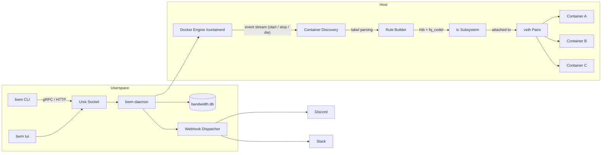

<script setup>
import { VPHomeHero, VPHomeFeatures } from 'vitepress'
</script>

# Bandwidth Manager

**Production-grade Docker bandwidth management** — per-container speed limits, daily traffic quotas, kernel‑level `tc` enforcement.

Stop guessing which container is saturating your uplink. Bandwidth Manager gives you surgical control over every container's network throughput — programmatically, persistently, and with zero userspace throttling overhead.

<div class="tip custom-block" style="margin-top: 1.5rem;">

**🎯 Built for PingLess Studios by [AnAverageBeing](https://github.com/AnAverageBeing)**  
[GitHub Repo](https://github.com/AnAverageBeing/Bandwidth-flow-maintainer) · `MIT License`

</div>

---

## Why Bandwidth Manager?

Running multiple Docker containers on a single host means one noisy neighbour can starve everyone else. Traditional solutions are painful:

| Approach                                                 | Pain Point                                                          |
| -------------------------------------------------------- | ------------------------------------------------------------------- |
| **Manual `tc`**                                          | Steep learning curve, ephemeral rules lost on reboot, no per‑container visibility |
| **cgroups v2**                                           | Inconsistent across kernel versions, no daily quota concept, poor tooling |
| **Docker Compose `deploy.resources.limits`**              | Swarm-only, ignores standalone containers, no traffic accounting    |
| **Thick SaaS agents**                                    | Expensive, closed-source, heavy on RAM                              |

Bandwidth Manager fills the gap with a **single static binary**, a handful of Docker labels, and the Linux kernel's battle-tested Traffic Control subsystem.

---

## Key Features

### 🚦 Per-Container Speed Limiting

Set upload and download rate limits **per container** via Docker labels. No config files, no sidecars.

```yaml
labels:
  bwm.limit.down: "50mbps"
  bwm.limit.up:   "10mbps"
```

### 📊 Daily Traffic Quotas

Define a total data allowance that resets at midnight (configurable). Containers that exceed their quota are throttled to a trickle until the next reset window.

```yaml
labels:
  bwm.quota.daily: "5gb"
```

### 🔍 Automatic Container Discovery

Listens to the Docker event stream. New containers get rules applied immediately. Stopped containers get cleaned up. No polling, no cron.

### ⚡ Kernel-Level `tc` Enforcement

All shaping runs through the Linux `tc` (Traffic Control) subsystem via `htb` qdiscs and `fq_codel` inner qdiscs attached to veth pairs. **Zero userspace throttling** — the kernel does the heavy lifting, so CPU overhead is negligible even at multi‑gigabit rates.

### 🏷️ Docker Label Overrides

Every setting can be driven by Docker container labels. Tweak limits without restarting the daemon — just update the label and send `SIGHUP`.

### 🔔 Webhook Notifications

Fire alerts to **Discord** or **Slack** when containers hit quota thresholds or when the daemon state changes. Includes a rich embed payload.

### 🖥️ Modern Terminal UI

A beautiful, keyboard‑driven TUI built with [Bubble Tea](https://github.com/charmbracelet/bubbletea). Inspect live rates, quotas, and rule status in real time. Sort, filter, and drill down — all from your terminal.

### 📈 Historical Stats

Per‑container byte counters and rate samples persisted to **SQLite** (zero external dependencies). Query with the CLI or export to CSV for Grafana.

### 🧩 SQLite Backend — Zero External Dependencies

No Postgres, no Redis, no message queues. Everything lives in a single `bandwidth.db` file. Back it up with `rsync` and sleep easy.

### 🔧 Systemd Integration

Ships with a hardened systemd unit. Socket activation, `ProtectSystem=strict`, `NoNewPrivileges`, and automatic restarts.

---

## Quick Install

```bash
curl -sSL https://raw.githubusercontent.com/AnAverageBeing/Bandwidth-flow-maintainer/main/install.sh | sudo bash
```

That's it. The script installs the binary, drops in a systemd unit, and starts the daemon. Head over to [Installation](./getting-started/installation.md) for the full walkthrough and manual install instructions.

---

## Architecture



### Control Flow

| Path                       | Description                                                              |
| -------------------------- | ------------------------------------------------------------------------ |
| **Docker → Discovery**     | Daemon subscribes to `/events`. Container create/destroy triggers re‑eval. |
| **Discovery → Rules**      | Labels are parsed into rate & quota specs. Defaults fill in missing values. |
| **Rules → tc**             | `htb` class tree is built per interface; `fq_codel` leaf qdiscs handle fairness. |
| **tc → veth → Container** | Shaping happens on the host-side veth, so the container has no visibility into the limit — it simply sees a constrained pipe. |
| **CLI → Unix Socket → Daemon** | All administrative commands flow over a Unix socket with filesystem ACLs. No network exposure by default. |

---

## Comparison

| Capability                       | Bandwidth Manager | Manual `tc` | cgroups v2 | Docker Compose Limits |
| -------------------------------- | :---------------: | :---------: | :--------: | :-------------------: |
| Per‑container rate limit          | ✅                | ✅          | ⚠️ partial  | ✅ (Swarm only)       |
| Daily traffic quota               | ✅                | ❌          | ❌         | ❌                    |
| Automatic container discovery     | ✅                | ❌          | ❌         | ❌                    |
| Persistent across reboots         | ✅                | ❌          | ✅         | ✅                    |
| Docker label driven               | ✅                | ❌          | ❌         | ❌                    |
| Webhook notifications             | ✅                | ❌          | ❌         | ❌                    |
| Built‑in TUI                      | ✅                | ❌          | ❌         | ❌                    |
| Historical stats (SQLite)         | ✅                | ❌          | ❌         | ❌                    |
| Works on standalone `docker run`  | ✅                | ✅          | ✅         | ❌                    |
| Kernel‑level enforcement          | ✅                | ✅          | ✅         | ❌ (userspace proxy)  |
| Learning curve                    | Low              | Steep       | Moderate   | Low                   |

> **Bottom line:** If you need simple rate caps *and* daily quotas with zero‑touch operation, Bandwidth Manager is purpose‑built for the job.

---

## Next Steps

- **[Installation →](./getting-started/installation.md)** — Get up and running in under a minute.
- **[Configuration →](./configuration.md)** — Learn about labels, quotas, and webhooks.
- **[CLI Reference →](./cli.md)** — Every command, flag, and exit code.
- **[TUI Guide →](./tui.md)** — Master the terminal dashboard.

---

<div class="footer-note">

**Developed by [AnAverageBeing](https://github.com/AnAverageBeing) for [PingLess Studios](https://github.com/pingless-studios)**

Crafted with ❤️ and lots of `tc filter add dev …` commands.  
If this project saves you from a 3 AM pager, consider starring the repo.

</div>

<style scoped>
.footer-note {
  margin-top: 3rem;
  padding: 1.5rem;
  border-top: 1px solid var(--vp-c-divider);
  text-align: center;
  font-size: 0.875rem;
  color: var(--vp-c-text-2);
}
.footer-note a {
  font-weight: 600;
}
</style>
