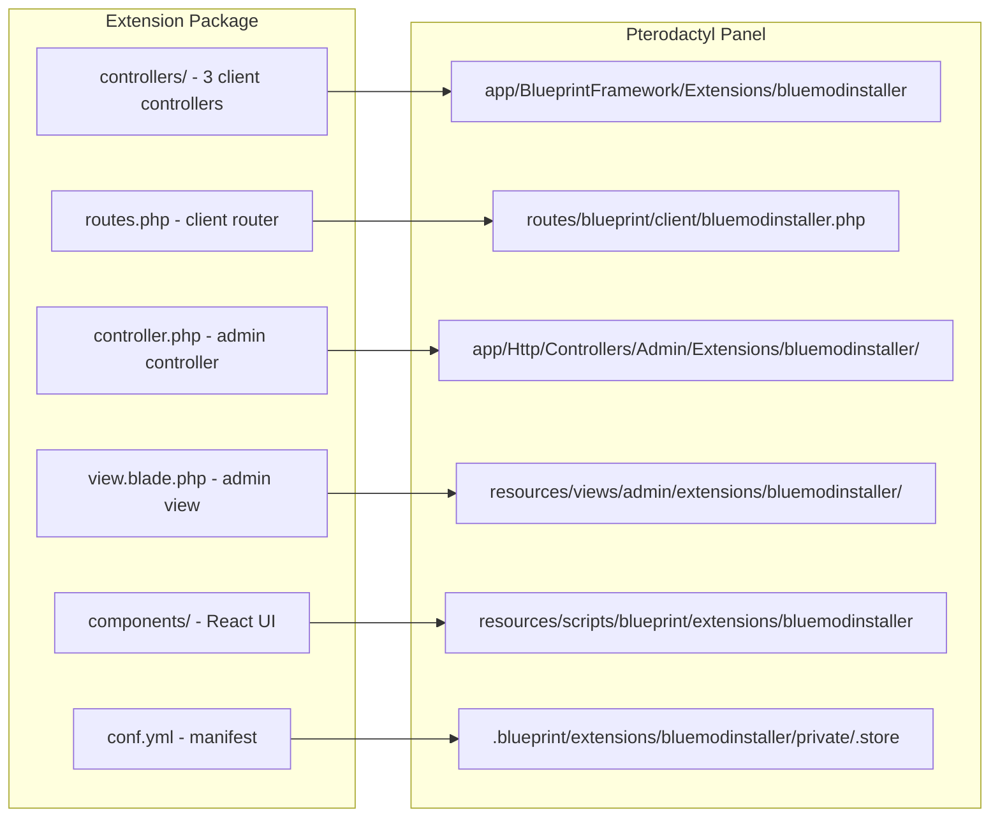
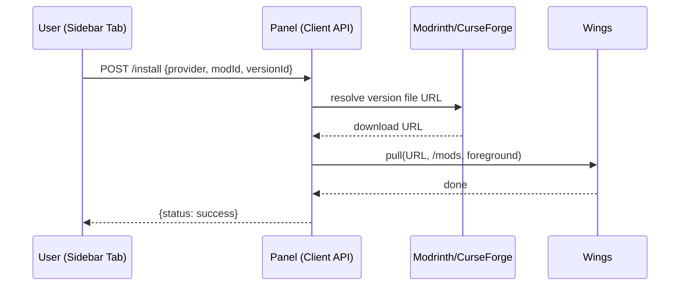

# Architecture Overview

Blue Mod Installer is a classic Blueprint extension: PHP controllers for the client API, a blade admin page, and a set of React components for the server dashboard. Blueprint mounts each piece at install time.



## Components

| Piece | Source | Mounted at | Role |
|---|---|---|---|
| `ModManagerController` | `controllers/` | `app/BlueprintFramework/Extensions/bluemodinstaller/` | Search proxy — builds provider URLs, normalizes responses |
| `ModVersionController` | `controllers/` | same | Version list proxy |
| `InstallModController` | `controllers/` | same | Resolves the file URL, Wings pull into `/mods` |
| `bluemodinstallerExtensionController` | `controller.php` | `app/Http/Controllers/Admin/Extensions/bluemodinstaller/` | Admin settings get/post via `BlueprintAdminLibrary` |
| `index.blade.php` | `view.blade.php` | `resources/views/admin/extensions/bluemodinstaller/` | Admin settings form |
| Client router | `routes.php` | `routes/blueprint/client/bluemodinstaller.php` | 3 routes under `/api/client/extensions/bluemodinstaller/servers/{server}` |
| React components | `components/` | `resources/scripts/blueprint/extensions/bluemodinstaller` (symlink) | Server sidebar tab at `/bluemodinstaller` |

## Data flow

**Search:** the tab calls the client API → `ModManagerController` checks `file.read` on the server → builds the provider URL (Modrinth facets / CurseForge query params, API key injected from extension settings) → normalizes both providers' responses into one shape (`data` + `pagination`).

**Install:** the tab posts provider + mod + version → `InstallModController` checks `file.create` → resolves the concrete file URL (`project/{id}/version` on Modrinth, `mods/{id}/files` on CurseForge, edge→mediafiles rewrite for CF) → `DaemonFileRepository::pull()` downloads it **on the node** into `/mods` in the foreground → success/error JSON.



## Repository layout

```
blueprint/
  bluemodinstaller/        # extension source (single source of truth)
    conf.yml               # manifest — version & Blueprint compatibility
    controller.php         # admin controller
    view.blade.php         # admin settings form
    routes.php             # client API router
    controllers/           # 3 client API controllers
    components/            # React UI (container, cards, filters, pagination, api/)
  INSTALLATION.md          # Blueprint install guide
standalone/
  INSTALLATION.md          # manual (no-CLI) install guide
tools/
  build-release.sh         # builds the versioned release zip
```

Releases ship one zip with `blueprint/` (the `.blueprint` + guide) and
`standalone/` (all files + guide) — see the repo README.
