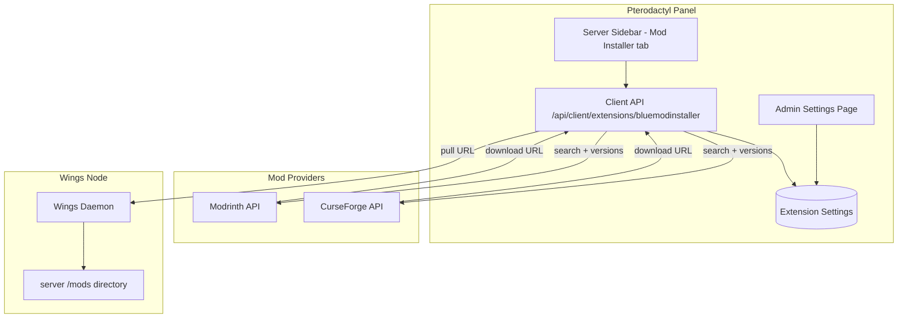

# Blue Mod Installer

**A mod installer for Minecraft servers with support for CurseForge & Modrinth** — a Blueprint extension for the Pterodactyl panel that lets your users search, browse, and install mods straight into their server's `/mods` directory from the server dashboard.

Blue Mod Installer adds a **Mod Installer** tab to every server's sidebar. Users pick a provider (Modrinth or CurseForge), filter by loader and Minecraft version, browse versions, and install with one click — the panel resolves the download through the provider's API and has Wings pull the file directly onto the node.

<div class="tip custom-block" style="margin-top: 1.5rem;">

**Built for ALTIS TECH SOLUTIONS by [AnAverageBeing](https://github.com/AnAverageBeing)**
[GitHub Repo](https://github.com/AnAverageBeing/blue-mod-installer) · [Studio](https://xdp.network)

</div>

---

## Architecture



The **panel** proxies all provider traffic: searches and version lookups are forwarded to Modrinth/CurseForge with your CurseForge API key applied server-side (users never see it). For installs, the panel resolves the real file URL for the chosen version and instructs **Wings** to pull it into the server's `/mods` folder in the foreground.

---

## Key Features

- **Two providers, one UI** — Modrinth (keyless) and CurseForge (API key set once by the admin, kept server-side).
- **Rich search** — text query, loader filter (Fabric, Forge, NeoForge, …), Minecraft version filter, sort modes, paginated results.
- **Version browser** — every version of a mod with game versions, loaders, and download counts before installing.
- **One-click install** — the resolved file is pulled by Wings into `/mods` in the foreground; the user sees success/failure immediately.
- **Permission-aware** — browsing requires `file.read`, installing requires `file.create` on the server.
- **Admin defaults** — default provider, items per page (6/12/24/48), and the CurseForge API key from **Admin → Extensions → Blue Mod Installer**.
- **Blueprint-native** — installs with one `blueprint -install` command; a manual standalone path ships for panels where the CLI can't run.

---

## Blueprint vs Standalone

Both distributions ship the **same** extension source. The difference is only how it lands on your panel.

| | Blueprint (recommended) | Standalone (manual) |
|---|---|---|
| Installer | `blueprint -install bluemodinstaller-vX.Y.Z.blueprint` | Hand-placed files per `standalone/INSTALLATION.md` |
| Requirement | Blueprint CLI on the panel | Blueprint **framework** on the panel (no CLI) |
| Updates | Install the newer `.blueprint` | Repeat the manual steps |
| Removal | `blueprint -remove bluemodinstaller` | Reverse the manual steps |

::: warning Standalone still needs the Blueprint framework
The controllers use `BlueprintAdminLibrary` and the React components import through Blueprint's `@/blueprint/extensions/*` alias. There is no Blueprint-free variant of this addon — the standalone path only replaces the CLI.
:::

---

## Quick Install

```bash
cd /var/www/pterodactyl
blueprint -install bluemodinstaller-v1.12.4.blueprint
```

Then open **Admin → Extensions → Blue Mod Installer** and set your CurseForge API key (only needed for CurseForge results).

See [Installation](./getting-started/installation) for the full guide, and the [Configuration Reference](./configuration/reference) for every setting.
