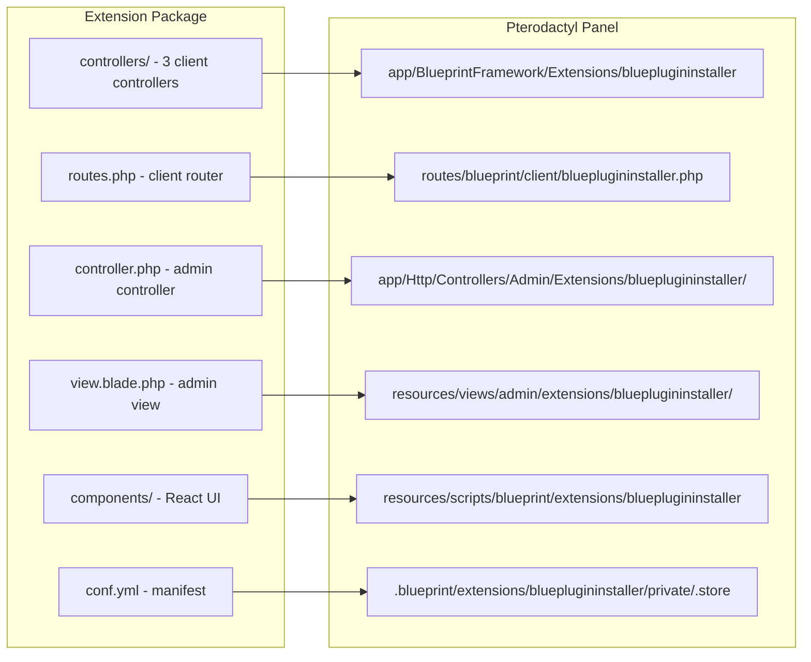
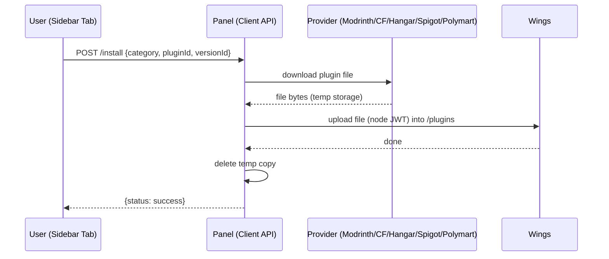

# Architecture Overview

Blue Plugin Installer is a classic Blueprint extension: PHP controllers for the client API, a blade admin page, and a set of React components for the server dashboard. Blueprint mounts each piece at install time.



## Components

| Piece | Source | Mounted at | Role |
|---|---|---|---|
| `BluePluginInstallerManagerController` | `controllers/` | `app/BlueprintFramework/Extensions/blueplugininstaller/` | Search proxy across all 5 providers, normalizes responses |
| `BluePluginInstallerVersionsController` | `controllers/` | same | Version list proxy per provider |
| `BluePluginInstallerInstallController` | `controllers/` | same | Downloads the file panel-side, uploads to Wings via `NodeJWTService` |
| `blueplugininstallerExtensionController` | `controller.php` | `app/Http/Controllers/Admin/Extensions/blueplugininstaller/` | Admin settings (CurseForge key) via `BlueprintAdminLibrary` |
| `index.blade.php` | `view.blade.php` | `resources/views/admin/extensions/blueplugininstaller/` | Admin settings form + about panel |
| Client router | `routes.php` | `routes/blueprint/client/blueplugininstaller.php` | 3 routes under `/api/client/extensions/blueplugininstaller/servers/{server}/blueplugininstaller` |
| React components | `components/` | `resources/scripts/blueprint/extensions/blueplugininstaller` (symlink) | Server sidebar tab at `/blueplugininstaller` |

## Data flow

**Search:** the tab calls the client API → `BluePluginInstallerManagerController` checks `file.read` → builds the provider URL (per-provider endpoint + headers; CurseForge key injected from extension settings) → normalizes every provider's response into one shape (`data` + `pagination`).

**Install:** the tab posts category + plugin + version → `BluePluginInstallerInstallController` checks `file.create` → resolves and **downloads** the file from the provider into local temp storage (`plugins/<name>`) → generates a node JWT and **uploads** the file to the server through Wings → deletes the temp copy → status JSON.



## Repository layout

```
blueprint/
  blueplugininstaller/     # extension source (single source of truth)
    conf.yml               # manifest — version & Blueprint compatibility
    controller.php         # admin controller
    view.blade.php         # admin settings form
    routes.php             # client API router
    controllers/           # 3 client API controllers
    components/            # React UI (container, search/versions panels, cards)
  INSTALLATION.md          # Blueprint install guide
standalone/
  INSTALLATION.md          # manual (no-CLI) install guide
tools/
  build-release.sh         # builds the versioned release zip
```

Releases ship one zip with `blueprint/` (the `.blueprint` + guide) and
`standalone/` (all files + guide) — see the repo README.
