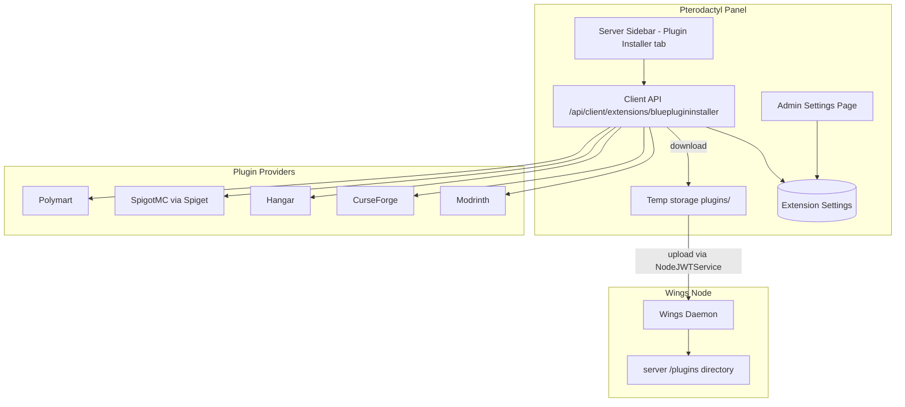

# Blue Plugin Installer

**Browse, install, and manage Minecraft plugins from multiple providers** — a Blueprint extension for the Pterodactyl panel that lets your users discover and install plugins straight into their server's `/plugins` directory from the server dashboard.

Blue Plugin Installer adds a **Plugin Installer** tab to every server's sidebar. Users pick a provider — **Modrinth, CurseForge, Hangar, SpigotMC, or Polymart** — filter by type and Minecraft version, browse versions, and install with one click. The panel downloads the plugin file server-side and uploads it to the node through Wings.

<div class="tip custom-block" style="margin-top: 1.5rem;">

**Built for PingLess Studios by [AnAverageBeing](https://github.com/AnAverageBeing)**
[GitHub Repo](https://github.com/AnAverageBeing/blue-plugin-installer) · [Studio](https://studio.pingless.org)

</div>

---

## Architecture



The **panel** proxies all provider traffic (your CurseForge API key stays server-side). For installs, the panel first **downloads** the plugin file itself, then **uploads** it to the server through Wings using a short-lived node JWT, and cleans up the temp copy.

---

## Key Features

- **Five providers** — Modrinth and Hangar (keyless), SpigotMC via the Spiget API (keyless), Polymart, and CurseForge (API key set once by the admin, kept server-side).
- **Rich search** — text query, loader/type filter (Bukkit, Paper, Spigot, …), Minecraft version filter, sort modes, paginated results.
- **Version browser** — versions per plugin with names and download counts before installing.
- **One-click install** — panel downloads the file and uploads it into `/plugins` via Wings; the user sees success/failure immediately.
- **Permission-aware** — browsing requires `file.read`, installing requires `file.create` on the server.
- **Minimal admin surface** — one setting (the CurseForge API key) at **Admin → Extensions → Blue Plugin Installer**.
- **Blueprint-native** — installs with one `blueprint -install` command; a manual standalone path ships for panels where the CLI can't run.

---

## Blueprint vs Standalone

Both distributions ship the **same** extension source. The difference is only how it lands on your panel.

| | Blueprint (recommended) | Standalone (manual) |
|---|---|---|
| Installer | `blueprint -install blueplugininstaller-vX.Y.Z.blueprint` | Hand-placed files per `standalone/INSTALLATION.md` |
| Requirement | Blueprint CLI on the panel | Blueprint **framework** on the panel (no CLI) |
| Updates | Install the newer `.blueprint` | Repeat the manual steps |
| Removal | `blueprint -remove blueplugininstaller` | Reverse the manual steps |

::: warning Standalone still needs the Blueprint framework
The controllers use `BlueprintAdminLibrary` and the React components import through Blueprint's `@/blueprint/extensions/*` alias. There is no Blueprint-free variant of this addon — the standalone path only replaces the CLI.
:::

---

## Quick Install

```bash
cd /var/www/pterodactyl
blueprint -install blueplugininstaller-v1.0.3.blueprint
```

Then open **Admin → Extensions → Blue Plugin Installer** and set your CurseForge API key (only needed for CurseForge results).

See [Installation](./getting-started/installation) for the full guide, and the [Configuration Reference](./configuration/reference) for every setting.
