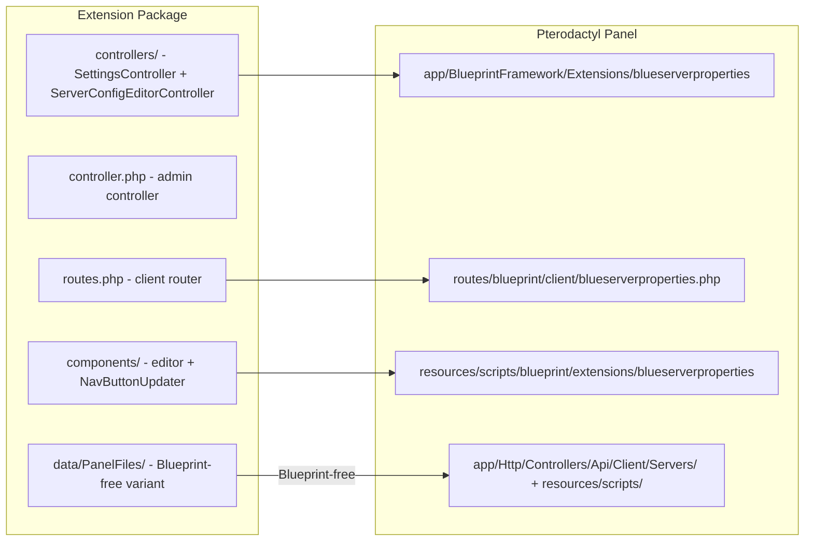
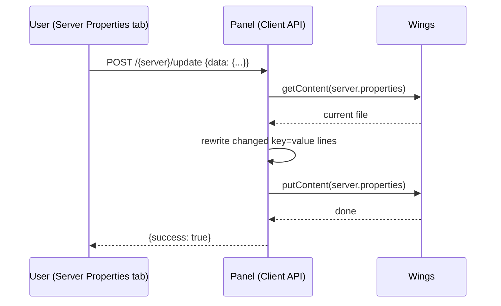

# Architecture Overview

Blue Server Properties Editor is a Blueprint extension with a twist: it also ships a **Blueprint-free variant** of its backend and frontend inside `data/PanelFiles/`, so the same feature can run on a panel with no Blueprint at all.



## Components (Blueprint path)

| Piece | Source | Mounted at | Role |
|---|---|---|---|
| `ServerConfigEditorController` | `controllers/` | `app/BlueprintFramework/Extensions/blueserverproperties/` | Parses/writes `server.properties` via `DaemonFileRepository`; rejects non-Minecraft nests |
| `SettingsController` | `controllers/` | same | Serves the custom tab label from `storage/app/blueserverproperties_config.json` |
| `blueserverpropertiesExtensionController` | `controller.php` | `app/Http/Controllers/Admin/Extensions/blueserverproperties/` | Admin page (navbar text) |
| Client router | `routes.php` | `routes/blueprint/client/blueserverproperties.php` | `/settings/nav-text`, `GET /{server}`, `POST /{server}/update` |
| `ServerConfigEditor` + `ConfigFieldItem` | `components/` | `resources/scripts/blueprint/extensions/blueserverproperties` (symlink) | The editor UI at `/servercfg` |
| `NavButtonUpdater` | `components/` | injected into 11 server-page wrappers | Applies the custom tab label live across the server area |

## Blueprint-free variant (`data/PanelFiles/`)

A parallel implementation that only **adds** files to a vanilla panel (no core
file is overwritten):

```
data/PanelFiles/
├── app/Http/Controllers/Api/Client/Servers/ServerConfigEditorController.php
├── app/Http/Requests/Api/Client/Servers/ServerConfigEditorFetchRequest.php   # file.read
├── app/Http/Requests/Api/Client/Servers/ServerConfigEditorUpdateRequest.php  # file.update
├── app/Http/Middleware/Api/Client/Server/MinecraftServerCheck.php            # 404 on non-MC nests
└── resources/scripts/
    ├── api/server/servercfg/            # fetchConfig.ts / updateConfig.ts
    └── components/server/servercfg/     # ServerConfigEditor.tsx / ConfigFieldItem.tsx
```

Two hand edits wire it up: a `/servercfg` route group in `routes/api-client.php`
and one entry in the `server` array of `resources/scripts/routers/routes.ts`.

::: info History
Before 1.12.4 the variant shipped a `ServerRouterElements.tsx` replacement
(designed for older panels) and a single request class using a nonexistent
`servercfg.edit` permission that failed for everyone. Both were reworked for
panel 1.14.
:::

## Data flow

**Fetch:** the tab calls `GET /{server}` → controller (permission check) → `DaemonFileRepository::getContent('server.properties')` on the node → parse lines (skip comments/blank/malformed) → classify each key (toggle/dropdown/text) → `items` + `defaults` JSON.

**Update:** the tab posts the whole `data` map → controller (permission check) → reads the live file again → rewrites only matching `key=value` lines (comments and untouched keys preserved) → `putContent()` back through Wings → `{success: true}`.



## Repository layout

```
blueprint/
  blueserverproperties/    # extension source (single source of truth)
    conf.yml               # manifest — version & Blueprint compatibility
    controller.php         # admin controller
    view.blade.php         # admin settings form
    routes.php             # client API router
    controllers/           # client API controllers
    components/            # React UI (editor + NavButtonUpdater)
    data/PanelFiles/       # Blueprint-free variant (panel tree mirror)
  INSTALLATION.md          # Blueprint install guide
standalone/
  INSTALLATION.md          # manual + Blueprint-free install guide
tools/
  build-release.sh         # builds the versioned release zip
```

Releases ship one zip with `blueprint/` (the `.blueprint` + guide) and
`standalone/` (all files + guide) — see the repo README.
