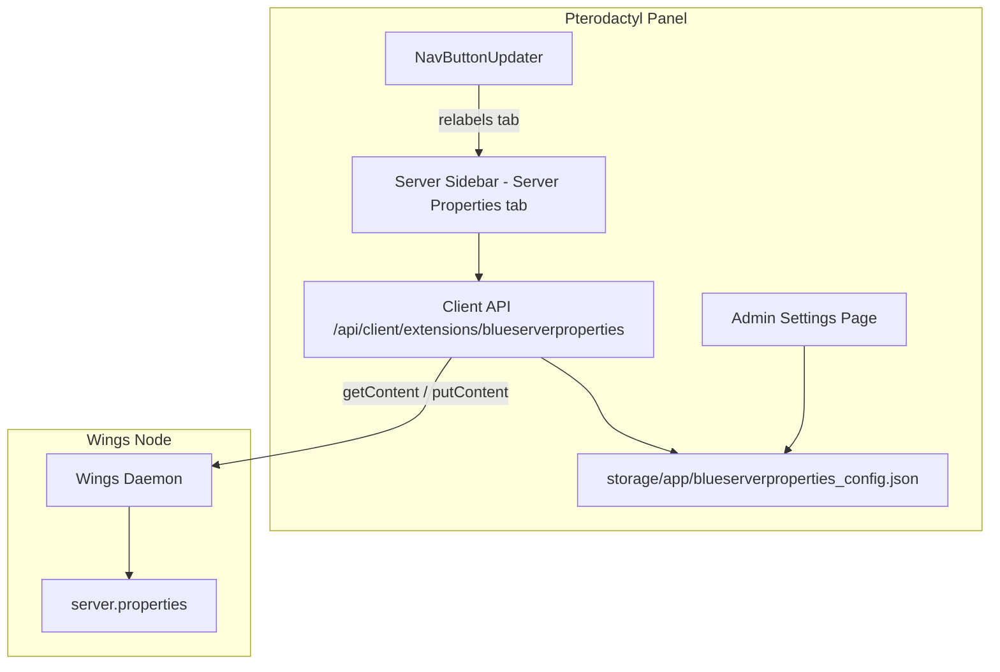

# Blue Server Properties Editor

**A modern `server.properties` editor for Minecraft servers** — a Blueprint extension for the Pterodactyl panel that gives your users a clean, categorized UI for their server's configuration instead of editing a raw text file.

Blue Server Properties Editor adds a **Server Properties** tab to every server's sidebar. It parses the live `server.properties` through Wings, renders every key with the right input — toggles for booleans, dropdowns for `difficulty` and `gamemode`, text for everything else — in a 3-column grid with category filtering, and writes changes back atomically.

<div class="tip custom-block" style="margin-top: 1.5rem;">

**Built for PingLess Studios by [AnAverageBeing](https://github.com/AnAverageBeing)**
[GitHub Repo](https://github.com/AnAverageBeing/blue-server-properties) · [Studio](https://studio.pingless.org)

</div>

::: warning Minecraft servers only
The editor only works on servers in the Minecraft nest (nest ID `1`) — enforced
by the backend and noted on the admin page.
:::

---

## Architecture



The **panel** reads and writes `server.properties` through the Wings file API (nothing is cached — every open fetches the live file). The optional custom tab label lives in a small JSON config written from the admin page; `NavButtonUpdater` components apply it live across the server area.

A genuinely **Blueprint-free** variant of backend + frontend also ships inside the extension (`data/PanelFiles/`) for panels without Blueprint — see [Installation](./getting-started/installation#blueprint-free-install-no-blueprint-at-all).

---

## Key Features

- **Structured editor** — every `server.properties` key rendered with the right control: toggle for `true/false`, dropdowns for `difficulty` and `gamemode`, text inputs elsewhere.
- **3-column grid + category filtering** — find keys fast instead of scrolling a raw file.
- **Live read/write through Wings** — `getContent`/`putContent` on `server.properties`; comments and unknown keys are preserved untouched on save.
- **Customizable sidebar label** — rename the tab (default `Server Properties`, max 30 chars) from **Admin → Extensions → Blue Server Properties Editor**.
- **Permission-aware** — viewing requires `file.read`, saving requires `file.update` (Blueprint-free variant).
- **Minecraft-only guard** — the backend rejects non-Minecraft nests (the admin page explains the limitation).
- **Two distributions** — Blueprint package, manual standalone path, **and** a Blueprint-free PanelFiles variant.

---

## Quick Install

```bash
cd /var/www/pterodactyl
blueprint -install blueserverproperties-v1.12.4.blueprint
```

See [Installation](./getting-started/installation) for all three install paths, and the [Configuration Reference](./configuration/reference) for every setting.
