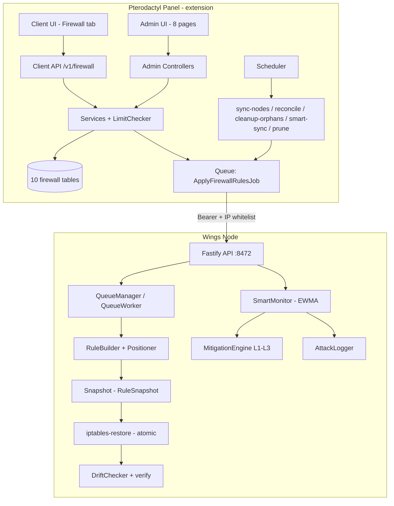
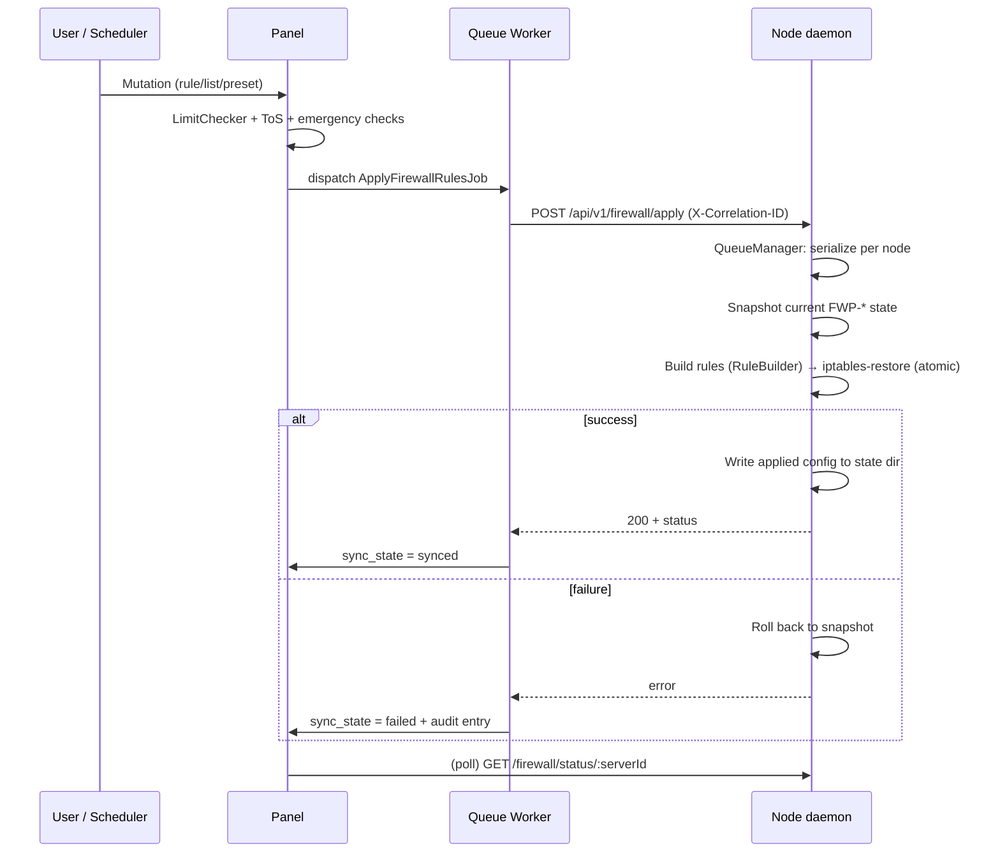
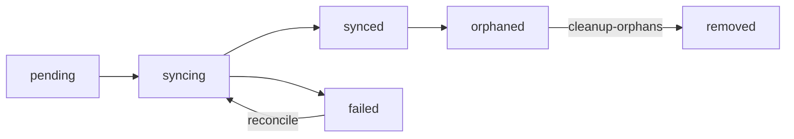
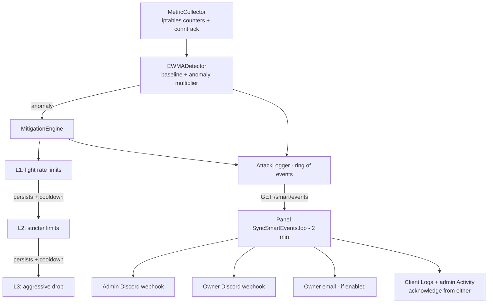

# Architecture Overview

Firewall-Plus is a **two-tier system**: a stateful panel extension that owns all configuration, and a small stateless-ish daemon on each Wings node that owns the actual iptables/ipset writes.

---

## Panel / Node Split

| Concern | Panel | Node daemon |
|---------|-------|-------------|
| Source of truth for rules, lists, presets, grants | ✅ (MySQL, 10 tables) | ❌ (stores last-applied config for drift checks) |
| UI (client + admin) | ✅ | ❌ |
| iptables/ipset writes | ❌ | ✅ (root, `CAP_NET_ADMIN`) |
| SMART traffic monitoring | ❌ (stores events) | ✅ (EWMA on live counters) |
| Scheduling, retries, audit, notifications | ✅ | ❌ |
| Auth | Pterodactyl client API keys + subuser permissions | 64-hex bearer token + IP whitelist + rate limits |

The node daemon is deliberately dumb about policy: it validates, queues, and applies what the panel sends, and reports status back. All authorization decisions happen panel-side.

---

## Apply Flow

Every mutation path (rule CRUD, list changes, preset apply, lifecycle events) converges on one pipeline:

Key properties:

- **Atomic:** rules go in via a single `iptables-restore` — there is no half-applied state.
- **Snapshot + rollback:** the previous `FWP-*` state is snapshotted (`RuleSnapshot`) before each apply; any restore failure rolls back automatically.
- **Idempotent:** rules are comment-tagged; duplicates are skipped, so re-applies are safe.
- **Serialized:** the node's `QueueManager` processes applies one at a time — no concurrent netfilter writers from Firewall-Plus itself.
- **Traceable:** one correlation ID flows from the client API response through the job into node logs and the audit row.

### State machine

Each server's firewall profile moves through:

`failed` profiles are retried by `firewall-plus:reconcile` (every 15 min). `orphaned` profiles — e.g. a server deleted while its node was offline — are reaped by `firewall-plus:cleanup-orphans` (every 30 min) and the pending-cleanup queue.

### Drift detection & reconcile

The node stores the last-applied desired config per server. `IptablesDriftChecker` compares live kernel state against it; the panel's reconcile job (or `POST /api/v1/firewall/verify` on demand) repairs divergence — e.g. after a node reboot without persistence, or someone hand-editing chains. Lifecycle hooks keep state consistent automatically: server deletion flushes the node, node transfers flush the old node and re-apply on the new one, and allocation create/delete re-applies when the addon is enabled.

---

## SMART Pipeline

SMART (Self-Monitoring Analysis & Response Technology) runs **on the node**, close to the traffic:

- **EWMA detection:** an exponentially-weighted moving average builds a per-server traffic baseline; an anomaly fires when current metrics exceed `baseline × smart_anomaly_multiplier`. `smart_alpha` controls smoothing, `smart_warmup_samples` prevents false positives on fresh servers.
- **L1→L3 mitigations:** escalating responses with **cooldowns** between levels — light rate limits first, aggressive drops only if the attack persists. Mitigations auto-apply via the same atomic iptables path, and can be cleared manually (`DELETE /api/v1/smart/mitigation/:serverId`).
- **Gating:** SMART is a double opt-in — an admin grants it per server (Admin → Firewall → Servers), then the owner enables it in the SMART tab and re-applies (the apply payload carries `smart.enabled: true`, which starts the monitor).
- **Visibility:** events sync to the panel every 2 minutes, fan out to Discord/email, and stay listed until acknowledged from the client UI or admin Activity page. The admin Servers index badges servers currently under mitigation.

---

## Node Service Internals

- **Runtime:** Fastify (Node.js 18+), systemd unit with heavy sandboxing (`ProtectSystem=strict`, capability bounding set, syscall filters — `MemoryDenyWriteExecute` is deliberately off because V8 needs executable JIT pages).
- **Storage:** `/var/lib/firewall-plus` — per-server applied configs (`ServerConfigStore`), snapshots, queue state. Atomic writes throughout.
- **iptables layer:** all commands via `execFile`/spawn argument arrays (no shell interpolation); auto-detects and prefers `iptables-nft*` binaries; restore uses `spawn` + `stream.pipeline` to avoid stdin deadlocks; restore timeout clamped 10s–600s.
- **Chains & ipsets:** `FWP-{serverId}` (global) and `FWP-{serverId}-{port}` (per-port) chains with INPUT jumps (`--dport` / `multiport` with `-p`); `fwp-wl-*` / `fwp-bl-*` ipsets.
- **Security posture:** loopback bind by default, empty-whitelist + public-bind refuses to start, token file chmod 600, per-route rate limits, optional `trustProxy` for reverse-proxy fronting.

## File Layout (repo)

| Path | Purpose |
|------|---------|
| `blueprint/pterodactylfirewallplus/` | Blueprint extension (conf.yml, controller, views, components, `data/PanelFiles` with commands/services/migrations) |
| `standalone/` | Blueprint-free installer (`install.sh` / `uninstall.sh` + PanelFiles) |
| `node-service/` | Fastify daemon (`src/api`, `src/engine`, `src/iptables`, `src/config`, `systemd/`, `scripts/`) |
| `docs/RUNBOOK.md`, `docs/ROLLBACK.md` | Operations runbook and rollback guide |
