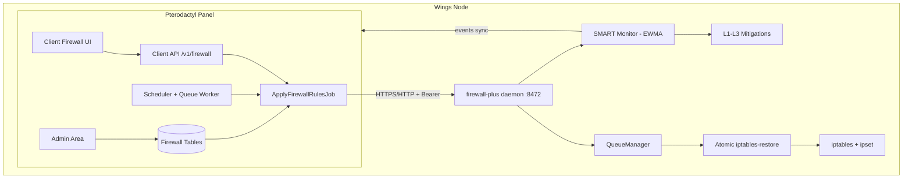

# Firewall-Plus

**Production-grade per-container iptables firewall for Pterodactyl Panel** — available as a Blueprint addon or a standalone panel extension — plus a Fastify node daemon on every Wings host, with DDoS SMART detection and automatic mitigation.

Firewall-Plus gives every game server its own iptables chains and ipsets, managed from the panel UI your users already know. Rules are applied atomically on the node through a queued, snapshot-backed pipeline, and the SMART engine watches live traffic on the node and mitigates attacks before they take a server down.

<div class="tip custom-block" style="margin-top: 1.5rem;">

**Built for PingLess Studios by [AnAverageBeing](https://github.com/AnAverageBeing)**
[GitHub Repo](https://github.com/AnAverageBeing/pterodactyl-firewall-plus) · [Studio](https://studio.pingless.org)

</div>

---

## Architecture



The **panel** owns all state: rules, lists, presets, grants, audit logs, and SMART events. The **node daemon** is a small Fastify service (default port `8472`) that turns panel payloads into atomic iptables changes, verifies them for drift, and runs the SMART detection loop locally on the host.

---

## Key Features

- **13 rule types** — SYN/TCP/UDP/connection limits, global packet limit, fragment drop, TTL filter, packet-size filter, new-connection rate, stateful tracking, burst protection, and GeoIP filtering. See [Rule Types](./user-guide/rules).
- **ipset whitelist & blacklist** — per-server `fwp-wl-*` / `fwp-bl-*` ipsets with bulk import, applied atomically with rule changes.
- **Per-port or global scopes** — rules can target a single allocation port (`FWP-{server}-{port}` chains) or the whole server (`FWP-{server}` chain), plus built-in game presets.
- **SMART DDoS detection** — on-node EWMA anomaly detection with L1→L3 mitigations, cooldowns, attack event log, per-server owner Discord webhooks **and** owner email alerts, and event acknowledgement from both the client UI and the admin Activity page.
- **Atomic, safe applies** — every apply is queued, written via `iptables-restore`, snapshotted first, and rolled back automatically on failure. Drift detection and reconcile keep nodes honest.
- **Full admin operations area** — nodes (tokens, health, version), servers (grants, SMART grants, sync states), rule CRUD, presets, activity audit, operations queue, emergency controls (freeze, per-rule-type disable, flush-all), and settings.
- **Rich client area** — dashboard with charts (chart.js), rules editor, whitelist/blacklist, presets, logs, SMART tab, AbuseIPDB tab, config import/export, and a Terms-of-Service gate.
- **Hardened node daemon** — bearer-token auth, IP whitelist, per-route rate limits, systemd sandboxing, and correlation IDs end-to-end.

---

## Blueprint vs Standalone

The panel extension ships in two flavors. Both install the **same** panel code and features — the difference is how the files get into your panel.

| | Blueprint (recommended) | Standalone |
|---|---|---|
| Installer | `blueprint -install pterodactylfirewallplus-vX.Y.Z.blueprint` | `sudo bash install.sh` from the `standalone/` folder |
| Requirement | [Blueprint](https://blueprint.zip) framework installed on the panel | None — plain Pterodactyl panel |
| File merging | Automatic via Blueprint | `install.sh` copies `PanelFiles` into place |
| Removal | `blueprint -remove pterodactylfirewallplus` | `sudo bash uninstall.sh` |
| Updates | Install the new `.blueprint` package | Re-run `install.sh` from the new release |
| Panel version coupling | Managed by Blueprint compatibility flags | Manual — check release notes |

::: warning The node daemon is separate either way
Reinstalling or upgrading the panel extension does **not** update the node service. The node daemon is installed once per Wings host and upgraded independently. See [Installation](./getting-started/installation#node-installation).
:::

---

## Quick Install

**Panel (Blueprint):**

```bash
cd /var/www/pterodactyl
blueprint -install pterodactylfirewallplus-v1.2.6.blueprint
php artisan migrate --force
```

**Each Wings node:**

```bash
curl -fsSL https://fw-install.pingless.org/node/install.sh | sudo bash
curl -s http://127.0.0.1:8472/api/v1/health
```

Then add the node in **Admin → Firewall → Nodes**, and make sure the scheduler cron and queue worker are running. Full walkthrough: [Installation](./getting-started/installation) · [Quick Start](./getting-started/quick-start)
