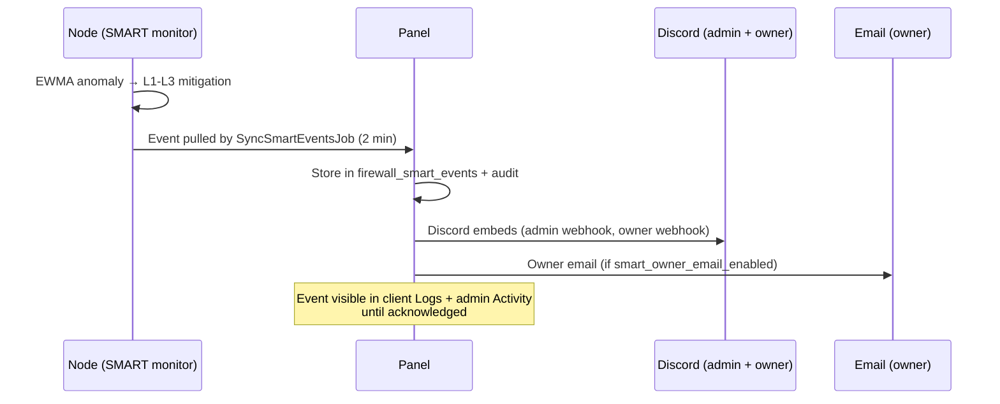

# Webhooks & Alerts

Firewall-Plus notifies through three channels, each with a different audience:

| Channel | Audience | Configured at | Covers |
|---------|----------|---------------|--------|
| Admin Discord webhook | Host operators | Admin → Firewall → Settings → `webhook_url` | Fleet events: node incidents, applies, SMART attacks |
| Owner Discord webhook | Individual server owner | Server → Firewall → SMART tab | That server's SMART attack events |
| Owner email | Individual server owner | Admin setting `smart_owner_email_enabled` (master switch) | That server's SMART attack events |

---

## Admin Discord Webhook

1. In Discord: channel → **Edit Channel → Integrations → Webhooks → New Webhook**, copy the URL.
2. Panel: **Admin → Firewall → Settings** → paste into **Webhook URL** and save.

The panel sends rich Discord embeds (`FirewallWebhookService`) for operational events — node offline/online transitions, apply failures, and SMART attack events synced from nodes.

::: tip Controlling alert volume
`node_offline_webhook_max` (settings) caps how many offline notifications one flapping node can generate per incident. SMART events sync from nodes every 2 minutes via `SyncSmartEventsJob`.
:::

---

## Per-Server Owner Discord Webhook

Server owners can get their own attack alerts without involving the host:

1. Owner creates a webhook in their own Discord server (same steps as above).
2. Server → **Firewall → SMART tab** → paste the webhook URL → save.
   - API equivalent: `PUT /api/client/servers/{server}/v1/firewall/smart/webhook`
3. Requires SMART mode granted by an admin and enabled on the server.

When the node's SMART engine raises an attack event for that server, the owner webhook fires with the detection details (level, metrics vs. baseline, mitigation applied).

## Owner Email Alerts

Email alerts use the panel's mailer — no extra credentials needed beyond working panel mail.

1. Admin → **Firewall → Settings** → enable **`smart_owner_email_enabled`**.
2. That's it: every SMART attack event emails the **server owner** via a dedicated mailable.

This is a fleet-wide master switch — when off, owners get Discord-only notifications. Owners don't configure anything themselves; the alert goes to their panel account email.

---

## Acknowledging Events

Attack events stay "unacknowledged" until someone marks them seen — useful for shared-server teams and for hosts tracking response:

- **Client UI:** server → Firewall → Logs / SMART tab → acknowledge
  (`POST /api/client/servers/{server}/v1/firewall/smart/events/{id}/ack`)
- **Admin UI:** **Admin → Firewall → Activity** → SMART events section → acknowledge

While a mitigation is active, the admin **Servers index** shows an **"under mitigation"** badge on that server's row, so ongoing attacks are visible at a glance across the fleet.

## Event Lifecycle

## Troubleshooting

- **No Discord messages:** verify the URL still exists in Discord (deleted webhooks fail silently), and check `storage/logs/laravel.log` for webhook errors.
- **No owner emails:** confirm `smart_owner_email_enabled` is on **and** panel mail works generally (`php artisan tinker` → send a test, or check your mail driver logs). The toggle only gates SMART alerts; it doesn't fix broken panel mail.
- **Duplicate-feeling alerts:** an event fires once per detection, but each L1→L3 escalation is a separate event. That's intentional — escalation is new information.
