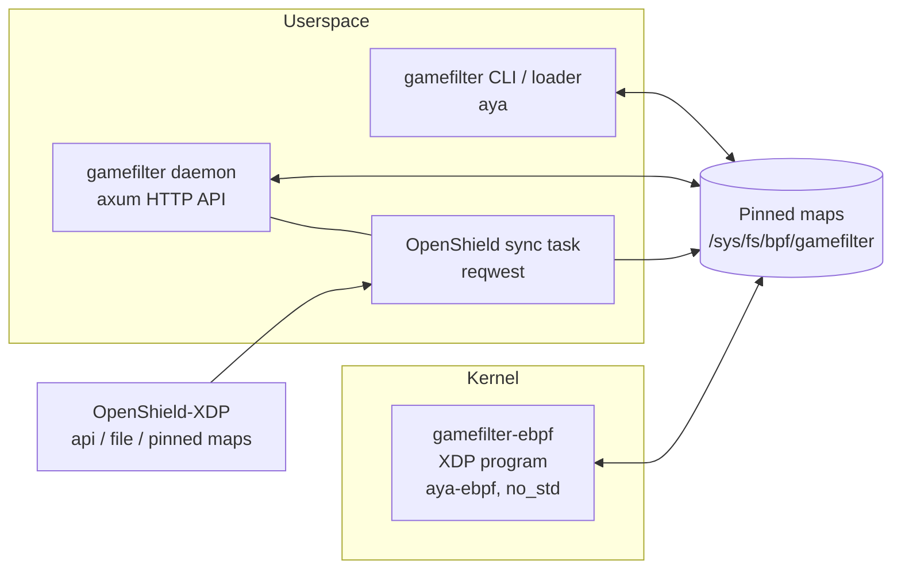
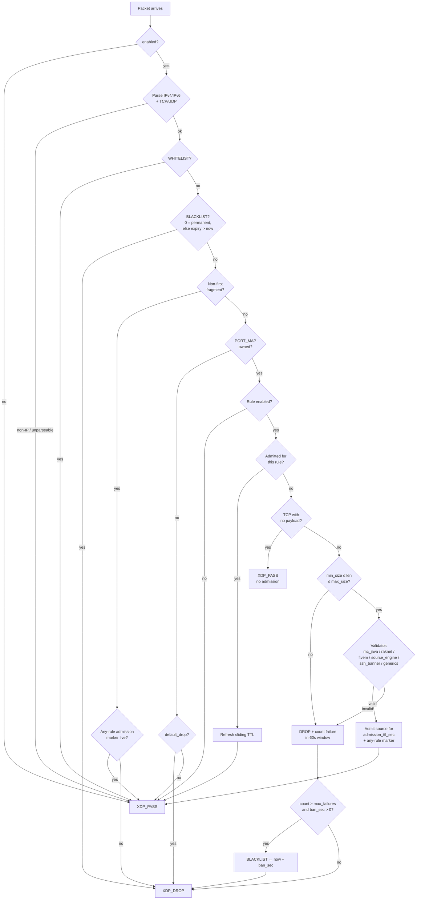
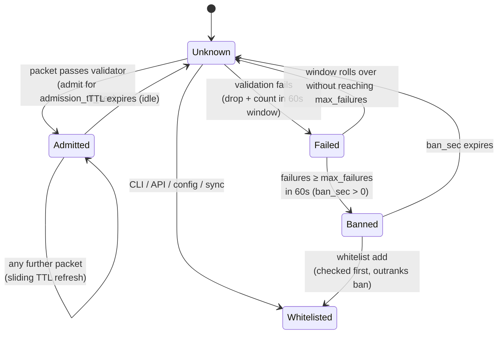

# Architecture Overview

GameFilter XDP is two programs and a shared-types crate, all Rust:



- **eBPF kernel program** (`gamefilter-ebpf/`) — a single `#[xdp]` entry point written with aya-ebpf (`no_std`, `no_main`). Parses IPv4/IPv6 + TCP/UDP, runs the whitelist/blacklist/port/admission/validator pipeline, and returns `XDP_PASS` or `XDP_DROP`. Non-IP or unparseable traffic is passed — fail-open by design.
- **Userspace loader + CLI** (`gamefilter/`, aya) — loads the object, populates the maps, attaches native-first with generic fallback, pins the link and every map, and exits. All CLI commands (`status`, `whitelist`, …) reopen the pinned maps, so they work without any resident process.
- **API daemon** (`gamefilter daemon`, axum) — the management plane: token-authenticated, per-IP rate-limited REST API, plus the OpenShield sync task when enabled.
- **OpenShield sync** (`sync.rs`) — polls OpenShield's lists (API, JSON file, or direct pinned-map read) and diffs them into the kernel maps; local CLI/API entries are marker-tagged and never touched.
- **Shared types** (`gamefilter-common/`) — `repr(C)` structs that are the kernel ABI (`FilterRule`, `AdmitKey`, `RuleStats`, …), compiled into both sides.

[[toc]]

---

## Map layout

All maps are pinned under `/sys/fs/bpf/gamefilter/maps/` at load; the attach itself is pinned as `/sys/fs/bpf/gamefilter/link` (an fd link — removing the pin detaches the program).

| Map | Type | Key → Value | Notes |
| --- | ---- | ----------- | ----- |
| `FILTER_MAP` | ARRAY (64) | slot → `FilterRule` | The rule table; position = slot used in stats |
| `PORT_MAP` | ARRAY (131072) | `proto_idx << 16 \| port` → `u16` | `proto_idx` 0 = TCP, 1 = UDP. Stores **rule_idx + 1** — 0 (zero-init) means "port not owned" |
| `ADMIT_MAP` | LRU_HASH (65536) | `AdmitKey{addr[16], rule}` → `{admit_until_ns}` | Sliding admission deadline (monotonic ns). Also written with `rule = 0xFFFF` as an any-rule marker for fragments |
| `FAIL_MAP` | LRU_HASH (65536) | `AdmitKey` → `{window_start_ns, count}` | Validation failures inside a 60-second window |
| `WHITELIST` | HASH (65536) | `addr[16]` → `u64` | Checked first — full bypass. Value 1 = local, 2 = synced |
| `BLACKLIST` | HASH (65536) | `addr[16]` → `u64` | Value 0 = permanent; otherwise monotonic-ns expiry (temp-bans) |
| `STATS` | PERCPU_ARRAY (65) | slot → `RuleStats` | One slot per rule; slot 64 is the global entry. Userspace sums across CPUs |
| `CONFIG` | ARRAY (1) | 0 → `{default_drop, enabled}` | Global switches, rewritten on every reload |

Key conventions:

- **IP keys are `[u8; 16]`** — IPv4 in the first 4 bytes (rest zero), full IPv6 otherwise. One map family serves both families.
- **Admission is per (source, rule)** — being admitted for Minecraft does not admit you to the SSH filter.
- LRU for `ADMIT_MAP`/`FAIL_MAP` means flood churn evicts entries instead of failing inserts; the whitelist/blacklist are plain HASH so synced and manual entries are never evicted.
- The validator reads payload at fixed offsets with direct packet access; the one dynamic-offset read (MC Java next-state byte) goes through `bpf_xdp_load_bytes`, which validates at runtime — available since kernel 5.9, comfortably above the 5.15 floor.

## Packet pipeline



Pipeline properties worth knowing:

- **Whitelist outranks everything; blacklist outranks all validation.**
- **TCP handshake packets pass but never admit** — SYN/ACK with no payload gets `XDP_PASS` without touching `ADMIT_MAP`. Only a data packet that passes the validator admits a source.
- **Fragments are fail-closed for strangers** — a non-first fragment has no visible L4 header, so it only passes if the source holds a live admission (the `0xFFFF` any-rule marker written alongside every admission).
- **IPv6 extension headers are not walked** — such packets are treated as unparseable and passed, same as non-IP traffic.
- Every counter bump hits both the rule's `STATS` slot and the global slot 64, per-CPU (no atomic contention at line rate).

## Admission / ban state machine



State is entirely in the LRU maps — there is no userspace bookkeeping, so the kernel decision path never waits on the daemon.

## Hot reload

`gamefilter reload` (and `POST /api/v1/reload`) re-push state through the **pinned maps** without reloading the object or detaching:

1. Rewrite the `CONFIG` slot (`enabled`, `default_drop`).
2. Zero all 64 `FILTER_MAP` slots, then write the new rules.
3. Sweep all 131072 `PORT_MAP` entries to 0, then re-stamp ownership (`rule_idx + 1`).

Admissions, lists, and failure windows survive a reload untouched. Static `whitelist:`/`blacklist:` from the YAML are only seeded at `load`.

## File layout

Installed:

```
/opt/gamefilter/gamefilter            # userspace binary
/opt/gamefilter/gamefilter-ebpf.o     # XDP object
/usr/local/bin/gamefilter             # symlink → /opt/gamefilter/gamefilter
/etc/gamefilter/gamefilter.yaml       # config (chmod 600)
/var/lib/gamefilter/state.json        # load-time snapshot (interface, mode, filter table)
/sys/fs/bpf/gamefilter/link           # pinned XDP link (the attachment)
/sys/fs/bpf/gamefilter/maps/*         # pinned maps
/etc/systemd/system/gamefilter-loader.service   # oneshot: load / unload
/etc/systemd/system/gamefilter-api.service      # daemon: API + sync
```

Source tree:

```
gamefilter/            # userspace (aya, axum, clap)
  src/main.rs          # CLI definition
  src/bpf_loader.rs    # object load, rule push, attach, pin
  src/cli.rs           # status JSON, lists, reload-via-pins, key mgmt
  src/api.rs           # axum router, auth, rate limiting
  src/daemon.rs        # load / daemon entry points
  src/sync.rs          # OpenShield list sync (api | file | maps)
  src/maps.rs          # pinned-map access helpers
  src/config.rs        # YAML schema
gamefilter-ebpf/       # XDP program (aya-ebpf, no_std)
gamefilter-common/     # shared repr(C) kernel ABI types
configs/               # example config
systemd/               # unit files
scripts/test-rig.sh    # veth integration test with crafted game packets
```
