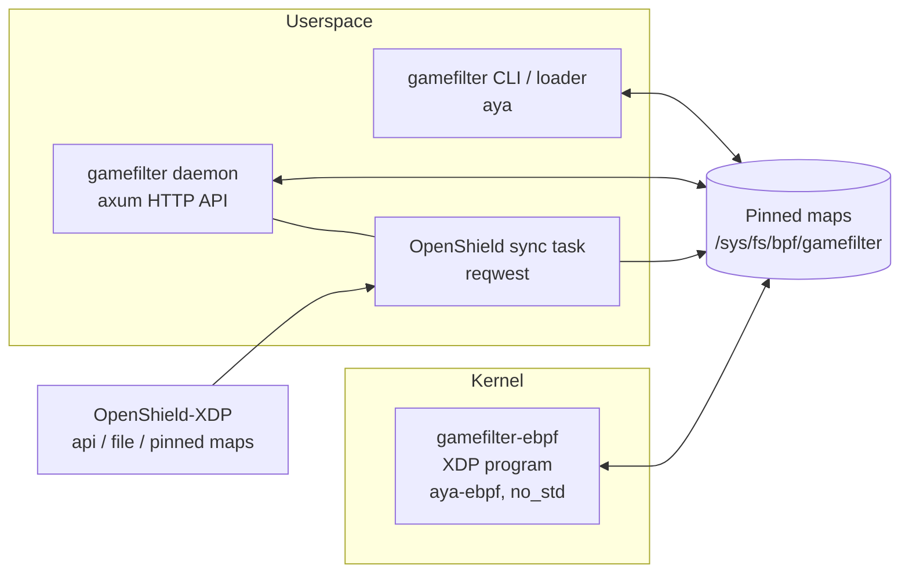
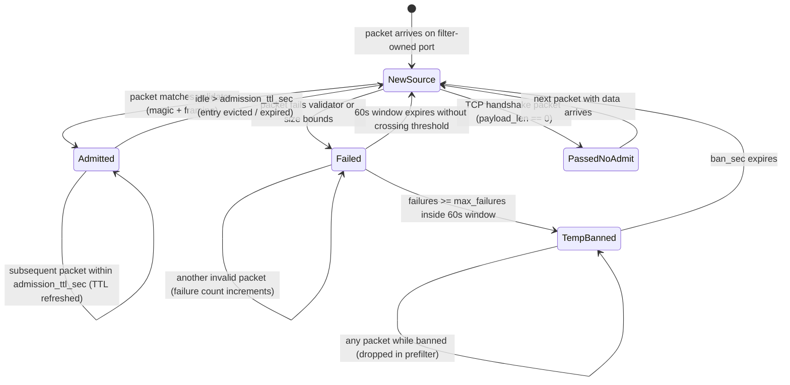

# Architecture Overview

GameFilter XDP is two programs and a shared-types crate, all Rust:



- **eBPF kernel program** (`gamefilter-ebpf/`) — a single `#[xdp]` entry point written with aya-ebpf (`no_std`, `no_main`). Parses IPv4/IPv6 + TCP/UDP, runs destination IP checks (`TENANTS_MAP` in dedicated mode), whitelist/blacklist, port ownership, admission, and validators. Non-IP or unparseable traffic is passed — fail-open by design.
- **Userspace loader + CLI** (`gamefilter/`, aya) — loads the object, populates the maps, attaches native-first with generic fallback, pins the link and every map, and exits. All CLI commands (`status`, `whitelist`, …) reopen the pinned maps, so they work without any resident process.
- **API daemon** (`gamefilter daemon`, axum) — the management plane: token-authenticated, per-IP rate-limited REST API, 1s rate sampler, live tenant enrollment, plus the OpenShield sync task.
- **OpenShield sync** (`sync.rs`) — polls OpenShield's lists (API, JSON file, or direct pinned-map read) and diffs them into the kernel maps; local CLI/API entries are marker-tagged and never touched.
- **Shared types** (`gamefilter-common/`) — `repr(C)` structs that are the kernel ABI (`FilterRule`, `AdmitKey`, `GlobalConfig`, `RuleStats`, …), compiled into both sides.

[[toc]]

---

## Map layout

All maps are pinned under `/sys/fs/bpf/gamefilter/maps/` at load; the attach itself is pinned as `/sys/fs/bpf/gamefilter/link` (an fd link — removing the pin detaches the program).

| Map | Type | Key → Value | Notes |
| --- | ---- | ----------- | ----- |
| `TENANTS_MAP` | HASH (65536) | `dst_ip[16]` → `u64` | In `mode: dedicated`, destination IPs not in this map bypass filtering with `XDP_PASS` |
| `FILTER_MAP` | ARRAY (64) | slot → `FilterRule` | The rule table; position = slot used in stats |
| `PORT_MAP` | ARRAY (131072) | `proto_idx << 16 \| port` → `u16` | `proto_idx` 0 = TCP, 1 = UDP. Stores **rule_idx + 1** — 0 (zero-init) means "port not owned" |
| `ADMIT_MAP` | LRU_HASH (65536) | `AdmitKey{src[16], dst[16], rule}` → `{admit_until_ns}` | Sliding admission deadline (monotonic ns). Also written with `rule = 0xFFFF` as an any-rule marker for fragments |
| `FAIL_MAP` | LRU_HASH (65536) | `AdmitKey` → `{window_start_ns, count}` | Validation failures inside a 60-second window |
| `WHITELIST` | HASH (65536) | `addr[16]` → `u64` | Checked first — full bypass. Value 1 = local, 2 = synced |
| `BLACKLIST` | HASH (65536) | `addr[16]` → `u64` | Value 0 = permanent; otherwise monotonic-ns expiry (temp-bans) |
| `STATS` | PERCPU_ARRAY (65) | slot → `RuleStats` | One slot per rule; slot 64 is the global entry. Userspace sums across CPUs |
| `CONFIG` | ARRAY (1) | 0 → `{default_drop, enabled, mode}` | Global switches, rewritten on every reload |

Key conventions:

- **IP keys are `[u8; 16]`** — IPv4 in the first 4 bytes (rest zero), full IPv6 otherwise.
- **Admission is per `(source, destination, rule)`** — being admitted for one tenant VPS does not grant access to another tenant VPS.
- LRU for `ADMIT_MAP`/`FAIL_MAP` means flood churn evicts entries instead of failing inserts; the whitelist/blacklist/tenants are plain HASH so entries are never evicted.
- The validator reads payload at fixed offsets with direct packet access; the dynamic-offset read (MC Java next-state byte) goes through `bpf_xdp_load_bytes`, which validates at runtime.

## Packet pipeline

```mermaid
flowchart TD
    A[Packet arrives] --> EN{enabled?}
    EN -- no --> PASS[XDP_PASS]
    EN -- yes --> PARSE{Parse IPv4/IPv6<br/>+ TCP/UDP}
    PARSE -- non-IP / unparseable --> PASS
    PARSE -- ok --> DEDICATED{mode: dedicated?}
    DEDICATED -- yes --> TENANT{dst_ip in<br/>TENANTS_MAP?}
    TENANT -- no (un-enrolled) --> PASS
    TENANT -- yes --> WL
    DEDICATED -- no (vps mode) --> WL
    WL{WHITELIST?} -- yes --> PASS
    WL -- no --> BL{BLACKLIST?<br/>0 = permanent,<br/>else expiry > now}
    BL -- yes --> DROP[XDP_DROP]
    BL -- no --> FRAG{Non-first<br/>fragment?}
    FRAG -- yes --> FA{Any-rule admission<br/>marker live?}
    FA -- yes --> PASS
    FA -- no --> DROP
    FRAG -- no --> OWN{PORT_MAP<br/>owned?}
    OWN -- no --> DEF{default_drop?}
    DEF -- yes --> DROP
    DEF -- no --> PASS
    OWN -- yes --> ADM{ADMIT_MAP live<br/>for (src, dst, rule)?}
    ADM -- yes --> REFRESH[Refresh sliding TTL<br/>XDP_PASS]
    ADM -- no --> TCP_NO_PAYLOAD{TCP with 0 payload<br/>SYN/ACK handshake?}
    TCP_NO_PAYLOAD -- yes --> PASS_NO_ADMIT[XDP_PASS<br/>no admission granted]
    TCP_NO_PAYLOAD -- no --> VAL{Protocol validator<br/>size bounds + magic bytes}
    VAL -- valid --> ADMIT[Insert ADMIT_MAP<br/>XDP_PASS]
    VAL -- invalid --> FAIL[Increment FAIL_MAP<br/>failures >= max? -> BLACKLIST<br/>XDP_DROP]
```

## Admission and Ban State Machine



## Hot Reload Mechanics

`gamefilter reload` and `POST /api/v1/config` (or `/api/v1/reload`) apply updates **incrementally without a traffic blip**:

1. **`CONFIG` map** — updated in place with `default_drop`, `enabled`, and `mode`.
2. **`FILTER_MAP`** — slots updated in place; trailing slots zeroed.
3. **`PORT_MAP`** — computed diff between old rules and new rules: new port bindings are added, and only removed port bindings are reset to `0`. Unaffected ports are never swept.
4. **`TENANTS_MAP`** — synced with `cfg.tenants` diff.
5. **`ADMIT_MAP`** — stale admissions are purged **only** for rules whose definition actually changed (ports, validator, or sizes). Unmodified rules preserve their active player admissions.
