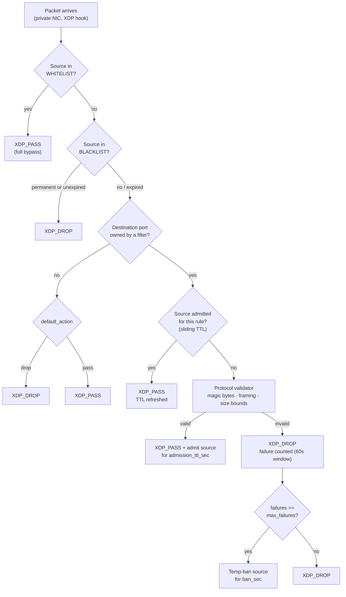

# GameFilter XDP

Per-game, protocol-validating XDP filter — all Rust (aya-ebpf kernel program, aya userspace).

GameFilter XDP sits on the **private NIC** between your edge firewall and your game servers. Every port a game listens on gets a filter; a packet only reaches the server if it **provably speaks that game's protocol**. Sources that pass validation once are admitted for a sliding TTL, so real players never notice the filter — and random flood garbage aimed at a game port dies in the NIC driver.

There are **no pps knobs**. Instead of guessing how many packets per second a "legit" client sends, GameFilter checks what the packet *is*: magic bytes at exact offsets, frame-length consistency, payload size bounds. A 10M pps UDP flood of random payloads to your Minecraft port is simply not RakNet — it is dropped on the first packet, and repeated failures temp-ban the source.

## How It Works



## Features

- **Protocol proof, not rate guessing** — validators check exact protocol structure (magic offsets, varint frame-length consistency), not just ports
- **7 built-in validators** — `mc_java`, `raknet` (Bedrock/MCPE/Geyser), `fivem`, `source_engine` (CS2/CS:GO), `ssh_banner`, plus `tcp_generic` / `udp_generic` size-bounds fallbacks
- **Sliding admission TTL** — a source that validates once is admitted per (source, rule); every further packet refreshes the window, so established players take the fast path
- **Failure → temp-ban escalation** — `max_failures` invalid packets inside a 60-second window bans the source for `ban_sec`, enforced in kernel
- **Flexible port ownership** — single ports (`"25565"`), lists, and ranges (`"27015-27050"`), up to 64 filters
- **Whitelist / blacklist** — permanent or timed entries, managed live from the CLI or HTTP API without a reload
- **OpenShield-XDP list sync** — mirrors OpenShield's whitelist/blacklist into the kernel maps (adds *and* removals), via its API, a JSON export file, or a direct read of its pinned ban maps
- **HTTP management API** — token-authenticated, per-IP rate-limited; stats, filters, admissions, lists, config read/patch, hot reload. No TUI by design
- **Hot config reload** — `gamefilter reload` re-pushes rules, port ownership, and the global config into the pinned maps without detaching
- **Fail-open by design** — non-IP or unparseable traffic is passed; only traffic to filter-owned ports is ever at risk of a drop

## Quick Install

```bash
# Extract the release package, then:
sudo ./install.sh
```

The installer checks your kernel (5.15+ with BTF), asks which interface to filter (the **private** one), writes `/etc/gamefilter/gamefilter.yaml`, and enables the systemd loader + API services. See [Installation](./getting-started/installation) for the full walkthrough.

```bash
sudo gamefilter status     # per-filter counters
sudo gamefilter key        # show API URL + key
```

## Built-in Validators

| Validator | Protocols | Proof required on the first packet |
| --------- | --------- | ---------------------------------- |
| `mc_java` | Minecraft Java (TCP) | Full handshake frame: varint length (must match payload), packet id 0, protocol varint, address, port, next-state 1\|2; legacy `FE 01` ping accepted |
| `raknet` | MC Bedrock / MCPE / Geyser (UDP) | RakNet magic `00ffff00…12345678` at the exact offset for ping (`0x01`) / open-connection-request (`0x05`, `0x07`) |
| `fivem` | FiveM (UDP) | `0xFFFFFFFF` + `getinfo`/`getstatus`/`connect`, or an ENet CONNECT command (low nibble 2, ≥52 bytes) |
| `source_engine` | CS2 / CS:GO / Source (UDP) | `0xFFFFFFFF` + A2S type byte; `T` additionally requires `Source Engine Query\0` |
| `ssh_banner` | SSH / SFTP (TCP) | `SSH-` banner, ≤255 bytes (RFC 4253) |
| `tcp_generic` | any TCP | Size bounds + NULL/Xmas/FIN-scan flag rejection |
| `udp_generic` | any UDP | Size bounds only |

::: warning TCP handshake packets are not admissions
SYN/ACK packets carry no payload and pass unvalidated — but they never admit a source. Admission only comes from a **data packet** that passes the protocol validator, so a spoofed handshake gets an attacker nothing.
:::

## vs. Generic Rate-Limit Firewalls

GameFilter is a complement to rate-limiting firewalls like [OpenShield-XDP](/openshield-xdp/), not a replacement — run OpenShield on the public edge and GameFilter on the private NIC in front of the game servers.

| | GameFilter XDP | Generic rate-limit firewall |
| --- | --- | --- |
| Decision basis | Protocol validity (magic bytes, framing, size bounds) | Packets/bytes per second per source |
| Tuning | Per-game payload bounds from documented protocol structure | Thresholds guessed from traffic baselines |
| Random-payload flood to a game port | Dropped on the **first** packet (not valid protocol) | Dropped only after a rate threshold trips |
| Legit player experience | Validated once, then admitted (sliding TTL fast path) | Counted against rate budgets forever |
| Attacker with valid-looking low-rate traffic | Blocked unless packets are protocol-perfect | Invisible below the threshold |
| Where it runs | Private NIC in front of game servers | Public edge |
| Management | HTTP API + CLI, hot reload, OpenShield list sync | Varies |

## Accuracy

Validators check exact protocol structure, not just ports — absolute accuracy depends on correct per-game `min_size`/`max_size` tuning for your setup. The `fivem` ENet CONNECT check and Source-engine game-join bytes are marked UNVERIFIED upstream (only query formats are officially documented); if you hit false drops there, widen `validator` to `udp_generic` for that port and keep the size bounds tight. The byte-level basis of every validator, with sources, is in the project's `docs/protocol-research.md`.

::: info Project status
`license` and `update` are intentionally **not implemented yet** — all features are currently enabled and there is no license server. There is no TUI and no stats window; everything is managed through the HTTP API or CLI.
:::

[Installation →](./getting-started/installation) · [Configuration Reference →](./configuration/reference) · [HTTP API →](./user-guide/api) · [Architecture →](./architecture/overview)
