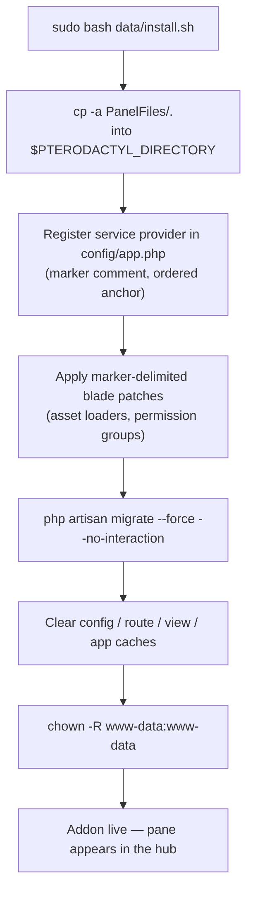
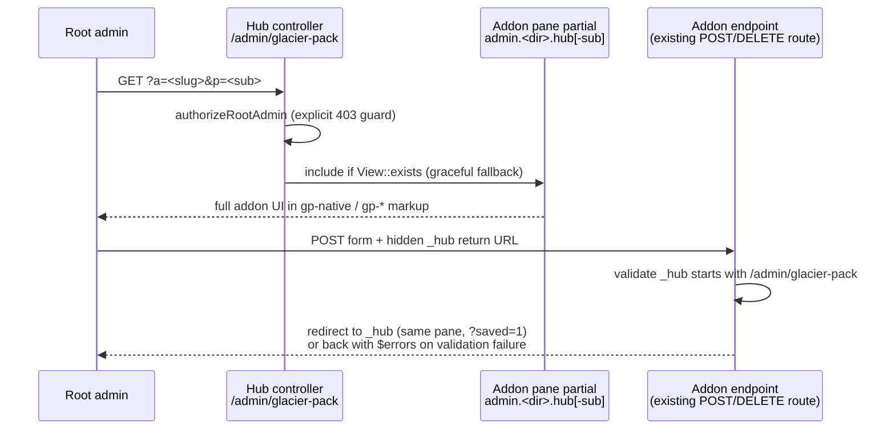
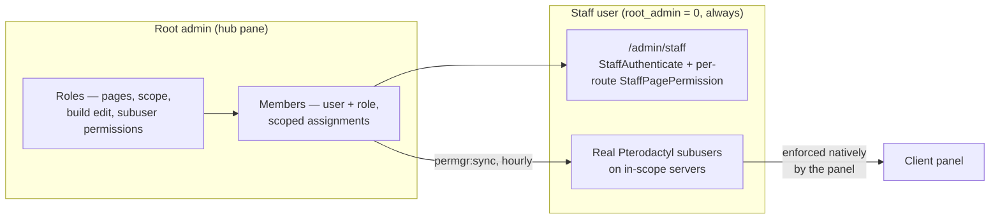

# Architecture Overview

Glacier Pack is two things: a **packaging format** (24 self-contained addons that install onto Pterodactyl Panel v1.12.x without Blueprint) and a **hub contract** (one admin dashboard that hosts every addon's complete UI). This page explains both, plus the theme-compatibility layer and Permission Manager's security model.

---

## The standalone package format

Every addon — including the hub itself — is a self-contained directory that mirrors the panel root exactly:

```
<addon-name>/
├── README.md             # what it does, feature list
├── INSTALL.md            # install / uninstall guide
├── PanelFiles/           # mirrors /var/www/pterodactyl exactly
│   ├── app/              # controllers, models, services, providers
│   ├── config/           # the addon's config file
│   ├── database/         # migrations (with working down())
│   ├── resources/views/  # hub partials and client partials
│   ├── routes/           # action + API routes
│   └── public/ext/       # static JS/CSS assets
└── data/
    ├── install.sh        # idempotent installer
    ├── remove.sh         # remover
    └── patch-*.py        # optional marker-delimited blade patchers
```

Naming is uniform across the family: kebab-case directories (`recycle-bin`), PascalCase namespace roots (`Pterodactyl\Http\Controllers\Admin\RecycleBin`), one service provider per addon (`Pterodactyl\Providers\<Name>ServiceProvider`), `<snake_addon>_*` database tables, `config/<addon>.php`, and `routes/admin-<addon>.php`.

### Install flow



Every installer runs under `set -euo pipefail` and is **idempotent**: marker-delimited blocks (`<!-- <marker>-block-start -->`, `// <marker>` in `config/app.php`) are detected and skipped on re-run, so re-running after a panel update re-applies what the update overwrote without duplicating anything. Two addons deviate deliberately — Recycle Bin additionally patches the React frontend (requiring `yarn build:production`), and Node Stats ships a separate queue-worker installer.

**No core-file replacement.** Patches are injected, never swapped. The one documented exception is Recycle Bin, which patches core panel files (marker `// pterodactyltrashbinpro`) — loudly documented in its own INSTALL.md.

---

## Service provider and route registration

Each addon registers exactly one Laravel service provider, which merges its config, loads its routes, binds its view namespace and schedules any recurring work through the panel's scheduler — no cron or Kernel edits required (Recycle Bin's hourly purge, Resource Alerts' per-minute sampling, Backup Pro's run-due/check-sync/prune commands and Permission Manager's hourly `permgr:sync` all wire in this way).

After hub v2 conversion, an addon's route table contains **no `GET /admin/<addon>` page routes** — only action endpoints (POST/DELETE) and API routes. The page routes were removed with the original admin pages; the endpoints stayed because hub forms post to them. Authorization checks live on every controller method, input is validated server-side, and Blade output is escaped.

---

## The hub v2 architecture

The hub is a single root-admin-guarded controller and one standalone page (its own chrome, not AdminLTE) driven by a plain config registry (`config/glacier-pack.php`) listing all 24 addons with their slug, name, description, pack, icon and pane view.



Key mechanics:

- **Pane resolution** — `?a=<slug>` renders `admin.<dir>.hub`; `?p=<sub>` renders `admin.<dir>.hub-<sub>`, `View::exists`-checked with fallback to the main pane for unknown subs. The `p` parameter is restricted to `[a-z0-9-]`.
- **Sub-tabs** — a multi-page partial declares its own tabs by including the shell's `glacier-pack::subtabs` component with a label/`p` list.
- **Self-sufficient partials** — the hub passes only `$gp` (registry meta) and `$gpSub` (active sub); each partial reads its own data inline through the same services and models the addon's original controllers used.
- **Styling** — original Bootstrap-ish markup is kept and wrapped in `<div class="gp-native">`, which the hub stylesheet themes to match (boxes, tables, forms, buttons, labels, alerts, pagination, nav-tabs, small-boxes, callouts). Anything new uses the shared `gp-*` component classes.
- **Uniform POST flow** — every form and row action (delete / toggle / run / create) carries the full return URL in `_hub`. Controllers validate it is a local `/admin/glacier-pack` path (403 otherwise) and redirect there. Validation failures redirect back automatically and render in the hub shell's error callout.
- **Zero dependencies** — the hub has no database tables, loads no external CDN assets, and uses inline SVG icons.

---

## Glacier theme compatibility

All client-facing addon CSS consumes the Glacier theme's design tokens through `var(--gl-*, fallback)` chains:

```css
color: var(--gl-ink, #e5e7eb);
background: var(--gl-surface, #1f242b);
border-radius: var(--gl-radius, 8px);
border: 1px solid var(--gl-border, #2e343d);
```

Glacier emits its tokens on `:root` (plus `html[data-glacier="light"]` overrides), so a plain `var(--gl-*, fallback)` inherits the theme automatically when it is installed and is a no-op when it is not. The fallback always equals the addon's own shipped value, so the standalone look is pixel-identical without Glacier.

| Purpose | Token | Purpose | Token |
| --- | --- | --- | --- |
| page background | `--gl-bg` | accent | `--gl-accent` |
| surface / cards | `--gl-surface` | accent fill | `--gl-accent-soft` |
| elevated (modals) | `--gl-elevated` | success / warning / danger | `--gl-success` / `--gl-warning` / `--gl-danger` |
| primary / secondary text | `--gl-ink` / `--gl-muted` | radius | `--gl-radius` / `--gl-radius-sm` / `--gl-radius-lg` |
| borders | `--gl-border` / `--gl-hairline` | container w/ opacity | `--gl-container-bg` |

Two scope rules keep this safe: only **client-facing** styles participate (server pages, account area, login page — never AdminLTE admin pages or the hub), and only presentational values route through tokens — JavaScript behavior, class names and structure are untouched.

---

## Permission Manager's security model

Permission Manager is the family's delegation layer, designed so staff can never widen their own access from any angle:



- **No `root_admin`, ever.** Member accounts keep `root_admin = 0` for their lifetime, so the stock `AdminAuthenticate` middleware keeps every core `/admin/*` page closed to them.
- **Fail-closed staff area.** `/admin/staff` runs its own middleware (`StaffAuthenticate` plus a per-route `StaffPagePermission` gate) — never the stock admin gate. A staff route registered without a page-permission parameter answers 403.
- **Server-side scope only.** All scope decisions are computed from the role row and assignment tables. Request input can narrow a search but never widen a scope, and out-of-scope IDs answer 403 rather than 404 so existence is not leaked.
- **No self-management capability.** The staff route group contains no routes at all for managing roles, members, assignments or provisioning — the capability does not exist for staff.
- **Native enforcement on servers.** On every in-scope server the addon maintains a *real* Pterodactyl subuser with exactly the role's permission set (default: console, power actions, file read). Client-panel access is enforced by Pterodactyl itself — there is no custom proxy to bypass. The addon only ever touches subuser rows it created (tracked in `permgr_provisioned_subusers`); subusers created by server owners are never adopted, edited or deleted.
- **Full audit trail.** Every root management write and every staff write is recorded with actor, action, target, payload and IP.
- **Reconciliation.** `php artisan permgr:sync` (scheduled hourly) reconciles provisioned subusers after role edits, deactivations and scope changes.

Root admins may open `/admin/staff` as a clearly-marked full-scope preview; management itself always happens in the hub pane.

---

## What's Next?

- **[Installation →](../getting-started/installation.md)** — put it on a panel.
- **[Configuration Reference →](../configuration/reference.md)** — every setting, every default.
- **[The Hub Dashboard →](../user-guide/dashboard.md)** — the contract from the admin's chair.
