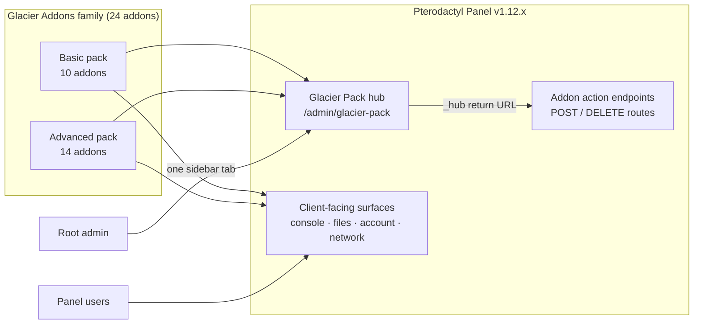

# Glacier Pack for Pterodactyl

**A family of 24 standalone addons for Pterodactyl Panel v1.12.x, managed from one hub.** Glacier Pack installs as self-contained packages — no Blueprint, no module daemons on your nodes — and replaces the sprawl of 24 separate admin pages with a single custom dashboard at `/admin/glacier-pack` that hosts every addon's complete management UI in one Glacier-styled page.

<div class="tip custom-block" style="margin-top: 1.5rem;">

**Built for PingLess Studios**
[studio.pingless.org](https://studio.pingless.org) · Standalone packages, installed directly on the panel

</div>

---

## Architecture



The hub is the **only admin surface**. Each addon's original admin pages and sidebar links are removed on install; everything an admin could do there — every table, form, action, filter and stat — renders inside a hub pane instead. Forms still post to each addon's own endpoints and land back on the same pane, so nothing about how the addons work changes — only where you manage them.

---

## Key Features

- **One admin dashboard for everything.** A single "Glacier Pack" sidebar tab opens a standalone, full-page admin UI styled after the Glacier theme editor — near-black surfaces, teal accent, its own chrome (not AdminLTE). Root-admin only, guarded twice.
- **24 addons, two packs.** The Basic pack covers panel operations (recycle bin, URL downloads, logs, alerts, uptime); the Advanced pack covers hosting workflows (S3 backups, plugin/mod/modpack installers, staff delegation, subdomains, server imports).
- **Full pages in-hub, not summaries.** Each addon renders its complete original UI as a hub pane — tables, forms, pagination, stat cards — with pill-style sub-tabs for multi-page addons.
- **Uniform save flow.** Every form carries a `_hub` return URL; successful saves land back on the same pane with a success banner, and validation errors render in a hub-styled callout above the form.
- **Standalone packaging, zero framework dependencies.** Every addon is a self-contained directory that mirrors the panel root (`PanelFiles/`) with an idempotent `data/install.sh` installer — no Blueprint, no external CDN assets, no core-file replacement (marker-delimited patches only).
- **Client surfaces without rebuilds.** 21 of 24 addons ship their client UI as static JS/CSS — no `yarn build`. The panel's React app is enhanced, never forked.
- **Glacier theme compatible.** Client-facing addon styles consume Glacier design tokens (`var(--gl-*, fallback)`), so every addon inherits Glacier's accent, surfaces and radius when the theme is installed — and keeps its own look when it isn't.
- **Safe delegation built in.** Permission Manager gives staff a restricted admin area at `/admin/staff` with real, auto-provisioned Pterodactyl subusers — no `root_admin` grants, enforced by the panel itself.
- **Idempotent installers.** Every `install.sh` is safe to re-run (and should be re-run after panel updates overwrite patched files), registers one service provider, runs migrations, and clears caches.

---

## Quick Install

Install the hub first — it is the only admin surface for the whole family:

```bash
cd glacier-pack && sudo bash data/install.sh
```

Then install any addon the same way:

```bash
cd recycle-bin && sudo bash data/install.sh
```

Open **Admin → Glacier Pack** (or `/admin/glacier-pack`) as a root admin. See [Installation](./getting-started/installation.md) for prerequisites, verification and troubleshooting.

---

## Pack Contents

### Basic pack — 10 addons

| Addon | Purpose |
| --- | --- |
| **Config Editor** | Edit the panel's `.env` safely from the browser, with backups and validation. |
| **Console Log Share** | One-click console log copying and sharing from the server console. |
| **Login Activity** | Filterable record of every successful sign-in to the panel. |
| **Move Files** | Browsable directory picker for the file manager move/copy dialog. |
| **Node Status** | Per-server uptime graphs, incident logs, and node health tracking. |
| **Panel Logs** | Live view of the panel's own log files, no SSH session required. |
| **Recycle Bin** | Recoverable file deletion with quotas and per-egg retention windows. |
| **Resource Alerts** | Threshold notifications the moment a server crosses a usage limit. |
| **Site Alerts** | Admin-managed announcement banners for the client panel and login page. |
| **URL Download** | Fetch remote files straight into a server from the file manager. |

### Advanced pack — 14 addons

| Addon | Purpose |
| --- | --- |
| **Backup Pro** | Scheduled server backups to S3-compatible storage with a full restore flow. |
| **Database Manager** | Import and export for panel-managed server MySQL databases. |
| **Mod Installer** | Browse and install Minecraft mods from Modrinth and CurseForge. |
| **Modpack Installer** | One-click Modrinth and CurseForge modpack installs from the file manager. |
| **Node Stats** | Node analytics: historical tracking, capacity planning, and forecasting. |
| **Permission Manager** | Staff roles with a restricted admin area — no `root_admin` required. |
| **Player List** | Live online-player list with a count badge on the server console. |
| **Player Manager** | Manage Minecraft Java players over plain RCON, nothing on the node. |
| **Plugin Installer** | Browse, install, and manage Minecraft plugins from live catalogues. |
| **Server Importer** | Move servers from another Pterodactyl panel via the source's Application API. |
| **Server Properties** | Friendly, categorized server.properties editor for Minecraft servers. |
| **Staff Requests** | Users request server access from each other with owner approval. |
| **Subdomain Manager** | Self-service DNS A and SRV subdomains for game servers. |
| **Version Changer** | Change the Minecraft: Java Edition version of a server from the panel. |

---

## Works with the Glacier theme

Every addon's client-facing UI is **Glacier-compatible**: styles reference the theme's design tokens through `var(--gl-*, fallback)` chains, so with the [Glacier theme](../glacier/index.md) installed, addon surfaces inherit its accent color, surfaces, borders and radius automatically — in both dark and light mode. Without Glacier, the fallback values render each addon's own standalone look, pixel-identical to how it shipped. Nothing is required, nothing breaks either way.

::: info
Glacier compatibility applies to **client-facing** surfaces only (server pages, account area, login page). The hub and the admin area are styled by the hub's own stylesheet, independent of any theme.
:::

---

## Next Steps

- **[Installation →](./getting-started/installation.md)** — prerequisites, hub install, per-addon install, verify, uninstall.
- **[Quick Start →](./getting-started/quick-start.md)** — hub plus three starter addons in minutes.
- **[Configuration Reference →](./configuration/reference.md)** — every setting, every default, per addon.
- **[The Hub Dashboard →](./user-guide/dashboard.md)** — a tour of the unified admin UI.
- **[Architecture →](./architecture/overview.md)** — how the packaging format and hub contract work.

---

<div class="footer-note">

**Developed for [PingLess Studios](https://studio.pingless.org)**

Questions or licensing — reach us at [studio.pingless.org](https://studio.pingless.org).

</div>

<style scoped>
.footer-note {
  margin-top: 3rem;
  padding: 1.5rem;
  border-top: 1px solid var(--vp-c-divider);
  text-align: center;
  font-size: 0.875rem;
  color: var(--vp-c-text-2);
}
.footer-note a {
  font-weight: 600;
}
</style>
