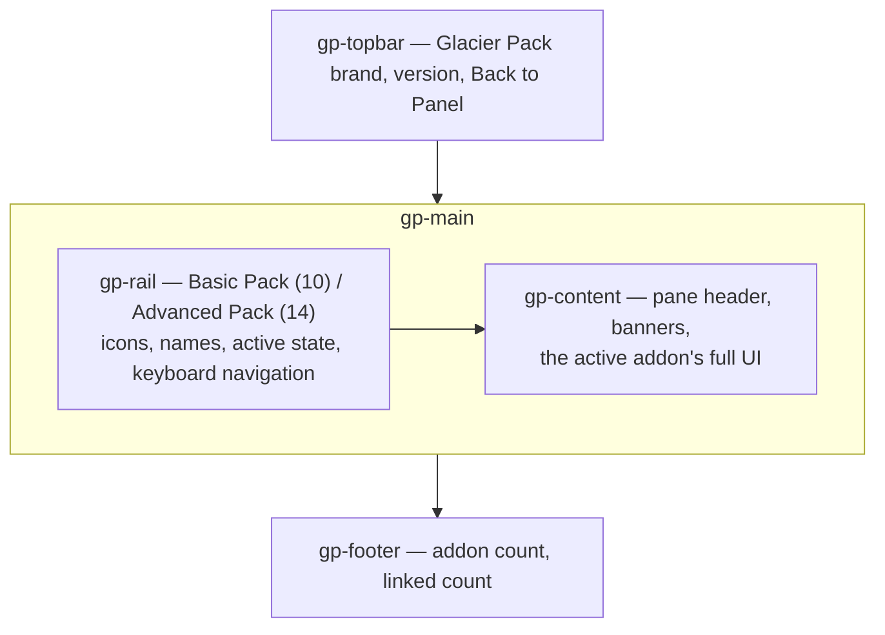

# The Hub Dashboard

The hub at `/admin/glacier-pack` is the **only admin surface** for the whole Glacier Addons family. It is a standalone, full-page admin UI — its own chrome, not AdminLTE — styled after the Glacier theme editor: near-black surfaces, a teal accent, and generous 14px radii. Everything you could ever do on an addon's original admin page happens here.

---

## Layout



- **Topbar** — the Glacier Pack brand mark and version on the left, a **Back to Panel** button on the right.
- **Rail** — every addon in the family, grouped under **Basic Pack** and **Advanced Pack** headers with counts. Each entry shows the addon's icon and name; the active entry is highlighted. `ArrowUp` / `ArrowDown` move through the rail when it has focus.
- **Content** — a pane header (addon name + one-line description), then the addon's complete management UI.
- **Footer** — total addon count and how many currently have a linked pane.

The hub is **root-admin only**: the route group runs the standard admin middleware, and the controller performs a second explicit `root_admin` check, so no code path can ever render it for staff or regular users.

---

## Basic vs Advanced groups

The rail's two groups mirror the two packs. Basic pack addons are panel-operations tools (logs, alerts, uptime, file handling); Advanced pack addons are hosting workflows (backups, installers, delegation, imports). The grouping is presentational only — every pane works the same way regardless of pack.

---

## Panes and sub-tabs

Clicking a rail entry opens the addon's **main pane** at `?a=<slug>`. Addons with multiple pages declare pill-style **sub-tabs** at the top of their pane — `?a=<slug>&p=<sub>` renders the corresponding sub-page. An unknown or invalid `p` value falls back to the main pane gracefully.

Examples:

| Addon | Sub-tabs |
| --- | --- |
| Resource Alerts | Overview · Rules · History · Settings |
| Backup Pro | Overview · Destinations · Backup Rules · Backups · Archives · Activity · Settings |
| Node Stats | Overview · Nodes · Capacity · Historical · Top Consumers · Reports · Settings |
| Permission Manager | Overview · Roles · Members · Audit Log |
| Subdomain Manager | Settings · Domains · Records |
| Node Status | Overview · Service Updates |
| Config Editor | Editor · Raw file |
| Server Importer | Overview · Run report |

The remaining 16 addons are single-pane — everything fits on one page.

---

## How panes are styled

Panes follow two conventions, and you will see both:

- **`.gp-native`** — the addon's original markup (boxes, tables, forms, buttons, badges, pagination, small-boxes), kept as-is and wrapped in a container the hub stylesheet re-themes to match. Tables, filters and pagination behave exactly like the addon's original pages.
- **`gp-*` components** — shared hub building blocks (cards, buttons, switches, badges, range sliders) used for anything new.

Either way, every control on a pane is real and functional — panes are not summaries or links out; they are the addon's entire admin UI.

---

## Saving: the `_hub` round-trip

Every form on every pane posts to the addon's **own existing endpoint** — the hub adds no save logic of its own. A hidden `_hub` field carries the full return URL:

```html
<input type="hidden" name="_hub" value="/admin/glacier-pack?a=<slug>&p=<sub>">
```

After the endpoint processes the request it redirects back to that URL, so you always land on the same pane you saved from. The `_hub` value is validated server-side — it must be a local `/admin/glacier-pack` path, anything else is rejected with 403.

- **Success** — the pane reloads with `?saved=1` and a green **Settings saved.** banner that fades out after a few seconds.
- **Validation failure** — the redirect lands back on the hub automatically, and the hub shell renders the full error bag in a red callout above the pane, listing every rejected field.

::: tip
Deep links are stable: `/admin/glacier-pack?a=backup-pro&p=destinations` always opens that exact sub-tab — handy for runbooks and bookmarks.
:::

---

## How addons appear once installed

The rail renders from the hub's registry (`config/glacier-pack.php`), which lists all 24 addons. For each entry the hub checks whether the addon's pane partial exists on the panel:

- **Installed** — the entry opens the addon's live pane.
- **Not installed (or files missing)** — the entry shows a small dot and opens a fallback card with the addon's description and, where applicable, a button to any native page that still exists.

Install an addon and its pane lights up on the next page load — no hub reconfiguration is ever needed.

## The old admin pages are gone — by design

Before the hub, each addon injected its own sidebar link and shipped its own AdminLTE pages. The hub v2 contract removes both: addon installers no longer inject sidebar links (and actively clean up previously injected ones), and the addons' original `GET /admin/<addon>` page routes and blades are deleted from the package. Only the **action endpoints** (POST/DELETE/API routes) remain — they are what hub forms post to.

Two deliberate exceptions:

- **Permission Manager's `/admin/staff`** is a *feature surface* for staff users, not a pack admin page — it stays, with its own middleware.
- Client-facing UI (server pages, account area, login page) is untouched by the hub contract entirely.

---

## What's Next?

- **[Addons Guide →](./addons.md)** — what each of the 24 addons does and where it lives in the hub.
- **[Configuration Reference →](../configuration/reference.md)** — every setting on every pane.
- **[Architecture →](../architecture/overview.md)** — the hub contract under the hood.
