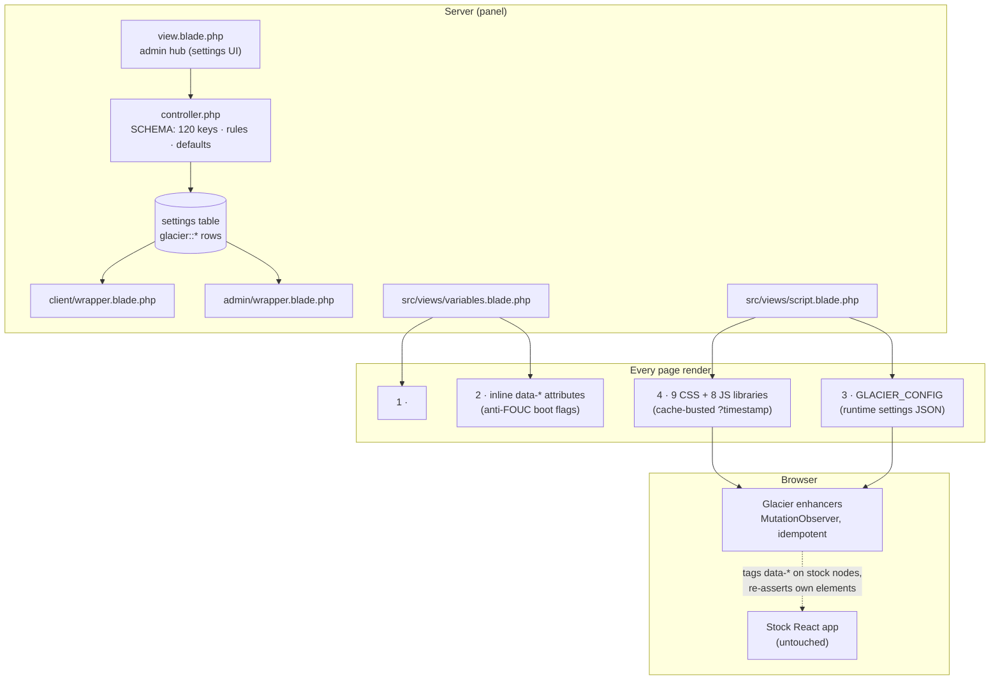
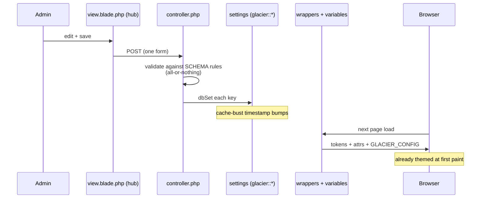

# Architecture Overview

Glacier's defining constraint: **zero core-file replacement**. Everything below exists to make a deep, structural theme possible inside that constraint — and to keep it working across panel updates.

## The big picture



## Stage 1 — server-rendered tokens (no FOUC)

The theme cannot wait for JavaScript: a dark panel flashing white on every navigation is unacceptable. So `variables.blade.php` renders, inside every page's initial HTML:

1. A `<style>` block with the full design-token set as CSS custom properties — dark values in `:root`, the light palette under `html[data-glacier="light"]`. Backgrounds, patterns and glass derive from the same tokens.
2. An inline script setting boot-critical `data-*` attributes on `<html>` (icon style, reveal mode, hover style, card style…) before first paint.

First paint is therefore already themed — CSS and JS only refine it.

## Stage 2 — the libraries

Static assets ship in the package (`public/`), served from the panel and cache-busted with a per-save timestamp.

| Layer | Files | Role |
| --- | --- | --- |
| CSS | `core`, `patterns`, `sidebar`, `console`, `panel`, `home`, `auth`, `mobile`, `editor` | Token-driven restyle of every surface; mobile is a dedicated layer, not an afterthought |
| JS | `icons`, `locationchange`, `sounds`, `sidebar`, `console-stats`, `home`, `activity`, `editor` | Enhancement runtimes (below) |

No external fonts, CDNs or requests: Glacier contacts nothing outside the panel.

## The React contract

Pterodactyl's client is a React SPA that reconciles DOM aggressively. Glacier's JS survives it with three rules, enforced everywhere:

1. **Never move React's nodes.** Stock elements are tagged with `data-*` attributes (React leaves unknown attributes alone) — classes and inline styles on React nodes get stripped on re-render, so Glacier never relies on them there.
2. **Own elements are siblings, re-asserted.** Console header, filter toolbars, stat cards and docks are Glacier-owned nodes inserted next to React's. React drops foreign children on remount, so a `MutationObserver` re-asserts them every pass — idempotently, so duplicate passes cost nothing.
3. **All enhancement is idempotent and silent.** Every pass is safe to re-run at any time; every DOM access is null-checked; failure never throws into the console.

`locationchange.js` wraps history navigation so SPA route changes trigger the same enhancement passes as full loads.

## Settings flow



Defaults seed on first load, so a fresh install is coherent before any save. Validation mirrors the hub's client-side hints; a rejected save writes nothing.

## File layout

```
glacier/
├── conf.yml                  # Blueprint manifest
├── controller.php            # SCHEMA, validation, save handlers, uploads
├── view.blade.php            # admin hub (tabs, fields, live preview)
├── admin/wrapper.blade.php   # admin-side boot
├── client/wrapper.blade.php  # client-side boot (defaults → vars → libs)
├── src/views/                # variables/script blades (tokens, GLACIER_CONFIG)
├── data/                     # uploaded assets (backgrounds, logos)
└── public/
    ├── libraries/            # 9 CSS + 8 JS runtime files
    ├── editor/               # hub editor assets
    └── presets/              # curated palette presets
```

## Design principles worth knowing

- **Tokens over literals.** Stock utility colors are remapped to Glacier tokens globally (`bg-gray-700` → `--gl-elevated`), so even un-themed stock corners and other extensions inherit the palette.
- **One radius, one motion language.** `radius` and the animation switches are honored by every component Glacier ships or restyles.
- **Reduced motion is a first-class path.** Every animation has an instant alternative under `prefers-reduced-motion`, independent of the admin switches.
- **Accessibility floors.** Body text ≥ 4.5:1 contrast on both palettes; focus rings on all interactive Glacier elements.
