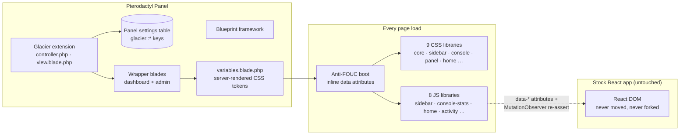

# Glacier Theme for Pterodactyl

**A calm, Apple-grade sidebar theme for Pterodactyl Panel**, built on the Blueprint framework. Glacier replaces the stock top navigation with a clean sidebar, reskins every page in dark and light mode, and gives you deep, code-free control over backgrounds, glass, colors and tabs — with **zero core-file replacement** and **zero external assets**.

<div class="tip custom-block" style="margin-top: 1.5rem;">

**❄️ Built for ALTIS TECH SOLUTIONS**
[xdp.network](https://xdp.network) · Single `.blueprint` package, installed on the panel

</div>

---

## Architecture



Glacier never edits a Pterodactyl core file. Blueprint renders Glacier's wrapper blades at the end of every page; those emit a server-rendered design-token block (so the very first paint is already themed) and load Glacier's CSS/JS libraries. The JavaScript enhances the stock React UI through `data-*` attributes and a MutationObserver — attributes survive React re-renders, so the theme is resilient to panel updates.

---

## Key Features

- **🌗 Full dark and light design system.** Separate 10-color palettes per mode (accent, background, surface, elevated, ink, muted, border, success, warning, danger), a one-click seed-color palette generator, curated presets, and dark / light / auto (follows the OS) modes. Users can flip modes themselves from the account menu if you allow it.
- **🧭 Sidebar navigation, three docks.** Replaces the top nav with an expanded or collapsed sidebar rail that sticks to the edge or floats in two styles. Five tab row effects (box, rounded, pill, dot, solid), hover styles, category headers, icon scale, custom logo and panel name.
- **🗂️ A real tab manager.** Reorder, relabel, re-icon or hide any sidebar tab; add redirect tabs linking anywhere; keep a separate tab list for server pages; addon tabs are imported automatically into a "More" group.
- **🖥️ Console command center.** Stats blocks (CPU, memory, network, uptime) as sparkline cards, classic icons or hidden — placeable above, beside or below the terminal with a drag-and-drop zones editor. Bandwidth graph (minimal or advanced), floating command input, custom console color, and a per-server server bar in the sidebar.
- **🎴 Dashboard server cards.** Banner or fade cover-image cards with per-server image rules, rows (elongated) or grid (shrink) layout, live CPU/memory/disk stats, state dots, and an optional welcome bar for non-admin users.
- **🖼️ Backgrounds without assets.** None, sixteen pure-CSS patterns (grid, waves, hex, circuit, topo, weave, brick…) with size and opacity controls, or your own image by URL or direct upload with opacity, blur and dim. Separate login-page background and login card alignment.
- **🔍 Ctrl+K search.** A command-palette search across servers and pages with keyboard navigation, built into an optional topbar with clock (12/24 h, timezone label, date formats).
- **📁 File manager refinement.** File browser container opacity/blur, custom or legacy icons with per-type colors, row tinting, sort animations, and an optional VS Code-style file tree on the editor with a drag-resize sash.
- **📣 Announcements and extras.** Multi-entry markdown announcements, a dismissable banner with type and CTA, custom footer text, login watermark, custom favicon and browser theme-color.
- **🔒 Privacy mode + per-user settings.** Users can blur IPs and server addresses panel-wide, toggle interface sounds, switch dark/light, and enable the editor file tree — all per-user, stored locally, admin-defaultable.
- **📦 Import/export + factory reset.** The entire configuration round-trips as JSON from the admin hub, and every change previews live before you save.

---

## Quick Install

```bash
# place glacier-v1.0.0.blueprint in /var/www/pterodactyl, then:
blueprint -i glacier-v1.0.0
```

Open **Admin → Extensions → Glacier** — sensible defaults apply on first load, so the panel looks right before you change a thing. See [Installation](./getting-started/installation.md) for verification and troubleshooting.

---

## Why Glacier instead of…

| | Glacier | Stock panel | CSS-only themes |
| --- | :---: | :---: | :---: |
| Sidebar navigation | ✅ three docks, five tab effects | ❌ top nav only | ⚠️ cosmetic, breaks often |
| Dark **and** light palettes | ✅ 10 tokens per mode + presets | ❌ dark only | ⚠️ usually dark only |
| Console layout editor | ✅ drag-and-drop zones | ❌ fixed layout | ❌ |
| Tab manager (reorder / hide / redirect) | ✅ | ❌ | ❌ |
| Per-user settings (privacy, sounds, tree) | ✅ | ❌ | ❌ |
| Core files replaced | ✅ none | — | ⚠️ sometimes |
| External assets loaded | ✅ none | — | ⚠️ fonts/CDN common |

> **Bottom line:** CSS-only themes repaint the stock layout; Glacier restructures navigation, console and dashboard while leaving every core file — and every other extension — untouched.

---

::: tip VERIFIED LIVE
Every surface was verified on a real Pterodactyl 1.12 panel during development: sidebar docks and tab effects, console zones in all nine placements, dashboard cards in both layouts, the file editor tree, the activity feed, light mode, and the mobile drawer — via automated browser screenshots at desktop and phone widths.
:::

---

## Next Steps

- **[Installation →](./getting-started/installation.md)** — requirements, install, verify, uninstall.
- **[Configuration Reference →](./configuration/reference.md)** — every setting, every default.
- **[Admin Hub →](./user-guide/admin-hub.md)** — a tour of the settings UI.

---

<div class="footer-note">

**Developed for [ALTIS TECH SOLUTIONS](https://xdp.network)**

Questions or licensing — reach us at [xdp.network](https://xdp.network).

</div>

<style scoped>
.footer-note {
  margin-top: 3rem;
  padding: 1.5rem;
  border-top: 1px solid var(--vp-c-divider);
  text-align: center;
  font-size: 0.875rem;
  color: var(--vp-c-text-2);
}
.footer-note a {
  font-weight: 600;
}
</style>
