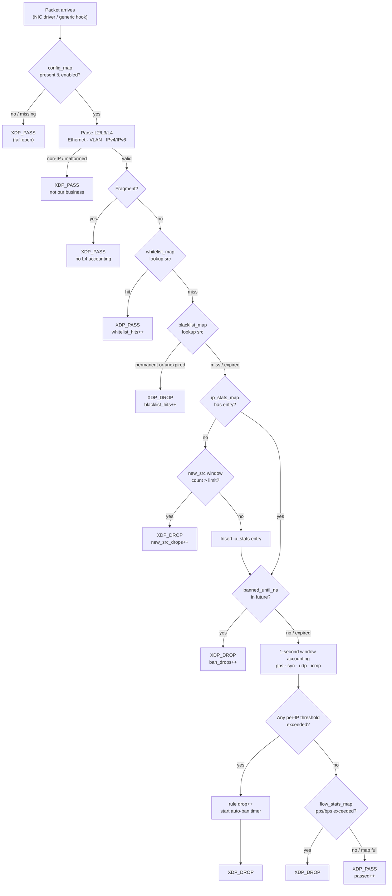
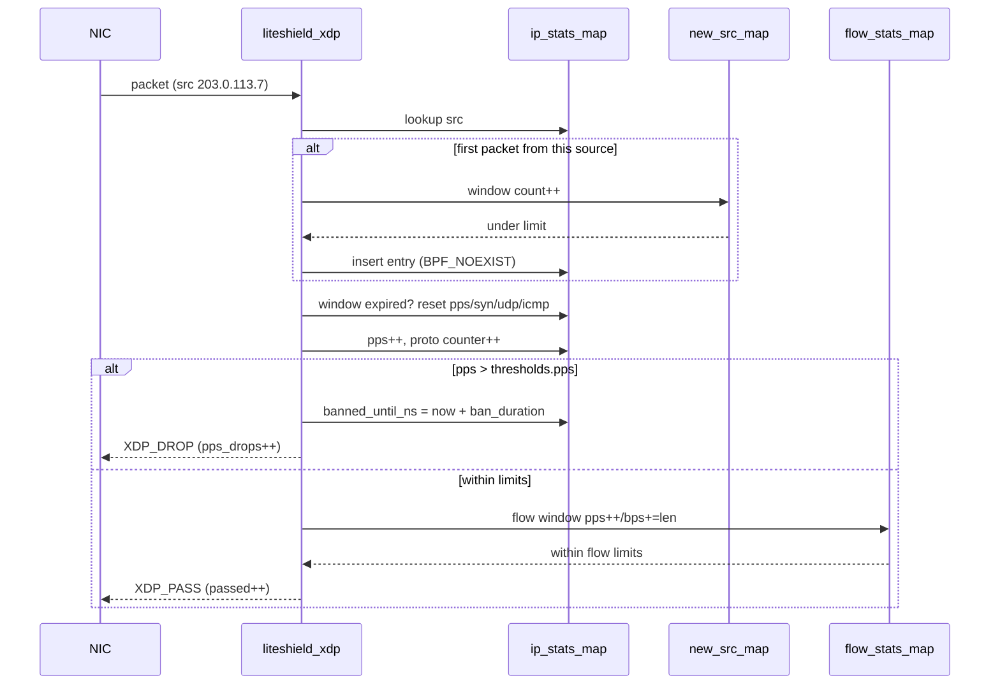
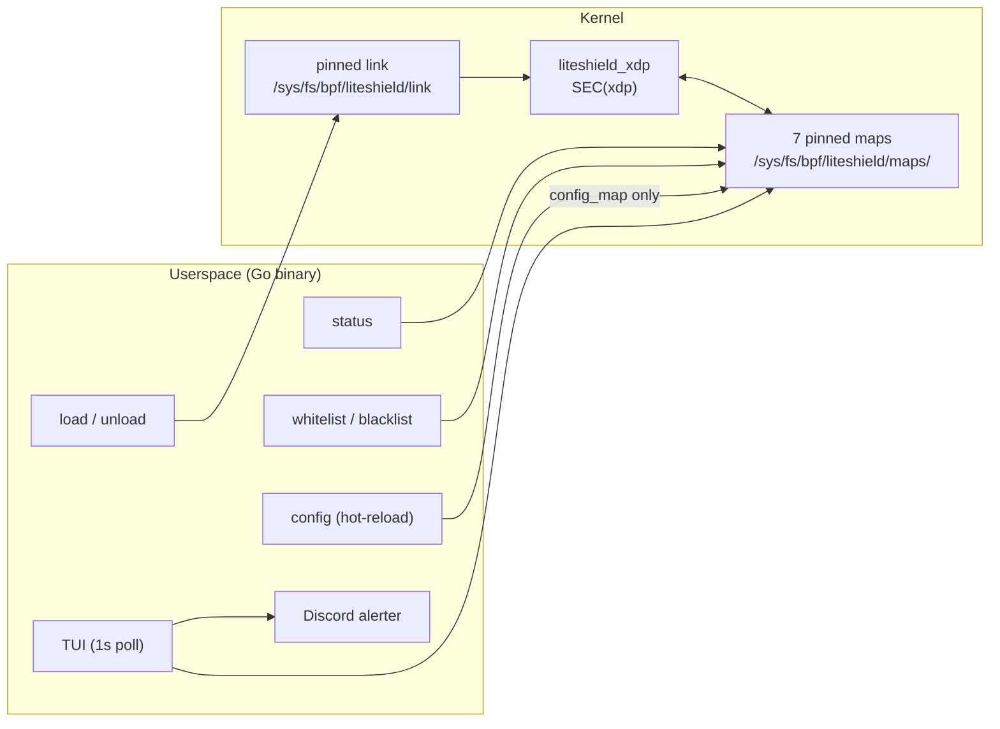

# Architecture Overview

> **One XDP program, seven BPF maps, one Go binary.**
> This page walks through the packet pipeline, the map layout, the rate-limiting
> machinery, and the fail-open design that keeps LiteShield from ever taking
> your link down.

[[toc]]

---

## Design Philosophy

LiteShield deliberately skips everything that makes eBPF firewalls hard to
audit:

- **No tail calls, no `freplace`, no program chaining** — one `SEC("xdp")`
  program contains the entire pipeline.
- **No GPL-only helpers** — only `bpf_map_lookup_elem`,
  `bpf_map_update_elem`, and `bpf_ktime_get_ns`, all available long before
  kernel 5.15. The object carries a `Dual MIT/GPL` license and passes the
  kernel's license check on any supported kernel.
- **No agent daemon** — the loading process can exit; the pinned link and maps
  keep enforcing with zero userspace processes.

---

## Packet Flow

Every inbound packet on the attached interface runs through this pipeline, in
order:



Key properties of the pipeline:

1. **Whitelist before blacklist before rate limits** — exempted sources skip
   all accounting; banned sources drop without touching the rate window.
2. **Auto-ban check before accounting** — banned sources drop on a single
   timestamp comparison, no counter updates.
3. **Flow rules last** — the most expensive checks (5-tuple map operations)
   only run for traffic that survived everything cheaper.

---

## BPF Maps

All seven maps are pinned under `/sys/fs/bpf/liteshield/maps/` so the CLI can
reach them from any later invocation.

| Map | Type | Max entries | Key → Value | Purpose |
| --- | ---- | ----------- | ----------- | ------- |
| `config_map` | `ARRAY` | 1 | `u32` → `liteshield_config` | Runtime thresholds + ban duration + enabled flag. Hot-reload target |
| `global_stats_map` | `PERCPU_ARRAY` | 1 | `u32` → `global_stats` | All counters the TUI/`status` display (per-CPU, summed on read) |
| `ip_stats_map` | `LRU_PERCPU_HASH` | 65,536 | `ip_key` → `ip_stats_val` | Per-source-IP rate windows, totals, and auto-ban deadline |
| `whitelist_map` | `HASH` | 65,536 | `ip_key` → `u64` | Manual exemptions (IPv4 + IPv6); value is a set timestamp |
| `blacklist_map` | `HASH` | 65,536 | `ip_key` → `u64` | Manual bans; value is ban deadline in monotonic ns, `0` = permanent |
| `new_src_map` | `PERCPU_ARRAY` | 1 | `u32` → `new_src_window` | Global new-source-IPs/sec window |
| `flow_stats_map` | `LRU_PERCPU_HASH` | 131,072 | `flow_key` → `flow_stats_val` | Per-flow (src+dst+proto+ports) rate windows |

### Design decisions worth knowing

- **Hash maps, not LPM tries.** Whitelist/blacklist use `BPF_MAP_TYPE_HASH`.
  CIDR entries are expanded into single addresses (max `/24`) at insert time
  by the CLI — the kernel side only ever does exact-match lookups.
- **LRU per-IP tracking.** `ip_stats_map` and `flow_stats_map` are
  `LRU_PERCPU_HASH`, so under a spoofed-source flood the kernel evicts the
  least-recently-used entries automatically. The map can't be "filled" as a
  denial-of-service vector.
- **Monotonic-clock bans.** Timed entries store a `CLOCK_MONOTONIC` deadline —
  the same clock `bpf_ktime_get_ns()` reads. Expiry is exact, immune to
  wall-clock changes (NTP steps, timezone edits), and survives userspace
  restarts because it lives in the pinned map.
- **Per-CPU counters.** Stats maps are per-CPU variants, so packet-path
  updates never contend on shared cache lines — userspace sums the per-CPU
  slots when reading.

---

## Rate Limiting Pipeline

All rate windows are **fixed 1-second buckets**, reset when
`now - window_start_ns >= 1s`:



Enforcement order and cost:

| Stage | Cost | Catches |
| ----- | ---- | ------- |
| Whitelist / blacklist | 1 hash lookup | Known-good / known-bad sources |
| New-source window | 1 array increment | Spoofed-source floods, map exhaustion attempts |
| Auto-ban check | 1 integer compare | Repeat offenders (cheapest possible drop) |
| Per-IP thresholds | 4 counter compares | SYN/UDP/ICMP floods, single-talker PPS floods |
| Per-flow thresholds | 1 hash lookup + 2 compares | Single-connection floods under the per-IP ceiling |

---

## Fail-Open Design

Every failure path in the program returns `XDP_PASS`:

| Condition | Behavior |
| --------- | -------- |
| `config_map` or `global_stats_map` missing | Pass — firewall can't be in an unknown state |
| `enabled` flag unset | Pass — explicit kill switch |
| Malformed / non-IP packet | Pass — not LiteShield's business |
| `ip_stats_map` insert fails (full / lost LRU race) | Pass — never drop legitimate traffic over bookkeeping |
| `flow_stats_map` insert fails | Pass — same reasoning |

::: danger The trade-off
Fail-open means a sufficiently exotic kernel-level failure silently disables
enforcement rather than the link. Monitor with `liteshield status` (exit code
`1` when unloaded) from your monitoring stack so a detached program pages a
human instead of going unnoticed.
:::

The rationale: LiteShield protects availability. A firewall that fails closed
**is** the outage during its own failure modes — an attacker (or a bug) that
can break the firewall wins either way.

---

## Userspace ↔ Kernel Boundary



- **Persistence without a daemon:** the link and maps are pinned to bpffs, so
  enforcement continues after every userspace process exits. `IsLoaded()` is
  just a stat of the pinned link.
- **All management is map I/O:** `whitelist add`, `blacklist add`, and config
  hot-reload open the pinned maps and update entries — the running program
  picks changes up on the very next packet, no re-attach.
- **bpffs is auto-mounted** by the loader if your init system didn't mount it.

---

## File Layout

```
LiteShield-XDP/
├── ebpf/
│   ├── liteshield.bpf.c        # the single XDP program (SEC("xdp"))
│   ├── headers/
│   │   ├── common.h            # shared constants
│   │   ├── config.h            # liteshield_config struct
│   │   ├── stats.h             # counter structs
│   │   ├── maps.h              # all 7 map definitions
│   │   ├── packet.h            # L2/L3/L4 parser
│   │   └── vmlinux.h           # generated CO-RE types
│   └── Makefile                # clang → liteshield.bpf.o
├── userspace/
│   └── internal/
│       ├── bpf/                # loader, pin management, map CRUD, hot-reload
│       ├── cli/                # subcommand dispatch (load/unload/status/…)
│       ├── config/             # YAML load/validate, presets, multipliers
│       └── tui/                # ANSI status screen + Discord alerter
├── configs/
│   └── liteshield.example.yaml # annotated example config
├── systemd/
│   └── liteshield-loader.service  # oneshot loader (load --no-tui)
├── install.sh                  # interactive installer
├── uninstall.sh                # uninstaller (--purge removes config)
└── Makefile                    # make all / make verify
```

Installed layout:

| Path | Contents |
| ---- | -------- |
| `/opt/liteshield/` | `liteshield` binary + `liteshield.bpf.o` |
| `/usr/local/bin/liteshield` | Symlink to the binary |
| `/etc/liteshield/liteshield.yaml` | Live config (mode `0600`) |
| `/etc/systemd/system/liteshield-loader.service` | Boot-time attach |
| `/sys/fs/bpf/liteshield/` | Pinned link + maps (runtime only) |

---

## Known Trade-offs

- **Fragments pass without L4 accounting.** A fragmented packet carries no
  usable L4 header in the non-first fragments; LiteShield passes them and
  rate-limits via the first fragment. A documented trade-off for a minimal
  parser — pure fragment floods are out of scope (that's OpenShield
  territory).
- **Fixed 1-second windows.** Bursts straddling a window boundary can
  briefly exceed the nominal per-second rate. This is standard token-bucket
  behavior and keeps the hot path branch-free.
- **Per-CPU LRU means approximate global state.** Under extreme multi-core
  load, per-CPU maps make counts approximate. For a rate limiter this is the
  right trade — exactness is sacrificed for zero contention.
