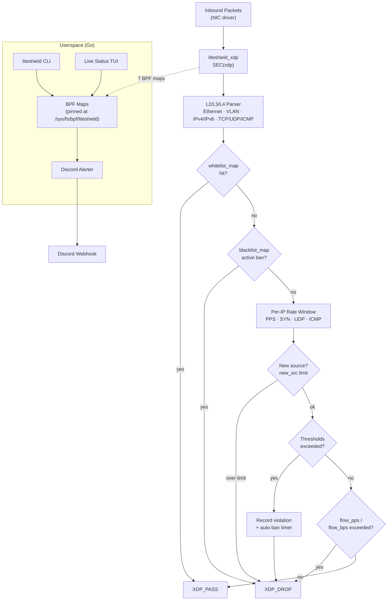

# LiteShield XDP

**Free, minimal XDP (eBPF) firewall for Linux 5.15+** — one XDP program, one Go binary, one YAML config.

LiteShield sits at the earliest possible point in the Linux networking stack and drops floods before they ever reach your applications. No license server, no daemons, no frameworks — a lightweight alternative to heavier commercial shields that you can read end‑to‑end in an evening and trust in production the same night.

<div class="tip custom-block" style="margin-top: 1.5rem;">

**🛡️ Built for ALTIS TECH SOLUTIONS by [AnAverageBeing](https://github.com/AnAverageBeing)**  
[GitHub Repo](https://github.com/AnAverageBeing/LiteShield-XDP) · `MIT License`

</div>

---

## Why LiteShield XDP?

DDoS mitigation usually means one of two extremes: iptables rules that melt under load, or commercial appliances that cost more than the server they protect. LiteShield fills the gap:

| Approach                     | Pain Point                                                              |
| ---------------------------- | ----------------------------------------------------------------------- |
| **iptables / nftables**      | Rules evaluated late in the stack; conntrack exhaustion under SYN floods |
| **Cloud scrubbing services** | Expensive, adds latency, your traffic leaves your network                |
| **Commercial XDP shields**   | License servers, HWID locking, closed source, heavyweight dashboards     |
| **Hand-rolled eBPF**         | Weeks of verifier wrestling before you drop a single packet              |

LiteShield gives you a **single statically-built Go binary**, a **single verified XDP program**, and a **single YAML file** — production-ready in under a minute.

---

## Key Features

### ⚡ Single XDP Program

No tail calls, no `freplace`, no module loading. One program that verifies and attaches on any kernel 5.15+ with BTF. If the kernel accepts it, it runs — nothing to feature-gate.

### 🌐 Protects All Ports & Protocols

TCP, UDP, ICMP and ICMPv6, over both IPv4 and IPv6. Every packet on the interface is inspected at driver level.

### 🚦 Rule-Based Flood Protection

Per-source-IP, per-second thresholds for total PPS, TCP SYN rate, UDP rate, and ICMP rate — plus a global new-source-IPs/sec limit to blunt spoofed-source floods.

### 🔨 Automatic Banning

Sources that exceed a threshold are auto-banned for a configurable duration. Bans use `CLOCK_MONOTONIC` deadlines — the same clock the BPF program reads — so expiry is exact.

### 📋 Live Whitelist / Blacklist

HASH maps for IPv4 and IPv6, managed from the CLI without reloading the program:

```bash
sudo liteshield whitelist add 10.0.0.0/24
sudo liteshield blacklist add 203.0.113.7 3600   # 1-hour ban
```

### 🖥️ Built-In Live Status Screen

A plain-text ANSI TUI with zero dependencies (no bubbletea, no lipgloss): interface, PPS, BPS, passed/dropped, active bans, uptime — refreshed every second.

### 💬 Discord Webhook Alerts

Simple embeds for `rule_trigger`, `ip_banned` and `new_source` events, with per-event cooldowns so a flood doesn't flood your channel.

### 🔄 Hot-Reloadable Config

`liteshield config` opens the YAML in your `$EDITOR` and applies the new thresholds to the running instance — no detach, no gap in protection.

### 🚀 Installs in Under a Minute

Interactive installer with deployment presets (Personal / Hosting / Enterprise), traffic profiles (Strict / Balanced / High), automatic dependency installation across six package managers, and systemd integration.

### 🛟 Fail-Open by Design

If a map is missing, full, or an LRU race is lost, the packet **passes**. LiteShield protects your link — it never takes it down.

---

## Quick Install

```bash
curl -fsSL https://raw.githubusercontent.com/AnAverageBeing/LiteShield-XDP/main/install.sh | sudo bash
```

The installer asks four questions (interface, preset, traffic profile, Discord webhook), builds the BPF object and Go binary, and installs to `/opt/liteshield` with a systemd service. See [Installation](./getting-started/installation.md) for the full walkthrough and manual install.

---

## Architecture



### Enforcement Order

| Step | Check | Verdict |
| ---- | ----- | ------- |
| 1 | Parse L2/L3/L4 | Malformed / non-IP → pass (not our business) |
| 2 | Whitelist | Hit → always pass |
| 3 | Blacklist | Active ban (permanent or timed) → drop |
| 4 | Global new-source limit | Over `new_src`/sec → drop |
| 5 | Auto-ban timer | Still banned → drop |
| 6 | Per-IP thresholds | PPS / SYN / UDP / ICMP exceeded → drop + optional auto-ban |
| 7 | Per-flow limits | `flow_pps` / `flow_bps` exceeded → drop |

---

## Comparison

| Capability              | LiteShield XDP           | gamemann/XDP-Firewall | OpenShield-XDP |
| ----------------------- | ------------------------ | --------------------- | -------------- |
| Price                   | ✅ Free (MIT)             | ✅ Free                | Paid           |
| Userspace               | Single Go binary         | C + config file       | Go + full TUI dashboard |
| Live status TUI         | ✅ Built-in (no deps)     | ❌                    | ✅ 7-screen dashboard |
| Discord alerts          | ✅                        | ❌                    | ✅ Rich forensics embeds |
| Whitelist/blacklist     | CLI, live, IPv4+IPv6     | Config file, reload   | CLI, live, CIDRs, subnet auto-ban |
| Per-IP rate rules       | PPS/SYN/UDP/ICMP/new-src | PPS/bps + filters     | 42 detection vectors L2–L7 |
| Flow rate rules         | ✅ PPS/BPS per flow       | ❌                    | ✅ |
| Interactive installer   | ✅ Presets                | ❌                    | ✅ 10 profiles × 7 levels |
| BPF layout              | 1 program, 7 maps        | 1 program, many maps  | Multi-stage pipeline, freplace |
| Attack forensics        | ❌                        | ❌                    | ✅ Per-attack reports |
| License system          | None                     | None                  | HWID-bound, Ed25519 |

> **Bottom line:** LiteShield is the free baseline — embed it, fork it, ship it. If you need 42-vector detection, attack forensics, and baseline learning, step up to [OpenShield-XDP](https://builtbybit.com/resources/openshield-xdp-ddos-protection.115692/).

---

## Next Steps

- **[Installation →](./getting-started/installation.md)** — Protected in under a minute.
- **[Configuration Reference →](./configuration/reference.md)** — Every YAML value, preset, and multiplier.
- **[CLI Reference →](./user-guide/cli.md)** — Every command, flag, and output.
- **[TUI Guide →](./user-guide/tui.md)** — Reading the live status screen.
- **[Architecture →](./architecture/overview.md)** — Maps, pipeline, and the fail-open design.

---

<div class="footer-note">

**Developed by [AnAverageBeing](https://github.com/AnAverageBeing) for [ALTIS TECH SOLUTIONS](https://github.com/pingless-studios)**

Crafted with ❤️ and one very opinionated `XDP_DROP`.  
If this project saves you from a 3 AM flood, consider starring the repo.

</div>

<style scoped>
.footer-note {
  margin-top: 3rem;
  padding: 1.5rem;
  border-top: 1px solid var(--vp-c-divider);
  text-align: center;
  font-size: 0.875rem;
  color: var(--vp-c-text-2);
}
.footer-note a {
  font-weight: 600;
}
</style>
