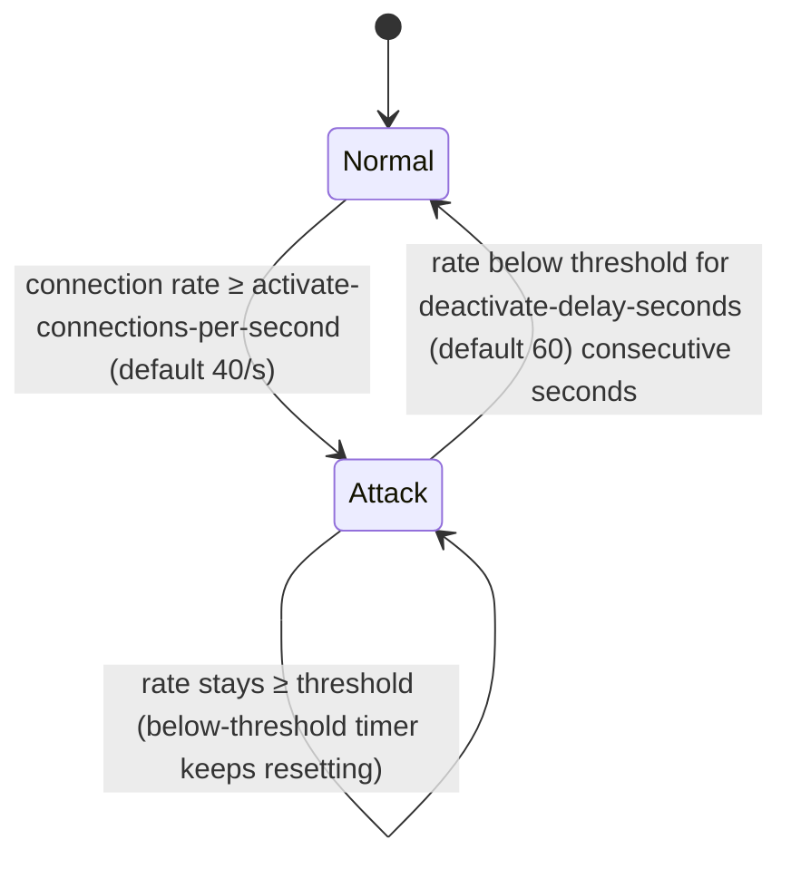

# Attack Mode

> **Normal checks for normal days. Escalation for the bad minutes.**
> Attack mode is NitroCord's global state machine: when the proxy-wide
> connection rate crosses a threshold, a whole tier of dormant defenses wakes
> up — and stands down again on its own once the flood is over.

[[toc]]

---

## What attack mode is

Most NitroCord checks run around the clock: the firewall gate, rate limiting,
reconnect verification, anti-VPN, country blocking and packet flood scoring
never sleep. A second tier of checks is different — they are powerful but too
aggressive (or too easy to abuse for false positives) to run against everyday
traffic, so they stay dormant until the proxy is measurably under attack.

Attack mode is the switch. While it is engaged:

- the dormant checks arm (TCP fingerprinting, name heuristics, DNS check,
  tab-complete filter),
- expensive work is bypassed (pings served from cache, no event dispatch, no
  backend contact),
- and under extreme rates, kicks stop being written at all.

It engages and disengages **automatically** — there is no command to toggle it
and no admin action required. Verified players are unaffected; see
[the whitelist interaction](#the-verified-whitelist-during-attacks).

---

## The state machine



Mechanics, exactly as implemented:

- **The metric** is new LOGIN-intent connections per second, counted proxy-wide
  in a one-second sliding window. Server list pings are tracked separately and
  never engage attack mode on their own.
- **Engage** the moment the measured rate reaches
  `attack.activate-connections-per-second`.
- **Disengage** only after the rate has stayed below the threshold for
  `attack.deactivate-delay-seconds` consecutive seconds — a brief dip in a
  long flood does not flap the state. With `attack.early-stop` enabled, a
  collapsed join rate disengages sooner; see
  [early stop](#early-stop-when-the-flood-collapses).
- **Evaluated constantly.** The state is re-evaluated lazily on every
  `isAttackMode()` query and once per second on the `nitrocord-attack-mode`
  daemon thread, so transitions are detected even when no new connections are
  arriving (which is exactly when disengagement happens).
- **Live configuration.** Thresholds are read from the current
  `protection.toml` snapshot on every evaluation — `/nitrocord reload` retunes
  the machine without a restart. Setting `attack.enabled = false` disengages
  attack mode immediately if it was active.
- **Every transition is observable**: logged to the console (the
  `attack-mode-on` / `attack-mode-off` messages from `nitrocord.toml`) and
  announced to plugins through `NitroAttackModeEvent`.

### Thresholds

| Key | Default | Meaning |
| --- | ------- | ------- |
| `attack.enabled` | `true` | Master switch for the state machine |
| `attack.activate-connections-per-second` | `40` | Proxy-wide new connections per second that engage attack mode |
| `attack.deactivate-delay-seconds` | `60` | Consecutive seconds below the threshold before disengaging |
| `attack.early-stop` | `true` | Allow disengaging early when the join rate collapses |
| `attack.early-stop-joins-per-window` | `8` | Joins per window below which the early stop triggers |
| `attack.early-stop-window-seconds` | `5` | Rolling window size (seconds) joins are counted in |
| `attack.early-stop-sustain-seconds` | `3` | Consecutive quiet windows required before disengaging early |
| `antiddos.kick-suppression-connections-per-second` | `150` | During attack mode, rate at which kicks turn into silent RSTs |

::: info Ping floods don't flip the switch
A pure MOTD/ping flood does not engage attack mode — it is absorbed by the
per-IP ping rate limit and the cached MOTD. Attack mode measures login
attempts, the traffic class that actually costs a proxy real work.
:::

---

## What changes during attack mode

| Behavior | Normal | Attack mode engaged |
| -------- | ------ | ------------------- |
| Server list pings | `ProxyPingEvent` fires; responses may pass through to backends; fresh responses are cached | Served directly from the synthesized cache — no event dispatch, no backend contact, null-ping proof |
| TCP fingerprinting | Dormant (`tcp-fingerprint.only-during-attack = true`) | Engages once the rate also reaches `tcp-fingerprint.required-connections-per-second` (default 100) |
| Name-pattern check | Passes silently | Compares each joining name against recent joins (Levenshtein similarity) |
| Strange-name check | Passes silently | Denies randomly generated-looking usernames |
| DNS check | Off | Joins whose handshake host is a bare IP literal earn a violation strike |
| Pre-login read timeout | Velocity default | Shrinks to `anti-hang.attack-timeout-ms` (default 2,000 ms) |
| Tab-complete filter | Off | Scores tab-complete expressions; exploit-like input earns a strike |
| Kick delivery | Configured MiniMessage kick message | Above 150 conn/s: no kick packet at all — the connection dies with a silent TCP RST |
| All always-on checks | On | On, unchanged |

### Server list pings during attacks

This is the biggest behavioral change and the reason NitroCord survives
null-ping floods. While attack mode is engaged and a fresh cached response
exists (younger than `motd.cache-seconds`, default 5 s):

1. The status request is answered directly from the snapshot. `ProxyPingEvent`
   is **not** fired — during a flood the plugin event path is itself attack
   surface — and no backend server is contacted.
2. If no fresh snapshot exists, a local ping is synthesized immediately from
   your configuration; backend ping-passthrough is skipped.
3. If even that fails, the proxy falls back to the last cached response or
   another synthesized ping. A NitroCord proxy always answers the server list.

Your custom MOTD rotation and fake player count keep applying throughout —
cached responses are passed through the same synthesizer. The one thing that
does **not** survive is the favicon: it is by far the largest field of a ping
response and bots do not render it, so every attack-mode answer is served
without it, shrinking each reply to a ping flood. The favicon returns the
moment attack mode disengages.

### Silent closes instead of kicks

Writing a disconnect packet costs orders of magnitude more than resetting a
socket. When attack mode is engaged **and** the connection rate reaches
`antiddos.kick-suppression-connections-per-second` (default 150), denied
connections stop receiving kick messages: the channel is closed with
`SO_LINGER 0`, the kernel sends a TCP RST, and both sides move on. Below that
rate, or outside attack mode, players always see the configured kick message.

### TCP fingerprinting

NitroCord's signature bot filter reads the kernel's `tcp_info` for each new
connection and flags stacks that don't behave like a real Minecraft client —
suspicious MSS values, non-Windows option negotiation, raw-socket stacks, and
MTU-mangling middleboxes. Because it judges the client's operating system, it
is deliberately attack-gated by default: it only runs while attack mode is
engaged **and** the proxy-wide rate has reached
`tcp-fingerprint.required-connections-per-second` (default 100). A flagged
connection earns a `TCP_FINGERPRINT` violation strike and a silent RST. Set
`tcp-fingerprint.only-during-attack = false` to run it around the clock.

### Name heuristics

Botnets generate usernames from templates. During attack mode:

- **Name-pattern** compares each joining name against the most recent joins
  using Levenshtein similarity — names matching a repeating template beyond
  `name-checks.pattern-min-match-percent` are denied. A rejoining player whose
  own name is still in the tiny comparison window is explicitly skipped.
- **Strange-name** flags names with improbable runs of capitals or digits.

Both pass silently outside attack mode, so unusual but legitimate names never
trip them on a normal day.

### Anti-hang read timeouts

Pre-login connections that connect but never send anything pile up during
floods. While attack mode is engaged, stalled pre-login connections are reaped
after `anti-hang.attack-timeout-ms` (default 2,000 ms) instead of the normal
read timeout — before they accumulate into a resource problem.

---

## Observing transitions: NitroAttackModeEvent

Plugins are notified after every transition through
`com.nitrocord.api.events.NitroAttackModeEvent`. The event is purely
informational: the transition has already been applied when it fires, and
listeners cannot cancel or change it.

```java
@Subscribe
public void onAttackMode(NitroAttackModeEvent event) {
  if (event.isAttackMode()) {
    logger.warn("Attack mode engaged at {} conn/s", event.getConnectionsPerSecond());
  } else {
    logger.info("Attack mode disengaged (rate now {} conn/s)",
        event.getConnectionsPerSecond());
  }
}
```

`getConnectionsPerSecond()` carries the proxy-wide rate measured at the exact
moment of the transition. Typical uses: alerting (Discord webhooks), switching
a lobby into a lightweight "under attack" mode, or feeding your own metrics
pipeline. See [Plugin API Events](/nitrocord/user-guide/api).

---

## Tuning guidance

The defaults target a typical mid-size network. Adjust to your join patterns,
not to superstition — the one rule is: **attack mode must never engage on your
busiest legitimate minute.**

### Small network (one proxy, up to a few hundred players)

Legitimate join bursts on a small network rarely exceed a handful per second,
even after a restart.

| Knob | Suggested | Why |
| ---- | --------- | --- |
| `attack.activate-connections-per-second` | `20`–`40` | Even a modest bot join flood is far above your organic rate |
| `attack.deactivate-delay-seconds` | `60` | Default is fine; short floods shouldn't flap the state |
| `antiddos.kick-suppression-connections-per-second` | `150` | Default is fine; small floods rarely reach it |
| `tcp-fingerprint.required-connections-per-second` | `60`–`100` | Lower it if you want fingerprinting to arm earlier |

### Large network (several proxies, thousands of players)

Hub restarts, network-wide events and matchmaking spikes can produce
legitimate join bursts of 100+ per second. Measure your real peak first
(`/nitrocord stats` shows the live connection rate), then set the threshold
clearly above it.

| Knob | Suggested | Why |
| ---- | --------- | --- |
| `attack.activate-connections-per-second` | `100`–`150` | Above your highest observed legitimate burst |
| `attack.deactivate-delay-seconds` | `60`–`120` | Rolling restarts produce rolling dips; don't disengage mid-event |
| `tcp-fingerprint.required-connections-per-second` | match or exceed the engage threshold | Fingerprinting should only arm at real flood rates |
| `antiddos.kick-suppression-connections-per-second` | above your legitimate peak | Kicks must stay visible for real players |

::: danger Don't set the engage threshold below your organic peak
If attack mode engages on legitimate traffic, the dormant checks start judging
real players: name heuristics apply to normal joins, the DNS check denies
players connecting by IP, and read timeouts shrink. Pick a threshold with
headroom, and let the always-on checks handle the rest.
:::

::: warning HAProxy / proxy-protocol setups
Behind a load balancer with `proxy-protocol` enabled, the accept-time gate sees
the balancer's address, not the client's — TCP fingerprinting inspects the
wrong socket. Disable `tcp-fingerprint` on such setups; everything else is
unaffected.
:::

---

## The verified whitelist during attacks

The persistent whitelist is what makes attack mode free for your regulars.
When a player completes a full login, their address is marked verified and
remembered for `whitelist.survive-days` (default 30 days). A verified address:

- **skips every remaining accept-time check** — no cached anti-VPN verdict, no
  fingerprinting, straight into the pipeline;
- **skips the entire handshake gate** — no rate limit, no reconnect
  verification, no offline anti-VPN lookup, no country check.

A completed login is the strongest legitimacy signal NitroCord has: the client
already passed every gate once. So while an attack rages, your verified players
rejoin exactly as fast as on a normal day, and only genuinely new addresses pay
the full cost of the escalated gates. Marking an address verified also lifts
any active firewall ban on it and wipes its violation history — a true fresh
start.

The whitelist persists to `nitrocord/whitelist.txt`, survives proxy restarts,
and purges entries not seen within the configured window. Genuine players only
ever experience the strict gates once: on their very first join.

---

## Early stop: when the flood collapses

The 60-second deactivation delay is deliberately conservative — it exists so
a bursty attack cannot flap the mode. But many real floods end abruptly: the
botnet is firewalled faster than it rotates addresses, or the attacker simply
gives up. Waiting a full extra minute with every check escalated punishes
nobody but new players.

With `attack.early-stop = true` (default), the once-per-second evaluation
tick also feeds the measured join rate into a rolling
`attack.early-stop-window-seconds` window (default 5). When the windowed
join count stays below `attack.early-stop-joins-per-window` (default 8) for
`attack.early-stop-sustain-seconds` (default 3) consecutive seconds, attack
mode disengages through the **same transition** as the normal path —
logged, and announced through `NitroAttackModeEvent` like any other
disengage.

- The two conditions coexist; **whichever fires first wins.** Early stop
  only ever shortens an attack, never extends it.
- The window resets on every transition, so a re-engaged attack always
  starts with fresh samples.
- While a force-engage pin holds (the [amazon real-client
  gate](/nitrocord/configuration/reference#amazon) pinning attack mode on
  its own evidence), early-stop evaluation is skipped — the two mechanisms
  never fight over the engaged state. The remaining lockdown time shown by
  `kick-lockdown` counts the pin first, then the normal deactivation delay,
  and the actual disengage may happen sooner than the estimate when early
  stop is enabled.

::: warning Wave attacks and early stop
An attacker who fires short, intense waves with pauses in between can ride
the early stop: the mode disengages in a pause and re-engages on the next
wave. The dormant checks re-arm on each transition, so protection is not
lost — but if you see the mode flapping in your logs, raise
`early-stop-sustain-seconds` (or lower `early-stop-joins-per-window`) rather
than disabling the feature.
:::

---

## Likeliness scoring

Rate-based attack mode answers "are we under attack?". Likeliness scoring
(BotSentry's weighted model) answers the per-IP follow-up: "is *this*
address part of it?". While attack mode is engaged, every join is evaluated
against a set of weighted conditions; each condition contributes its weight
to the address's score **at most once per attack**, and the moment the sum
reaches `scoring.score-threshold` the address is firewalled with the reason
`attack likeliness score`.

| Condition | Key | Default weight | Awarded when |
| --------- | --- | -------------- | ------------ |
| Unknown location | `scoring.score-unknown-location` | `50` | GeoIP has no answer for the address *and* anti-VPN has no verdict (see the caveat below) |
| Join velocity | `scoring.score-join-velocity` | `25` | The address joined ≥ `score-join-velocity-threshold` (35) times within a fixed 60-second window |
| Cloned names | `scoring.score-cloned-names` | `50` | ≥ `score-cloned-names-threshold` (3) distinct usernames joined from the address |
| Denied country | `scoring.score-denied-country` | `50` | The address geolocates to a `[country] blacklist`ed country |
| Denied VPN | `scoring.score-denied-vpn` | `50` | The address is on the anti-VPN offline blocklist or holds a cached positive verdict |

The firewall threshold is `scoring.score-threshold` (default `50`): with the
stock weights any single 50-point condition is decisive, while join velocity
needs to combine with a second signal. All lookups are in-memory — the
country code comes from the GeoIP cache, the VPN side only consults the
offline blocklist and the verdict cache — so scoring never blocks a login on
a network call.

::: info The unknown-location caveat
`UNKNOWN_LOCATION` deliberately requires both intelligence services to
actually run: the GeoIP database loaded and `antivpn.enabled` set. With
either of them unconfigured, *every* address would look "unknown" — and at
the default weight (50, equal to the threshold) that alone would firewall
legitimate players during an attack. If you run without GeoIP or anti-VPN,
this condition silently never fires.
:::

Per-attack state (score cards, join windows) is held in memory with a
ten-minute idle bound and is wiped when attack mode disengages — every
attack scores from a clean slate. Scoring is a no-op outside attack mode, so
it costs nothing on a normal day.

---

## The attack log

Every likeliness-scoring firewall decision is journaled to
`nitrocord/attack-log.jsonl` in the proxy run directory — one JSON object
per line, appended by a daemon thread that batches writes twice a second.
Two record shapes exist:

```json
{"ip":"203.0.113.50","score":75,"conditions":[{"name":"JOIN_VELOCITY","points":25},{"name":"CLONED_NAMES","points":50}],"time":"2026-07-30T21:15:04.123Z"}
{"type":"summary","event":"attack-end","firewalled":261,"time":"2026-07-30T21:18:41.006Z"}
```

- A **firewall record** carries the address, the final score and every
  condition that contributed points, in award order — the exact evidence for
  each ban.
- One **summary record** is written when attack mode disengages, counting
  the addresses scoring firewalled during that attack. An attack that
  tripped nothing writes no summary, keeping quiet attacks out of the
  journal.

The journal is forensics, not enforcement: the in-memory firewall stays
authoritative, and under an extreme flood the bounded write queue drops
records rather than slowing a Netty event loop. Records still queued at
proxy shutdown are flushed synchronously, so a clean stop loses nothing.

---

## Related pages

- [Architecture Overview →](/nitrocord/architecture/overview) — the pipeline,
  lifecycle gates and violation system attack mode builds on.
- [Configuration Reference →](/nitrocord/configuration/reference) — every key
  mentioned on this page.
- [Plugin API Events →](/nitrocord/user-guide/api) — `NitroAttackModeEvent` and
  friends.
