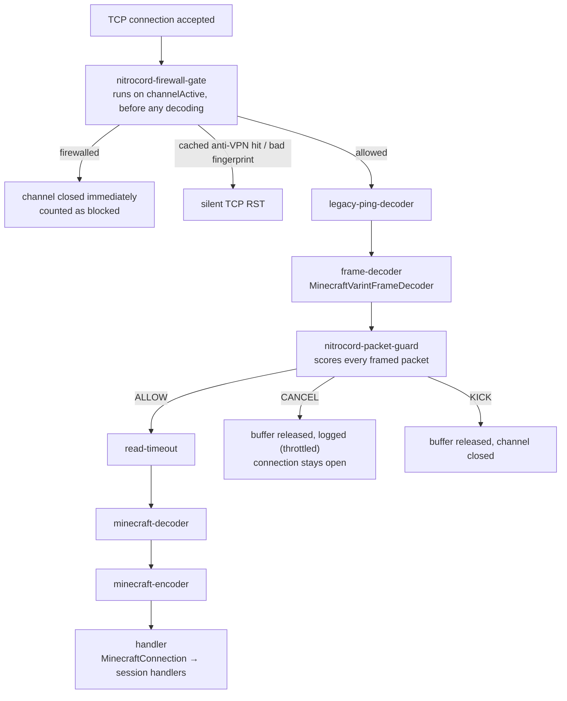
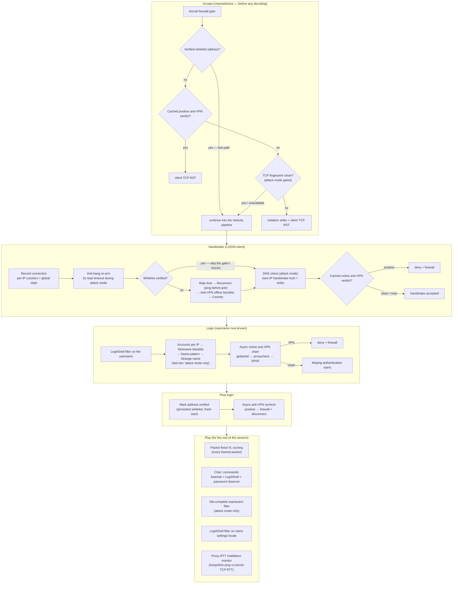
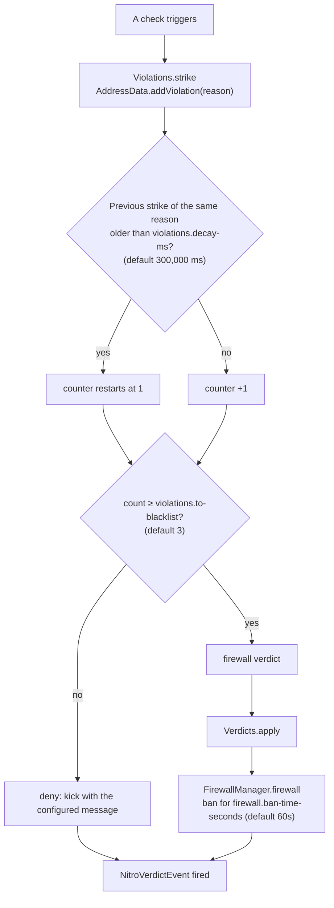
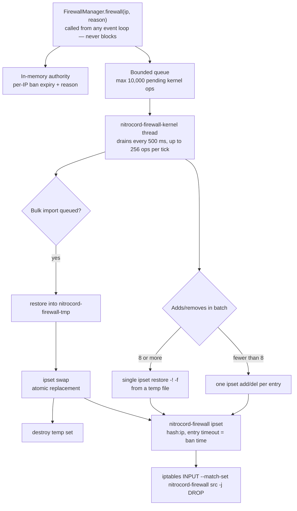

# Architecture Overview

> **A stock Velocity pipeline, plus a full protection engine.**
> This page walks through how NitroCord is put together: where its handlers sit
> in the Netty pipeline, which gates a connection passes and in what order, how
> a single bad packet escalates into a kernel-level firewall ban, and why none
> of it ever blocks a network thread.

[[toc]]

---

## Design principles

NitroCord is a fork of Velocity 4.1.0 held to three golden rules:

- **Plugin compatibility is sacred.** No `com.velocitypowered.*` package, class
  or public API signature is ever renamed or modified. Plugins compiled against
  `velocity-api` keep working unchanged.
- **Minimal upstream edits.** Edits to upstream files are limited to one-line
  hooks delegating into NitroCord code, so merging future Velocity releases
  stays a mechanical process.
- **All protection logic lives in `com.nitrocord.*`.** Every check, service and
  handler is NitroCord-owned code, configured through `nitrocord.toml` and
  `protection.toml` — two standalone files that live next to `velocity.toml`.

Two practical consequences for admins:

- **Configuration is read live.** Checks read the current `protection.toml`
  snapshot on every invocation, so `/nitrocord reload` takes effect immediately
  — no restart, no gap in protection.
- **Everything self-gates on the license.** Without a valid license key
  (license enforcement happens before bind, and if a background re-check later denies the key) every gate, check and handler passes traffic through
  untouched, and the proxy behaves like stock Velocity.

---

## The Netty pipeline

NitroCord inserts exactly two handlers into every server channel pipeline:

| Pipeline name | Handler | Position | Job |
| ------------- | ------- | -------- | --- |
| `nitrocord-firewall-gate` | `NitroFirewallGateHandler` | First handler (`addFirst`) | Accept-time gate: firewall, whitelist fast path, cached anti-VPN verdict, TCP fingerprint |
| `nitrocord-packet-guard` | `NitroPacketGuardHandler` | Immediately after `frame-decoder` | Packet flood scoring — one `ByteBuf` is exactly one framed serverbound packet |



Because the firewall gate runs on `channelActive`, a firewalled source is
rejected before any decoding, timeout handling or connection bookkeeping runs —
the cheapest possible denial short of the kernel dropping the packet itself.

::: warning HAProxy caveat
When `proxy-protocol` is enabled, Velocity inserts the HAProxy decoder ahead of
the gate, and the gate acts before the HAProxy message is decoded — so it sees
your load balancer's address, not the client's. Firewall and whitelist entries
only match direct connections, and `tcp-fingerprint` inspects the load
balancer's own socket. Disable `tcp-fingerprint` on HAProxy setups.
:::

---

## Connection lifecycle

Every connection walks a fixed sequence of gates. The order is deliberate: the
cheapest, most certain checks run first, and anything that costs network I/O
runs asynchronously, off the event loop.



The status (server list ping) path has its own short gate: every ping is
recorded and rate-limited (`PingGuard`), and during attack mode a fresh cached
MOTD is served directly — without firing `ProxyPingEvent` and without touching
any backend server. See
[Attack Mode](/nitrocord/architecture/attack-mode#server-list-pings-during-attacks).

::: info Bedrock players
When Geyser compatibility is active (`compat.geyser` in `nitrocord.toml` and
Floodgate or Geyser installed), usernames with the Floodgate prefix skip the
username-stage checks, which would otherwise false-positive on Bedrock players.
:::

---

## The violation system

All checks feed one graduated escalation ladder. Every address carries a
per-reason strike counter; repeated offences of the same kind escalate from a
plain kick to a firewall ban.



Properties of the ladder:

- **19 violation reasons**, one per detection: rate limit, reconnect, anti-VPN,
  country, accounts, nickname, fastchat, password, packets, TCP fingerprint,
  proxy-RTT, name-pattern, strange-name, timeout-flood, DNS check, Log4Shell,
  tab-exploit, improbable buffer and a catch-all.
- **Strikes decay independently per reason.** One strike of a kind expires
  after `violations.decay-ms` without a repeat, so a one-off mistake never
  accumulates into a ban.
- **Every verdict flows through one funnel.** `Verdicts.apply` records the
  block in the global statistics, logs it (throttled to one line per
  `performance.log-throttle-ms`, default 100 ms), mirrors firewall verdicts
  into the firewall manager and fires a `NitroVerdictEvent` — identical
  behaviour no matter which stage rejected the connection.
- **A completed login wipes the slate.** When an address finishes a full login,
  the whitelist service lifts any active ban and drops its entire violation
  state — verified players get a fresh start.

Per-IP state lives in a Caffeine cache that expires ten minutes after the last
access, so even a spoofed-source flood cannot grow memory unboundedly.

---

## The kernel firewall

The firewall is two layers with a strict authority order:



- **In-memory is authoritative.** A ban is stamped into the address's state
  first and every `isFirewalled` lookup answers from memory, so protection
  works identically on any platform. The kernel layer is a mirror that makes
  floods cheaper, never the source of truth.
- **Batched and atomic.** Small batches run one `ipset` call per entry; batches
  of 8+ are applied with a single `ipset restore`. Bulk imports are built in a
  temporary set and swapped in atomically, so the iptables DROP rule always
  matches a fully populated set.
- **Fail-safe by construction.** All external commands run through explicit
  argument arrays (never a shell) on one daemon thread. Five consecutive
  command failures trip a circuit breaker that disables the kernel integration
  — the in-memory firewall keeps protecting. Queue overflow drops only the
  kernel mirror; the ban still applies. Kernel entries expire on their own via
  the set timeout even if the proxy dies.
- **IPv4 at kernel level, IPv6 in memory.** The ipset is IPv4-only; IPv6 bans
  are kept in memory and enforced at the accept-time gate.

::: tip Root optional, not required
`firewall.ipset` needs root plus `ipset`/`iptables` on Linux. Without them
NitroCord logs one clear warning and runs in-memory-only — every feature still
works, floods just cost a little more CPU to drop.
:::

---

## Component map

All NitroCord code lives under `com.nitrocord.*`:

| Package | Responsibility |
| ------- | -------------- |
| `com.nitrocord` | Bootstrap singleton — owns both TOML configs, the brand, the message helper, Geyser detection |
| `com.nitrocord.config` | Typed views of `nitrocord.toml` and `protection.toml`; writes commented defaults on first run, merges new keys on upgrade |
| `com.nitrocord.license` | Altis license client — the single source of truth for whether protection may run |
| `com.nitrocord.command` | `/nitrocord` (alias `/nc`) — stats, reload, firewall add/remove |
| `com.nitrocord.api` | Public plugin API: `NitroVerdictEvent`, `NitroFirewallEvent`, `NitroAttackModeEvent`, `Verdict` |
| `com.nitrocord.protection` | Stage gates (`LoginGuard`, `PingGuard`) and shared verdict application (`Verdicts`) |
| `com.nitrocord.protection.core` | Attack-mode state machine, per-IP state, violation ladder, global stats, event posting, close helpers |
| `com.nitrocord.protection.netty` | The two pipeline handlers — firewall gate and packet guard |
| `com.nitrocord.protection.checks` | The eight registered anti-bot checks (rate limit, reconnect, anti-VPN, country, accounts, nickname, fastchat, password) |
| `com.nitrocord.protection.names` | Attack-mode username heuristics — name-pattern (Levenshtein similarity) and strange-name |
| `com.nitrocord.protection.exploits` | Log4Shell JNDI filter and tab-complete expression filter |
| `com.nitrocord.protection.firewall` | In-memory bans plus the ipset/iptables kernel mirror |
| `com.nitrocord.protection.geoip` | GeoLite2 country blocking — database download, auto-update, lookups |
| `com.nitrocord.protection.antivpn` | Offline blocklists plus the online provider chain, verdict caching and persistence |
| `com.nitrocord.protection.fingerprint` | Kernel `tcp_info` fingerprinting and proxy-RTT middlebox detection |
| `com.nitrocord.protection.packets` | Packet flood violation-level scoring |
| `com.nitrocord.protection.motd` | Null-ping-proof cached MOTD, custom MOTD rotation, fake player counts |
| `com.nitrocord.protection.whitelist` | Persistent verified-IP whitelist |
| `com.nitrocord.protection.misc` | DNS check, anti-hang read timeouts, timeout-flood tracking |
| `com.nitrocord.perf` | DynDNS backend re-resolution |

---

## Threading model

One rule governs everything: **Netty event loops never block.** Every gate that
runs on an event loop — firewall lookup, fingerprint, rate limit, name checks,
MOTD serving — is pure in-memory work. Anything that needs the network or a
subprocess runs on a background daemon thread or an async HTTP client.

| Thread | Cadence | Work |
| ------ | ------- | ---- |
| Netty event loops | per I/O event | All gates, packet scoring, fingerprinting, MOTD serving — allocation-lean, never blocking |
| `nitrocord-attack-mode` | every 1 s | Attack-mode evaluation tick (transitions are also detected lazily on every query) |
| `nitrocord-firewall-kernel` | every 500 ms | Drains queued ipset/iptables operations |
| `nitrocord-geoip` | every `country.update-interval-hours` (24 h) | GeoLite2 database download and refresh |
| `nitrocord-antivpn-refresh` | every `antivpn.list-refresh-hours` (12 h) + every 10 min | Blocklist re-downloads; persisted verdict cache flush |
| `nitrocord-whitelist` | purge every 12 h, save every 60 min | Whitelist expiry and disk flush |
| `nitrocord-license-check` | every 6 h | License revalidation against the Altis platform |
| JDK HttpClient workers | on demand | Online anti-VPN provider queries — awaited asynchronously before Mojang auth, never on an event loop |

---

## File layout

Everything NitroCord reads or writes lives in the proxy run directory:

```text
<proxy run directory>/
├── velocity.toml              # stock Velocity config (untouched semantics)
├── nitrocord.toml             # branding, theme colors, all messages, license key
├── protection.toml            # every protection knob
└── nitrocord/                 # NitroCord data directory
    ├── whitelist.txt          # persistent verified-IP whitelist
    ├── antivpn-cache.txt      # persisted anti-VPN verdicts
    ├── license.cache          # signed offline license grace cache
    └── GeoLite2-Country.mmdb  # GeoIP database (downloaded with your MaxMind key)
```

All state files are written the same safe way: serialized to a temporary file
first, then atomically moved over the target — a crash mid-save can never
corrupt them. The license cache is what keeps protection running through a
temporary outage of the license platform.

---

## Performance notes

NitroCord is built for the worst minute your proxy will ever have:

- **Zero-allocation hot paths.** Violation counters pack timestamp and count
  into a single `AtomicLong` (one compare-and-set per strike), and the strike
  map is created lazily — an address that never misbehaves costs nothing. The
  packet scorer performs no allocation beyond its cache lookup. Whitelist
  lookups allocate nothing.
- **Cached MOTD without event dispatch.** During attack mode, pings are
  answered from a synthesized snapshot without firing `ProxyPingEvent` and
  without contacting backends — the plugin event path itself is removed from
  the attack surface.
- **RST closes.** Denied connections are closed with `SO_LINGER 0`: the kernel
  sends a TCP RST instead of running the FIN handshake, freeing the connection
  immediately.
- **Kick suppression.** Above `antiddos.kick-suppression-connections-per-second`
  (default 150 conn/s) during attack mode, no disconnect packet is written at
  all — the connection simply dies.
- **Throttled logging.** At most one protection log line per
  `performance.log-throttle-ms` (default 100 ms), so a flood cannot turn the
  log into a second attack.
- **Bounded memory everywhere.** Per-IP state expires 10 minutes after last
  access, packet flood state after 60 seconds, and the kernel-op queue is
  capped at 10,000 entries.

---

## Next steps

- [Attack Mode →](/nitrocord/architecture/attack-mode) — the state machine that
  ties it all together under load.
- [Configuration Reference →](/nitrocord/configuration/reference) — every
  `protection.toml` key mentioned on this page.
- [Plugin API Events →](/nitrocord/user-guide/api) — observe verdicts, firewall
  changes and attack-mode transitions from your own plugins.
