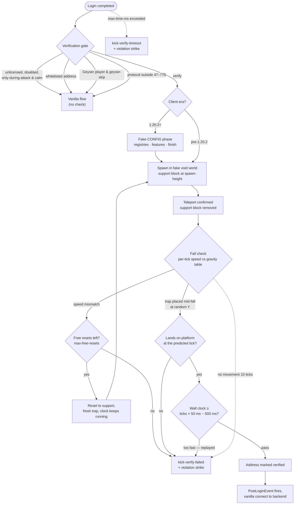

# Fall-Check Verification

> **Bots can fake a handshake. They cannot fake physics.**
> The fall check holds each joining client inside a tiny void world on the
> proxy and makes it prove it is a real Minecraft client the one way a bot
> cannot cheaply imitate: by falling with exact vanilla gravity and landing
> on a platform it could not have predicted.

[[toc]]

---

## What the fall check is

Handshake-level checks (rate limits, reconnect verification, name heuristics)
all judge a connection by what it *says*. The fall check judges it by what it
*does*. A joining client that passed the login gates is not connected to a
backend server. Instead the proxy:

1. spawns it into a synthesized void world — a 5×5 empty-chunk area with a
   plains biome, generated once per protocol version and served from memory;
2. stands it on a single support block at `verify.spawn-height` (default
   200);
3. removes the support and watches it fall, tick by tick;
4. midway through the fall, places a **trap platform** at a pseudo-random
   height and requires the client to land on it at exactly the tick vanilla
   physics predicts.

Every movement packet the client sends is compared against a precomputed
table of vanilla fall speeds. A real client passes without knowing anything
happened — the whole check takes a few seconds and looks like an odd spawn.
A bot must implement the full Minecraft fall integrator, react to a block
change it could not precompute, and report its position honestly 20 times a
second. Flood tools do none of that.

The check runs on protocols **47 through 776** (Minecraft 1.8 through 26.2);
clients outside that range skip it silently, as do Bedrock players (see
[Geyser behavior](#geyser-behavior)) and addresses already on the
[verified-IP whitelist](#the-verified-whitelist-integration).

---

## The verification flow

Two details the diagram compresses:

- **1.20.2+ clients** land in the CONFIG state after login, so the
  verification first walks them through a minimal fake configuration
  (dimension/biome registries, the vanilla feature flag) before entering
  PLAY — the same exchange a real backend would perform. The
  `verify.max-time-ms` budget already runs during this phase, so a client
  that stalls the configuration is kicked by the same timeout.
- **Plugins never see the fake world.** `PostLoginEvent` and the
  initial-server connect are deferred until the client passes and the
  connection is back in a fully vanilla state (a fresh PLAY handler
  pre-1.20.2, the stock CONFIG handler on 1.20.2+). A plugin observing the
  player cannot tell the check happened.

---

## Why bots fail it

| Defense | What it catches |
| ------- | --------------- |
| Vanilla gravity table | The per-tick fall speed must match `v = (v − 0.08) × 0.98` integrated exactly as the client does, normalized to two decimals on both sides. Bots that approximate, teleport, or send constant speeds mismatch within a few ticks. |
| Trap platform | At a pseudo-random mid-fall tick a platform of a random block appears at a random Y (8–100, always ≥ 16 below spawn). The client must report `y == platformY + 1` with `onGround` at exactly the predicted landing tick — impossible to precompute, and a one-tick grace covers clients that split the landing across two packets. |
| Wall-clock anti-precompute | The fall must have taken at least `ticks × 50 ms − 500 ms` of real time. A bot that replays a recorded fall at full speed, or answers every check instantly, fails even with perfect positions. |
| Zero-movement watchdog | More than ten consecutive ticks without movement fails — recordings freeze or loop the same frame. |
| Fresh state per attempt | Trap height, trap block, teleport id and timing are re-rolled per attempt, and free resets deliberately do **not** restart the wall clock — resets can never be farmed to bypass the too-fast check. |

On top of the fall itself, [session invariants](/nitrocord/configuration/reference#invariants)
challenge the login/config stages with boot-random keep-alive and transaction
ids: unsolicited or mismatched answers kick with `kick-verify-failed`, and a
challenge left unanswered for 12 seconds kicks with `kick-verify-timeout`.

---

## Failure reasons

Both kick messages are configurable under `[messages]` in `nitrocord.toml`,
and every failure also records a violation strike — repeat offenders escalate
from a kick to a firewall ban at `[violations] to-blacklist` (default 3).

| Kick message | Logged detail | What it means |
| ------------ | ------------- | ------------- |
| `kick-verify-failed` | `non-vanilla gravity` | The per-tick fall speed did not match the physics table after the free resets were used up. The classic bot outcome. |
| `kick-verify-failed` | `fell through the platform` | The client passed the platform's Y without reporting a landing — it either ignored the block change or its physics drifted. |
| `kick-verify-failed` | `did not land on the platform` | The client reached the platform top but never reported `onGround` (after the one-tick grace). |
| `kick-verify-failed` | `no movement while falling` | Ten consecutive zero-movement ticks mid-fall — a frozen or looping recording. |
| `kick-verify-failed` | `inhumanly fast fall` | Correct positions delivered faster than real time allows — a replayed or precomputed fall. |
| `kick-verify-timeout` | `verification timed out` / `configuration timed out` | The whole check (including the fake CONFIG phase on 1.20.2+) exceeded `verify.max-time-ms`. Very slow or stalled clients land here, which is why the budget is generous. |

A player who is kicked can simply rejoin: nothing is firewalled on the first
failure, and the reconnect check already treats them as a returning visitor.

---

## The honest caveat: lag costs a reset, not a kick

The check is deliberately lag-tolerant, and you should know exactly how
before sizing it for your audience:

- The **first** gravity mismatch never fails. It consumes one of
  `verify.max-free-resets` (default **1**): the client is teleported back
  onto the support block and restarts the fall with a fresh trap. A player
  whose connection stutters mid-fall gets a free do-over.
- Only a mismatch **after the free resets are gone** produces
  `kick-verify-failed`. So a laggy player pays one extra fall, not their
  connection.
- The landing check has a one-tick grace for clients that report the
  position and the on-ground flag in separate packets.
- The two-decimal normalization on the speed comparison absorbs ordinary
  floating-point and timing noise — real clients do not need perfect ticks.

::: warning Tune resets, not strictness
If players on genuinely bad connections (mobile hotspots, transcontinental
links) report verification kicks, raise `verify.max-free-resets` to `2`–`3`
and `verify.max-time-ms` above the 30-second default before considering
disabling the check. Free resets cannot be abused: the wall clock keeps
running across them, so extra attempts only ever make a replayed fall
slower — never more convincing.
:::

---

## Tuning guidance

### `verify.max-time-ms` (default 30000)

The total budget covers everything: the fake CONFIG phase on 1.20.2+, the
teleport round-trip, the fall itself (a 200-block fall is ~4 seconds) and
any free resets. 30 seconds fits a 500 ms ping with headroom. Raise it for
high-latency audiences; lowering it below ~10 seconds risks timing out real
players mid-fall.

### `verify.only-during-attack` (default false)

With the default, every new address is verified exactly once — after passing,
it joins the verified whitelist and skips the fake world for as long as the
entry lives (`[whitelist] survive-days`, 30 days by default), so the
steady-state cost is one fall per new player per month. Set
`only-during-attack = true` to skip verification in peace time and run it
only while [attack mode](/nitrocord/architecture/attack-mode) is engaged.
That trades first-join friction for a smaller peace-time surface — but note
that an address first seen *during* an attack is then checked under attack
conditions, when your join pipeline is busiest.

### `verify.spawn-height` (default 200)

Higher falls sample more physics ticks and are strictly harder to fake, at a
few extra seconds per verification. The value is clamped to 32–250 (the fake
world is 256 blocks high). The default is already far beyond what a bot can
bluff; there is little reason to change it.

### Geyser behavior

Bedrock clients cannot emulate Java movement physics and would fail every
time, so with `verify.geyser-skip = true` (default) and Geyser/Floodgate
detected, Bedrock players skip the check entirely — the same exemption the
nickname and account checks already use. Turn the skip off only if your
setup routes Java clients through something that fakes the Bedrock username
prefix.

### The verified-whitelist integration

Passing the check calls the same `WhitelistService` a completed login uses:
the address is remembered for `[whitelist] survive-days` (default 30 days)
and skips the fall check — and every other accept-time gate — on later
joins. Marking an address verified also lifts any active firewall ban on it
and wipes its violation history. Your regulars pay for the fall check
exactly once a month; only genuinely new addresses fall.

---

## Related pages

- [Architecture Overview →](/nitrocord/architecture/overview) — the three
  lifecycle gates a connection passes before verification.
- [Attack Mode →](/nitrocord/architecture/attack-mode) — the state machine
  `only-during-attack` binds to, and the likeliness scoring that runs
  alongside.
- [Configuration Reference →](/nitrocord/configuration/reference#verify) —
  every `verify.*` and `invariants.*` key.
