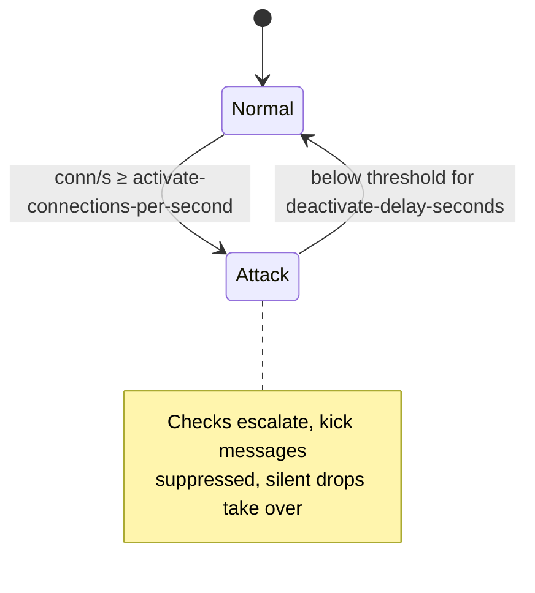

# Configuration Reference

NitroCord is configured through two TOML files, both created with full defaults and comments on first start in the **proxy run directory** (next to `velocity.toml`):

| File | Contents |
| ---- | -------- |
| `nitrocord.toml` | Branding, theme colors, every user-facing message, and your license key. |
| `protection.toml` | Every attack-prevention knob — firewall, rate limits, anti-bot checks, GeoIP, anti-VPN, packet scoring, and more. |

Neither file touches or conflicts with `velocity.toml`; Velocity's own settings stay exactly where they always were.

Apply changes with `/nitrocord reload` (or a restart). Hot-reload re-reads both files and re-applies them to the running checks; the stateful services (GeoIP database, anti-VPN lists, MOTD cache, verified-IP whitelist) are reloaded individually and keep their previous state if a reload fails.

::: warning Syntax errors fall back to defaults
If a file fails to parse, NitroCord logs an error and runs on the bundled defaults instead of failing startup. Watch the console after editing.
:::

::: info Community edition
Without a valid `license-key`, NitroCord refuses to start: the proxy logs the reason and exits before binding, so the settings in `protection.toml` only take effect with a valid license.
:::

---

## nitrocord.toml

Branding, theme, messages, and the license key.

### Root settings

| Key | Type | Default | What it does |
| --- | --- | --- | --- |
| `server-name` | string | `"NitroCord"` | Proxy name shown in the server list ping version brand and in `/nitrocord` command output. Purely cosmetic — does not affect plugin compatibility. Also feeds the `<prefix>` message tag. |
| `license-key` | string | `""` (empty) | Your commercial license key, format `PL-XXXX-...`, as issued by the Altis dashboard after purchase. Verified online and cryptographically cached for offline grace; binds one activation seat to this server's hostname. **Required** — the proxy refuses to start without a valid key. |

::: danger Keep your license key private
Treat `license-key` like a password: it activates seats on your account. Never share the file, commit it to a public repository, or post it in support chats — share the key itself only with PingLess Studios support when asked.
:::

### [theme]

Colors used by every default message. Accepts MiniMessage color tags (`<#FF8FB1>`), bare hex (`#FF8FB1`), or named colors (`white`).

| Key | Type | Default | What it does |
| --- | --- | --- | --- |
| `primary` | string | `"<#FF8FB1>"` | Primary color (pink), available inside messages as the `<primary>` tag. Used for emphasis in all default messages. |
| `secondary` | string | `"<#FFFFFF>"` | Secondary color (white), available inside messages as the `<secondary>` tag. Used for body text in all default messages. |

Change these to rebrand every default message at once — you do not need to touch `[messages]` unless you want custom wording too.

### [messages]

Every user-facing NitroCord message in MiniMessage format. The section is a flat map — add, remove, or reword keys freely; a missing key renders as a `(missing message: key)` placeholder instead of breaking anything.

**Placeholders** available per message:

| Placeholder | Available in | Resolves to |
| ----------- | ------------ | ----------- |
| `<primary>` | every message | The `[theme]` primary color. |
| `<secondary>` | every message | The `[theme]` secondary color. |
| `<prefix>` | every message | `<primary>` + `server-name` + `<secondary>` + `» ` — e.g. `NitroCord » ` in pink/white. |
| `<ip>` | all kick messages, `kick-firewalled`, `stats-line`, `firewall-added`, `firewall-removed` | The address (kick/stats/firewall) or stat label (`stats-line`). |
| `<player>` | all kick messages | The username, or `?` before login. |
| `<count>` | `kick-accounts`, `stats-line` | The configured limit / the stat value. |
| `<seconds>` | `kick-firewalled` | Remaining firewall ban time. |

**Kick messages** — shown to a denied connection:

| Key | Extra placeholders | Default | Shown when |
| --- | --- | --- | --- |
| `kick-rate-limit` | — | `<prefix><primary>Connection throttled. <secondary>Please slow down.` | An IP exceeds the connection or ping rate limit. |
| `kick-reconnect` | — | `<prefix><primary>Please rejoin <secondary>to verify your connection.` | A joining IP did not finish the ping/connect verification. |
| `kick-accounts` | `<count>` | `<prefix><primary>Too many accounts from your address <secondary>(max <count>).` | An IP uses more distinct nicknames than allowed. |
| `kick-nickname` | — | `<prefix><primary>This username is <secondary>not allowed.` | A nickname matches the bot nickname blacklist. |
| `kick-fastchat` | — | `<prefix><primary>You are chatting <secondary>too fast.` | Chat is sent too quickly after joining. |
| `kick-password` | — | `<prefix><primary>Bot-like behaviour <secondary>detected.` | One password is shared by too many different nicknames. |
| `kick-country` | — | `<prefix><primary>Your country is <secondary>not allowed <primary>on this server.` | A player's country is blacklisted. |
| `kick-antivpn` | — | `<prefix><primary>Please disable your <secondary>VPN or proxy <primary>and rejoin.` | A VPN or proxy address is detected. |
| `kick-firewalled` | `<seconds>` | `<prefix><primary>Your address <secondary><ip> <primary>is blocked for <secondary><seconds>s.` | An IP is dropped by the kernel firewall. |
| `kick-invalid-packet` | — | `<prefix><primary>Malformed packets <secondary>received from your client.` | Malformed packets or packet flooding. |
| `kick-tcp-fingerprint` | — | `<prefix><primary>Suspicious connection <secondary>detected.` | The TCP fingerprint of a connection looks like a bot. |
| `kick-proxy-rtt` | — | `<prefix><primary>Please disable your <secondary>VPN or proxy <primary>and rejoin.` | The measured round-trip time suggests a VPN or proxy. |
| `kick-name-pattern` | — | `<prefix><primary>This username is <secondary>not allowed.` | A username matches a repeating bot join pattern. |
| `kick-strange-name` | — | `<prefix><primary>This username is <secondary>not allowed.` | A username looks randomly generated. |
| `kick-timeout-flood` | — | `<prefix><primary>Your connection is <secondary>timing out too often.` | Connections repeatedly stall until the read timeout. |
| `kick-dns-check` | — | `<prefix><primary>Please rejoin using the <secondary>server domain.` | An attack-mode join does not use the server domain. |
| `kick-log4shell` | — | `<prefix><primary>Malformed content <secondary>detected.` | Log4Shell exploit attempts (JNDI lookups). |
| `kick-tab-exploit` | — | `<prefix><primary>Malformed content <secondary>detected.` | Tab-completion exploits and floods. |

**Command and stats messages:**

| Key | Extra placeholders | Default | Shown when |
| --- | --- | --- | --- |
| `stats-header` | — | `<prefix><primary>Protection statistics` | First line of the `/nitrocord stats` output. |
| `stats-line` | `<count>` | `  <secondary><ip><primary>: <secondary><count>` | One entry line of the `/nitrocord stats` output (`<ip>` is the stat label, `<count>` its value). |
| `command-reloaded` | — | `<prefix><primary>Configuration <secondary>reloaded.` | Confirmation after `/nitrocord reload`. |
| `firewall-added` | — | `<prefix><secondary><ip> <primary>added to the firewall.` | Confirmation after `/nitrocord firewall add <ip>`. |
| `firewall-removed` | — | `<prefix><secondary><ip> <primary>removed from the firewall.` | Confirmation after `/nitrocord firewall remove <ip>`. |
| `no-permission` | — | `<prefix><primary>You do not have <secondary>permission <primary>to use this command.` | A command sender lacks the `nitrocord.admin` permission. |

**Console messages** — logged, not shown to players:

| Key | Default | Logged when |
| --- | --- | --- |
| `startup-banner` | `<prefix><primary>attack prevention is now active.` | NitroCord starts up. |
| `attack-mode-on` | `<prefix><primary>attack mode <secondary>engaged<primary>: connection rate above the threshold.` | Attack mode engages. |
| `attack-mode-off` | `<prefix><primary>attack mode <secondary>disengaged<primary>: connection rate back to normal.` | Attack mode disengages. |

::: tip MiniMessage only
Messages are parsed with [MiniMessage](https://docs.advntr.dev/minimessage/) — legacy `&`/`§` codes do not work. Use `<#RRGGBB>` for custom hex colors and keep tags balanced; a malformed tag can make a kick message render literally.
:::

### [compat]

| Key | Type | Default | What it does |
| --- | --- | --- | --- |
| `geyser` | boolean | `true` | Automatically detects Floodgate/Geyser and exempts Bedrock players from the nickname and account checks, which produce false positives on Bedrock. Turn off only if you run Geyser but still want Bedrock players fully checked. |

### [misc]

| Key | Type | Default | What it does |
| --- | --- | --- | --- |
| `update-check` | boolean | `true` | Reserved toggle: check for NitroCord updates on startup. Not yet used — changing it currently has no effect. |

---

## protection.toml

Every attack-prevention knob, in file order. All of these require a valid license (the proxy will not start without one).

### [attack]

The global attack-mode state machine. While the proxy-wide connection rate stays above the activation threshold, protection checks escalate and kicks are suppressed in favor of silent drops.

| Key | Type | Default | What it does |
| --- | --- | --- | --- |
| `enabled` | boolean | `true` | Master switch for attack mode. Disable only if you want all checks to run at their normal (non-escalated) strength permanently. |
| `activate-connections-per-second` | int | `40` | New connections per second (proxy-wide) at which attack mode engages. Lower it on small networks that never see 40 legit joins/s; raise it on large networks to avoid mode flapping during login storms (e.g. after a restart). |
| `deactivate-delay-seconds` | long | `60` | Attack mode disengages after this many consecutive seconds below the activation threshold. Keep it well above a few seconds so a bursty attack cannot flip the mode rapidly. |



### [violations]

Graduated per-IP violation strikes, shared by every check. Strikes are tracked per address and per reason (19 distinct reasons across the checks); one reason reaching the limit escalates from a plain kick to a firewall ban.

| Key | Type | Default | What it does |
| --- | --- | --- | --- |
| `to-blacklist` | int | `3` | Strikes of one reason at which the address is firewalled instead of merely kicked. Raise to be more forgiving of flaky clients; lower to ban bots faster. |
| `decay-ms` | long | `300000` | A violation strike expires after this many milliseconds (5 minutes) without another strike of the same reason, so occasional one-off triggers never accumulate into a ban. |

::: warning to-blacklist = 1 bans on first offense
Setting `to-blacklist` to `1` turns every single check trigger — including rare false positives — into a firewall ban. The default of `3` exists so one bad packet does not cost a real player their connection.
:::

### [antiddos]

| Key | Type | Default | What it does |
| --- | --- | --- | --- |
| `kick-suppression-connections-per-second` | int | `150` | During attack mode, once the connection rate reaches this many per second, kick messages are suppressed and connections are closed silently with a TCP RST — serializing thousands of disconnect components per second would itself cost CPU. |

### [firewall]

The kernel-level firewall that drops hostile IPs before they ever reach the Minecraft protocol handlers.

| Key | Type | Default | What it does |
| --- | --- | --- | --- |
| `enabled` | boolean | `true` | Master switch for the firewall. With it off, hostile IPs are only kicked, never dropped. |
| `ipset` | boolean | `true` | Use ipset + iptables kernel drops instead of only in-memory denial. Degrades gracefully (with a startup warning) to in-memory mode when not running as root on Linux or when `ipset`/`iptables` are missing. |
| `ban-time-seconds` | long | `60` | How many seconds an IP stays firewalled after triggering protection. Raise for persistent attackers; keep in mind botnets rotate IPs, so very long bans mostly fill the ban set. |
| `whitelist` | string list | `["127.0.0.1"]` | IPs that can never be firewalled. Add your own monitoring, uptime checkers, and any trusted infrastructure IPs. |
| `exceptions` | string list | `["BadPacketException", "QuietException", "FastDecoderException"]` | Simple class names of exceptions that trigger an immediate firewall ban — decoder failures that only garbage or exploit traffic produces. Rarely needs changing. |

::: warning Kernel drops need root
The ipset path requires running the proxy as root (or with `CAP_NET_ADMIN`) on Linux with `ipset` and `iptables` installed. Without it you get in-memory denial only — still effective, but the packets reach the proxy process before being refused.
:::

### [ratelimit]

Per-IP connection and ping rate limiting — the first line of defense.

| Key | Type | Default | What it does |
| --- | --- | --- | --- |
| `enabled` | boolean | `true` | Master switch for rate limiting. |
| `connections-per-second` | int | `3` | Maximum new connections per second from a single IP. |
| `pings-per-second` | int | `8` | Maximum server list pings per second from a single IP. |
| `firewall-on-trigger` | boolean | `true` | Also firewall an IP that trips the rate limit (uses `[firewall]` `ban-time-seconds`), instead of only refusing the excess connections. |
| `whitelist` | string list | `["127.0.0.1"]` | IPs exempt from rate limiting. |

::: danger Shared IPs trip tight limits
A household with several players, a school, or carrier-grade NAT can put many legit users behind one IP. Lowering `connections-per-second` to `1` will kick real players during join rushes. Prefer raising `firewall-on-trigger` sensitivity through `[violations]` over tightening the raw rates.
:::

### [reconnect]

Anti-bot verification: a joining IP must have pinged the MOTD and connected before within the time window, like a real Minecraft client does when a player clicks a server in their list. Bots that join blindly without ever pinging fail this check.

| Key | Type | Default | What it does |
| --- | --- | --- | --- |
| `enabled` | boolean | `true` | Master switch for the reconnect check. |
| `required-connections` | int | `2` | How many separate connections the IP must have made within the window — the denied first join itself counts, which is why the kick tells the player to simply rejoin. |
| `required-pings` | int | `1` | How many MOTD pings the IP must have made within the window. |
| `max-time-ms` | long | `10000` | Maximum age in milliseconds of the tracked pings/connections before they are forgotten. |
| `activation-window-ms` | long | `8000` | How far back in milliseconds the verification window reaches when evaluating a join. |

::: warning First-time players during attacks
A brand-new player who joins via direct connect without refreshing the server list has never pinged your MOTD. If you raise `required-pings` above `1`, such players may need several attempts — during an attack that friction also hits legit newcomers. Keep `required-pings` at `1` unless bots are walking past the default.
:::

### [accounts]

Limits how many distinct nicknames a single IP may join with — the classic bot-flood tell.

| Key | Type | Default | What it does |
| --- | --- | --- | --- |
| `enabled` | boolean | `true` | Master switch for the account limit. |
| `limit` | int | `3` | Maximum distinct nicknames per IP before new ones are kicked. Households with siblings share an IP — do not set this to `1`. |
| `firewall-on-trigger` | boolean | `true` | Also firewall an IP that exceeds the account limit. |

Bedrock players are exempted automatically when `[compat] geyser` is on and Floodgate is detected.

### [nickname]

Kicks joining players whose name contains a known bot substring.

| Key | Type | Default | What it does |
| --- | --- | --- | --- |
| `enabled` | boolean | `true` | Master switch for the nickname blacklist. |
| `blacklist` | string list | `["mcstorm", "mcdown", "mcbot", "theresa_bot", "dropbot", "kingbot"]` | Case-insensitive substrings that mark a nickname as a bot. Matching is substring-based — adding `"bot"` would also catch `Talbot`, so prefer specific bot-tool names. |

### [fastchat]

Bots often send chat or commands instantly after joining; humans cannot type that fast.

| Key | Type | Default | What it does |
| --- | --- | --- | --- |
| `enabled` | boolean | `true` | Master switch for the fast-chat check. |
| `min-delay-ms` | long | `1000` | Chat sent within this many milliseconds after join counts as bot behaviour. Do not raise far beyond the default — legitimate clients with auto-join mods or `/register` macros can send a command within a second or two. |

### [password]

Detects the same password being used by many different nicknames — typical of botnets registering en masse on cracked servers.

| Key | Type | Default | What it does |
| --- | --- | --- | --- |
| `enabled` | boolean | `true` | Master switch for the password check. Only relevant on offline-mode (cracked) setups where clients send passwords; harmless elsewhere. |
| `limit` | int | `3` | How many *different* nicknames per IP may share one password before kicking. |

### [country]

GeoLite2-Country blocking.

| Key | Type | Default | What it does |
| --- | --- | --- | --- |
| `enabled` | boolean | `false` | Master switch for country blocking. |
| `maxmind-license-key` | string | `""` (empty) | Your MaxMind license key used to download the GeoLite2-Country database. Get a free key at [maxmind.com/en/geolite2/signup](https://www.maxmind.com/en/geolite2/signup). |
| `auto-update` | boolean | `true` | Automatically refresh the GeoLite2 database in the background. |
| `update-interval-hours` | long | `24` | How often the GeoLite2 database is refreshed, in hours. |
| `blacklist` | string list | `[]` (empty) | ISO 3166-1 alpha-2 country codes that are not allowed to join, e.g. `["CN", "RU"]`. Empty list = no country is blocked. |

::: danger enabled without a MaxMind key does nothing
The check stays inactive until `maxmind-license-key` is configured — the database cannot be downloaded without it. Setting `enabled = true` alone changes nothing. This is your own MaxMind account key, unrelated to your NitroCord license.
:::

### [antivpn]

Blocks known proxy, VPN, and Tor exit node IPs using downloadable blocklists plus an optional online API chain.

| Key | Type | Default | What it does |
| --- | --- | --- | --- |
| `enabled` | boolean | `true` | Master switch for the anti-VPN check. |
| `online-check` | boolean | `false` | Also query an online API for IPs not found in the local lists. Requires registering an account with the provider; leave disabled if you have none. Adds lookup latency to first-time joins, which the cache below absorbs. |
| `online-check-email` | string | `""` (empty) | Contact e-mail sent to the online check API — required by some providers (GetIPIntel) before they answer queries. |
| `cache-minutes` | long | `60` | How many minutes a VPN check result is cached per IP, avoiding repeat lookups. |
| `list-refresh-hours` | long | `12` | How often the blocklists are re-downloaded, in hours. |
| `whitelist` | string list | `["127.0.0.1"]` | IPs exempt from VPN/proxy checks. |
| `lists` | string list | 7 URLs (see example below) | Blocklist URLs downloaded on startup and every `list-refresh-hours`. Dead or unreachable lists are skipped with a warning. Remove lists that false-positive for your audience rather than disabling the whole check. |
| `persist-cache` | boolean | `true` | Persist the VPN check cache to disk so it survives proxy restarts. |
| `purge-age-days` | long | `30` | Persisted cache entries older than this many days are purged on load — IP reputations change, so stale verdicts are discarded. |
| `post-login-recheck` | boolean | `true` | Re-check a player's address once the login completes, catching VPNs that only become visible after the handshake. |
| `proxycheck-key` | string | `""` (empty) | Optional proxycheck.io API key enabling that provider for online checks. |
| `iphub-key` | string | `""` (empty) | Optional IPHub API key enabling that provider for online checks. |

::: tip Online checks are a chain, not a switch
`online-check = true` alone only enables providers you have actually configured: GetIPIntel needs `online-check-email`, proxycheck.io needs `proxycheck-key`, IPHub needs `iphub-key`. With no provider configured, the online check has nothing to query.
:::

### [packets]

Violation-level (vls) scoring against packet floods, similar to anti-cheat: every received packet and byte adds points inside a sliding window, and crossing thresholds escalates from cancelling packets to kicking.

| Key | Type | Default | What it does |
| --- | --- | --- | --- |
| `enabled` | boolean | `true` | Master switch for packet flood scoring. |
| `vls-per-byte` | double | `0.0017` | Violation points added per received byte within the window. |
| `vls-per-packet` | double | `0.1` | Violation points added per received packet within the window. |
| `vls-cancel` | double | `25` | Score at which offending packets start being cancelled (dropped silently) instead of processed. |
| `vls-kick` | double | `100` | Score at which the connection is kicked. |
| `window-ms` | long | `1000` | Length of the scoring window in milliseconds. |

With the defaults, a connection is kicked at roughly 1000 packets or ~59 KB per second of sustained junk — far above anything a real client produces during login. Tune `vls-kick` down only if floods slip through; raising `vls-per-byte`/`vls-per-packet` is the safer lever.

### [tcp-fingerprint]

Inspects TCP/IP header details (TTL, window size, MSS) of new connections via the kernel's `tcp_info` to flag bot clients that do not behave like a real Minecraft client.

| Key | Type | Default | What it does |
| --- | --- | --- | --- |
| `enabled` | boolean | `true` | Master switch for TCP fingerprinting. |
| `only-during-attack` | boolean | `true` | Only fingerprint connections while attack mode is engaged — zero cost and zero risk in peace time. Set `false` for always-on scrutiny. |
| `required-connections-per-second` | int | `100` | Minimum proxy-wide connections per second before fingerprinting applies, even during attack mode — the check only matters when the flood is actually large. |
| `detect-suspicious-mss` | boolean | `true` | Flag connections advertising an MSS that real Minecraft clients never use. |
| `detect-non-windows` | boolean | `true` | Flag connections whose initial TTL does not match a Windows network stack — most real players join from Windows, most botnets from Linux servers. |
| `detect-raw-stack` | boolean | `true` | Flag connections coming from a raw-socket userspace TCP stack, as used by flood tools. |
| `detect-proxy-vps` | boolean | `true` | Flag connections whose fingerprint matches common proxy or VPS software. |

::: danger Requires native epoll — and no HAProxy
Fingerprinting reads the kernel's `tcp_info`, which is only available through Netty's native epoll transport on Linux; on other transports the check quietly disables itself. If you run Velocity's `proxy-protocol` (HAProxy) in front, the proxy sees the load balancer's TCP stack, not the client's — disable `tcp-fingerprint` on such setups or every player inherits the balancer's fingerprint.
:::

### [proxy-rtt]

Measures the TCP round-trip time during the handshake and compares it with the player's in-game ping to uncover VPNs and proxies: a relayed connection shows a handshake RTT far above the true end-to-end latency.

| Key | Type | Default | What it does |
| --- | --- | --- | --- |
| `enabled` | boolean | `false` | Master switch for the proxy-RTT check. Disabled by default — enable it when VPN-based ban evasion is a problem. Also requires the native epoll transport, like `[tcp-fingerprint]`. |
| `leniency-ms` | long | `20` | How many milliseconds the handshake RTT may exceed the measured ping before the connection counts as proxied. Lower values catch more VPNs but risk false positives on jittery connections. |
| `max-attempts` | int | `40` | How many RTT samples are taken per connection before giving up. |
| `interval-ms` | long | `50` | Delay in milliseconds between two RTT samples. |
| `ignore-below-ping-ms` | long | `10` | Players with a ping below this many milliseconds are never checked — the measurement is too imprecise at that scale. |

### [name-checks]

Two independent username heuristics against name-generated bot floods.

| Key | Type | Default | What it does |
| --- | --- | --- | --- |
| `pattern-enabled` | boolean | `true` | Denies usernames matching a pattern that repeats across recent joins — a typical sign of name-generated bot floods (e.g. `xKq_ab12`, `xKq_cd34`). |
| `pattern-min-length` | int | `5` | Minimum username length before pattern matching applies; shorter names are too easy to collide by chance. |
| `pattern-history` | int | `2` | How many recent usernames a new join is compared against. |
| `pattern-min-match-percent` | double | `0.4` | Fraction (0.0 – 1.0) of characters that must match a recent pattern before the username is denied. Lower values catch weaker patterns but risk denying unrelated players with similar names. |
| `strange-enabled` | boolean | `true` | Denies usernames that look randomly generated, with improbable runs of capitals or digits. |
| `strange-max-random-capitals` | int | `3` | Maximum capital letters allowed in improbable positions before a username counts as randomly generated. |
| `strange-max-random-digits` | int | `3` | Maximum digits allowed in improbable positions before a username counts as randomly generated. |

### [exploits]

| Key | Type | Default | What it does |
| --- | --- | --- | --- |
| `tab-filter-enabled` | boolean | `true` | Scores tab-completion requests and kicks clients that flood or abuse them (expression exploits, brute-force completion scans). |
| `tab-filter-score` | int | `10` | Violation score at which the tab-completion filter kicks the client. |
| `log4shell-filter-enabled` | boolean | `true` | Blocks chat, commands, and books containing Log4Shell JNDI lookups (`${...}`), protecting downstream servers and plugins that still log unsanitized input. Keep this on. |

### [whitelist]

The verified-IP whitelist: remembers addresses that joined legitimately and lets them bypass attack-mode checks, so regulars sail through even mid-flood.

| Key | Type | Default | What it does |
| --- | --- | --- | --- |
| `enabled` | boolean | `true` | Master switch for the verified-IP whitelist. |
| `survive-days` | long | `30` | How many days a whitelisted address is remembered without being seen again. |
| `purge-interval-hours` | long | `12` | How often expired whitelist entries are purged, in hours. |
| `save-interval-minutes` | long | `60` | How often the whitelist is written back to disk, in minutes. |

::: info Not the same as the other whitelists
This is the *learned* list of verified players. The static exemption lists live at `[firewall] whitelist`, `[ratelimit] whitelist`, and `[antivpn] whitelist` — those you fill by hand, this one fills itself.
:::

### [timeout-flood]

Tracks connections that repeatedly stall until the read timeout fires — a flood pattern that wastes proxy threads by holding connections open without ever completing a login.

| Key | Type | Default | What it does |
| --- | --- | --- | --- |
| `enabled` | boolean | `false` | Master switch for timeout-flood detection. Disabled by default; enable it if your console shows floods of read-timeout disconnects during attacks. |
| `time-between-timeouts-ms` | long | `10000` | A new connection from the same address within this many milliseconds of a timed-out one counts as a timeout-flood strike. |

### [dns-check]

Botnets usually target a bare IP address; real players join through your domain. During attacks, that difference is a free filter.

| Key | Type | Default | What it does |
| --- | --- | --- | --- |
| `enabled` | boolean | `true` | During attacks, deny connections whose handshake host is a bare IP address instead of your domain. Only applies while attack mode is engaged, so direct-IP joins still work in peace time. |
| `strict` | boolean | `false` | Also match localhost and short host forms, not just literal IP addresses. Enable if bots reach you via `localhost` or single-label hosts. |

::: warning Players who join by raw IP
If your community has players who added the server by numeric IP, they will be kicked during attacks with `kick-dns-check`. Make sure your real domain is well published before relying on this.
:::

### [anti-hang]

Closes connections that stop progressing through the login sequence while the proxy is under attack, before they pile up and exhaust worker threads.

| Key | Type | Default | What it does |
| --- | --- | --- | --- |
| `enabled` | boolean | `true` | Master switch for anti-hang timeouts. |
| `attack-timeout-ms` | long | `2000` | How many milliseconds a pre-login connection may stall during attack mode before it is closed. Slow but legitimate clients on bad connections may need a raise if they report being dropped mid-login during attacks. |

### [motd]

Anti-null-ping and server list customization. Null-ping floods request the MOTD millions of times to exhaust backend servers; the cache answers from memory instead.

| Key | Type | Default | What it does |
| --- | --- | --- | --- |
| `anti-null-ping` | boolean | `true` | Answer server list pings from a synthesized cache instead of waking backend servers (or firing a full `ProxyPingEvent`) for every ping. During attacks this is what keeps the MOTD online at all. |
| `cache-seconds` | long | `5` | How many seconds a synthesized ping response is cached. Lower values keep player counts fresher at a small CPU cost; higher values absorb bigger ping floods. |
| `custom-motds` | string list | `[]` (empty) | Custom MOTDs (MiniMessage, `<primary>`/`<secondary>` supported) rotated randomly in ping responses. Empty list = use the `motd` from `velocity.toml`. |
| `fake-players-enabled` | boolean | `false` | Show a fake player count in ping responses instead of the real one. |
| `fake-players-mode` | string | `"STATIC"` | Fake count mode: `STATIC` always shows `fake-players-value`, `RANDOM` shows a random value between 0 and `fake-players-value`, `DIVISION` shows the real online count divided by `fake-players-value`. Case-insensitive; unknown values fall back to `STATIC`. |
| `fake-players-value` | int | `0` | The fake player count shown (or the divisor in `DIVISION` mode) when `fake-players-enabled` is true. |

### [performance]

| Key | Type | Default | What it does |
| --- | --- | --- | --- |
| `dyndns-re-resolve` | boolean | `true` | Re-resolve backend hostnames when a connection to a backend fails, so DynDNS backends that changed IP recover without a proxy restart. Disable only if your backends are static and you want failure fast. |
| `log-throttle-ms` | long | `100` | Maximum one protection log line per this many milliseconds during floods, so a bot attack cannot spam the console or fill the disk. Raise for quieter logs, lower for more complete forensics. |

---

## Complete annotated examples

Both files exactly as NitroCord generates them on first start, with their stock comments.

::: details nitrocord.toml (complete default file)
```toml
# NitroCord general settings: branding, theme colors and every user-facing message.
# All protection and firewall knobs live in protection.toml, not in this file.

# The proxy name shown in the server list ping version brand and in NitroCord
# command output. Does not affect plugin compatibility in any way.
server-name = "NitroCord"

# Your commercial NitroCord license key, format PL-XXXX-.... (as issued by the
# Altis dashboard after purchase at https://altis.host). The key is verified
# online against the Altis license platform (hardcoded into the software, not
# changeable here) and cryptographically cached for offline grace; it binds one
# activation seat to this server's hostname.
# Required: the proxy refuses to start without a valid key.
license-key = ""

[theme]

# Primary MiniMessage color tag used by all default NitroCord messages.
# Inside message strings below it is available as the <primary> tag.
primary = "<#FF8FB1>"

# Secondary MiniMessage color tag used by all default NitroCord messages.
# Inside message strings below it is available as the <secondary> tag.
secondary = "<#FFFFFF>"

[messages]

# Every user-facing NitroCord message in MiniMessage format. <primary> and
# <secondary> resolve to the theme colors above, every message supports
# <prefix>, and some messages support extra placeholders such as
# <ip>, <player>, <count> or <seconds>.

# Kick message when an IP exceeds the connection or ping rate limit.
kick-rate-limit = "<prefix><primary>Connection throttled. <secondary>Please slow down."

# Kick message when a joining IP did not finish the ping/connect verification.
kick-reconnect = "<prefix><primary>Please rejoin <secondary>to verify your connection."

# Kick message when an IP uses more distinct nicknames than allowed (<count>).
kick-accounts = "<prefix><primary>Too many accounts from your address <secondary>(max <count>)."

# Kick message when a nickname matches the bot nickname blacklist.
kick-nickname = "<prefix><primary>This username is <secondary>not allowed."

# Kick message when chat is sent too quickly after joining.
kick-fastchat = "<prefix><primary>You are chatting <secondary>too fast."

# Kick message when one password is shared by too many different nicknames.
kick-password = "<prefix><primary>Bot-like behaviour <secondary>detected."

# Kick message when a player's country is blacklisted.
kick-country = "<prefix><primary>Your country is <secondary>not allowed <primary>on this server."

# Kick message when a VPN or proxy address is detected.
kick-antivpn = "<prefix><primary>Please disable your <secondary>VPN or proxy <primary>and rejoin."

# Kick message shown when an IP is dropped by the kernel firewall (<ip>, <seconds>).
kick-firewalled = "<prefix><primary>Your address <secondary><ip> <primary>is blocked for <secondary><seconds>s."

# Kick message for malformed packets or packet flooding.
kick-invalid-packet = "<prefix><primary>Malformed packets <secondary>received from your client."

# Kick message when the TCP fingerprint of a connection looks like a bot.
kick-tcp-fingerprint = "<prefix><primary>Suspicious connection <secondary>detected."

# Kick message when the measured round-trip time suggests a VPN or proxy.
kick-proxy-rtt = "<prefix><primary>Please disable your <secondary>VPN or proxy <primary>and rejoin."

# Kick message when a username matches a repeating bot join pattern.
kick-name-pattern = "<prefix><primary>This username is <secondary>not allowed."

# Kick message when a username looks randomly generated.
kick-strange-name = "<prefix><primary>This username is <secondary>not allowed."

# Kick message for connections that repeatedly stall until the read timeout.
kick-timeout-flood = "<prefix><primary>Your connection is <secondary>timing out too often."

# Kick message when an attack-mode join does not use the server domain.
kick-dns-check = "<prefix><primary>Please rejoin using the <secondary>server domain."

# Kick message for Log4Shell exploit attempts (JNDI lookups).
kick-log4shell = "<prefix><primary>Malformed content <secondary>detected."

# Kick message for tab-completion exploits and floods.
kick-tab-exploit = "<prefix><primary>Malformed content <secondary>detected."

# First line of the /nitrocord stats output.
stats-header = "<prefix><primary>Protection statistics"

# One entry line of the /nitrocord stats output (<ip> is the stat label, <count> its value).
stats-line = "  <secondary><ip><primary>: <secondary><count>"

# Confirmation shown after /nitrocord reload.
command-reloaded = "<prefix><primary>Configuration <secondary>reloaded."

# Confirmation shown after /nitrocord firewall add <ip> (<ip>).
firewall-added = "<prefix><secondary><ip> <primary>added to the firewall."

# Confirmation shown after /nitrocord firewall remove <ip> (<ip>).
firewall-removed = "<prefix><secondary><ip> <primary>removed from the firewall."

# Shown when a command sender lacks the NitroCord command permission.
no-permission = "<prefix><primary>You do not have <secondary>permission <primary>to use this command."

# Logged to the console while NitroCord starts up.
startup-banner = "<prefix><primary>attack prevention is now active."

# Logged to the console when attack mode engages.
attack-mode-on = "<prefix><primary>attack mode <secondary>engaged<primary>: connection rate above the threshold."

# Logged to the console when attack mode disengages.
attack-mode-off = "<prefix><primary>attack mode <secondary>disengaged<primary>: connection rate back to normal."

[compat]

# Automatically detect Floodgate/Geyser and exempt Bedrock players from the
# nickname and account checks, which produce false positives on Bedrock.
geyser = true

[misc]

# Reserved toggle: check for NitroCord updates on startup. Not yet used.
update-check = true
```
:::

::: details protection.toml (complete default file)
```toml
# NitroCord attack prevention settings.
# Branding, theme colors and messages live in nitrocord.toml, not in this file.

[attack]

# Global attack mode: while the proxy-wide connection rate stays above the
# activation threshold, protection checks escalate and kicks are suppressed.
enabled = true

# New connections per second (proxy-wide) at which attack mode engages.
activate-connections-per-second = 40

# Attack mode disengages after this many consecutive seconds below the
# activation threshold.
deactivate-delay-seconds = 60

[violations]

# Per-IP violation strikes escalate from a plain kick to a firewall ban once
# one reason reaches this count.
to-blacklist = 3

# A violation strike expires after this many milliseconds without another
# strike of the same reason.
decay-ms = 300000

[antiddos]

# During attack mode, kick messages are suppressed (the connection is closed
# silently with a TCP RST) once the connection rate reaches this many per second.
kick-suppression-connections-per-second = 150

[firewall]

# Master switch for the kernel-level firewall that drops hostile IPs
# before they ever reach the Minecraft protocol handlers.
enabled = true

# Use ipset + iptables kernel drops instead of only in-memory denial.
# Degrades gracefully (with a warning) when not running as root on Linux.
ipset = true

# How many seconds an IP stays firewalled after triggering protection.
ban-time-seconds = 60

# IPs that can never be firewalled.
whitelist = ["127.0.0.1"]

# Simple class names of exceptions that trigger an immediate firewall ban.
exceptions = ["BadPacketException", "QuietException", "FastDecoderException"]

[ratelimit]

# Master switch for per-IP connection and ping rate limiting.
enabled = true

# Maximum new connections per second from a single IP.
connections-per-second = 3

# Maximum server list pings per second from a single IP.
pings-per-second = 8

# Also firewall an IP that trips the rate limit (uses [firewall] ban-time).
firewall-on-trigger = true

# IPs exempt from rate limiting.
whitelist = ["127.0.0.1"]

[reconnect]

# Anti-bot verification: a joining IP must have pinged the MOTD and connected
# before within the time window below, like a real Minecraft client would.
enabled = true

# How many separate connections the IP must have made within the window.
required-connections = 2

# How many MOTD pings the IP must have made within the window.
required-pings = 1

# Maximum age in milliseconds of the tracked pings/connections.
max-time-ms = 10000

# How far back in milliseconds the verification window reaches.
activation-window-ms = 8000

[accounts]

# Limits how many distinct nicknames a single IP may join with.
enabled = true

# Maximum distinct nicknames per IP before new ones are kicked.
limit = 3

# Also firewall an IP that exceeds the account limit.
firewall-on-trigger = true

[nickname]

# Kicks joining players whose name contains a known bot substring.
enabled = true

# Case-insensitive substrings that mark a nickname as a bot.
blacklist = ["mcstorm", "mcdown", "mcbot", "theresa_bot", "dropbot", "kingbot"]

[fastchat]

# Bots often send chat/commands instantly after joining; humans cannot.
enabled = true

# Chat sent within this many milliseconds after join counts as bot behaviour.
min-delay-ms = 1000

[password]

# Detects the same password being used by many different nicknames.
enabled = true

# How many DIFFERENT nicknames per IP may share one password before kicking.
limit = 3

[country]

# GeoLite2-Country blocking. Stays disabled until a MaxMind license key is
# entered below; get a free key at https://www.maxmind.com/en/geolite2/signup
enabled = false

# Your MaxMind license key used to download the GeoLite2-Country database.
maxmind-license-key = ""

# Automatically refresh the GeoLite2 database in the background.
auto-update = true

# How often the GeoLite2 database is refreshed, in hours.
update-interval-hours = 24

# ISO 3166-1 alpha-2 country codes that are not allowed to join.
blacklist = []

[antivpn]

# Blocks known proxy/VPN/Tor exit node IPs using the blocklists below.
enabled = true

# Also query an online API for IPs not found in the local lists. Requires
# registering an account; leave disabled if you have no API account.
online-check = false

# Contact e-mail sent to the online check API (required by some providers).
online-check-email = ""

# How many minutes a VPN check result is cached per IP.
cache-minutes = 60

# How often the blocklists below are re-downloaded, in hours.
list-refresh-hours = 12

# IPs exempt from VPN/proxy checks.
whitelist = ["127.0.0.1"]

# Blocklist URLs downloaded on startup and every list-refresh-hours.
# Dead or unreachable lists are skipped with a warning.
lists = [
    "https://raw.githubusercontent.com/TheSpeedX/PROXY-List/master/http.txt",
    "https://raw.githubusercontent.com/clarketm/proxy-list/master/proxy-list-raw.txt",
    "https://check.torproject.org/torbulkexitlist",
    "http://cinsscore.com/list/ci-badguys.txt",
    "http://lists.blocklist.de/lists/all.txt",
    "http://blocklist.greensnow.co/greensnow.txt",
    "https://raw.githubusercontent.com/firehol/blocklist-ipsets/master/stopforumspam_7d.ipset",
]

# Persist the VPN check cache to disk so it survives proxy restarts.
persist-cache = true

# Persisted cache entries older than this many days are purged on load.
purge-age-days = 30

# Re-check a player's address once the login completes, catching VPNs that
# only become visible after the handshake.
post-login-recheck = true

# Optional proxycheck.io API key enabling that provider for online checks.
proxycheck-key = ""

# Optional IPHub API key enabling that provider for online checks.
iphub-key = ""

[packets]

# Violation-level (vls) scoring against packet floods, similar to anti-cheat.
enabled = true

# Violation points added per received byte within the window.
vls-per-byte = 0.0017

# Violation points added per received packet within the window.
vls-per-packet = 0.1

# Score at which offending packets start being cancelled.
vls-cancel = 25

# Score at which the connection is kicked.
vls-kick = 100

# Length of the scoring window in milliseconds.
window-ms = 1000

[tcp-fingerprint]

# Inspects TCP/IP header details (TTL, window size, MSS) of new connections
# to flag bot clients that do not behave like a real Minecraft client.
enabled = true

# Only fingerprint connections while attack mode is engaged.
only-during-attack = true

# Minimum proxy-wide connections per second before fingerprinting applies,
# even during attack mode.
required-connections-per-second = 100

# Flag connections advertising an MSS that real Minecraft clients never use.
detect-suspicious-mss = true

# Flag connections whose initial TTL does not match a Windows network stack.
detect-non-windows = true

# Flag connections coming from a raw-socket userspace TCP stack.
detect-raw-stack = true

# Flag connections whose fingerprint matches common proxy or VPS software.
detect-proxy-vps = true

[proxy-rtt]

# Measures the TCP round-trip time during the handshake and compares it with
# the player's in-game ping to uncover VPNs and proxies.
enabled = false

# How many milliseconds the handshake RTT may exceed the measured ping
# before the connection counts as proxied.
leniency-ms = 20

# How many RTT samples are taken per connection before giving up.
max-attempts = 40

# Delay in milliseconds between two RTT samples.
interval-ms = 50

# Players with a ping below this many milliseconds are never checked, as the
# measurement is too imprecise at that scale.
ignore-below-ping-ms = 10

[name-checks]

# Denies usernames matching a pattern that repeats across recent joins,
# a typical sign of name-generated bot floods.
pattern-enabled = true

# Minimum username length before pattern matching applies.
pattern-min-length = 5

# How many recent usernames a new join is compared against.
pattern-history = 2

# Fraction (0.0 - 1.0) of characters that must match a recent pattern
# before the username is denied.
pattern-min-match-percent = 0.4

# Denies usernames that look randomly generated, with improbable runs of
# capitals or digits.
strange-enabled = true

# Maximum capital letters allowed in improbable positions before a username
# counts as randomly generated.
strange-max-random-capitals = 3

# Maximum digits allowed in improbable positions before a username counts
# as randomly generated.
strange-max-random-digits = 3

[exploits]

# Scores tab-completion requests and kicks clients that flood or abuse them.
tab-filter-enabled = true

# Violation score at which the tab-completion filter kicks the client.
tab-filter-score = 10

# Blocks chat, commands and books containing Log4Shell JNDI lookups.
log4shell-filter-enabled = true

[whitelist]

# Remembers addresses that joined legitimately and lets them bypass
# attack-mode checks.
enabled = true

# How many days a whitelisted address is remembered without being seen again.
survive-days = 30

# How often expired whitelist entries are purged, in hours.
purge-interval-hours = 12

# How often the whitelist is written back to disk, in minutes.
save-interval-minutes = 60

[timeout-flood]

# Tracks connections that repeatedly stall until the read timeout fires,
# a flood pattern that wastes proxy threads.
enabled = false

# A new connection from the same address within this many milliseconds of a
# timed-out one counts as a timeout-flood strike.
time-between-timeouts-ms = 10000

[dns-check]

# During attacks, deny connections whose handshake host is a bare IP
# address instead of your domain.
enabled = true

# Also match localhost and short host forms, not just literal IP addresses.
strict = false

[anti-hang]

# Closes connections that stop progressing through the login sequence while
# the proxy is under attack, before they pile up.
enabled = true

# How many milliseconds a pre-login connection may stall during attack mode
# before it is closed.
attack-timeout-ms = 2000

[motd]

# Anti-null-ping: answer server list pings from a synthesized cache instead
# of waking backend servers for every ping.
anti-null-ping = true

# How many seconds a synthesized ping response is cached.
cache-seconds = 5

# Custom MOTDs (MiniMessage) rotated in ping responses. Empty list = use the
# motd from velocity.toml.
custom-motds = []

# Show a fake player count in ping responses.
fake-players-enabled = false

# Fake player count mode: STATIC (always fake-players-value).
fake-players-mode = "STATIC"

# The fake player count shown when fake-players-enabled is true.
fake-players-value = 0

[performance]

# Re-resolve backend hostnames when a connection to a backend fails,
# so dyndns backends that changed IP recover without a proxy restart.
dyndns-re-resolve = true

# Maximum one protection log line per this many milliseconds during floods.
log-throttle-ms = 100
```
:::

---

## See also

- [Installation](/nitrocord/getting-started/installation) — getting the proxy running
- [Licensing](/nitrocord/getting-started/licensing) — activating your commercial license
- [CLI Reference](/nitrocord/user-guide/cli) — `/nitrocord stats`, `reload` and `firewall` in action
