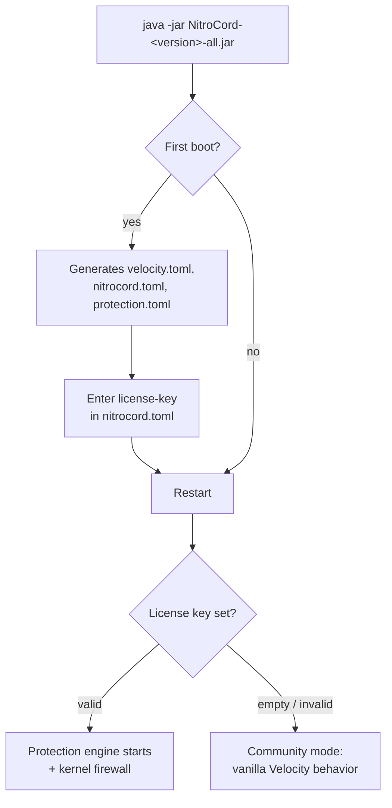

# Installation

NitroCord is a drop-in replacement for the Velocity proxy jar. You download one file, start it once to generate the configuration files, enter your license key and restart. The whole process takes a few minutes.

## Prerequisites

### Java 25 or newer

The NitroCord jar is built for Java 25 and refuses to start on an older JVM. Check what you have:

```bash
java -version
```

The first line must report version 25 or higher, for example:

```text
openjdk version "25.0.1" 2025-10-21
```

If your distribution does not ship Java 25 yet, download a build from [Adoptium](https://adoptium.net/) or your JDK vendor of choice.

### Linux

NitroCord is developed and supported on Linux. The kernel-level firewall — the component that drops hostile IPs in iptables before they ever reach the proxy — requires:

- a Linux host,
- the `ipset` and `iptables` binaries installed,
- the proxy process running as **root** (or with equivalent firewall privileges).

::: tip No root? You still get protection
Without root, ipset or iptables, NitroCord logs one warning at startup and falls back to its **in-memory firewall**. Every protection feature still works; bans are simply enforced in userspace instead of the kernel. Nothing else to configure — `firewall.ipset` degrades gracefully on its own.
:::

### Optional extras

These are not required for installation, but unlock optional features later:

- **MaxMind license key** — enables GeoLite2 country blocking (`[country]` in `protection.toml`). Get a free key at [maxmind.com/en/geolite2/signup](https://www.maxmind.com/en/geolite2/signup).
- **proxycheck.io / IPHub API keys** — enable the online VPN/proxy check chain on top of the built-in blocklists (`[antivpn]` in `protection.toml`).

## Install NitroCord

1. **Download the jar.** After purchase, download `NitroCord-<version>-all.jar` from the [Altis dashboard](https://altis.host) or the store page you bought from.
2. **Place it in your server directory** — the directory where your current Velocity jar (and `velocity.toml`) lives. NitroCord reuses your existing Velocity configuration, backends and plugins as-is.
3. **Start the proxy once:**

   ```bash
   java -jar NitroCord-<version>-all.jar
   ```

   On first boot NitroCord generates three files next to each other:

   | File | Contents |
   | ---- | -------- |
   | `velocity.toml` | Standard Velocity configuration (bind, servers, forwarding) |
   | `nitrocord.toml` | Branding, theme colors, every message, your license key |
   | `protection.toml` | Every attack-prevention knob |

4. **Enter your license key.** Open `nitrocord.toml` and paste the key from the Altis dashboard:

   ```toml
   license-key = "PL-XXXX-XXXX-XXXX-XXXX"
   ```

   Leave it empty only if you intentionally want the free community edition (protection disabled). See [Licensing](/nitrocord/getting-started/licensing).
5. **Restart the proxy.** Protection services only start when a valid license is present, so this restart is what activates them.
6. **Watch the console.** A successful activation shows:

   ```text
   License verified - thank you for supporting NitroCord.
   Kernel firewall active: dropping sources of ipset 'nitrocord-firewall' in iptables.
   ```



## Post-install verification checklist

Run through this once after the restart:

- **License line** — the console shows `License verified - thank you for supporting NitroCord.` (it appears a few seconds after the bind, the check runs in the background).
- **Firewall line** — the console shows `Kernel firewall active: dropping sources of ipset 'nitrocord-firewall' in iptables.` when running as root with ipset available.
- **Kernel set exists** — `sudo ipset list nitrocord-firewall` lists the set (empty is fine; entries appear as bans happen).
- **Bootstrap banner** — the themed `attack prevention is now active.` line confirms the NitroCord bootstrap ran (it prints in community mode too; the license line above is what confirms protection).
- **Admin command works** — from the proxy console or in-game with the `nitrocord.admin` permission:

  ```text
  /nitrocord stats
  ```

  You get live counters: total pings, pings per second, total connections, connections per second, blocked connections, firewalled addresses.
- **Server list brand** — ping the proxy from a Minecraft client's server list; the version brand shows `NitroCord`.

## Troubleshooting

| Symptom | Cause | Fix |
| ------- | ----- | --- |
| `Address already in use` at startup | Another process holds the bind port | Change `bind` in `velocity.toml` (default `0.0.0.0:25565`) or stop the conflicting process |
| `NitroCord protection is inactive (community mode): no valid license.` | License key missing or invalid | Re-check `license-key` in `nitrocord.toml` for typos/truncation, confirm the key in your Altis dashboard, restart |
| `Could not create the 'nitrocord-firewall' ipset ...` | `ipset`/`iptables` missing or not running as root | Install both packages and run the proxy as root — or do nothing and accept the in-memory firewall |
| GeoLite2 database download fails | Wrong MaxMind key or no outbound network access | Verify `country.maxmind-license-key`, check the host can reach MaxMind, look at the logged download error |
| Bedrock (Geyser) players kicked by nickname/account checks | Bedrock exemption needs Floodgate/Geyser detected | `compat.geyser` is `true` by default — make sure Floodgate (or Geyser) is actually installed as a proxy plugin |
| Proxy starts on macOS/Windows, firewall warning logged | Kernel firewall is Linux-only | Expected; the in-memory firewall covers bans. Run on Linux for kernel drops |

## Uninstall

NitroCord never touches your Velocity plugins or worlds, so removal is clean:

1. **Stop the proxy.**
2. **Remove the kernel firewall leftovers** (only if the kernel firewall was active). NitroCord intentionally leaves the ipset and its iptables rule in place on shutdown so remaining entries expire on their own — remove them manually:

   ```bash
   sudo iptables -D INPUT -m set --match-set nitrocord-firewall src -j DROP
   sudo ipset destroy nitrocord-firewall
   ```

3. **Delete the NitroCord files** from the server directory:

   ```text
   NitroCord-<version>-all.jar
   nitrocord.toml
   protection.toml
   nitrocord/            # data directory: license cache, verified-IP whitelist, anti-VPN cache
   ```

4. **Put a Velocity jar back** and start it. Your `velocity.toml`, forwarding secret, plugins and their configurations carry over unchanged.

::: warning Keep nitrocord.toml if you might come back
`nitrocord.toml` contains your license key, and `nitrocord/whitelist.txt` inside the data directory holds up to 30 days of verified player IPs that bypass attack-mode checks. Back both up if there is any chance you reinstall — losing the whitelist means every player re-verifies after the next attack.
:::
