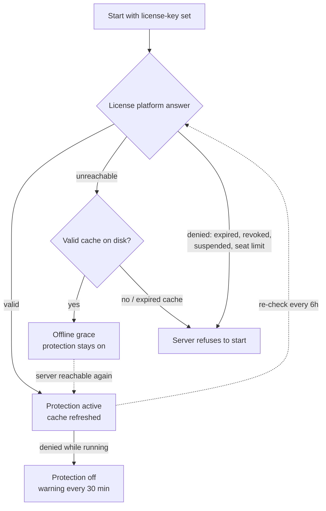

# Licensing

NitroCord is a commercial product sold by PingLess Studios. **A valid license key is required to run the proxy at all** — there is no free/community mode. This page covers everything you need to know as a buyer; the only configuration involved is pasting one line.

## What the license does

| | No key / invalid key | Licensed |
| --- | --- | --- |
| Proxy startup | **Refused — the server stops before binding** | Starts normally |
| Attack prevention | Off | **Fully active** |
| `/nitrocord` admin command | Never reached | Works |

Starting without a key (or with a key that cannot be verified and has no valid grace cache) prints the reason and exits before any player can connect:

```text
License Not Found - set license-key in nitrocord.toml (get one at https://altis.host). The server will now stop.
NitroCord could not verify a license (no license key configured in nitrocord.toml). Shutting down.
```

A valid key unlocks the entire protection engine: the kernel firewall, attack mode, rate limiting, anti-bot verification, GeoIP and anti-VPN blocking, packet flood scoring and the exploit filters.

## Buying a license

Licenses are issued through the **Altis dashboard** at [https://altis.host](https://altis.host). After purchase you receive a key in the format `PL-XXXX-...`, shown on your dashboard.

::: warning Treat your key like a password
Anyone holding your key can consume your activation seats. Do not commit `nitrocord.toml` to a public repository, do not paste the key in support chats, and contact Altis to have a leaked key reissued.
:::

## Activation

1. Open `nitrocord.toml` in your proxy run directory (generated on first start).
2. Paste the key:

   ```toml
   license-key = "PL-XXXX-XXXX-XXXX-XXXX"
   ```

3. **Start (or restart) the proxy.** The license is read at startup; editing the key requires a restart to take effect.

Within a few seconds you should see the startup sequence:

```text
License Found - verifying with the license server...
License Key Verified.
```

Once the proxy is bound and online, startup finishes with the pink/white **Protection Enabled** banner listing every protection active in your `protection.toml`, followed by the support line:

```text
Protection Enabled
  ✔ Kernel Firewall (ipset + iptables)
  ✔ Connection & Ping Rate Limiting
  ✔ Reconnect Verification
  ... (every enabled protection is listed)

For support: contact pingless.org on Discord or an.average.being on BuiltByBit, or join the Discord server discord-studio.pingless.org
```

From then on the proxy re-validates your key every 6 hours in the background — you never have to touch it again.

## Seats: one activation per server hostname

Each activation seat binds to the **hostname of the machine** the proxy runs on — not to an IP address, not to a hardware fingerprint.

- The number of seats is set by your purchase — check your key's seat count in the Altis dashboard.
- Starting the same key on a machine with a **different hostname consumes a new seat**.
- When all seats are used, extra servers are denied at startup and refuse to boot (see [when a key is denied](#when-a-key-is-denied)).

Changing the IP, moving datacenters or reinstalling the OS does **not** consume a new seat as long as the hostname stays the same.

## Offline grace

Licensing hiccups should not take your network down — so after the first successful activation, the proxy keeps a signed validation cache on disk (`nitrocord/license.cache`).

- If the Altis license server is **unreachable** — maintenance, your firewall, a routing issue — protection simply keeps running on that cache (startup shows `License Key Verified (offline grace)`).
- Grace lasts **up to 3 days**, capped further by the offline allowance configured on your license, and never past the license's own expiry.
- As soon as the license server is reachable again, the background check refreshes the cache silently. No admin action, no restart.

::: warning The one case that stops the server
If the license server is unreachable **and** there is no valid grace cache on disk (for example a brand-new install that could never verify), the proxy cannot prove you paid and refuses to start. Once one online verification has succeeded, outages are covered by grace.
:::

## When a key is denied

If the license platform reports a problem — **expired**, **revoked**, **suspended**, or **seat limit reached** — behavior depends on when it happens:

- **At startup:** the proxy logs the denial reason and refuses to run.
- **During a background re-check (already running):** protection disables itself — all checks, the firewall and the MOTD cache turn off (players keep their vanilla Velocity behavior), a warning naming the reason is logged, then a reminder every 30 minutes. The stored offline cache is discarded, so the denial survives restarts until fixed.

Fix the cause in your Altis dashboard (renew, unsuspend, free a seat) or enter a different key and restart — protection comes back at the next successful check, no reinstall needed.



## FAQ

**I am moving to a new host. Do I need a new license?**
No. Move the jar, your configs and your key — but a machine with a different hostname binds a **new seat**. If your key has one seat, free the old activation in the Altis dashboard (or let support do it) before starting on the new host.

**Can I run several proxies on one key?**
Only if your key has multiple seats. Every running NitroCord instance consumes one seat per machine hostname — a network of three proxies on three machines needs three seats.

**Does activation need internet access?**
Once, briefly. The first activation must reach the Altis license platform; after that the offline grace cache covers outages of up to 3 days (or your license's configured allowance, whichever is shorter).

**I edited the key but nothing changed.**
License keys are only read at startup. Restart the proxy after editing `license-key`; `/nitrocord reload` reloads protection settings but does not re-read the key.

**What happens if I let the license expire?**
A running proxy disables protection and reminds you every 30 minutes (players keep their normal proxy behavior); at the next start the proxy refuses to run until you renew. Renew in the dashboard and the next start reactivates everything.

**Where can I see my seats and activations?**
In the Altis dashboard at [https://altis.host](https://altis.host), next to your key.
