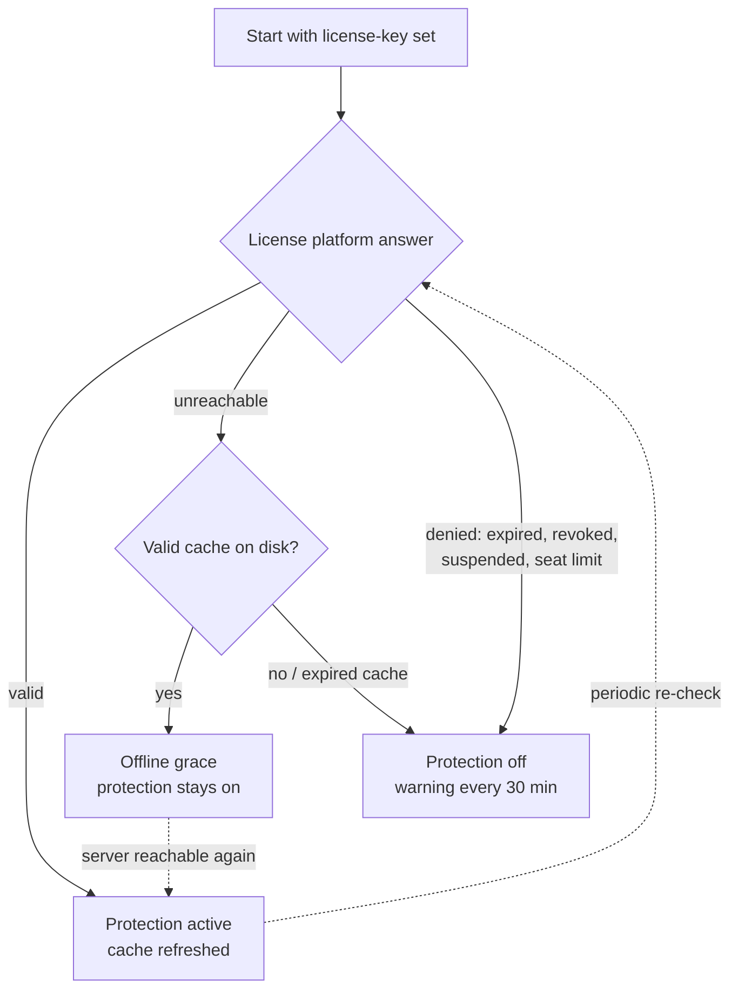

# Licensing

NitroCord is a commercial product sold by PingLess Studios. One license key turns the same jar from the free community edition into the full protected proxy. This page covers everything you need to know as a buyer — no configuration beyond pasting one line.

## What the license does

| | Community edition (no key) | Licensed |
| --- | --- | --- |
| Proxy core | Full Velocity 4.1.0 behavior, all plugins work | Identical |
| Branding | NitroCord name and theme | Identical |
| Attack prevention | **Disabled** — every check, the firewall, anti-bot, anti-VPN, packet scoring | **Fully active** |
| `/nitrocord` admin command | Works | Works |

With an empty `license-key` the proxy runs exactly like stock Velocity with NitroCord branding, and the console reminds you at startup:

```text
No license key set in nitrocord.toml; running the NitroCord community edition. Attack prevention is disabled - get a license at https://altis.host
```

A valid key unlocks the entire protection engine: the kernel firewall, attack mode, rate limiting, anti-bot verification, GeoIP and anti-VPN blocking, packet flood scoring and the exploit filters.

## Buying a license

Licenses are issued through the **Altis dashboard** at [https://altis.host](https://altis.host). After purchase you receive a key in the format `PL-XXXX-...`, shown on your dashboard.

::: warning Treat your key like a password
Anyone holding your key can consume your activation seats. Do not commit `nitrocord.toml` to a public repository, do not paste the key in support chats, and contact Altis to have a leaked key reissued.
:::

## Activation

1. Open `nitrocord.toml` in your proxy run directory (generated on first start).
2. Paste the key:

   ```toml
   license-key = "PL-XXXX-XXXX-XXXX-XXXX"
   ```

3. **Restart the proxy.** The license is read at startup; editing the key requires a restart to take effect.

Within a few seconds of the bind you should see:

```text
License verified - thank you for supporting NitroCord.
```

That single line means protection is live. From then on the proxy re-validates your key periodically in the background — you never have to touch it again, and the check never blocks startup or gameplay.

## Seats: one activation per server hostname

Each activation seat binds to the **hostname of the machine** the proxy runs on — not to an IP address, not to a hardware fingerprint.

- The number of seats is set by your purchase — check your key's seat count in the Altis dashboard.
- Starting the same key on a machine with a **different hostname consumes a new seat**.
- When all seats are used, extra servers are denied: they keep running as proxies, but their protection stays off (see [denial states](#when-a-key-is-denied)).

Changing the IP, moving datacenters or reinstalling the OS does **not** consume a new seat as long as the hostname stays the same.

## Offline grace

NitroCord must never take your network down because a licensing server hiccups. After the first successful activation, the proxy keeps a signed validation cache on disk (`nitrocord/license.cache`).

- If the Altis license server is **unreachable** — maintenance, your firewall, a routing issue — protection simply keeps running on that cache.
- Grace lasts **up to 3 days**, capped further by the offline allowance configured on your license, and never past the license's own expiry.
- As soon as the license server is reachable again, the background check refreshes the cache silently. No admin action, no restart.

::: info The proxy never shuts down over licensing
Whatever the license state — denied, expired, unreachable with an exhausted cache — NitroCord keeps proxying players. The worst case is protection turning off and falling back to community-edition behavior, with a console warning every 30 minutes until it is resolved.
:::

## When a key is denied

If the license platform reports a problem — **expired**, **revoked**, **suspended**, or **seat limit reached** — that proxy's protection disables itself:

- all protection checks, the firewall and the MOTD cache turn off (vanilla Velocity behavior is preserved exactly),
- a warning naming the denial reason is logged, then a reminder every 30 minutes,
- the stored offline cache is discarded, so the denial survives restarts until fixed.

Fix the cause in your Altis dashboard (renew, unsuspend, free a seat) or enter a different key and restart — protection comes back at the next successful check, no reinstall needed.



## FAQ

**I am moving to a new host. Do I need a new license?**
No. Move the jar, your configs and your key — but a machine with a different hostname binds a **new seat**. If your key has one seat, free the old activation in the Altis dashboard (or let support do it) before starting on the new host.

**Can I run several proxies on one key?**
Only if your key has multiple seats. Every running NitroCord instance consumes one seat per machine hostname — a network of three proxies on three machines needs three seats.

**Does activation need internet access?**
Once, briefly. The first activation must reach the Altis license platform; after that the offline grace cache covers outages of up to 3 days (or your license's configured allowance, whichever is shorter).

**I edited the key but nothing changed.**
License keys are only read at startup. Restart the proxy after editing `license-key`; `/nitrocord reload` reloads protection settings but does not re-read the key.

**What happens if I let the license expire?**
The proxy keeps running and proxying players, protection turns off, and the console reminds you every 30 minutes. Renew in the dashboard and the next background check (or a restart) reactivates everything.

**Where can I see my seats and activations?**
In the Altis dashboard at [https://altis.host](https://altis.host), next to your key.
