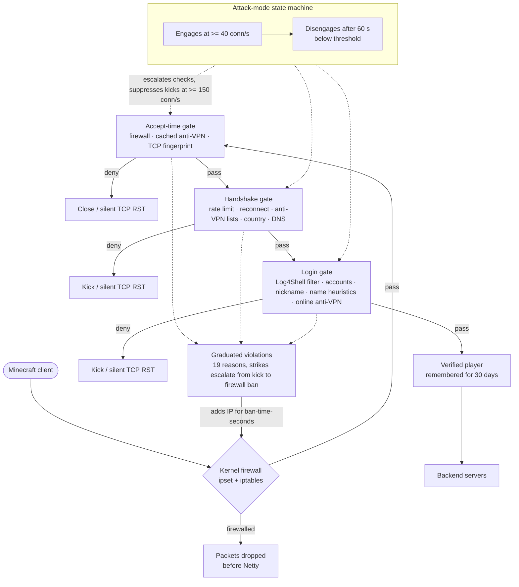

# NitroCord

**Velocity-compatible Minecraft proxy with built-in, license-gated attack prevention.**

## What is NitroCord?

NitroCord is a fork of [Velocity](https://papermc.io/software/velocity) 4.1.0 and a drop-in replacement for it: plugins compiled against the Velocity API keep working unchanged, and `velocity.toml` plus every upstream feature behaves exactly as before. On top of that, NitroCord ships a built-in protection engine that vanilla Velocity does not have — an accept-time kernel firewall, TCP fingerprinting, an attack-mode state machine, anti-bot verification, anti-VPN and GeoIP blocking, packet flood scoring, a null-ping-proof MOTD cache and exploit filters for Log4Shell and tab-completion abuse.

The engine is configured through two standalone TOML files created next to `velocity.toml` on first start: `nitrocord.toml` (branding, theme colors, every message, license key) and `protection.toml` (every protection knob). Protection is unlocked by a commercial license key from [Altis](https://altis.host) — and because NitroCord is a commercial product, the proxy refuses to start without a valid key (startup prints `License Found` → `License Key Verified` and finishes with the pink/white `Protection Enabled` banner listing every active protection).

## Key Features

- **Drop-in Velocity Replacement**: Fork of Velocity 4.1.0 with 100% plugin compatibility — no plugin recompiles, no API renames
- **Kernel-Level Firewall**: Hostile IPs are dropped via `ipset` + `iptables` before they reach the Minecraft protocol; degrades to in-memory denial without root
- **Accept-Time Gate**: The first Netty handler rejects firewalled addresses, cached anti-VPN positives and suspicious fingerprints before any decoding runs
- **TCP Fingerprinting**: Reads kernel `tcp_info` (MSS, TTL, window) to flag raw-socket bot stacks and proxy/VPS software during attacks
- **Attack-Mode State Machine**: Engages at 40 connections/s, disengages after 60 calm seconds; escalates checks and suppresses kick messages (silent TCP RST) under heavy load
- **Graduated Violations**: 19 violation reasons tracked per IP — repeated strikes escalate from a plain kick to a timed firewall ban
- **Anti-Bot Verification**: Ping-before-join reconnect check, accounts-per-IP limit, nickname blacklist, fastchat and shared-password detection, name-pattern and strange-name heuristics — with automatic Geyser/Floodgate exemption for Bedrock players
- **Fall-Check Client Verification**: Joining clients are held in a fake void world and must fall with exact vanilla physics onto a trap platform before ever reaching a backend — wall-clock anti-precompute, lag-tolerant free resets, boot-random session challenges, Geyser skip and verified-IP whitelist integration (protocols 1.8–26.2)
- **Anti-VPN**: 7 offline blocklists refreshed in the background, an online provider quorum (getipintel, proxycheck.io, IPHub, vpnapi.io, IPQualityScore) that flags only when `flagged-threshold` providers agree — rate-limited providers abstain — with per-provider votes persisted on disk and a post-login recheck
- **GeoIP Country Blocking**: MaxMind GeoLite2 country lookups with automatic database updates
- **Packet Flood Scoring**: Anti-cheat-style violation levels per byte and per packet — cancel, then kick
- **Null-Ping-Proof MOTD Cache**: During attacks, server list pings are answered from a synthesized cache without firing `ProxyPingEvent` or contacting backend servers
- **Exploit Filters**: Log4Shell (`${...}` JNDI) filtering on chat, commands and client settings, plus a tab-completion expression filter

## Quick Links

- [Installation](/nitrocord/getting-started/installation)
- [Quick Start](/nitrocord/getting-started/quick-start)
- [Configuration Reference](/nitrocord/configuration/reference)
- [CLI Reference](/nitrocord/user-guide/cli)

## Architecture

Every connection passes three ordered gates before it becomes a verified player:

::: info Verified-player fast path
Addresses that complete a full login are remembered for 30 days (`[whitelist]` in `protection.toml`) and skip the gates entirely — legitimate players never pay for protection twice.
:::

## How it compares

| Capability | NitroCord | Vanilla Velocity | Waterfall-era forks (FlameCord / MangoCord) |
| ---------------------- | -------------------------------------- | --------------------------- | ------------------------------------- |
| Plugin compatibility | Velocity 4.1.0 API, plugins unchanged | Velocity API (reference) | BungeeCord/Waterfall API |
| Kernel firewall | ✅ ipset + iptables, in-memory fallback | ❌ | FlameCord only (iptables/ipset) |
| TCP fingerprinting | ✅ kernel `tcp_info` (MSS/TTL/window) | ❌ | ❌ |
| Attack-mode adaptation | ✅ state machine + kick suppression | ❌ | ❌ |
| Anti-bot checks | ✅ client physics verification (fall-check), reconnect, accounts, nickname, fastchat, password, name heuristics | ❌ | ✅ similar check set |
| Anti-VPN | ✅ 7 blocklists + online APIs + persistent cache | ❌ | ✅ blocklists |
| GeoIP | ✅ GeoLite2, auto-update | ❌ | ✅ GeoLite2 |
| Packet limits | ✅ per-byte/per-packet violation scoring | Frame length caps only | ✅ vls-style scoring |
| MOTD flood protection | ✅ null-ping-proof cache, no backend contact | ❌ | Partial (ping rate limit) |
| Maintained upstream | ✅ tracks Velocity 4.1.0 (active) | ✅ PaperMC | ❌ Waterfall EOL March 2024 |
| License | Commercial key (Altis), required to run | GPLv3, free | FlameCord paid; MangoCord free (MIT), unmaintained since 2023 |

NitroCord keeps the Velocity ecosystem you already run and adds the protection layer Waterfall-era forks pioneered — on a maintained upstream, with TCP fingerprinting and attack-mode adaptation they never had.

## Requirements

- **Java 25** — NitroCord is built for and runs on the Java 25 toolchain
- **Linux** — the kernel firewall additionally needs **root** plus `ipset` and `iptables`; without them it degrades to in-memory denial with a warning
- **NitroCord license key** — issued by the Altis dashboard after purchase, entered as `license-key` in `nitrocord.toml`; required to enable attack prevention
- **MaxMind license key** — optional, only needed for GeoIP country blocking (free at [maxmind.com](https://www.maxmind.com/en/geolite2/signup))
