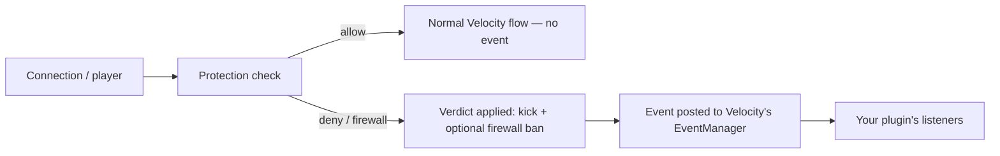

# Plugin API

NitroCord exposes a small, read-only event API for Velocity plugins in `com.nitrocord.api`. It lets your plugin observe what the protection engine is doing — every denied connection, every firewall ban, every attack-mode transition — so you can log it, alert staff, feed a dashboard, or mirror bans into your own systems.

::: warning Informational only
The API is **observational**. Every event fires *after* the action has been applied — the connection is already closed, the firewall rule already installed, attack mode already toggled. Listeners cannot cancel, veto or modify anything, and nothing reachable from an event mutates NitroCord's state. There is intentionally no API for allowing traffic through: protection decisions belong to NitroCord alone.
:::



Events are posted through Velocity's normal `EventManager` — subscribe with `@Subscribe` exactly like any built-in Velocity event. No plugin dependency declaration is needed: NitroCord is the proxy itself, so the API classes are always present at runtime.

::: info License required
Events only fire while a valid license keeps the protection engine enabled. In community mode every check short-circuits to vanilla behavior, so no events are produced.
:::

## The `Verdict` enum

`com.nitrocord.api.Verdict` — the outcome of a single protection check:

| Constant | Meaning |
| -------- | ------- |
| `ALLOW` | The connection or player passed the check and may proceed. |
| `DENY` | The connection or player was denied (disconnected). |
| `FIREWALL` | The connection or player was denied **and** the address was firewalled. |

`ALLOW` never appears in an event — allowed traffic produces no events. In events you will only ever see `DENY` or `FIREWALL`.

## `NitroVerdictEvent`

`com.nitrocord.api.events.NitroVerdictEvent` — fired whenever a protection check denies or firewalls a connection or player, at any stage (ping, handshake, login, in-game packets, chat).

| Method | Returns |
| ------ | ------- |
| `getAddress()` | `InetAddress` — the remote address the verdict applies to. |
| `getUsername()` | `@Nullable String` — the player's username, or `null` if the verdict happened before login (e.g. a rate-limited ping or connection). |
| `getCheckName()` | `String` — the check that produced the verdict (see the table below). |
| `getVerdict()` | `Verdict` — `DENY` or `FIREWALL`, never `ALLOW`. |
| `getReason()` | `String` — human-readable description of why the check fired. |

A `FIREWALL` verdict produces **two** events: the `NitroFirewallEvent` for the ban itself, immediately followed by the `NitroVerdictEvent` carrying `Verdict.FIREWALL`.

## `NitroFirewallEvent`

`com.nitrocord.api.events.NitroFirewallEvent` — fired when an address is added to or removed from the firewall. Removals include automatic expiries when a ban's time runs out.

| Method | Returns |
| ------ | ------- |
| `getAddress()` | `InetAddress` — the firewalled address. |
| `getReason()` | `String` — why the address was firewalled (`manual` for `/nc firewall add`; empty on removals). |
| `getBanSeconds()` | `long` — how long the ban lasts, in seconds (`0` on removal events). |
| `isAdded()` | `boolean` — `true` if the address was added, `false` if it was removed or its ban expired. |

## `NitroAttackModeEvent`

`com.nitrocord.api.events.NitroAttackModeEvent` — fired when the global attack mode toggles: engaged when the proxy-wide connection rate reaches `[attack] activate-connections-per-second`, disengaged after the rate stays below it for `deactivate-delay-seconds`.

| Method | Returns |
| ------ | ------- |
| `isAttackMode()` | `boolean` — `true` if attack mode engaged, `false` if it disengaged. |
| `getConnectionsPerSecond()` | `int` — the proxy-wide new-connections-per-second rate measured at the moment of the transition. |

## Check names

`NitroVerdictEvent.getCheckName()` is one of these stable identifiers, each governed by a section of `protection.toml`:

| Check name | Triggered by | Config section |
| ---------- | ------------ | -------------- |
| `ratelimit` | Per-IP connection or ping rate limit exceeded | `[ratelimit]` |
| `reconnect` | Join without the required prior ping/connect verification | `[reconnect]` |
| `accounts` | More distinct nicknames from one IP than allowed | `[accounts]` |
| `nickname` | Username contains a blacklisted bot substring | `[nickname]` |
| `fastchat` | Chat or command sent too quickly after joining | `[fastchat]` |
| `password` | One password shared by too many nicknames from the IP | `[password]` |
| `country` | Player's GeoIP country is blacklisted | `[country]` |
| `antivpn` | Address on a proxy/VPN/Tor blocklist or flagged by an online check | `[antivpn]` |
| `packets` | Malformed packets or packet-flood violation score exceeded | `[packets]` |
| `tcp-fingerprint` | TCP header fingerprint matches a bot or proxy stack | `[tcp-fingerprint]` |
| `proxy-rtt` | Handshake round-trip time inconsistent with in-game ping | `[proxy-rtt]` |
| `name-pattern` | Username matches a repeating bot join pattern | `[name-checks]` |
| `strange-name` | Username looks randomly generated | `[name-checks]` |
| `timeout-flood` | Repeated connections stalling until the read timeout | `[timeout-flood]` |
| `dns-check` | Handshake host is a bare IP instead of your domain during attack mode | `[dns-check]` |
| `log4shell` | Chat, command or book contains a Log4Shell `${...}` JNDI lookup | `[exploits]` |
| `tab-exploit` | Tab-completion flood or exploit payload | `[exploits]` |
| `firewall` | Address already on the firewall, blocked at the gate | `[firewall]` |

## Example: a staff-alert plugin

A complete, working Velocity plugin that subscribes to all three events: it logs every verdict and sends an in-game alert to staff holding the `nitroalerts.view` permission when an address is firewalled or attack mode toggles.

```java
package com.example.nitroalerts;

import com.google.inject.Inject;
import com.nitrocord.api.Verdict;
import com.nitrocord.api.events.NitroAttackModeEvent;
import com.nitrocord.api.events.NitroFirewallEvent;
import com.nitrocord.api.events.NitroVerdictEvent;
import com.velocitypowered.api.event.Subscribe;
import com.velocitypowered.api.event.proxy.ProxyInitializeEvent;
import com.velocitypowered.api.plugin.Plugin;
import com.velocitypowered.api.proxy.Player;
import com.velocitypowered.api.proxy.ProxyServer;
import net.kyori.adventure.text.Component;
import net.kyori.adventure.text.format.NamedTextColor;
import org.slf4j.Logger;

@Plugin(
    id = "nitroalerts",
    name = "NitroAlerts",
    version = "1.0.0",
    description = "Logs NitroCord verdicts and alerts staff",
    authors = {"YourNetwork"}
)
public final class NitroAlertsPlugin {

  private static final String ALERT_PERMISSION = "nitroalerts.view";

  private final ProxyServer server;
  private final Logger logger;

  @Inject
  public NitroAlertsPlugin(final ProxyServer server, final Logger logger) {
    this.server = server;
    this.logger = logger;
  }

  @Subscribe
  public void onProxyInitialize(final ProxyInitializeEvent event) {
    // Velocity automatically registers the plugin class as a listener,
    // and NitroCord posts its events to the same EventManager — there
    // is nothing else to wire up.
    this.logger.info("NitroAlerts is listening for NitroCord protection events.");
  }

  @Subscribe
  public void onVerdict(final NitroVerdictEvent event) {
    // Fires for every denied or firewalled connection. Never fires for ALLOW.
    // getHostAddress() returns the numeric IP without a reverse DNS lookup.
    this.logger.info("[nitrocord] {} verdict for {}{}: {}",
        event.getCheckName(),
        event.getAddress().getHostAddress(),
        event.getUsername() == null ? " (pre-login)" : " (player " + event.getUsername() + ")",
        event.getReason());
    if (event.getVerdict() == Verdict.FIREWALL) {
      // The matching NitroFirewallEvent has already fired with the ban details.
      this.logger.info("[nitrocord] {} was also firewalled.", event.getAddress().getHostAddress());
    }
  }

  @Subscribe
  public void onFirewall(final NitroFirewallEvent event) {
    if (!event.isAdded()) {
      return; // Removals and automatic ban expiries — not alert-worthy here.
    }
    this.alertStaff(Component.text()
        .append(Component.text("[NitroCord] ", NamedTextColor.LIGHT_PURPLE))
        .append(Component.text(event.getAddress().getHostAddress(), NamedTextColor.WHITE))
        .append(Component.text(" firewalled for " + event.getBanSeconds() + "s: ",
            NamedTextColor.GRAY))
        .append(Component.text(event.getReason(), NamedTextColor.WHITE))
        .build());
  }

  @Subscribe
  public void onAttackMode(final NitroAttackModeEvent event) {
    if (event.isAttackMode()) {
      this.alertStaff(Component.text("[NitroCord] Attack mode engaged at "
          + event.getConnectionsPerSecond() + " connections/s.", NamedTextColor.RED));
    } else {
      this.alertStaff(Component.text("[NitroCord] Attack mode disengaged.", NamedTextColor.GREEN));
    }
  }

  private void alertStaff(final Component message) {
    this.server.getConsoleCommandSource().sendMessage(message);
    for (final Player player : this.server.getAllPlayers()) {
      if (player.hasPermission(ALERT_PERMISSION)) {
        player.sendMessage(message);
      }
    }
  }
}
```

Drop the compiled jar into `plugins/` and grant the alert permission to staff:

```text
lpv group staff permission set nitroalerts.view
```

::: details Build setup: dependency and `velocity-plugin.json`
The NitroCord proxy jar contains both the Velocity API and `com.nitrocord.api`, so the simplest setup is one compile-only dependency on the jar you run:

```kotlin
dependencies {
    // Or use your normal velocity-api dependency and add the NitroCord jar
    // for the com.nitrocord.api classes. Never shade either into your jar.
    compileOnly(files("libs/NitroCord-<version>-all.jar"))
}
```

`velocity-plugin.json` is generated at build time from the `@Plugin` annotation by Velocity's annotation processor. Written by hand, the equivalent of the example above is:

```json
{
  "id": "nitroalerts",
  "name": "NitroAlerts",
  "version": "1.0.0",
  "description": "Logs NitroCord verdicts and alerts staff",
  "authors": ["YourNetwork"],
  "main": "com.example.nitroalerts.NitroAlertsPlugin"
}
```

No `dependencies` entry is needed — NitroCord is the proxy, not a plugin, so its classes are always on the classpath.
:::

## Rules for listeners

- **Never block.** NitroCord posts events with `EventManager.fireAndForget`, so handlers run on Velocity's shared async event executor. Blocking, sleeping or doing I/O (databases, HTTP, files) inside a handler delays event delivery for every plugin. Hand heavy work off to `server.getScheduler()` or your own executor.
- **Events are immutable snapshots.** They capture the moment the verdict was applied; by the time your handler runs, the connection is already gone and game state may have moved on. Treat the values as a record, not a live reference.
- **No cancellation.** None of the events are cancellable. If you need to exempt an address, use the `whitelist` lists in `protection.toml` — not a plugin.
- **Expect volume.** During a real flood, verdict events can fire hundreds of times per second. Keep handlers cheap and aggregate before alerting, or your alert channel becomes the second flood.

## Next steps

- [Command Reference](/nitrocord/user-guide/cli) — the `/nitrocord` admin command for stats, reloads and manual firewall entries.
- [Quick Start](/nitrocord/getting-started/quick-start) — tune the checks your plugin will be observing.
- [Licensing](/nitrocord/getting-started/licensing) — community mode disables protection, and with it these events.
