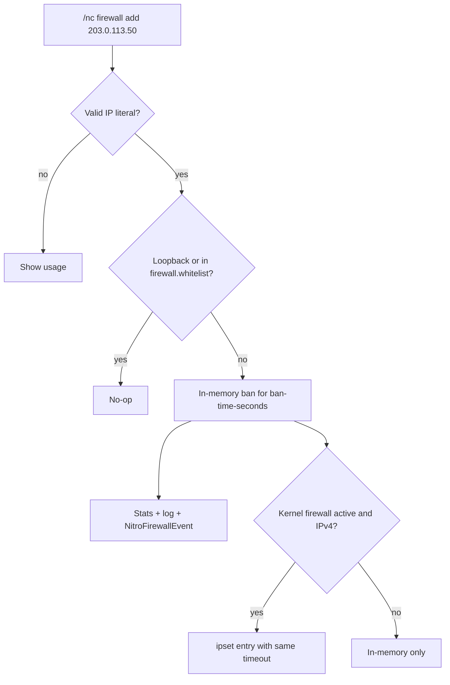

# Command Reference

NitroCord ships one administration command, `/nitrocord` (alias `/nc`), registered by the proxy itself. It works identically from the server console and in-game, and covers the three things you need while watching the proxy: protection statistics, configuration reloads, and manual firewall entries.

::: info Permission
Every subcommand requires `nitrocord.admin`. The console always has it; in-game, grant it with your permission plugin (e.g. `lpv user <you> permission set nitrocord.admin`). Senders without the permission see the configured `messages.no-permission` message, not Velocity's generic unknown-command error.
:::

Running `/nitrocord` with no arguments prints the subcommand list:

```text
NitroCord » commands
  /nitrocord stats - show protection statistics
  /nitrocord reload - reload the configuration
  /nitrocord firewall add <ip> - add an address to the firewall
  /nitrocord firewall remove <ip> - remove an address from the firewall
```

All output goes through the messages in `nitrocord.toml`, so the pink/white theme shown here is just the default — recolor or reword every line under `[messages]` and `[theme]`.

---

## `/nitrocord stats`

```text
/nc stats
```

Prints the global protection counters, all measured since the proxy started:

```text
NitroCord » Protection statistics
  Total pings: 1284407
  Pings per second: 31
  Total connections: 84312
  Connections per second: 47
  Blocked connections: 3918
  Firewalled addresses: 261
```

| Line | Meaning |
| ---- | ------- |
| `Total pings` | Server list pings received since start. |
| `Pings per second` | Pings within the current one-second window. |
| `Total connections` | Login connections received since start. |
| `Connections per second` | Connections within the current one-second window — the value attack mode watches (engages at `[attack] activate-connections-per-second`, default 40). |
| `Blocked connections` | Connections or players denied by any protection check since start. |
| `Firewalled addresses` | Addresses added to the firewall since start (automatic bans and `/nc firewall add`). |

**When to use:** the first command you run when something feels off. During an attack, `Connections per second` and the two blocked counters climb in real time; in quiet periods they confirm the proxy sees normal traffic.

::: tip
Counters reset on restart. The header and line format are the `stats-header` and `stats-line` messages in `nitrocord.toml` if you want to retheme them.
:::

---

## `/nitrocord reload`

```text
/nc reload
```

```text
NitroCord » Configuration reloaded.
```

Re-reads `nitrocord.toml` and `protection.toml` from disk and re-applies them to the stateful protection services (GeoIP, anti-VPN, MOTD cache, verified-IP whitelist). A broken file falls back to the bundled defaults with an error in the console — reload never crashes the proxy.

**Applies immediately, no restart needed:**

- Every threshold, toggle and list in `protection.toml` — rate limits, attack-mode thresholds, violation strikes, packet scoring, check toggles, and `ban-time-seconds` for **new** bans
- Branding, theme colors and every message in `nitrocord.toml`
- GeoIP — a new MaxMind key, country blacklist or database setting
- Anti-VPN — blocklists, online-check keys, cache settings
- MOTD caching, custom MOTDs and fake-player settings
- Verified-IP whitelist settings

**Requires a proxy restart:**

- `license-key` — the license is verified once at startup
- `firewall.ipset` — the kernel ipset/iptables integration is set up once at startup
- Anything in `velocity.toml` — that file is not NitroCord's; use `/velocity reload` for it

::: tip
`/velocity reload` also reloads both NitroCord TOMLs (it calls the same reload path before firing Velocity's `ProxyReloadEvent`), so either command works for NitroCord config changes.
:::

---

## `/nitrocord firewall add <ip>`

```text
/nc firewall add 203.0.113.50
```

```text
NitroCord » 203.0.113.50 added to the firewall.
```

Manually bans an address, using the exact same mechanism as automatic bans:

- The address is banned **in memory** for `[firewall] ban-time-seconds` (default `60`) — change that key in `protection.toml` and `/nc reload` to adjust it.
- When the [kernel firewall](/nitrocord/getting-started/installation) is active (Linux, root, `ipset`/`iptables`, `firewall.ipset = true`) and the address is IPv4, an `ipset` entry with the same timeout is queued, so packets are dropped before they reach the proxy at all.
- The ban is counted in `/nc stats`, written to the log with the reason `manual`, and announced to plugins through `NitroFirewallEvent`.



::: warning IP literals only
The argument must be a literal IP address — hostnames are rejected (the command never resolves DNS) and invalid input prints the usage list. Loopback addresses and IPs in `[firewall] whitelist` can never be firewalled; the confirmation is shown regardless, but the firewall itself skips them. Bans always expire after `ban-time-seconds` — there is no permanent-ban subcommand.
:::

---

## `/nitrocord firewall remove <ip>`

```text
/nc firewall remove 203.0.113.50
```

```text
NitroCord » 203.0.113.50 removed from the firewall.
```

Lifts a ban early: clears the in-memory state and, when the kernel firewall is active, queues the `ipset` removal. The removal is announced to plugins through `NitroFirewallEvent`.

**When to use:** false positives — a legitimate player firewalled by an aggressive check, or an address you banned by mistake. If a source keeps getting banned legitimately, exempt it in `[firewall] whitelist` instead of repeatedly removing it.

---

## Console vs in-game

Both work the same; the differences are practical:

- **Console** — always permitted, no permission plugin needed. Best during an attack, when you may not be able to join. Type the command without the slash: `nitrocord stats`.
- **In-game** — needs `nitrocord.admin`; output rendered in the pink/white theme. Best for watching `stats` while playing or testing checks with a second account.

---

## Common workflows

### Investigating an ongoing attack

1. The console logs `attack mode engaged` once the connection rate crosses the threshold — or you notice join lag.
2. `nitrocord stats` — watch `Connections per second`, `Blocked connections` and `Firewalled addresses` climb. If blocked ≈ total, protection is absorbing the flood.
3. Check `logs/latest.log` for `Firewalled <ip> for 60 seconds: <reason>` and `Blocked <ip> (<name>): <reason>` lines to see which checks are firing.
4. For an offender that keeps retrying without tripping an automatic ban: `nitrocord firewall add <ip>`.
5. Re-run `stats`; when `Connections per second` drops back under the threshold, attack mode disengages after `[attack] deactivate-delay-seconds` (default 60) quiet seconds.

### Handling a false positive

1. A player reports being kicked — find the `Blocked <ip> (<name>): <reason>` line in the log to identify the check and reason.
2. `nitrocord firewall remove <ip>` if they were firewalled.
3. Tune the responsible check in `protection.toml` (or exempt the address in the relevant `whitelist` list), then `nitrocord reload`.

---

## Next steps

- [Plugin API](/nitrocord/user-guide/api) — react to verdicts, firewall bans and attack mode from your own Velocity plugin.
- [Quick Start](/nitrocord/getting-started/quick-start) — the five `protection.toml` tweaks most admins make first.
- [Installation](/nitrocord/getting-started/installation) — kernel firewall prerequisites and post-install verification.
