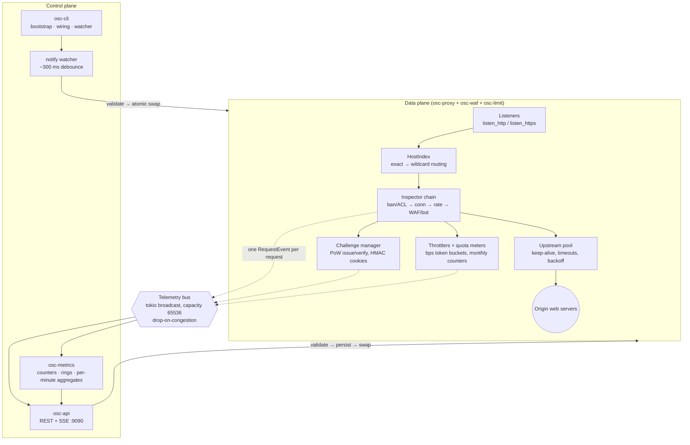
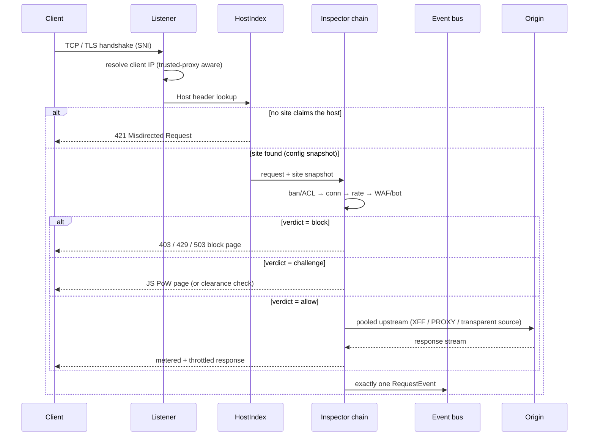

# Architecture Overview

OpenShield-L7 is a single Rust binary built as a workspace of seven crates. The data plane (listeners, routing, inspection, forwarding) is fully async on tokio; the control plane (admin API, metrics, config watching) shares the same runtime and talks to the data plane over a broadcast event bus.

---

## Crate layout

The workspace under `crates/` separates the contract, the data plane, and each concern into its own crate:

| Crate | Role |
|---|---|
| `osc-core` | Contract: config models, events, state, pipeline traits, challenge, client-IP resolution |
| `osc-proxy` | Data plane: listeners, TLS/SNI, routing, upstream forwarding, transparent mode |
| `osc-waf` | Content/bot inspector (sqli / xss / traversal / rce / scanner / bot / custom rules) |
| `osc-limit` | Bans, ACLs, conn/rate limits, quotas, throttles, auto-mitigation |
| `osc-metrics` | Event-bus consumer: counters, ring buffers, aggregates, analytics |
| `osc-api` | Admin REST + SSE API |
| `osc-cli` | The `openshield-l7` binary: wiring, config dir, hot reload |

Shared dependency versions are pinned once in the workspace `Cargo.toml` (`dep.workspace = true` in members). Key libraries: `tokio` (multi-thread runtime), `hyper` 1.x (HTTP), `rustls` (TLS), `regex` (linear-time WAF matching), `notify` (file watcher), `arc-swap` (lock-free config snapshots), `serde_yaml`.

---

## Components



| Component | Responsibility |
|---|---|
| **Listeners** | Accept TCP on `listen_http` / `listen_https`; TLS terminated with per-site certs selected by SNI. Unknown SNI aborts the handshake. |
| **HostIndex** | Case-insensitive host map; exact match first, then longest-suffix wildcard; no match → `421`. |
| **Inspector chain** | Ordered, first non-`Allow` verdict wins: ban check + IP ACL → connection limits → rate limits → WAF/bot rules. Cheap stateless drops run first. |
| **Challenge manager** | Issues self-authenticating PoW seeds (`timestamp ‖ random ‖ HMAC`), verifies solves, mints/validates `osc_clear` clearance cookies. Stateless — the only secret is `data/challenge.secret`. |
| **Upstream pool** | Pooled keep-alive connections per site (`max_idle_per_host`, `keepalive_secs`), connect/read timeouts, 502-with-backoff on origin failure. |
| **Throttlers / quota meters** | Token buckets for `max_site_bps` / `max_ip_bps` shaping the response stream; monthly byte counters persisted under `data/quotas/` (atomic tmp+rename). |
| **Metrics engine** | Bus consumer: global + per-site counters, recent-event ring buffers, per-minute aggregate series, analytics tops/percentiles. |
| **Admin API** | REST + SSE on `admin.listen`; role-gated; writes go through the config store to disk, then hot-apply. |
| **Watcher** | Debounced `notify` on `config.yaml` + `sites.d/`; per-file reparse with last-good isolation. |

---

## Request data flow



Every request — allowed, blocked, challenged, errored — produces **exactly one** telemetry event. That invariant is what makes the stats endpoints exact and the SSE stream complete.

---

## Threading model

One `tokio` multi-thread runtime (`new_multi_thread`, threads named `openshield-l7`). Long-running tasks, spawned in this order at startup:

1. **`MetricsEngine`** — started first, so no bus events are missed.
2. **`LimitEngine::run_maintenance`** — ban expiries, quota resets, mitigation windows; started before the proxy accepts traffic so connection gauges pair from the start.
3. **`ProxyServer`** — all listeners and per-connection tasks.
4. **`osc_api::serve`** — admin REST + SSE.
5. **The hot-reload watcher** — debounced `notify` task.

Shutdown is a `watch` channel broadcast: `SIGTERM`/`SIGINT` flips it, the proxy and API stop accepting and drain (bounded at 10 s), maintenance and watcher are aborted, exit code `0`. If the proxy or API task dies on its own (bind failure), the process exits `1`.

Concurrency properties worth knowing:

- **Config snapshots are `ArcSwap`-published.** A request pins the site config snapshot it started on; a hot reload swaps the pointer — in-flight requests finish on the old config, new requests see the new one. No locks on the request path.
- **The event bus is a tokio broadcast channel** (default capacity 65536). Slow consumers drop events rather than applying backpressure to the data plane — telemetry never blocks proxying.
- **Per-IP/per-site limiter state** lives in `osc-limit` with counters preserved across reloads for unchanged rules; connection gauges are paired per request (`conn_bumped_*` flags) so releases exactly match takes.

---

## On-disk layout

```text
<root>/                                 (--root, default ".")
├── config.yaml                         global config — watched
├── sites.d/
│   ├── <site>.yaml                     one file per site — watched, per-file isolation
│   └── example.yaml.disabled           template written when empty at bootstrap
├── certs/<site>/{fullchain,privkey}.pem
└── data/
    ├── challenge.secret                HMAC secret for PoW seeds + clearance cookies (0600)
    ├── quotas/                         monthly quota counters (atomic tmp+rename)
    └── snapshots/                      runtime state snapshots
```

The production install maps this onto `/etc/openshield-l7` with the binary at `/usr/local/bin/openshield-l7` — see [Installation](../getting-started/installation.md).

---

## Design invariants

- **The proxy never hosts content.** The only originated bytes are block pages, challenge pages, and the admin API.
- **Fail isolated, not open or closed.** A broken site file affects only that file; origin failure means 502-with-backoff for that site, never a panic.
- **Telemetry is lossy by design** under congestion; the data plane is never slowed by observability.
- **Files are the source of truth.** The API is a validated writer to the same files, not a parallel config store.

## See also

- **[Transparent Client IP →](./transparent-ip.md)** — `IP_TRANSPARENT` mechanics and routing setups.
- **[Testing & Benchmarks →](./testing.md)** — the e2e battery and attack simulation.
- **[Hot Reload →](../user-guide/hot-reload.md)** — the reload pipeline from the operator side.
