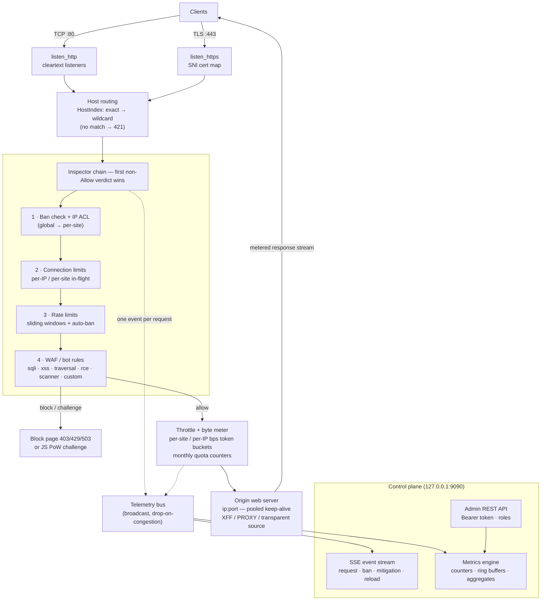

# OpenShield-L7

**An L7-protected reverse web proxy, written in Rust.** OpenShield-L7 is a *filter*: it sits in front of your destination web servers (`ip:port`), terminates ports 80/443, and forwards only clean traffic onward. It never hosts content itself — the only bytes it originates are block pages, challenge pages, and the admin API.

One binary (`openshield-l7`), one global config file, one YAML file per proxied site. No database, no external services.

<div class="tip custom-block" style="margin-top: 1.5rem;">

**🛡️ Built for PingLess Studios by [AnAverageBeing](https://github.com/AnAverageBeing)**
[GitHub Repo](https://github.com/AnAverageBeing/openshield-l7) (currently private) · `MIT License`

</div>

---

## Key Features

### 🌐 Hostname Routing on 80/443

Many sites share one pair of listeners. Exact and wildcard (`*.example.com`) host matching, case-insensitive, port- and trailing-dot-tolerant. SNI-based certificate selection on 443. Unknown hosts get `421` — bare-IP scanners never reach a site.

### 🔒 Optional Per-Site TLS

Per-site cert/key with SNI routing (HTTP/2 + HTTP/1.1), HTTP→HTTPS `308` redirect, optional HSTS. Sites without TLS config simply never get a cert.

### 🧱 L7 WAF

SQLi, XSS, path traversal, and RCE pattern sets, scanner/bad-UA blocking, heuristic bot scoring, plus per-site custom regex rules over URI / query / body / method / any header. All matching is linear-time (`regex` crate) — **no ReDoS**, and input is percent-decoded once before matching.

### 🚦 Rate + Connection Limits

Per-IP and per-site sliding-window request limits, concurrent in-flight connection caps, and automatic temp-bans with escalating durations for repeat offenders (doubling up to 24h). **Auto-mitigation** tightens all of a site's limits by a configured factor when its RPS crosses a threshold, renewing while the flood continues.

### 📋 Blacklists / Whitelists

A global ACL evaluated before any site logic, plus a per-site ACL. CIDRs or plain IPs, IPv4 and IPv6; the whitelist always wins.

### 🧩 JS Proof-of-Work Challenges

SHA-256 PoW page with HMAC-signed clearance cookies (`osc_clear`) and server-signed, self-authenticating seeds — fully stateless: the server keeps nothing per client. Modes: `off` / `auto` (verdict-driven) / `on` (challenge everything).

### 📊 Monthly Quotas + Speed Caps

Per-site monthly byte quotas (persisted to disk, reset on a configurable day of month; over-quota sites serve `509` or drop connections) plus sustained bytes/sec token-bucket caps per site and per client IP.

### 🕵️ Transparent Client-IP Forwarding

Five forward modes (`none` / `X-Forwarded-For` / `X-Real-Ip` / `Forwarded` / custom header), HAProxy PROXY protocol v1/v2, and a Linux `IP_TRANSPARENT` mode where the origin's socket table shows the **real client IP** with zero origin configuration. Trusted-proxy-aware resolution walks the XFF chain right-to-left.

### 🔥 Hot-Reload Per-Site Configs

A file watcher re-parses only the changed file (~300 ms debounce). A broken edit never affects other sites — the last good config keeps serving for the broken one. API writes and file edits are the same pipeline.

### 📡 Token-Secured Admin API + SSE

REST control surface and a live Server-Sent Events telemetry stream on `127.0.0.1:9090`, role-gated (admin / operator / readonly), with deep per-site analytics: top IPs/paths/UAs/rule hits, latency percentiles, and per-minute RPS/bandwidth series.

---

## Quick Start

```bash
cargo build --release && ./target/release/openshield-l7 run
```

First run writes a documented default `config.yaml` and prints one admin token — **once**. Add a site file, and you're proxying. The full 30-second path is in [Quick Start](./getting-started/quick-start.md).

---

## Architecture



### One Request's Path

Listener → resolve client IP (trusted-proxy aware) → hostname → site config snapshot → inspector chain (first non-`Allow` verdict wins) → challenge page / block page, or forward to the origin over a pooled keep-alive connection with byte metering and throttling applied to the response stream. Every request produces exactly one telemetry event on the bus, consumed by the metrics engine, the REST analytics endpoints, and the SSE stream.

---

## Comparison

Factual positioning against the two common self-hosted alternatives: **nginx + ModSecurity (CRS)** and a **hand-assembled Cloudflare-free stack** (nginx + fail2ban + limit_req + scripts).

| Capability | OpenShield-L7 | nginx + ModSecurity | Cloudflare-free DIY stack |
|---|---|---|---|
| Deployment | One Rust binary, one global YAML + one YAML per site | nginx + module + CRS ruleset + tuning | nginx + fail2ban + cron + scripts |
| WAF engine | Fixed pattern families + custom rules, linear-time regex (no ReDoS) | OWASP CRS on PCRE — powerful but ReDoS-prone, heavy FP tuning | Whatever you wire together |
| Rate limiting | Per-IP + per-site sliding windows, escalating auto-bans, RPS-triggered auto-mitigation | `limit_req` fixed zones; no auto-ban, no auto-tightening | `limit_req` + fail2ban regexes on logs (seconds of lag) |
| Bot challenges | Built-in stateless JS proof-of-work with HMAC clearance cookies | None built in | External (e.g. Anubis, custom pages) |
| Client-IP forwarding | 5 header modes + PROXY v1/v2 + `IP_TRANSPARENT` (origin sees real IP, zero origin config) | XFF headers only | XFF (+ PROXY with extra modules) |
| Bandwidth quotas | Monthly per-site byte quotas, persisted, 509/close on exceed | Not built in | Not built in |
| Speed caps | Sustained bps token buckets per site and per IP | `limit_rate` per connection only | `limit_rate` per connection only |
| Hot reload | Per-file, validated, failure-isolated, atomic swap; API and file edits are one pipeline | Full config reload; one bad file breaks the whole reload | Same as nginx |
| Admin surface | Token REST API + SSE events + per-site analytics (tops, latency percentiles, series) | Access logs | Access logs + your own parsing |
| Content hosting | Never — reverse proxy only | Yes (it's a web server) | Yes |
| Maturity | New, small codebase you can read end-to-end | Battle-tested everywhere | Varies |

> **Bottom line:** if you want a focused L7 filter in front of existing web servers — with challenges, quotas, transparent client IP and a live API built in rather than bolted on — OpenShield-L7 replaces a pile of moving parts with one binary. If you need a general-purpose web server or a decade of CRS rule coverage, nginx + ModSecurity remains the incumbent.

---

## Verified Numbers

From the automated e2e + attack battery ([Testing & Benchmarks](./architecture/testing.md), `testing/RESULTS.md`):

| Metric | Result |
|---|---|
| Unit tests | **215 passed** (`cargo test --workspace`) |
| E2E battery | **85 / 85 passed** (routing, TLS/SNI, XFF modes, WAF, limits, PoW, quotas, API roles, hot reload, bans, SSE, keep-alive, WebSocket, PROXY v1/v2, transparent mode, graceful shutdown) |
| Attack scenarios | **8 / 8 passed** (HTTP flood ×2, random-Host flood ×2, POST flood, slowloris, WAF sweep, XFF spoofing) |
| HTTP flood absorbed | **152,735 rps** loopback, 100% 429 — benign site kept 100% 200 at p95 2.3 ms |
| Random-Host flood | **150,426 rps** → 100% 421, legitimate site untouched |
| Proxied throughput (loopback, protections ON) | **67,666 rps** (p50 0.66 ms, p99 1.88 ms, zero errors in 541,881 requests) |

---

## Next Steps

- **[Installation →](./getting-started/installation.md)** — Build, systemd, sysctls, verification.
- **[Quick Start →](./getting-started/quick-start.md)** — Proxying a site in 30 seconds.
- **[Configuration Reference →](./configuration/reference.md)** — Every config value, every default.
- **[CLI Reference →](./user-guide/cli.md)** — `run` / `validate` / `gen-token` / `gen-cert`.
- **[Admin API →](./user-guide/api.md)** — Auth, roles, every endpoint, SSE.
- **[Architecture →](./architecture/overview.md)** — Crates, data flow, threading, event bus.
- **[Transparent Client IP →](./architecture/transparent-ip.md)** — `IP_TRANSPARENT` deep dive.
