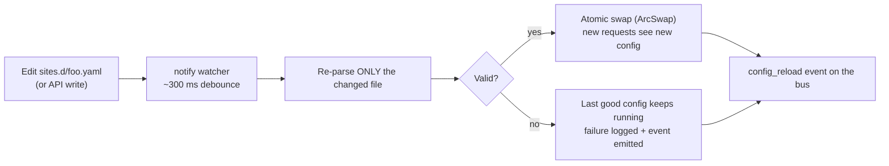

# Hot Reload

OpenShield-L7 never needs a restart for config changes. A filesystem watcher (`notify`) watches `sites_dir` **and** `config.yaml`, debounced to ~300 ms, and every change goes through the same validate → persist → apply pipeline whether it came from an editor or the admin API.

---

## The file lifecycle



### Changed site file

Only that file is re-parsed and validated. On success the new config is swapped in atomically (`ArcSwap`): in-flight requests finish on the old snapshot, new requests see the new one — no downtime. Inspectors and throttlers are rebuilt; **limiter counters for unchanged rules are preserved** (a reload doesn't reset someone's rate-limit window).

### Invalid edit — failure isolation

A YAML error, a bad regex, a missing cert — the failure is logged and the **last good config keeps running**. One bad file never affects other sites; a broken file at startup is skipped the same way (logged, other files still load). This is the core promise: you can edit production files live without taking unrelated sites down.

Watch the failure surface in real time:

```bash
curl -sN -H "Authorization: Bearer $TOKEN" http://127.0.0.1:9090/api/v1/events/stream
# data: {"kind":"config_reload","applied":[],"failed":[["sites.d/broken.yaml","origin.url: 'http://': missing host"]]}
```

### The reload event

Every reload finishes with a `config_reload` event on the bus:

```json
{"kind": "config_reload",
 "applied": ["site-id", "..."],
 "failed": [["sites.d/bad.yaml", "yaml error: ..."]]}
```

Also returned synchronously by `POST /api/v1/reload`. A non-empty `failed` array is the alert worth wiring into a dashboard or notification — it means "an edit did not take."

### Deleted site file

The site is disabled (its runtime is kept for stats) or removed, depending on how it disappeared. `DELETE /api/v1/sites/{id}` removes both the file and the live registry entry.

### `config.yaml` changes

Validated, then hot-applied. Two caveats:

- **Listener addresses, `data_dir`, `sites_dir`** apply to new connections / next restart — the process does not rebind sockets or move directories at runtime.
- **Admin tokens** are re-read from the live config on every request, so rotation is instant for new requests; already-accepted admin/API connections keep the old view.

### Site `id` assignment

A new file with `id: ""` (or omitted) gets a uuid assigned by the loader, and the file is **rewritten with it** (atomic tmp+rename). The id is what API paths, metrics, and events reference.

---

## API writes vs file edits — one pipeline

The admin API mutates the same files through the config store (validate → write `tmp` + atomic `rename` → hot-apply):

| API call | File effect |
|---|---|
| `POST /api/v1/sites` | New `sites.d/<id>.yaml` (id assigned if empty, file rewritten with it) |
| `PUT /api/v1/sites/{id}` | Full replace of that file |
| `PATCH /api/v1/sites/{id}` | JSON merge-patch applied over the current config, result persisted |
| `DELETE /api/v1/sites/{id}` | File removed; site removed from the live registry |
| `POST /api/v1/sites/{id}/enable` / `disable` | Flips `enabled:` in the file |
| `PUT /api/v1/global` | Replaces `config.yaml` (validated first) |

A validation failure anywhere returns **all** collected errors (HTTP 400 with a `details` array) and leaves the running config untouched.

The interplay to remember:

- **Files are the source of truth.** API writes persist to disk immediately; a file edit and an API write race on the same lock-free swap — last valid write wins.
- **Out-of-band sync** (rsync, Ansible, git pull into `sites.d/`) is picked up by the watcher like any edit. If you want an explicit barrier after a batch copy, call `POST /api/v1/reload` and inspect the report.
- **Cert rotation** is a file event too: write the new PEMs, touch the site file (or call `/reload`) — new TLS connections use the new cert. The SNI cert map also rebuilds hourly on its own.

---

## Operator checklist

```bash
# 1. Validate before/after edits, without touching the running proxy
openshield-l7 validate --root /etc/openshield-l7

# 2. Force a full re-read after out-of-band changes
curl -s -X POST -H "Authorization: Bearer $TOKEN" http://127.0.0.1:9090/api/v1/reload

# 3. Watch what applied and what failed
curl -sN -H "Authorization: Bearer $TOKEN" http://127.0.0.1:9090/api/v1/events/stream | grep config_reload
```

::: warning
Hot reload covers **configuration**, not the binary. Upgrading the executable itself is a `systemctl restart` — see [Installation → Upgrade](../getting-started/installation.md#upgrade).
:::
