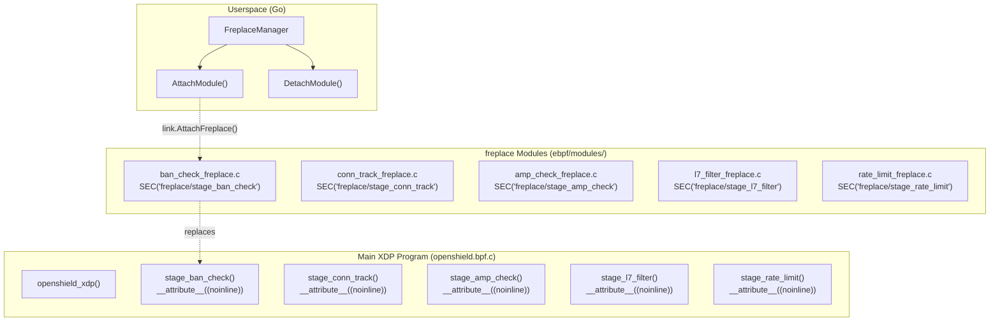

# freplace Hot-Patching

OpenShield-XDP supports **runtime replacement** of pipeline stages using the Linux kernel's `freplace` (function replace) BPF mechanism. This allows you to swap mitigation strategies, add debug telemetry, or test experimental filters **without unloading the XDP program** — meaning zero packet loss during the switch.

## How It Works

Five pipeline stages are declared as **`__attribute__((noinline))` global functions** in the main XDP program. These are real BPF subprograms with full BTF type information, making them eligible targets for `freplace`:

```c
// ebpf/headers/stages.h — declared as prototypes, implemented in openshield.bpf.c

int stage_ban_check(struct packet_info *info, const struct config *cfg,
                    u64 now, u8 wl_flags, struct ip6_key *v6_key);

int stage_rate_limit(struct ip_stats *stats, struct packet_info *info,
                     const struct config *cfg, u64 now_packed,
                     struct ip6_key *v6_key);

int stage_conn_track(struct ip_stats *stats, struct packet_info *info,
                     const struct config *cfg, u64 now);

int stage_amp_check(struct xdp_md *ctx, struct packet_info *info,
                    const struct config *cfg);

int stage_l7_filter(struct xdp_md *ctx, struct packet_info *info,
                    const struct config *cfg);
```

Each stage function:
- Returns `STAGE_PASS` (0) to continue the pipeline
- Returns `STAGE_DROP` (1) to signal the caller to drop the packet
- Is called from `openshield_xdp()` which handles profiling counters and global stats

## Architecture



## Requirements

| Requirement | Detail |
|-------------|--------|
| **Kernel version** | ≥ 5.11 (where `BPF_LINK_TYPE_FREPLACE` was stabilized) |
| **BTF** | `CONFIG_DEBUG_INFO_BTF=y` — provides type information needed to match function signatures |
| **libbpf** | ≥ 0.3 (for `bpf_link_create` with `BPF_F_REPLACE`) |
| **cilium/ebpf** | ≥ 0.11 (for `link.AttachFreplace`) |

::: warning Without BTF, freplace cannot work
The kernel needs BTF type info from both the target program and the replacement program to verify that function signatures match exactly. If your kernel was compiled without `CONFIG_DEBUG_INFO_BTF=y`, freplace is unavailable.
:::

## Go-Side: FreplaceManager

The `FreplaceManager` in `userspace/internal/bpf/freplace.go` handles the full lifecycle:

```go
// Create a manager tied to the main XDP program
fm := bpf.NewFreplaceManager(mainProg)

// Attach a replacement module (compiled .o file)
err := fm.AttachModule("stage_ban_check", "/opt/openshield/lib/freplace/stage_ban_check.o")

// List currently attached modules
modules := fm.ListModules()

// Detach a module (restores default implementation)
err = fm.DetachModule("stage_ban_check")

// Detach everything on shutdown
fm.Close()
```

### Attach Flow

1. Load the freplace `.o` file's BPF collection spec
2. Find the program with `SectionName == "freplace/<stage_name>"`
3. Create an `ebpf.Program` from the spec
4. Call [`link.AttachFreplace(mainProg, stageName, replacementProg)`](https://pkg.go.dev/github.com/cilium/ebpf/link#AttachFreplace)
5. Store the `FreplaceModule` in the manager's map

### Detach Flow

1. Close the `link.Link` (this detaches the replacement)
2. Close the replacement `ebpf.Program`
3. The original `__attribute__((noinline))` function resumes handling packets immediately

## Example: stage_ban_check Replacement

The working example in `ebpf/modules/ban_check_freplace.c` adds **ringbuf event emission** to every ban hit — useful for debugging ban decisions without modifying the main program:

```c
// ebpf/modules/ban_check_freplace.c
#include "../headers/common.h"
#include "../headers/config.h"
#include "../headers/stats.h"
#include "../headers/packet.h"
#include "../headers/events.h"
#include "../headers/maps.h"
#include "../headers/stages.h"

SEC("freplace/stage_ban_check")
int ban_check_v2(struct packet_info *info, const struct config *cfg,
                 u64 now, u8 wl_flags, struct ip6_key *v6_key)
{
    if (wl_flags & WL_SKIP_BAN)
        return STAGE_PASS;
    if (cfg->bans_empty)
        return STAGE_PASS;

    // ... same ban lookup logic as the default ...

    if (ban && ban->expiry > now) {
        // NEW: emit a ringbuf event on every ban hit
        struct event *ev = bpf_ringbuf_reserve(&events_map, sizeof(*ev), 0);
        if (ev) {
            ev->type      = EVENT_BAN_TRIGGERED;
            ev->ip        = info->src_ip;
            ev->timestamp = now;
            ev->value     = ban->score;
            ev->reason    = ban->reason;
            bpf_ringbuf_submit(ev, 0);
        }
        return STAGE_DROP;
    }
    return STAGE_PASS;
}

char _license[] SEC("license") = "GPL";
```

### Compile and Attach

```bash
# Compile the freplace module
make -C ebpf/modules

# Attach via the Go loader (or CLI)
openshield-cli freplace attach stage_ban_check \
    /opt/openshield/lib/freplace/ban_check_freplace.o

# Verify it's attached
openshield-cli freplace list
# Output:
#   stage_ban_check: ban_check_freplace.o (active)

# Detach to restore default
openshield-cli freplace detach stage_ban_check
```

## Benefits

| Benefit | Description |
|---------|-------------|
| **Zero-downtime updates** | Swap mitigation strategies without dropping a single packet. |
| **A/B testing** | Attach an experimental filter to one server, compare ban rates against the default. |
| **Debug telemetry** | Add ringbuf events to any stage without modifying the main XDP binary. |
| **Hot-fix deployment** | If a new attack pattern emerges, deploy a targeted L7 signature freplace module in seconds. |
| **Safe rollback** | Detach the module to instantly revert to the default behavior — no restart needed. |

## Current State

| Stage | Default (openshield.bpf.c) | freplace Example | Status |
|-------|---------------------------|-----------------|--------|
| `stage_ban_check` | Ban + subnet + prefix lookup | `ban_check_freplace.c` | ✅ Working example |
| `stage_conn_track` | SYN/ACK/RST tracking | — | Stub available |
| `stage_amp_check` | DNS + UDP reflection | — | Stub available |
| `stage_l7_filter` | Byte-pattern matching (slot 0) | — | Stub available |
| `stage_rate_limit` | Threshold + token bucket | — | Stub available |

::: tip Adding a new freplace module
1. Create `ebpf/modules/<stage>_freplace.c` with `SEC("freplace/stage_<name>")`
2. Add it to `ebpf/modules/Makefile`
3. Compile with `make -C ebpf/modules`
4. Attach via `FreplaceManager.AttachModule()`
:::

## Limitations

- **Signature must match exactly** — the replacement function must have the identical parameter list and return type as the original. BTF enforces this at attach time.
- **No freplace-on-freplace** — you cannot replace a replacement. Detach first, then attach the new one (the `FreplaceManager` handles this automatically).
- **Kernel ≥ 5.11 only** — older kernels do not support `BPF_LINK_TYPE_FREPLACE`.
- **Map access is shared** — freplace modules access the same pinned maps as the main program. A buggy replacement can corrupt shared state.
