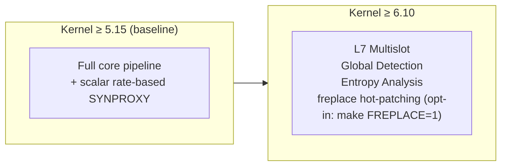

# Kernel Feature Gates

OpenShield-XDP uses **compile-time feature gates** to enable or disable functionality based on the running kernel version. This allows a single codebase to support kernels from 5.15 through 6.10+ while leveraging newer BPF features when available.

## How It Works

The top-level `Makefile` detects the running kernel version via `uname -r` and sets C preprocessor defines (`-D` flags) passed to both the eBPF compiler (clang) and the Go binding generator (bpf2go):

```makefile
# Makefile (top-level)
KERNEL_VER := $(shell uname -r | cut -d. -f1,2)
KERNEL_MAJOR := $(word 1,$(subst ., ,$(KERNEL_VER)))
KERNEL_MINOR := $(word 2,$(subst ., ,$(KERNEL_VER)))

BPF_FEATURES := -D__TARGET_ARCH_x86 -D_GNU_SOURCE

# Feature-specific gates added conditionally...
```

::: warning Build-time only
Feature gates are evaluated at **build time**, not at runtime. If you upgrade your kernel, you must **rebuild** OpenShield-XDP to enable newly available features. Running `uname -r` during the build determines what gets compiled in.
:::

## Feature Gates

### `OPENSHIELD_SYNPROXY`

| Property | Value |
|----------|-------|
| **Minimum kernel** | 5.15 (baseline minimum, not a special requirement) |
| **Detection** | `test $(KERNEL_MAJOR) -gt 5 -o \( $(KERNEL_MAJOR) -eq 5 -a $(KERNEL_MINOR) -ge 15 \)` |
| **What it gates** | Scalar, non-terminal SYN classification gate (rate-based) |
| **Compiles to** | `synproxy_check_listener()` — a scalar-only `__always_inline` hook |
| **Below threshold** | Compiles out entirely — SYN handling falls back to the rate limiter |

```c
// openshield.bpf.c
#ifdef OPENSHIELD_SYNPROXY
    if (synproxy_check_listener(ctx, &info, cfg) == STAGE_DROP)
        return XDP_DROP;
#endif /* OPENSHIELD_SYNPROXY */
```

**Why scalar-only?** The gate reads **only** pre-parsed scalar fields from `packet_info` — no packet-pointer access and no version-specific helpers (no `bpf_sk_lookup_tcp`, no cookie crypto, no `XDP_TX`). This guarantees it verifies and loads on **every** supported kernel (5.15 → latest) with zero user fixes. Actual SYN-flood mitigation is delivered by the per-IP `syn_pps_threshold` rate limiter. On kernels ≥ 6.10 an **opt-in** freplace module can hot-patch this hook to add richer listener verification.

### `OPENSHIELD_L7_MULTISLOT`

| Property | Value |
|----------|-------|
| **Minimum kernel** | 6.10 |
| **Detection** | `test $(KERNEL_MAJOR) -ge 7 -o \( $(KERNEL_MAJOR) -eq 6 -a $(KERNEL_MINOR) -ge 10 \)` |
| **What it gates** | L7 signature slots 1-15 (slot 0 is always available) |
| **Compiles to** | Full 16-slot unrolled loop |
| **Below threshold** | Only slot 0 is checked; slots 1-15 silently ignored |

```c
// Without OPENSHIELD_L7_MULTISLOT: single slot 0 check
// With OPENSHIELD_L7_MULTISLOT: #pragma unroll for (i = 0; i < 16; i++)
```

**Why kernel ≥ 6.10?** The 16-slot unrolled loop requires the BPF verifier to handle larger program sizes and more complex control flow. Kernel 6.10 relaxed verifier limits sufficiently for this pattern.

### `OPENSHIELD_GLOBAL_DETECT`

| Property | Value |
|----------|-------|
| **Minimum kernel** | 6.10 |
| **Detection** | Same as `OPENSHIELD_L7_MULTISLOT` (combined check) |
| **What it gates** | SYN/FIN ratio detection + entropy spoofing detection |
| **Compiles to** | `check_global_detection()` function call |
| **Below threshold** | No-op — global detection stage skipped |

```c
#ifdef OPENSHIELD_GLOBAL_DETECT
    check_global_detection(cfg, now);
#endif
```

**Why kernel ≥ 6.10?** Global detection uses `bpf_for_each_map_elem` for iterating entropy buckets and SYN/FIN counters, which requires kernel 5.13+. The 6.10 gate is conservative — it also covers the combined verifier complexity of global detection + entropy together.

### `OPENSHIELD_ENTROPY`

| Property | Value |
|----------|-------|
| **Minimum kernel** | 6.10 |
| **Detection** | Same combined check as `OPENSHIELD_GLOBAL_DETECT` |
| **What it gates** | Per-packet entropy bucket updates |
| **Compiles to** | `update_entropy_bucket()` function call |
| **Below threshold** | No-op |

```c
#ifdef OPENSHIELD_ENTROPY
    update_entropy_bucket(&info);
#endif
```

**Why kernel ≥ 6.10?** Per-packet entropy tracking uses `bpf_get_prandom_u32()` for bucket selection and requires spinlock-free per-CPU hash bucket updates. The verifier in older kernels would reject the complexity.

## Feature Gate Summary



| Feature Gate | Kernel | Feature |
|-------------|--------|---------|
| *(none required)* | 5.15+ | Core pipeline: MAC filter, parse, panic breaker, whitelist, ban check, validation, L4, UDP amp, IP stats, new-source flood, connection tracking, window reset, rate limiting |
| `OPENSHIELD_SYNPROXY` | 5.15+ | Scalar, rate-based SYN gate (no cookies, no helpers) |
| `OPENSHIELD_L7_MULTISLOT` | 6.10+ | L7 signature slots 1-15 |
| `OPENSHIELD_GLOBAL_DETECT` | 6.10+ | SYN/FIN ratio + entropy spoofing detection |
| `OPENSHIELD_ENTROPY` | 6.10+ | Per-packet entropy bucket tracking |

## Verification

### Check enabled features at build time

```bash
make ebpf
# Output:
# ==> Compiling eBPF program (kernel 6.8.0)
#     Features: -DOPENSHIELD_SYNPROXY
```

The Makefile prints which feature flags were detected and passed to the compiler.

### Check available features at runtime

```bash
openshield status --features
# Output:
#   Kernel: 6.8.0-45-generic
#   SYNPROXY: enabled
#   L7 Multislot: disabled (need kernel >= 6.10)
#   Global Detection: disabled (need kernel >= 6.10)
#   Entropy: disabled (need kernel >= 6.10)
```

The CLI reads the compiled-in feature set from the BPF program's BTF and reports which features are active.

## Upgrading Your Kernel

1. Upgrade the kernel package (e.g., `apt install linux-image-6.10-...`)
2. Reboot into the new kernel
3. **Rebuild OpenShield-XDP**:
   ```bash
   cd /opt/openshield/src
   make clean && make all
   ```
4. Restart the loader:
   ```bash
   systemctl restart openshield-loader
   ```

The rebuilt binary will auto-detect the new kernel version and enable all compatible features.

## Base Minimum

OpenShield-XDP requires **kernel ≥ 5.15** as the absolute minimum. Below 5.15, several core BPF features are unavailable:

- `BPF_MAP_TYPE_LRU_HASH` per-CPU pre-allocation improvements
- `bpf_ktime_get_boot_ns()` precision
- Various verifier improvements needed for the pipeline complexity

Attempting to build on a kernel below 5.15 will result in compilation errors.
