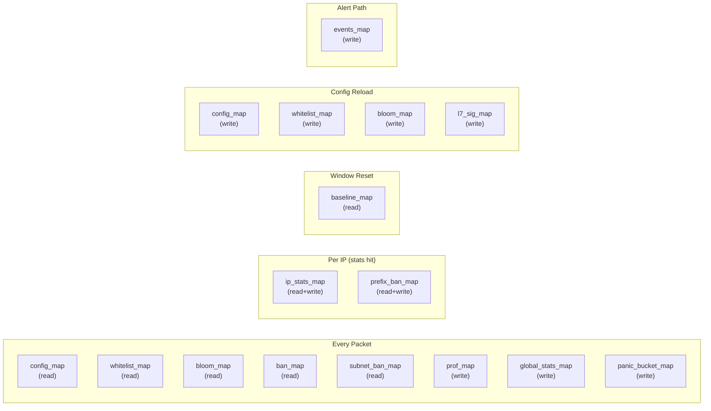

# Map Layout

OpenShield-XDP uses **20 pinned BPF maps** shared between the XDP data path (kernel) and the Go loader/alerter (userspace). All maps are pinned to `/sys/fs/bpf/openshield/` and survive loader restarts.

## Complete Map Catalog

### 1. Configuration Maps

#### `config_map`

| Property | Value |
|----------|-------|
| **Type** | `BPF_MAP_TYPE_ARRAY` |
| **Key** | `u32` (index 0) |
| **Value** | `struct config` |
| **Max Entries** | 1 |
| **Pin** | `LIBBPF_PIN_BY_NAME` |
| **Access** | Userspace: write (startup, config reload). Kernel: read (every packet). |
| **Purpose** | Holds all runtime thresholds, flags, and feature toggles. The single source of truth for pipeline behavior. |

#### `baseline_map`

| Property | Value |
|----------|-------|
| **Type** | `BPF_MAP_TYPE_ARRAY` |
| **Key** | `u32` (index 0) |
| **Value** | `struct baseline` |
| **Max Entries** | 1 |
| **Pin** | `LIBBPF_PIN_BY_NAME` |
| **Access** | Userspace: write (baseline EMA every 5s). Kernel: read (window reset). |
| **Purpose** | Dynamic mitigation baseline and attack state classification. Loaded from `baseline.json` on warm restart. |

### 2. Whitelist Maps

#### `whitelist_map`

| Property | Value |
|----------|-------|
| **Type** | `BPF_MAP_TYPE_HASH` |
| **Key** | `u32` (IPv4 address, host byte order) |
| **Value** | `u32` (flag bitmask) |
| **Max Entries** | 10,000 |
| **Memory** | ~640 KB |
| **Access** | Userspace: write (config load). Kernel: read (every packet, before ban check). |
| **Purpose** | IPv4 whitelist. Flag values: `0` = full bypass (skip all checks); non-zero = bitmask (`WL_SKIP_BAN`, `WL_SKIP_VALIDATION`, `WL_SKIP_RATE`). |

::: tip HASH vs LRU
Whitelist maps use `BPF_MAP_TYPE_HASH` (not LRU) because whitelist entries must **never** be evicted under memory pressure. They are only removed by explicit userspace delete.
:::

#### `whitelist_map_v6`

| Property | Value |
|----------|-------|
| **Type** | `BPF_MAP_TYPE_HASH` |
| **Key** | `struct ip6_key` (hi/lo 64-bit halves) |
| **Value** | `u32` (flag bitmask) |
| **Max Entries** | 10,000 |
| **Memory** | ~960 KB |

### 3. Per-IP Statistics Maps

#### `ip_stats_map`

| Property | Value |
|----------|-------|
| **Type** | `BPF_MAP_TYPE_LRU_HASH` |
| **Key** | `u32` (IPv4) |
| **Value** | `struct ip_stats` |
| **Max Entries** | 100,000 |
| **Memory** | ~17 MB |
| **Access** | Kernel: write (every packet, counter increments). Kernel: read (window reset). Userspace: read (top offenders every 5s). |
| **Purpose** | Per-IP rate counters (PPS, BPS, protocol counts), suspicion score, token bucket state, and advanced metrics. LRU eviction handles map exhaustion during spoofed-source floods. |

#### `ip_stats_map_v6`

| Property | Value |
|----------|-------|
| **Type** | `BPF_MAP_TYPE_LRU_HASH` |
| **Key** | `struct ip6_key` |
| **Value** | `struct ip_stats` |
| **Max Entries** | 100,000 |
| **Memory** | ~17 MB |

### 4. Ban Maps

#### `ban_map`

| Property | Value |
|----------|-------|
| **Type** | `BPF_MAP_TYPE_LRU_HASH` |
| **Key** | `u32` (IPv4) |
| **Value** | `struct ban_entry` (score, expiry, reason, star_level) |
| **Max Entries** | 50,000 |
| **Memory** | ~1.3 MB |
| **Access** | Kernel: write (ban trigger), read (every packet). Userspace: read (ban list), write (expiry cleanup). |
| **Purpose** | Active single-IP bans with expiry. **Kept across loader restarts** (bans persist). |

#### `ban_map_v6`

| Property | Value |
|----------|-------|
| **Type** | `BPF_MAP_TYPE_LRU_HASH` |
| **Key** | `struct ip6_key` |
| **Value** | `struct ban_entry` |
| **Max Entries** | 50,000 |
| **Memory** | ~1.6 MB |

#### `subnet_ban_map`

| Property | Value |
|----------|-------|
| **Type** | `BPF_MAP_TYPE_LPM_TRIE` |
| **Key** | `struct lpm_v4_key` (prefixlen + IP) |
| **Value** | `struct subnet_ban_entry` (expiry, reason) |
| **Max Entries** | 1,024 |
| **Flags** | `BPF_F_NO_PREALLOC` |
| **Memory** | ~64 KB |
| **Purpose** | CIDR-based bans. Lookup uses longest-prefix match — a key with `prefixlen=32` matches all subnet entries containing that IP. |

#### `subnet_ban_map_v6`

| Property | Value |
|----------|-------|
| **Type** | `BPF_MAP_TYPE_LPM_TRIE` |
| **Key** | `struct lpm_v6_key` |
| **Value** | `struct subnet_ban_entry` |
| **Max Entries** | 512 |
| **Flags** | `BPF_F_NO_PREALLOC` |

#### `prefix_ban_map`

| Property | Value |
|----------|-------|
| **Type** | `BPF_MAP_TYPE_LRU_HASH` |
| **Key** | `u32` (/24 prefix in host byte order) |
| **Value** | `u32` (ban count for this /24) |
| **Max Entries** | 1,024 |
| **Memory** | ~32 KB |
| **Purpose** | Tracks how many single-IP bans have occurred in each /24. When the count exceeds `auto_escalation_threshold`, a subnet ban is automatically inserted into `subnet_ban_map`. |

#### `prefix_ban_map_v6`

| Property | Value |
|----------|-------|
| **Type** | `BPF_MAP_TYPE_LRU_HASH` |
| **Key** | `struct ip6_key` (/64 prefix, lo zeroed) |
| **Value** | `u32` (ban count for this /64) |
| **Max Entries** | 512 |
| **Memory** | ~24 KB |

### 5. Global State Maps

#### `global_stats_map`

| Property | Value |
|----------|-------|
| **Type** | `BPF_MAP_TYPE_PERCPU_ARRAY` |
| **Key** | `u32` (index 0) |
| **Value** | `struct global_stats` |
| **Max Entries** | 1 |
| **Memory** | ~1 KB per CPU |
| **Access** | Kernel: write (every packet, PERCPU = no lock). Userspace: read (every 1s, sums per-CPU values). |
| **Purpose** | Global packet/byte counts, drop/pass counters, and attack state flags. PERCPU means zero lock contention. |

#### `new_source_map`

| Property | Value |
|----------|-------|
| **Type** | `BPF_MAP_TYPE_ARRAY` |
| **Key** | `u32` (index 0) |
| **Value** | `struct new_source_state` (bpf_spin_lock + count + window_start) |
| **Max Entries** | 1 |
| **Memory** | < 1 KB |
| **Access** | Kernel: write (new IP creation, spinlock-protected). |
| **Purpose** | Global counter tracking how many new IPs were created in the current window. When `count` exceeds `new_source_limit`, all new IPs are banned. |

::: danger Spinlock Required
`new_source_map` is the only map that uses `struct bpf_spin_lock`. Unlike PERCPU maps, this counter must be globally consistent (not per-CPU) because the flood threshold is a single global value.
:::

#### `panic_bucket_map`

| Property | Value |
|----------|-------|
| **Type** | `BPF_MAP_TYPE_PERCPU_ARRAY` |
| **Key** | `u32` (index 0) |
| **Value** | `struct panic_bucket` (pkt_count + last_second) |
| **Max Entries** | 1 |
| **Memory** | < 1 KB per CPU |
| **Purpose** | Per-CPU rolling second counter for panic drop. When a CPU exceeds `panic_pps_rate`, packets are probabilistically dropped. |

### 6. Profiling Map

#### `prof_map`

| Property | Value |
|----------|-------|
| **Type** | `BPF_MAP_TYPE_PERCPU_ARRAY` |
| **Key** | `u32` (0-26, see slot table below) |
| **Value** | `u64` (counter) |
| **Max Entries** | 27 |
| **Memory** | ~216 B per CPU |
| **Purpose** | Hot-path profiling. Incremented via `prof_inc(PROF_*)` at strategic points. Userspace reads every 5s for `openshield status` diagnostics. |

**Profile Slots:**

| Index | Constant | Meaning |
|-------|----------|---------|
| 0 | `PROF_NON_IPV4` | Non-IP packets passed |
| 1 | `PROF_MALFORMED` | Malformed IP packets dropped |
| 2 | `PROF_BANNED` | Packets dropped by ban check |
| 3 | `PROF_WHITELISTED` | Whitelist hits |
| 4 | `PROF_NO_CONFIG` | Packets before config loaded |
| 5 | `PROF_PRIVATE_SRC` | Private/bogon source IP |
| 6 | `PROF_BOGUS_TCP` | Invalid TCP flags |
| 7 | `PROF_MALFORMED_L4` | Truncated L4 payload |
| 8 | `PROF_NEW_SRC_CREATE` | New IP stats entries created |
| 9 | `PROF_NEW_SRC_FLOOD` | New-source flood drops |
| 10 | `PROF_RATE_DROP` | Rate limit drops |
| 11 | `PROF_PASSED` | Packets passed to kernel |
| 12 | `PROF_IP_STATS_HIT` | Existing IP stats lookups |
| 13 | `PROF_TOTAL` | Total packets processed |
| 14 | `PROF_PANIC_DROP` | Panic breaker drops |
| 15 | `PROF_DNS_AMPLIFY` | DNS amplification drops |
| 16 | `PROF_L7_DROP` | L7 signature drops |
| 17 | `PROF_UDP_AMP` | Generic UDP amp drops |
| 18 | `PROF_SYN_FIN_DROP` | SYN/FIN ratio drops |
| 19 | `PROF_ENTROPY_DROP` | Entropy spoofing drops |
| 20 | `PROF_TTL_ANOMALY` | TTL anomaly drops |
| 21 | `PROF_PKT_ANOMALY` | Packet size anomaly drops |
| 22 | `PROF_CONN_RATE` | Connection rate drops |
| 23 | `PROF_MAC_DROP` | MAC filter drops |
| 24 | `PROF_ESCALATION` | Auto-escalation subnet bans |
| 25 | `PROF_SYNPROXY_SYNACK` | SYNs accounted by the scalar SYN gate |
| 26 | `PROF_SYNPROXY_DROP` | SYN gate drops (reserved; baseline never drops, used by opt-in freplace) |

### 7. Event Map

#### `events_map`

| Property | Value |
|----------|-------|
| **Type** | `BPF_MAP_TYPE_RINGBUF` |
| **Key** | N/A (ring buffer) |
| **Value** | `struct event` |
| **Max Entries** | 262,144 (256 KB) |
| **Access** | Kernel: write (rate-limited to `event_rate_limit`/s). Userspace: read (continuous goroutine). |
| **Purpose** | Event stream for alerting. Full buffer → new writes fail silently → events dropped. Never blocks the packet path. |

### 8. L7 Signature Map

#### `l7_sig_map`

| Property | Value |
|----------|-------|
| **Type** | `BPF_MAP_TYPE_ARRAY` |
| **Key** | `u32` (0-15) |
| **Value** | `struct l7_sig` (proto, port, offset, mask, pattern, min_payload) |
| **Max Entries** | 16 |
| **Memory** | ~1 KB |
| **Feature Gate** | None — all 16 slots are always compiled and available on every supported kernel |
| **Purpose** | Configurable byte-pattern matching at fixed offsets. Disabled slots have `proto == 0`. |

### 9. Bloom Filter Map

#### `bloom_map`

| Property | Value |
|----------|-------|
| **Type** | `BPF_MAP_TYPE_ARRAY` |
| **Key** | `u32` (word index, 0-149,999) |
| **Value** | `u64` (64-bit word, each bit is one Bloom position) |
| **Max Entries** | 150,000 |
| **Memory** | 150,000 × 8 = **1.2 MB** (9.6 million bits) |
| **Access** | Userspace: write (config reload, 3 writes per whitelisted IP). Kernel: read (every packet). |
| **Purpose** | Fast Bloom filter for whitelist membership. See [Bloom Filter](./bloom-filter.md). |

## Memory Budget

| Map | Entries | Entry Size (approx) | Total |
|-----|---------|---------------------|-------|
| `config_map` | 1 | ~300 B | < 1 KB |
| `baseline_map` | 1 | ~64 B | < 1 KB |
| `whitelist_map` | 10,000 | 8 B (key + value) | ~640 KB |
| `whitelist_map_v6` | 10,000 | 20 B | ~960 KB |
| `ip_stats_map` | 100,000 | ~170 B | ~17 MB |
| `ip_stats_map_v6` | 100,000 | ~170 B | ~17 MB |
| `ban_map` | 50,000 | ~26 B | ~1.3 MB |
| `ban_map_v6` | 50,000 | ~32 B | ~1.6 MB |
| `subnet_ban_map` | 1,024 | ~32 B | ~64 KB |
| `subnet_ban_map_v6` | 512 | ~40 B | ~40 KB |
| `prefix_ban_map` | 1,024 | 8 B | ~32 KB |
| `prefix_ban_map_v6` | 512 | 24 B | ~24 KB |
| `new_source_map` | 1 | ~16 B | < 1 KB |
| `global_stats_map` | 1 (per-CPU) | ~64 B | ~1 KB/CPU |
| `prof_map` | 27 (per-CPU) | 8 B | ~216 B/CPU |
| `panic_bucket_map` | 1 (per-CPU) | 16 B | ~16 B/CPU |
| `events_map` | 256 KB | — | 256 KB |
| `l7_sig_map` | 16 | ~64 B | ~1 KB |
| `bloom_map` | 150,000 | 8 B | 1.2 MB |
| **Total** | | | **~32 MB** |

::: tip Memory is pre-allocated
BPF maps allocate their full memory at creation time (or at first access for `BPF_F_NO_PREALLOC`). The ~32 MB is reserved in kernel memory and cannot be swapped.
:::

## Pinning Behavior

All maps use `LIBBPF_PIN_BY_NAME` and are pinned under `/sys/fs/bpf/openshield/`. This means:

- **Loader restart**: maps survive. The new loader calls `ebpf.LoadPinnedMap()` instead of creating new ones.
- **Ban persistence**: banned IPs remain banned across restarts.
- **Stats persistence**: per-IP counters survive (though the loader typically clears `ip_stats_map` on restart to avoid stale data).

### Clear-on-Restart Maps

The loader clears these maps on startup:
- `ip_stats_map` / `ip_stats_map_v6` — per-IP counters reset to zero
- `prof_map` — profiling counters reset

These maps are **preserved** across restarts:
- `ban_map` / `ban_map_v6` — active bans survive
- `subnet_ban_map` / `subnet_ban_map_v6` — CIDR bans survive
- `baseline_map` — loaded from `baseline.json`

## Empty-Map Fast Path

When maps are empty at startup (no whitelist entries, no bans), the loader sets two boolean flags in `config_map`:

```c
cfg->whitelist_empty = 1;   // skip whitelist + Bloom lookups
cfg->bans_empty      = 1;   // skip ban/subnet/prefix lookups
```

These flags are checked at the **start of each relevant pipeline section** before any map lookup, saving 5+ map operations per packet. When entries are added (e.g., a ban is triggered), the flags are updated automatically via the config reload mechanism.

## Map Access Patterns


