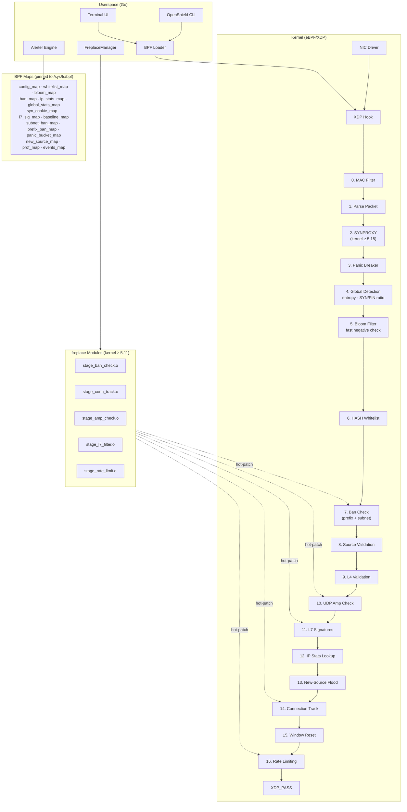

# Architecture Overview

OpenShield-XDP is an XDP eBPF firewall written in C (BPF) and Go (userspace). It attaches to a network interface at the earliest possible point in the Linux networking stack and makes drop/pass decisions before the kernel allocates an SKB.

## Architecture Diagram

## Key Concepts

| Concept | Description |
|---------|-------------|
| **16-stage pipeline** | Packets flow through ~16 ordered stages; any stage can drop the packet. |
| **Bloom filter acceleration** | A 150K-entry Bloom filter does a fast negative-check before the HASH whitelist lookup, saving ~60-100ns per packet for non-whitelisted traffic. |
| **freplace hot-patching** | Five pipeline stages are declared as `__attribute__((noinline))` global functions — they can be replaced at runtime without unloading the XDP program. |
| **Dual-stack** | IPv4 and IPv6 are handled in separate paths with parallel map sets (`ban_map` / `ban_map_v6`, etc). |
| **Per-CPU zero-lock** | `global_stats_map`, `prof_map`, and `panic_bucket_map` use `BPF_MAP_TYPE_PERCPU_ARRAY` — atomic increments without lock contention. |
| **Map pinning** | All maps are pinned to `/sys/fs/bpf/openshield/` — they survive loader restarts. |
| **Compile-time feature gating** | `OPENSHIELD_SYNPROXY`, `OPENSHIELD_L7_MULTISLOT`, `OPENSHIELD_GLOBAL_DETECT`, and `OPENSHIELD_ENTROPY` are enabled based on kernel version detection in the Makefile. |
| **Spinlock-protected global state** | `new_source_map` uses `struct bpf_spin_lock` for safe concurrent access to the new-source flood counter. |

## Map Catalog

| Map | Type | Max Entries | Purpose |
|-----|------|------------|---------|
| `config_map` | ARRAY | 1 | Runtime configuration (written by userspace, read per-packet) |
| `whitelist_map` | HASH | 10K | IPv4 whitelist with per-IP flags |
| `whitelist_map_v6` | HASH | 10K | IPv6 whitelist |
| `ip_stats_map` | LRU_HASH | 100K | Per-IPv4 rate counters & suspicion scores |
| `ip_stats_map_v6` | LRU_HASH | 100K | Per-IPv6 rate counters |
| `ban_map` | LRU_HASH | 50K | Active IPv4 bans with expiry |
| `ban_map_v6` | LRU_HASH | 50K | Active IPv6 bans |
| `subnet_ban_map` | LPM_TRIE | 1K | IPv4 CIDR bans (longest-prefix match) |
| `subnet_ban_map_v6` | LPM_TRIE | 512 | IPv6 CIDR bans |
| `prefix_ban_map` | LRU_HASH | 1K | Per-/24 ban counter for auto-escalation |
| `prefix_ban_map_v6` | LRU_HASH | 512 | Per-/64 ban counter for auto-escalation |
| `new_source_map` | ARRAY | 1 | Spinlock-protected global new-source flood counter |
| `global_stats_map` | PERCPU_ARRAY | 1 | Global packet/byte counters (per-CPU) |
| `baseline_map` | ARRAY | 1 | Dynamic mitigation baseline & attack state |
| `prof_map` | PERCPU_ARRAY | 27 | Profiling path counters (hot-path profiling) |
| `panic_bucket_map` | PERCPU_ARRAY | 1 | Per-CPU panic circuit breaker counters |
| `events_map` | RINGBUF | 256 KB | Event ring buffer for userspace alerts |
| `syn_cookie_map` | LRU_HASH | 100K | SYNPROXY cookie store (kernel ≥ 5.15) |
| `l7_sig_map` | ARRAY | 16 | L7 byte-pattern signature slots |
| `bloom_map` | ARRAY | 150K | Bloom filter for fast whitelist membership test |

**Total memory footprint: ~37 MB** (dominated by `ip_stats_map` + `ip_stats_map_v6` at ~17 MB each for 100K LRU_HASH entries).

## Fast-Path Flags

Two boolean flags in the `config` struct skip expensive lookups when maps are empty:

- **`bans_empty`** — skip `ban_map`, `subnet_ban_map`, and `prefix_ban_map` lookups
- **`whitelist_empty`** — skip `whitelist_map` and Bloom filter checks

These are set by the Go loader after reading current map sizes and reloaded on config changes.

## Performance

| Metric | Value |
|--------|-------|
| Target PPS | 10M+ pps per core |
| Bloom filter overhead | ~60-100ns/pkt (saves 100-200ns when it skips HASH lookup) |
| HASH whitelist lookup | ~100-200ns |
| Per-CPU counter increment | ~10ns (no lock) |
| Pipeline stage count | ~16 stages |

## Further Reading

- [Pipeline Details](./pipeline.md) — stage-by-stage walkthrough
- [Map Layout](./maps.md) — complete map catalog with sizes and access patterns
- [Bloom Filter](./bloom-filter.md) — fast whitelist membership testing
- [freplace Hot-Patching](./freplace.md) — runtime stage replacement
- [Kernel Feature Gates](./kernel-gates.md) — compile-time kernel version detection
