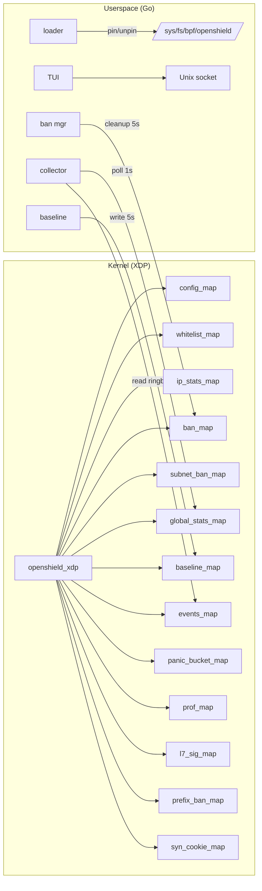

# Architecture Overview

## Key concepts

**XDP** — programs attach to the NIC driver. Zero per-packet allocation, zero sk_buff overhead.

**PERCPU** — 4 maps use per-CPU arrays. Each CPU writes independently. Userspace aggregates by summing.

**LRU auto-eviction** — ip_stats, ban, and syn_cookie maps auto-evict oldest entries under memory pressure.

## Component roles

| Component | Language | Role |
|-----------|----------|------|
| XDP program | C → BPF | Packet inspection, rate tracking, cookie generation, ban insertion |
| Loader | Go | BPF loading, map init, XDP attachment, config population |
| Collector | Go | Per-second stats polling, ring buffer reading, webhook dispatch |
| TUI | Go (Bubbletea) | 7-screen terminal dashboard |
| Baseline learner | Go | EMA smoothing, attack classification, threshold adjustment |
| Ban manager | Go | Expired ban cleanup, star decay, map maintenance |
| Panic coordinator | Go | Cross-CPU panic detection and response |

## Map reference

| Map | Type | Entries | RW |
|-----|------|---------|-----|
| `config_map` | ARRAY | 1 | userspace write, kernel read |
| `whitelist_map` / `_v6` | HASH | 10K | userspace write, kernel read |
| `ip_stats_map` / `_v6` | LRU_HASH | 100K | kernel R/W, userspace read |
| `ban_map` / `_v6` | LRU_HASH | 50K | kernel write, userspace R/W |
| `subnet_ban_map` / `_v6` | LPM_TRIE | 1K/512 | userspace write, kernel read |
| `prefix_ban_map` | PERCPU_ARRAY | 256 | kernel R/W |
| `global_stats_map` | PERCPU_ARRAY | 1 | kernel write, userspace read |
| `baseline_map` | ARRAY | 1 | userspace write, kernel read |
| `panic_bucket_map` | PERCPU_ARRAY | 1 | kernel R/W |
| `events_map` | RINGBUF | 256KB | kernel write, userspace read |
| `prof_map` | PERCPU_ARRAY | 27 | kernel write, userspace read |
| `l7_sig_map` | ARRAY | 16 | userspace write, kernel read |
| `syn_cookie_map` | LRU_HASH | 100K | kernel R/W |

## Related pages

[Pipeline](/openshield-xdp/detection-engine/pipeline) · [Map Layout](/openshield-xdp/architecture/maps) · [Developer Guide](/openshield-xdp/developer-guide/overview)
