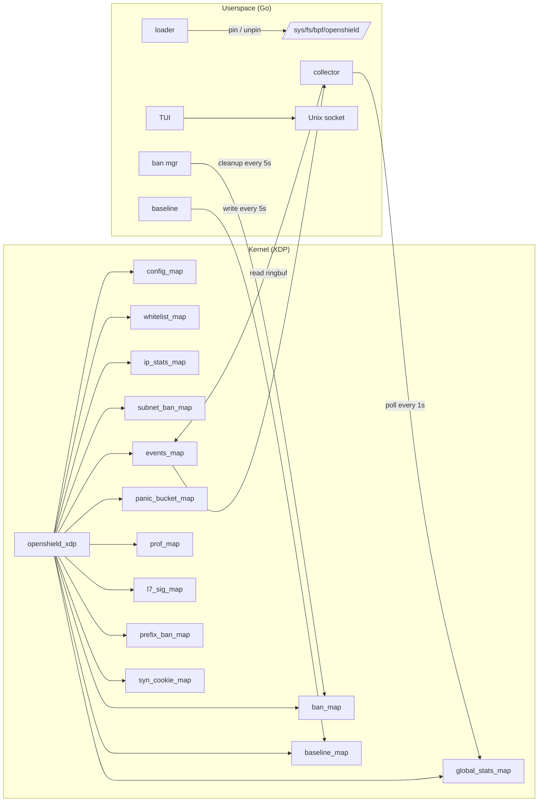

# Architecture Overview

## Key Concepts

**XDP** — Programs attach to the NIC driver. Process packets before the kernel allocates an skb. No memory allocation per packet, direct DMA access.

**BPF Maps** — 13 maps pinned to `/sys/fs/bpf/openshield/`. Survive restarts and crashes.

**PERCPU** — Four maps use per-CPU arrays. Each CPU writes to its own copy. Zero lock contention.

**LRU Auto-Eviction** — ip_stats, ban, and syn_cookie maps use LRU hashing. Under spoofed-source floods, oldest entries evicted automatically.

## Component Roles

| Component | Language | Role |
|-----------|----------|------|
| XDP program | C → BPF | Packet inspection, rate tracking, cookie generation, ban insertion |
| Loader | Go | BPF loading, map init, XDP attachment |
| Collector | Go | Per-second stats, ring buffer reading, webhook dispatch |
| TUI | Go (Bubbletea) | Terminal dashboard, 7 screens |
| Baseline learner | Go | EMA smoothing, attack classification |
| Ban manager | Go | Expired ban cleanup, star decay |
| Panic coordinator | Go | Cross-CPU panic detection |
