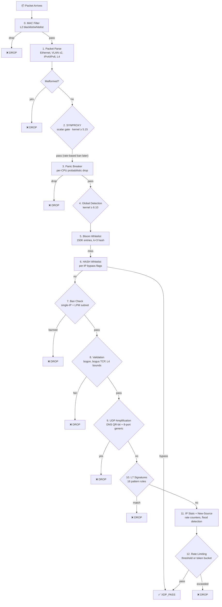

# Pipeline

OpenShield-XDP processes every packet through a fixed **16-stage pipeline**. Each stage is a discrete check; any stage can drop the packet (`XDP_DROP`). Once a packet passes all stages, it is passed to the kernel (`XDP_PASS`).

## Pipeline Order



::: tip Legend
🟢 Green = early fast-pass / bookkeeping &nbsp; 🔵 Blue = validation &nbsp; 🟣 Purple = feature-gated &nbsp; 🔴 Red = detection &nbsp; 🟠 Orange = freplace-able stage
:::

## Stage Reference

| # | Stage | Action | Freplace? | Feature Gate |
|---|-------|--------|:---------:|:------------:|
| 0 | **MAC Filter** | Whitelist/blacklist by source MAC address (8-slot config). Drops immediately before any IP parsing. | — | — |
| 1 | **Parse** | Extract Ethernet, IP, and L4 headers into `struct packet_info`. Bails out on non-IP or malformed packets. | — | — |
| 2 | **SYNPROXY** | Scalar, non-terminal SYN gate. Reads pre-parsed scalars only (no packet access, no helpers); accounts SYNs and continues. Flood mitigation is delivered by the per-IP `syn_pps_threshold` rate limiter. | — | `OPENSHIELD_SYNPROXY` (≥ 5.15) |
| 3 | **Panic Breaker** | Per-CPU packet rate check with probabilistic drop. When a CPU exceeds `panic_pps_rate`, drops `panic_drop_ratio`% of packets. | — | — |
| 4 | **Global Detection** | Window-based entropy spoofing detection + SYN/FIN ratio anomaly check. Drops when source IP entropy is high (spoofed flood) or SYN:FIN ratio exceeds threshold. | — | `OPENSHIELD_GLOBAL_DETECT` (≥ 6.10) |
| 5 | **Bloom Whitelist** | Fast negative-check: if the Bloom filter says "definitely not present", skip the expensive HASH whitelist lookup. Saves ~60-100ns/pkt. | — | — |
| 6 | **HASH Whitelist** | Exact-match lookup in `whitelist_map` (IPv4) or `whitelist_map_v6` (IPv6). `WL_FULL_BYPASS` entries skip all further checks. Other flags disable specific stages (`WL_SKIP_BAN`, `WL_SKIP_VALIDATION`, `WL_SKIP_RATE`). | — | — |
| 7 | **Ban Check** | Lookup in `ban_map` + fallthrough to `subnet_ban_map` (LPM_TRIE) for CIDR bans. Also checks `prefix_ban_map` for auto-escalation. | ✅ | — |
| 8 | **Source Validation** | Private/bogon IP filtering (`10.0.0.0/8`, `127.0.0.0/8`, etc). Controlled by `enable_private_filter`. | — | — |
| 9 | **L4 Validation** | TCP flag sanity (`enable_bogus_tcp_filter`) and L4 bounds check (`enable_malformed_filter`). Drops SYN+FIN, null flags, and truncated L4 payloads. | — | — |
| 10 | **UDP Amplification** | Detects amplified DNS responses (`sport=53, QR=1, large payload`) and generic UDP reflection on configurable ports (8 slots). | ✅ | — |
| 11 | **L7 Signatures** | Byte-pattern matching at configurable offsets. All 16 signature slots are always checked (single unrolled loop; no kernel gate). | ✅ | — |
| 12 | **IP Stats Lookup** | Lookup or create `ip_stats` entry. New IPs get a fresh stats struct with token bucket pre-filled. | — | — |
| 13 | **New-Source Flood** | If the global new-source creation rate exceeds `new_source_limit`, bans new IPs for `new_source_ban_duration_sec`. Uses spinlock-protected `new_source_map`. | — | — |
| 14 | **Connection Tracking** | Detects blind TCP ACK/RST floods by tracking `last_syn_seen_ns`. Drops non-SYN TCP packets from IPs that haven't sent a SYN within `ct_syn_timeout_sec`. | ✅ | — |
| 15 | **Window Reset** | 1-second sliding window: resets per-second counters, decays suspicion scores, runs advanced per-window checks (TTL anomaly, packet size anomaly, connection rate). | — | — |
| 16 | **Rate Limiting** | Either threshold-scoring mode (adds to `suspicion_score` per violation) or token-bucket mode. Bans IPs exceeding `suspicion_threshold`. | ✅ | — |

## Feature-Gated Stages

Some stages are compile-time gated based on the running kernel version. Note the L7 signature matcher is **not** gated — all 16 slots are always compiled and load on every supported kernel.

### SYNPROXY (`OPENSHIELD_SYNPROXY` — scalar, all supported kernels)

```c
#ifdef OPENSHIELD_SYNPROXY
    /* Scalar-only, non-terminal SYN gate. Reads ONLY pre-parsed scalar fields
     * (no packet-pointer access, no version-specific helpers) so it verifies
     * and loads on every kernel 5.15 → latest with zero user fixes. Actual SYN
     * flood mitigation is delivered by the per-IP syn_pps_threshold rate
     * limiter in the rate-limiting stage. */
    if (synproxy_check_listener(ctx, &info, cfg) == STAGE_DROP)
        return XDP_DROP;
#endif
```

The baseline gate never drops — it accounts SYNs for profiling and continues. On kernels ≥ 6.10 it provides a hook that an **opt-in** freplace module can hot-patch to add richer listener verification (`bpf_sk_lookup_tcp`). Below kernel 5.15 the block compiles away entirely.

### Global Detection & Entropy (`OPENSHIELD_GLOBAL_DETECT`, `OPENSHIELD_ENTROPY` — kernel ≥ 6.10)

SYN/FIN ratio detection, entropy-based spoof detection, and per-packet entropy bucket tracking are gated at kernel 6.10. Below 6.10 these blocks compile away; the rest of the pipeline (including all 16 L7 signature slots) is unaffected.

::: warning Kernel Version Detection
The Makefile detects the running kernel via `uname -r` at build time. Feature gates are **compile-time only** — you must rebuild after a kernel upgrade to enable new features. See [Kernel Feature Gates](./kernel-gates.md) for details.
:::

## Early-Exit Optimization

The pipeline is organized for maximum early-drop efficiency:

1. **MAC filter** runs before any IP parsing — no packet metadata needed
2. **SYNPROXY** runs immediately after parse — SYN floods are the most common attack
3. **Panic breaker** protects CPU before expensive per-IP lookups
4. **Bloom filter** skips expensive HASH whitelist lookup for non-whitelisted IPs
5. **`bans_empty` / `whitelist_empty`** flags skip entire lookup blocks when maps are empty
