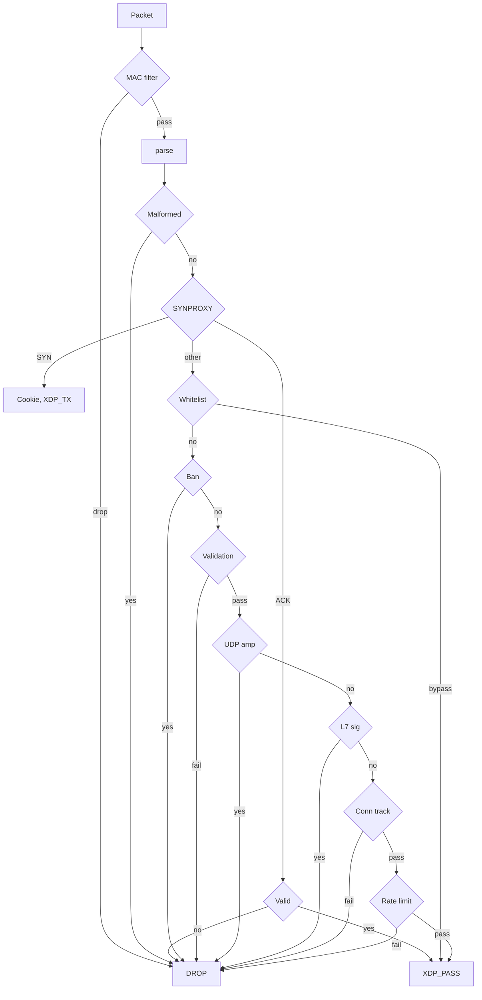

# Pipeline

12 ordered stages. Drop checks ordered by cost.

| # | Stage | Action |
|---|-------|--------|
| 0 | MAC filter | L2 blacklist/whitelist before IP parse |
| 1 | Packet parse | Ethernet, VLAN (×2), IPv4/IPv6, ext headers, TCP/UDP |
| 2 | SYNPROXY | Cookie-based SYN flood mitigation (when enabled) |
| 3 | Panic breaker | Per-CPU probabilistic bulk drop |
| 4 | Whitelist | Per-IP bypass flags, empty-map fast path |
| 5 | Ban / subnet ban | Single IP + LPM trie CIDR bans |
| 6 | Validation | Private/bogon source, bogus TCP, malformed L4 |
| 7 | UDP amplification | DNS + generic 8-port |
| 8 | L7 signatures | 16 configurable pattern rules |
| 9 | Connection tracking | Blind SYN-ACK/RST detection |
| 10 | Rate limiting | Threshold scoring or token bucket |
| 11 | PASS | Packet reaches kernel |
