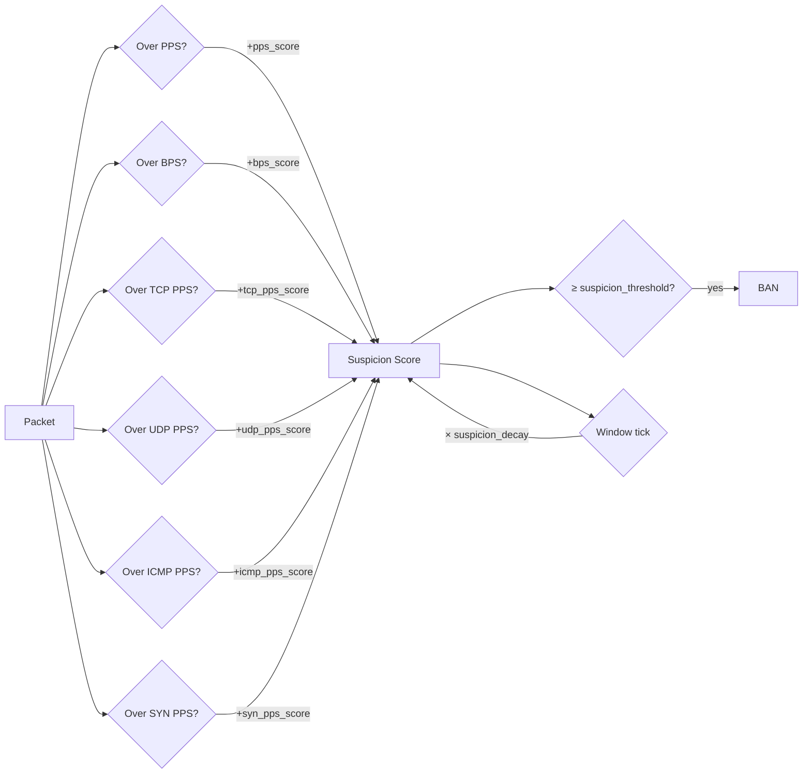

# Configuration Reference

Complete YAML reference for `/etc/openshield/openshield.yaml`. Every field is listed with its Go type, default value as set in `defaults.go`, valid range, and a description of what it controls.

Fields marked **🔄 Runtime-Safe** can be updated via the Unix socket without restarting the XDP program. Fields marked **🔒 Requires Reload** need `openshield fix && openshield load` to take effect.

::: warning Configuration File Location
The active config lives at `/etc/openshield/openshield.yaml`. An annotated example ships at `/opt/openshield/share/openshield.example.yaml`.

Run `openshield config` to generate a fresh defaults file.
:::

## Top-Level

| Field | Type | Default | Range | Description | Safe? |
|-------|------|---------|-------|-------------|-------|
| `interface` | `string` | `"eno1"` | any netdev name | Network interface for XDP attachment | 🔒 |
| `xdp_mode` | `string` | `"auto"` | `auto` / `native` / `generic` / `offload` | XDP attachment mode | 🔒 |

## `static` — Rate Thresholds & Scoring

| Field | Type | Default | Range | Description | Safe? |
|-------|------|---------|-------|-------------|-------|
| `static.enabled` | `bool` | `true` | `true` / `false` | Enable per-IP rate threshold checks | 🔄 |
| `static.pps_threshold` | `int` | **`850`** | `1` – `10,000,000` | Max packets/s per IP before suspicion | 🔄 |
| `static.bps_threshold` | `int` | **`8912896`** | `1024` – `10,737,418,240` | Max bytes/s per IP before suspicion (~8.5 MiB/s) | 🔄 |
| `static.tcp_pps_threshold` | `int` | **`680`** | `1` – `10,000,000` | Max TCP packets/s per IP | 🔄 |
| `static.udp_pps_threshold` | `int` | **`425`** | `1` – `10,000,000` | Max UDP packets/s per IP | 🔄 |
| `static.icmp_pps_threshold` | `int` | **`85`** | `1` – `10,000,000` | Max ICMP packets/s per IP | 🔄 |
| `static.syn_pps_threshold` | `int` | **`170`** | `1` – `10,000,000` | Max SYN packets/s per IP | 🔄 |
| `static.suspicion_threshold` | `int` | `100` | `1` – `10,000` | Score at which IP is banned | 🔄 |
| `static.ban_duration` | `int` | `3600` | `1` – `86,400` | How long bans last (seconds) | 🔄 |
| `static.pps_score` | `int` | `20` | `0` – `1000` | Score added for PPS violation | 🔄 |
| `static.bps_score` | `int` | `20` | `0` – `1000` | Score added for BPS violation | 🔄 |
| `static.tcp_pps_score` | `int` | `15` | `0` – `1000` | Score added for TCP PPS violation | 🔄 |
| `static.udp_pps_score` | `int` | `15` | `0` – `1000` | Score added for UDP PPS violation | 🔄 |
| `static.icmp_pps_score` | `int` | `25` | `0` – `1000` | Score added for ICMP PPS violation | 🔄 |
| `static.syn_pps_score` | `int` | `30` | `0` – `1000` | Score added for SYN PPS violation | 🔄 |
| `static.suspicion_decay` | `float64` | `0.5` | `0.0` – `1.0` | Score retention per window (0.5 = keep 50%) | 🔄 |
| `static.rate_limit_mode` | `string` | `"threshold"` | `threshold` / `token_bucket` | Rate limiting algorithm | 🔄 |
| `static.token_rate` | `uint32` | `0` | `0` – `10,000,000` | Tokens refilled per second per IP (token_bucket mode) | 🔄 |
| `static.token_burst` | `uint32` | `0` | `0` – `100,000,000` | Max burst tokens per IP (token_bucket mode) | 🔄 |
| `static.enable_connection_tracking` | `bool` | `true` | `true` / `false` | Drop blind SYN-ACK/RST/ACK (no prior SYN seen) | 🔄 |
| `static.star_duration_multiplicators` | `[]int` | `[1,2,4,8,16,32]` | array of 6 ints | Ban duration multipliers per star level (repeat-offender escalation) | 🔄 |
| `static.star_decay_seconds` | `int` | `3600` | `1` – `86,400` | Seconds before star rating decays by 1 | 🔄 |
| `static.ban_subnets` | `[]string` | `[]` | CIDR strings | Hardcoded subnet bans (e.g., `["10.0.0.0/8"]`) | 🔄 |
| `static.auto_subnet_ban` | `bool` | `false` | `true` / `false` | Automatically ban /24 subnets when too many single-IP bans occur | 🔄 |
| `static.auto_subnet_prefixes` | `[]int` | `[24]` | prefix lengths | CIDR prefix lengths for auto-subnet-ban | 🔄 |
| `static.subnet_ban_duration` | `int` | `7200` | `1` – `86,400` | Duration for auto subnet bans (seconds) | 🔄 |
| `static.ct_syn_timeout_sec` | `int` | `30` | `0` – `3600` | Max seconds since last SYN before ACK/RST is blind (0=disable) | 🔄 |

### Scoring Model



Each per-second evaluation window, the suspicion score is multiplied by `suspicion_decay` (emulating exponential decay). An IP is banned when its score reaches `suspicion_threshold`.

## `validation` — Packet Validation

| Field | Type | Default | Range | Description | Safe? |
|-------|------|---------|-------|-------------|-------|
| `validation.filter_private` | `bool` | `true` | `true` / `false` | Drop packets with private/bogon source IPs | 🔄 |
| `validation.filter_bogon` | `bool` | `true` | `true` / `false` | Drop packets with bogon (unallocated) source IPs | 🔄 |
| `validation.filter_bogus_tcp` | `bool` | `true` | `true` / `false` | Drop impossible TCP flag combinations (e.g., SYN+FIN) | 🔄 |
| `validation.filter_malformed` | `bool` | `true` | `true` / `false` | Drop malformed headers (invalid lengths, truncated options) | 🔄 |

```yaml
validation:
  filter_private: true
  filter_bogon: true
  filter_bogus_tcp: true
  filter_malformed: true
```

## `dynamic` — Anomaly Detection & Attack Response

| Field | Type | Default | Range | Description | Safe? |
|-------|------|---------|-------|-------------|-------|
| `dynamic.enabled` | `bool` | `true` | `true` / `false` | Enable dynamic anomaly detection | 🔄 |
| `dynamic.baseline_window` | `int` | `60` | `10` – `3600` | Seconds to build traffic baseline | 🔒 |
| `dynamic.baseline_update_interval` | `int` | `5` | `1` – `300` | Seconds between baseline updates | 🔒 |
| `dynamic.baseline_alpha` | `float64` | `0.1` | `0.0` – `1.0` | EMA smoothing factor for baseline | 🔒 |
| `dynamic.baseline_alpha_min` | `float64` | `0.05` | `0.0` – `1.0` | Minimum adaptive EMA alpha | 🔄 |
| `dynamic.baseline_alpha_max` | `float64` | `0.50` | `0.0` – `1.0` | Maximum adaptive EMA alpha | 🔄 |
| `dynamic.baseline_alpha_variance_scale` | `float64` | `0.1` | `0.0` – `1.0` | How much variance adjusts alpha | 🔄 |
| `dynamic.spike_percentage` | `int` | `200` | `10` – `10,000` | % above baseline that triggers spike detection (200 = 3× baseline) | 🔄 |
| `dynamic.spike_recovery_factor` | `float64` | `1.2` | `1.0` – `10.0` | Multiplier below baseline to clear spike status | 🔄 |
| `dynamic.spike_recovery_time` | `int` | `30` | `1` – `600` | Seconds below recovery factor before clearing | 🔄 |
| `dynamic.new_source_limit` | `int` | `100` | `1` – `100,000` | New unique IPs/s before new-source flood mode | 🔄 |
| `dynamic.new_source_ban_duration` | `int` | `30` | `1` – `3600` | Ban duration for new-source flood IPs | 🔄 |
| `dynamic.attack_threshold_multiplier` | `float64` | `0.5` | `0.1` – `1.0` | Threshold multiplier during attack (0.5 = 50% of normal thresholds) | 🔄 |
| `dynamic.attack_pps_threshold` | `uint64` | `0` | `0` – `1,000,000,000` | Global PPS to trigger attack state (0=use baseline) | 🔄 |
| `dynamic.attack_bps_threshold` | `uint64` | `0` | `0` – `1,000,000,000,000` | Global BPS to trigger attack state (0=use baseline) | 🔄 |
| `dynamic.panic_pps_rate` | `uint32` | `200,000` | `0` – `100,000,000` | Per-CPU PPS to trigger panic circuit breaker (0=disabled) | 🔄 |
| `dynamic.panic_drop_ratio` | `uint32` | `80` | `0` – `100` | % of packets to probabilistically drop in panic mode | 🔄 |
| `dynamic.panic_global_pps_threshold` | `uint32` | `5,000,000` | `0` – `100,000,000` | Total across-CPU PPS for coordinated panic | 🔄 |
| `dynamic.panic_coordination_enabled` | `bool` | `true` | `true` / `false` | Enable cross-CPU panic coordination | 🔄 |
| `dynamic.dns_amplification_enabled` | `bool` | `true` | `true` / `false` | Drop DNS amplification responses | 🔄 |
| `dynamic.dns_amplification_payload_min` | `int` | `512` | `0` – `65,535` | Min UDP payload for DNS amp detection | 🔄 |
| `dynamic.udp_amplification_enabled` | `bool` | `true` | `true` / `false` | Drop generic UDP amplification responses | 🔄 |
| `dynamic.udp_amp_ports` | `[]int` | `[53,123,1900,11211,17,19,520,69]` | up to 8 ports | UDP ports to check for amplification | 🔄 |
| `dynamic.udp_amp_payload_min` | `[]int` | `[512,90,256,50,50,50,50,50]` | up to 8 values | Min payload per port (index-aligned with `udp_amp_ports`) | 🔄 |
| `dynamic.syn_fin_ratio_enabled` | `bool` | `true` | `true` / `false` | Detect SYN floods via SYN:FIN ratio | 🔄 |
| `dynamic.syn_fin_ratio_threshold` | `int` | `100` | `1` – `10,000` | Max SYN:FIN ratio (100 = 100:1) | 🔄 |
| `dynamic.entropy_spoof_enabled` | `bool` | `true` | `true` / `false` | IP entropy-based spoofing detection | 🔄 |
| `dynamic.entropy_spoof_threshold` | `int` | `12` | `1` – `16` | Distinct hash buckets (of 16) that indicate spoofing | 🔄 |
| `dynamic.ttl_anomaly_enabled` | `bool` | `true` | `true` / `false` | TTL deviation detection | 🔄 |
| `dynamic.ttl_expected` | `int` | `64` | `1` – `255` | Expected TTL (64=Linux, 128=Windows) | 🔄 |
| `dynamic.ttl_tolerance` | `int` | `5` | `1` – `255` | Allowed deviation from expected TTL | 🔄 |
| `dynamic.pkt_anomaly_enabled` | `bool` | `true` | `true` / `false` | Packet size anomaly detection | 🔄 |
| `dynamic.pkt_size_min_threshold` | `int` | `64` | `0` – `1500` | Flag if avg size < this (empty floods) | 🔄 |
| `dynamic.pkt_size_max_threshold` | `int` | `1024` | `0` – `9000` | Flag if avg size > this (amp floods) | 🔄 |
| `dynamic.conn_rate_enabled` | `bool` | `true` | `true` / `false` | Connection rate limiting (SYN/s per IP) | 🔄 |
| `dynamic.conn_rate_limit` | `int` | `5000` | `1` – `1,000,000` | Max SYN/s per IP | 🔄 |
| `dynamic.auto_escalation_enabled` | `bool` | `true` | `true` / `false` | Auto-escalate to /24 subnet ban | 🔄 |
| `dynamic.auto_escalation_threshold` | `int` | `5` | `1` – `1000` | Single-IP bans in /24 before subnet ban | 🔄 |
| `dynamic.mac_filter_enabled` | `bool` | `false` | `true` / `false` | L2 MAC address filtering | 🔄 |
| `dynamic.mac_filter_mode` | `int` | `0` | `0` / `1` / `2` | 0=disabled, 1=whitelist, 2=blacklist | 🔄 |
| `dynamic.mac_filter_entries` | `[]string` | `[]` | 6-byte hex strings | Up to 8 MAC addresses | 🔄 |
| `dynamic.synproxy_enabled` | `bool` | `false` | `true` / `false` | Enable the scalar SYN gate (rate-based; flood mitigation via `syn_pps_threshold`) | 🔄 |
| `dynamic.l7_drop_signatures` | `[]L7Signature` | `nil` | array | Layer-7 pattern match rules | 🔄 |

### L7 Drop Signature Fields

Each entry in `l7_drop_signatures`:

| Field | Type | Default | Description |
|-------|------|---------|-------------|
| `name` | `string` | — | Human-readable rule name |
| `protocol` | `string` | — | `tcp` or `udp` |
| `port` | `int` | — | Port to match (source or dest) |
| `port_is_src` | `bool` | — | Match source port instead of dest |
| `offset` | `int` | — | Byte offset into payload |
| `pattern` | `string` | — | Hex pattern to match at offset |
| `mask` | `string` | — | Bitmask applied before comparison |
| `min_payload` | `int` | — | Minimum payload length to trigger |
| `max_payload` | `int` | — | Maximum payload length to trigger |

## `whitelist` — Trusted IPs

| Field | Type | Default | Range | Description | Safe? |
|-------|------|---------|-------|-------------|-------|
| `whitelist.enabled` | `bool` | `true` | `true` / `false` | Enable whitelist (bypass all mitigation) | 🔄 |
| `whitelist.ips` | `[]string` | `[]` | IPv4 / IPv6 addresses | Trusted IP list | 🔄 |

```yaml
whitelist:
  enabled: true
  ips:
    - 10.0.0.1
    - 2001:db8::1
```

## `telemetry` — Monitoring

| Field | Type | Default | Range | Description | Safe? |
|-------|------|---------|-------|-------------|-------|
| `telemetry.poll_interval` | `int` | `1` | `1` – `60` | Seconds between collector map reads | 🔒 |
| `telemetry.event_rate_limit` | `int` | `100` | `1` – `10,000` | Max events/s emitted to ring buffer | 🔄 |
| `telemetry.top_offenders_count` | `int` | `20` | `1` – `1000` | Top N IPs shown in TUI/stats | 🔄 |
| `telemetry.log_level` | `string` | `"info"` | `debug` / `info` / `warn` / `error` | Log verbosity | 🔄 |
| `telemetry.snapshot_interval` | `int` | `1` | `1` – `60` | Seconds between stat snapshots | 🔄 |

## `maps` — BPF Map Sizing

| Field | Type | Default | Range | Description | Safe? |
|-------|------|---------|-------|-------------|-------|
| `maps.ip_stats_max` | `int` | `100,000` | `1000` – `10,000,000` | Max entries in per-IP stats LRU | 🔒 |
| `maps.ban_max` | `int` | `50,000` | `1000` – `10,000,000` | Max entries in ban LRU | 🔒 |
| `maps.whitelist_max` | `int` | `10,000` | `100` – `1,000,000` | Max entries in whitelist map | 🔒 |
| `maps.event_buffer_size` | `int` | `262,144` (256 KB) | `4096` – `268,435,456` | Ring buffer size in bytes | 🔒 |
| `maps.bloom_filter_enabled` | `bool` | `true` | `true` / `false` | Use Bloom filter fast-path for whitelist lookups | 🔄 |
| `maps.bloom_filter_size` | `int` | `150,000` | `1000` – `10,000,000` | Number of entries in the Bloom filter map | 🔄 |

::: info Bloom Filter
When enabled, whitelisted IPs are hashed into a Bloom filter in the BPF `bloom_map` (a regular ARRAY map used as a bit-vector with 3 hash functions and 64 bits per entry). Before performing a full `bpf_map_lookup_elem` on the whitelist HASH map, the XDP program first checks the Bloom filter — a negative result means "definitely not whitelisted" in ~60-100ns, saving a full hash map lookup.
:::

## `alerter` — Webhook Alerts

| Field | Type | Default | Range | Description | Safe? |
|-------|------|---------|-------|-------------|-------|
| `alerter.enabled` | `bool` | `false` | `true` / `false` | Enable Discord webhook alerts | 🔄 |
| `alerter.webhook_url` | `string` | `""` | valid Discord webhook URL | Webhook endpoint URL | 🔄 |
| `alerter.events` | `[]string` | `[]` | event type strings | Events to alert on (empty = all) | 🔄 |

See the [Alerter docs](./alerter) for webhook format and event types.

## Complete Example

```yaml
interface: eno1
xdp_mode: auto

static:
  enabled: true
  pps_threshold: 850
  bps_threshold: 8912896
  tcp_pps_threshold: 680
  udp_pps_threshold: 425
  icmp_pps_threshold: 85
  syn_pps_threshold: 170
  suspicion_threshold: 100
  ban_duration: 3600
  pps_score: 20
  bps_score: 20
  tcp_pps_score: 15
  udp_pps_score: 15
  icmp_pps_score: 25
  syn_pps_score: 30
  suspicion_decay: 0.5
  rate_limit_mode: threshold
  token_rate: 0
  token_burst: 0
  enable_connection_tracking: true
  star_duration_multiplicators: [1, 2, 4, 8, 16, 32]
  star_decay_seconds: 3600
  ban_subnets: []
  auto_subnet_ban: false
  auto_subnet_prefixes: [24]
  subnet_ban_duration: 7200
  ct_syn_timeout_sec: 30

validation:
  filter_private: true
  filter_bogon: true
  filter_bogus_tcp: true
  filter_malformed: true

dynamic:
  enabled: true
  baseline_window: 60
  baseline_update_interval: 5
  baseline_alpha: 0.1
  baseline_alpha_min: 0.05
  baseline_alpha_max: 0.50
  baseline_alpha_variance_scale: 0.1
  spike_percentage: 200
  spike_recovery_factor: 1.2
  spike_recovery_time: 30
  new_source_limit: 100
  new_source_ban_duration: 30
  attack_threshold_multiplier: 0.5
  attack_pps_threshold: 0
  attack_bps_threshold: 0
  panic_pps_rate: 200000
  panic_drop_ratio: 80
  panic_global_pps_threshold: 5000000
  panic_coordination_enabled: true
  dns_amplification_enabled: true
  dns_amplification_payload_min: 512
  udp_amplification_enabled: true
  udp_amp_ports: [53, 123, 1900, 11211, 17, 19, 520, 69]
  udp_amp_payload_min: [512, 90, 256, 50, 50, 50, 50, 50]
  syn_fin_ratio_enabled: true
  syn_fin_ratio_threshold: 100
  entropy_spoof_enabled: true
  entropy_spoof_threshold: 12
  ttl_anomaly_enabled: true
  ttl_expected: 64
  ttl_tolerance: 5
  pkt_anomaly_enabled: true
  pkt_size_min_threshold: 64
  pkt_size_max_threshold: 1024
  conn_rate_enabled: true
  conn_rate_limit: 5000
  auto_escalation_enabled: true
  auto_escalation_threshold: 5
  mac_filter_enabled: false
  mac_filter_mode: 0
  mac_filter_entries: []
  synproxy_enabled: false
  synproxy_enabled: false
  l7_drop_signatures: []

whitelist:
  enabled: true
  ips: []

telemetry:
  poll_interval: 1
  event_rate_limit: 100
  top_offenders_count: 20
  log_level: info
  snapshot_interval: 1

maps:
  ip_stats_max: 100000
  ban_max: 50000
  whitelist_max: 10000
  event_buffer_size: 262144
  bloom_filter_enabled: true
  bloom_filter_size: 150000

alerter:
  enabled: false
  webhook_url: ""
  events: []
```

## Related Pages

- [Configuration Validation](./validation) — Schema rules, file locations, runtime updates
- [Alerter](./alerter) — Discord webhook format and event types
- [Getting Started](/openshield-xdp/getting-started/overview) — First-time setup
